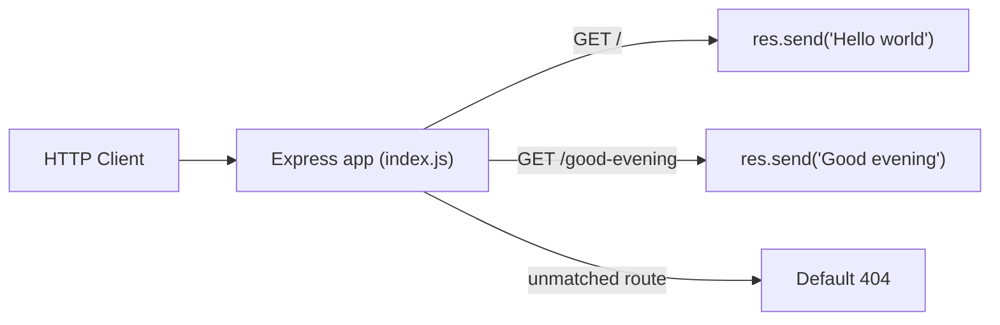

# Technical Specification

# 0. Agent Action Plan

## 0.1 Intent Clarification

This Agent Action Plan is the definitive interpretation of the user's request and the technical plan to fulfill it. It is grounded strictly in three sources of truth: the user's prompt, the verified state of the repository, and an environment validation performed against the live runtime. Pre-existing Technical Specification sections describing an unrelated "AI Umbrella" Java/Spring Boot platform were reviewed and determined to be irrelevant placeholder content for a different project; none of that content is incorporated here.

### 0.1.1 Core Objective

Based on the provided requirements, the Blitzy platform understands that the objective is to **integrate the Express.js web framework into the project and expose a second HTTP endpoint that returns the plaintext response "Good evening", while preserving the originally described endpoint that returns "Hello world"**.

The user's request, preserved verbatim:

> add feature to a existing product
> this is a tutorial of node js server hosting one endpoint that returns the response "Hello world". Could you add expressjs into the project and add another endpoint that return the reponse of "Good evening"?

Restated with enhanced clarity, the request decomposes into the following discrete requirements:

- **(R1) Add Express.js** as a managed project dependency at the verified current stable version `express@5.2.1`.
- **(R2) Serve the baseline endpoint** `GET /` returning the exact plaintext `Hello world` through Express.
- **(R3) Add a new endpoint** `GET /good-evening` returning the exact plaintext `Good evening`.
- **(R4) Establish the minimal Node.js project scaffolding** required to run an Express application (manifest, entry file, dependency lock, ignore rules) and document how to run it.

**Critical implicit discovery.** The user describes an *existing* Node.js server, but the repository does not contain one. The only tracked file is `README.md`, whose entire content is the single heading `# 13_feb_2_3` [README.md:L1]. There is no `package.json`, no server entry file, and no source code of any kind. Therefore the described "Hello world" server is treated as a **to-be-created baseline**: it must be scaffolded from scratch as part of fulfilling the request, rather than modified in place. This assumption is flagged explicitly in §0.8.

**Dependencies and prerequisites:**

- Node.js `>= 18` runtime — required by Express 5; the target environment was validated at Node `v22.22.2` with npm `11.1.0`.
- npm — used to create `package.json`, install Express, and generate `package-lock.json`.

### 0.1.2 Task Categorization

- **Primary task type:** Feature Addition — integrating the Express.js framework and adding a new endpoint. Within the general taxonomy this is a **Mixed** change spanning Build/scaffolding, Configuration, and Source code.
- **Secondary aspects:** Greenfield project bootstrap; dependency and configuration management; documentation update.
- **Scope classification:** Cross-cutting change at the **project-foundation level** (it introduces the web framework and the runtime scaffolding the project will stand on), yet very small in code surface area — a single-file server.

### 0.1.3 Special Instructions and Constraints

- **Verbatim response strings (MUST preserve exactly):** the two responses are `Hello world` and `Good evening`. These are reproduced character-for-character in the implementation.
- **Backward compatibility:** the `Hello world` endpoint must remain reachable. The change is strictly additive — adding Express and a second route, not replacing the first.
- **Framework directive:** "add expressjs into the project" — Express must be the framework that powers the routes (not the raw `http` module).
- **No explicit methodological rules** were supplied (no user rules, no attachments). Implementation therefore follows standard, idiomatic Node.js + Express conventions.
- **User Example (preserved exactly):** endpoint responses `Hello world` and `Good evening`.
- **Web search requirement (completed):** verify the current stable Express version and Node compatibility — confirmed `express@5.2.1` and Node `>= 18`.

### 0.1.4 Technical Interpretation

These requirements translate to the following technical implementation strategy:

- To **add Express (R1)**, we will create `package.json` declaring `express` at `^5.2.1` and install it, which generates `package-lock.json` and the `node_modules/` tree.
- To **serve the baseline response (R2)**, we will create `index.js` that instantiates an Express application and registers `GET /` to send `Hello world`.
- To **add the new endpoint (R3)**, we will register `GET /good-evening` on the same application to send `Good evening`.
- To **make the project runnable and clean (R4)**, we will add an npm `start` script (`node index.js`), a `.gitignore` excluding `node_modules/`, and update `README.md` with prerequisites and run instructions.

## 0.2 Repository Scope Discovery

### 0.2.1 Comprehensive File Analysis

An exhaustive inspection of the repository was performed across every category relevant to a Node.js project. The result is unambiguous: the repository is a **greenfield placeholder**. It tracks exactly one file — `README.md` — whose entire content is the heading `# 13_feb_2_3` [README.md:L1]. There is no application code, manifest, configuration, test, or build/deploy file present.

| Search Area / Pattern | Finding |
|---|---|
| Source code (`index.js`, `server.js`, `app.js`, `src/**`, `lib/**`) | None present |
| Manifests (`package.json`, `package-lock.json`) | None present |
| Configuration (`.*rc`, `*.json`, `*.yaml`, `.env*`, `.nvmrc`) | None present |
| Documentation (`README*`, `docs/**`) | Only `README.md`, a placeholder label [README.md:L1] |
| Build / Deploy (`Dockerfile*`, `.github/workflows/**`, `Makefile*`) | None present |
| Tests (`test/**`, `**/*.test.*`, `**/*.spec.*`) | None present |
| Installed dependencies (`node_modules/`) | None present |

Because there is no `http`-module server to migrate and no baseline route to preserve in code, the described "Hello world" server must itself be created. The complete set of files implicated by this task is therefore:

- `package.json` — **CREATE** (project manifest and dependency declaration)
- `index.js` — **CREATE** (Express application entry: both routes + listener)
- `.gitignore` — **CREATE** (exclude `node_modules/` from version control)
- `package-lock.json` — **CREATE** (generated by `npm install`; pins exact versions)
- `README.md` — **UPDATE** (add description, prerequisites, install/run instructions, endpoint table) [README.md:L1]
- `node_modules/` — generated build artifact (git-ignored, not committed)

**Related-file discovery.** Because the repository contains no existing source modules, there are no importing or dependent files, no interface contracts to propagate, and no configuration coupled to code. The single pre-existing file, `README.md`, has no code dependency and is touched only for documentation.

### 0.2.2 Web Search Research Conducted

The following research was conducted to validate the approach and pin exact, valid versions (no placeholders):

- **Express current stable version and Node compatibility** — confirmed `express@5.2.1` is the latest npm release and that Express 5 requires Node.js `>= 18`; the target runtime Node `v22.22.2` is fully compatible. Sources: `https://www.npmjs.com/package/express`; `https://expressjs.com/2024/10/15/v5-release.html`.
- **Getting-started conventions for a brand-new project** — confirmed the recommended flow is to create `package.json` (via `npm init`) and then `npm install express`, with the canonical quick-start registering `app.get('/', ...)` and `app.listen(3000, ...)`. Source: `https://www.npmjs.com/package/express`.
- **Express 5 behavioral notes** — native async/await error propagation and a route-matching/security overhaul; not required for this minimal tutorial but informs clean, modern conventions. Source: `https://dev.to/leapcell/express-500-new-features-and-updates-48an`.

### 0.2.3 Existing Infrastructure Assessment

- **Current project structure and organization:** a single placeholder `README.md` [README.md:L1]; no module layout, no source directory.
- **Existing patterns and conventions to follow:** none exist; the plan therefore adopts standard Node.js + Express conventions (npm-based dependency management, CommonJS entry `index.js`, `npm start`).
- **Build and deployment configuration:** none present.
- **Testing infrastructure:** none present.
- **Documentation system in use:** a single Markdown `README.md` serving only as a project label.

## 0.3 Scope Boundaries

### 0.3.1 Exhaustively In Scope

Every artifact below is required to fulfill the request and is in scope. Target paths are listed with their transformation mode.

- **Source code:**
  - `index.js` — CREATE the Express application entry implementing `GET /` → `Hello world` and `GET /good-evening` → `Good evening`, plus the listener.
- **Configuration / manifest:**
  - `package.json` — CREATE with `main: index.js`, `scripts.start: "node index.js"`, and `dependencies.express: "^5.2.1"`.
  - `package-lock.json` — CREATE (generated by `npm install`; pins `express` 5.2.1 and its transitive dependencies).
  - `.gitignore` — CREATE to exclude `node_modules/` (and npm debug logs).
- **Documentation:**
  - `README.md` — UPDATE with project description, prerequisites (Node `>= 18`), install/run instructions, and an endpoint table [README.md:L1].
- **Dependency:**
  - Add `express@5.2.1` (npm registry).
- **Local artifacts:**
  - `node_modules/` — generated by `npm install`; git-ignored and not committed.

### 0.3.2 Explicitly Out of Scope

The following are deliberately excluded because they are neither requested by the user nor required to satisfy R1–R4:

- Any HTTP endpoints or routes beyond the two specified (`GET /` and `GET /good-evening`).
- Additional Express capabilities not requested: custom middleware, body parsing, templating/view engines, static file serving, router/controller modularization, and custom error-handling middleware beyond Express defaults.
- Cross-cutting concerns not requested: authentication/authorization, structured logging frameworks, databases or persistence, and configuration management beyond the `PORT` environment variable.
- Testing frameworks and test files (no tests were requested) and linting/formatting tooling (ESLint/Prettier).
- TypeScript migration; bundlers or build tooling.
- Containerization (`Dockerfile`), CI/CD workflows (`.github/workflows/**`), and deployment/orchestration.
- Production hardening (helmet, CORS, rate limiting, HTTPS/TLS termination).
- The unrelated "AI Umbrella" Java/Spring Boot content found in pre-existing tech-spec sections — explicitly excluded as it pertains to a different project and is not present in this repository.
- Any restructuring, renaming, or relocation of `README.md` beyond the documented content update.

## 0.4 Dependency Inventory

### 0.4.1 Key Packages

The repository currently declares **no dependencies** (there is no `package.json` [README.md:L1]). Exactly one production dependency is introduced by this task. The version below was verified against the live npm registry (dist-tags `latest = 5.2.1`) and exercised in a working proof-of-concept; it is not a placeholder.

| Registry | Package Name | Version | Purpose |
|---|---|---|---|
| npm | express | 5.2.1 | Minimalist Node.js web framework providing routing and HTTP request/response handling for both endpoints |

- **Transitive dependencies:** installing `express@5.2.1` brings in approximately 65 additional transitive packages (66 total were added during validation). These are resolved and pinned automatically through `package-lock.json` and are neither declared directly nor imported in application code.
- **Runtime prerequisite (not an npm dependency):** Node.js `>= 18`, required by Express 5; the target environment is Node `v22.22.2`.

### 0.4.2 Dependency Updates

- **New dependencies to add:**
  - `express`: `5.2.1` — fulfills the user's explicit request to "add expressjs into the project". Declared in `package.json` as `^5.2.1` (the range npm writes by default) and locked to `5.2.1` in `package-lock.json`.
- **Dependencies to update:** none — there are no pre-existing dependencies.
- **Dependencies to remove:** none.
- **Import / Reference Updates:**
  - The only new import is `require('express')` inside the newly created `index.js`.
  - No existing source files reference any modules (greenfield repository), so there are no import statements to rewrite anywhere in the codebase.
  - Import transformation rules: not applicable — there is no prior `http`-module code to convert, because the described baseline server does not yet exist in the repository [README.md:L1].

## 0.5 Implementation Design

### 0.5.1 Technical Approach

The plan achieves the four requirements (R1–R4) through a small set of complementary actions:

- Achieve **framework integration** by creating `package.json` and installing `express@5.2.1`, making Express available to `require`.
- Achieve the **baseline response** by creating `index.js` that instantiates an Express app and registers `GET /` to send `Hello world`.
- Achieve the **new feature** by registering `GET /good-evening` on the same app to send `Good evening`.
- Ensure **runnability and hygiene** by adding an npm `start` script, a `.gitignore`, and an updated `README.md`.

Logical implementation flow (sequence of construction, not a schedule):

- First, establish the project foundation by creating `package.json` (declaring the `express` dependency, `main`, and the `start` script).
- Next, integrate the framework by running `npm install`, which resolves and pins `express@5.2.1` and writes `node_modules/` and `package-lock.json`.
- Then, implement the server by creating `index.js` with the two route handlers and a listener bound to `process.env.PORT || 3000`.
- Finally, ensure clarity and hygiene by adding `.gitignore` (excluding `node_modules/`) and updating `README.md` with prerequisites and run instructions.

**Rationale.** Express centralizes routing so that adding endpoints is a one-line declarative operation, which is exactly the capability the user wants to grow. A single-file `index.js` keeps the tutorial minimal and faithful to Express's "fast, unopinionated, minimalist" philosophy, avoiding premature structure that the request does not call for.

### 0.5.2 Component Impact Analysis

- **Direct creations/modifications required:**
  - `package.json` — CREATE: declares the Express dependency and the `start` script that launches the server.
  - `index.js` — CREATE: hosts the Express application and both route handlers.
  - `.gitignore` — CREATE: keeps `node_modules/` out of version control so the lockfile remains the source of truth.
  - `README.md` — UPDATE: documents prerequisites, installation, run command, and available endpoints [README.md:L1].
- **Indirect impacts and generated artifacts:**
  - `package-lock.json` and `node_modules/` are produced by `npm install` as a consequence of declaring the dependency.
  - No other components are affected — there are no importers, tests, or CI pipelines in the repository to update.
- **New components introduced:**
  - `index.js` — the Express server. Rationale: a runtime entry point is required to host both endpoints; none exists today.

The end-state request routing is straightforward:



### 0.5.3 User Interface Design

Not applicable. This is a backend HTTP server that returns short plaintext responses; there is no graphical user interface, component library, or design system involved. The Design System Alignment Protocol therefore does not apply.

### 0.5.4 User-Provided Examples Integration

The user's example responses are implemented verbatim:

- **User Example:** `Hello world` — implemented in `index.js` as the handler for `GET /` calling `res.send('Hello world')`.
- **User Example:** `Good evening` — implemented in `index.js` as the handler for `GET /good-evening` calling `res.send('Good evening')`.

The two route handlers form the crux of the implementation:

```js
app.get('/', (req, res) => res.send('Hello world'));
app.get('/good-evening', (req, res) => res.send('Good evening'));
```

### 0.5.5 Critical Implementation Details

- **Design pattern:** a single Express application object with declarative route handlers, authored in CommonJS (`require`) to match the validated proof-of-concept.
- **Routing:** `GET /` and `GET /good-evening`; any unmatched route yields Express's default `404` response (confirmed during validation).
- **Port binding:** `process.env.PORT || 3000`, allowing the port to be overridden via environment without code changes.
- **Response type:** plaintext via `res.send(...)`; for a short string Express responds with a `text/html` content type by default, which is acceptable for this tutorial.
- **Error handling / edge cases:** minimal by design; Express 5 automatically forwards rejected promises to error-handling middleware, but no custom error handling is required for these static responses.
- **Security / performance considerations:** tutorial scope — no authentication, middleware, or hardening is introduced; `node_modules/` is excluded from version control.
- **Validation evidence:** a throwaway proof-of-concept (built outside the repository and then deleted) confirmed, on Node `v22.22.2` with `express@5.2.1`, that `GET /` returns `Hello world`, `GET /good-evening` returns `Good evening`, and unknown routes return HTTP `404`.

## 0.6 File Transformation Mapping

### 0.6.1 File-by-File Execution Plan

The table below maps every file to be created or updated, with the target file listed first. No file is left "pending" or "to be discovered". `DELETE` mode is not used — nothing in the repository is obsolete.

| Target File | Transformation | Source File / Reference | Purpose / Changes |
|---|---|---|---|
| `package.json` | CREATE | npm init defaults (REFERENCE: npm documentation) | New project manifest declaring `name`, `version`, `description`, `main: index.js`, `scripts.start: "node index.js"`, and `dependencies.express: "^5.2.1"` |
| `index.js` | CREATE | Express 5 quick-start (REFERENCE: `npmjs.com/package/express`) | New Express application: `GET /` → `res.send('Hello world')`; `GET /good-evening` → `res.send('Good evening')`; `app.listen(process.env.PORT || 3000)` |
| `.gitignore` | CREATE | Standard Node `.gitignore` (REFERENCE) | Exclude `node_modules/` and npm debug logs from version control |
| `package-lock.json` | CREATE | Generated by `npm install` | Lock `express` `5.2.1` plus all transitive dependencies (≈66 packages) for reproducible installs |
| `README.md` | UPDATE | `README.md` (current content `# 13_feb_2_3`) [README.md:L1] | Add project description, prerequisites (Node `>= 18`), install (`npm install`) and run (`npm start`) instructions, and an endpoint table |

### 0.6.2 New Files Detail

- **`index.js`** — the application entry point.
  - Content type: source (CommonJS).
  - Based on: the Express 5 canonical quick-start pattern.
  - Key elements: `require('express')`; `const app = express()`; a `GET /` handler returning `Hello world`; a `GET /good-evening` handler returning `Good evening`; `app.listen` on `process.env.PORT || 3000` with a startup log line.
- **`package.json`** — the project manifest.
  - Content type: configuration (JSON).
  - Based on: npm init defaults.
  - Key fields: `main: "index.js"`, `scripts.start: "node index.js"`, `dependencies.express: "^5.2.1"`.
- **`.gitignore`** — version-control hygiene.
  - Content type: configuration.
  - Key entries: `node_modules/`, npm debug logs.
- **`package-lock.json`** — dependency lockfile.
  - Content type: generated configuration.
  - Based on: the output of `npm install express@5.2.1`.
  - Key sections: locked resolution for `express` 5.2.1 and its transitive dependency graph.

### 0.6.3 Files to Modify Detail

- **`README.md`** — currently a single heading `# 13_feb_2_3` [README.md:L1].
  - New content to add: a short project description; a Prerequisites section (Node `>= 18`); an Installation section (`npm install`); a Usage/Run section (`npm start`, default `http://localhost:3000`); and an Endpoints table listing `GET /` → `Hello world` and `GET /good-evening` → `Good evening`.
  - Content to remove: none (the existing heading is retained or refined).
  - Refactoring needed: none beyond additive documentation.

### 0.6.4 Configuration and Documentation Updates

- **Configuration changes:**
  - `package.json`: introduces the `start` script and the `express` dependency. Impact: the project becomes installable (`npm install`) and runnable (`npm start`).
  - `.gitignore`: introduces `node_modules/` exclusion. Impact: keeps the working tree and commits clean while the lockfile remains authoritative.
- **Documentation updates:**
  - `README.md`: adds setup, run, and endpoint documentation [README.md:L1].
  - Cross-references to update: none beyond `README.md` itself.

### 0.6.5 Cross-File Dependencies

- `package.json` `scripts.start` references `index.js` (`node index.js`) — the manifest and the entry file must agree on the entry path.
- `index.js` performs `require('express')`, which resolves from `node_modules/` as installed per `package.json` / `package-lock.json`.
- `.gitignore` must list `node_modules/` so that the committed `package-lock.json` remains the single source of truth for dependency resolution.

## 0.7 Rules

No user-specified implementation rules were provided for this project — the rules input was an empty list. Consequently, there are no rule-mandated files forced into scope and no externally imposed coding directives to honor.

In the absence of explicit rules, the implementation adheres to the following implicit, best-practice directives derived directly from the request and the repository state:

- **Follow standard Node.js + Express conventions** — npm-based dependency management, a CommonJS entry file named `index.js`, and an `npm start` script. There are no pre-existing conventions in the repository to match [README.md:L1].
- **Maintain backward compatibility** with the described `Hello world` endpoint — keep it reachable at `GET /`; the change is additive only.
- **Use Express for routing** — both endpoints are served through the Express application, satisfying the explicit "add expressjs" directive.
- **Preserve the exact response strings** — `Hello world` and `Good evening` are reproduced verbatim.
- **Pin a verified dependency version** — `express@5.2.1`, confirmed against the npm registry; no placeholder versions such as "latest" are used.

## 0.8 Special Instructions

### 0.8.1 Special Execution Instructions

- **Additive change only:** create Express and the second endpoint without removing or altering the baseline `Hello world` response.
- **Greenfield scaffolding required:** because the repository contains only `README.md` [README.md:L1], the project foundation (`package.json`, `index.js`, lockfile, `.gitignore`) must be created from scratch — there is no existing server to edit.
- **No testing requested:** the user did not ask for automated tests; test files and test frameworks are out of scope.
- **No deployment/containerization requested:** Docker, CI/CD, and orchestration are out of scope.
- **Tooling:** plain Node.js + npm + Express only; no TypeScript, bundlers, or linters are introduced.

### 0.8.2 Constraints and Boundaries

- **Technical constraints:** Node.js `>= 18` (Express 5 requirement); target runtime Node `v22.22.2`; dependency pinned at `express@5.2.1`.
- **Process constraints:** preserve the `Hello world` endpoint; reproduce both response strings verbatim; do not introduce features beyond the two requested endpoints.
- **Output constraints:** produce only the files enumerated in §0.3.1 / §0.6.1. Do **not** import any content from the unrelated "AI Umbrella" Java/Spring Boot tech-spec sections — that material belongs to a different project and is not present in this repository [README.md:L1].
- **Compatibility requirements:** the `Hello world` behavior must remain identical after the change; the new endpoint is purely additive.
- **Open assumptions to confirm (flagged for clarity):**
  - The described baseline server is absent, so it is created rather than modified.
  - The new endpoint path is `GET /good-evening` (the user specified the response but not the route path).
  - The server listens on port `3000` by default, overridable via the `PORT` environment variable.

## 0.9 Attachments

No attachments were provided for this project.

- **File attachments:** none — the attachments review returned "No attachments found for this project." There are no PDFs, images, or other documents to analyze.
- **Figma designs:** none — no Figma frames or screen URLs were provided. No visual design or design-system input applies to this backend, plaintext-only task.

