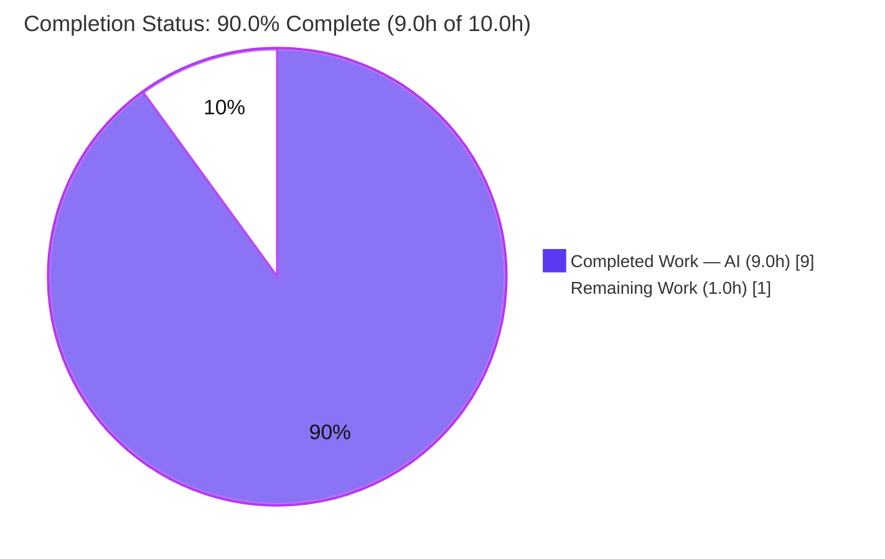
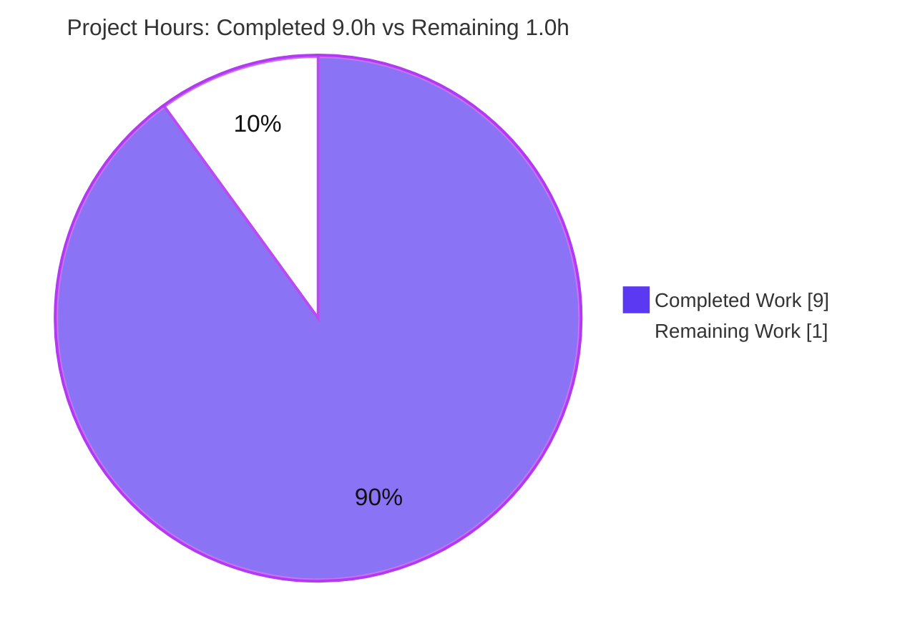
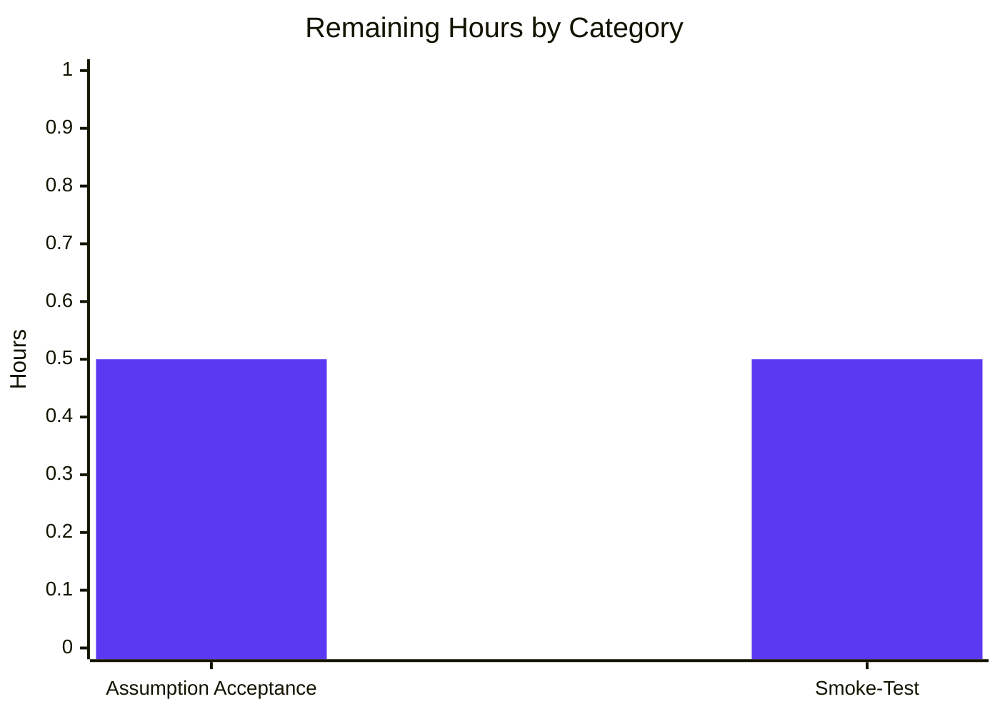

# Blitzy Project Guide — `13_feb_2_3` Express Tutorial Server

> **Project status color key:** Completed / AI Work = Dark Blue `#5B39F3` · Remaining / Not Completed = White `#FFFFFF` · Headings & Accents = Violet-Black `#B23AF2` · Highlight = Mint `#A8FDD9`

---

## 1. Executive Summary

### 1.1 Project Overview

This project integrates the Express.js web framework into a previously empty Node.js repository and exposes two HTTP `GET` endpoints: the preserved baseline `GET /` returning `Hello world`, and a new `GET /good-evening` returning `Good evening`. It targets developers learning Express routing and serves as a minimal, runnable tutorial server. Business impact is educational and demonstrative rather than revenue-bearing. The technical scope is deliberately small: a single CommonJS entry file (`index.js`), an npm manifest pinning `express@5.2.1`, a generated lockfile, version-control hygiene (`.gitignore`), and run documentation (`README.md`). The repository was greenfield — only a placeholder `README` existed — so the entire runnable baseline was scaffolded from scratch under the Agent Action Plan.

### 1.2 Completion Status



| Metric | Value |
|---|---:|
| **Total Hours** | **10.0** |
| **Completed Hours (AI + Manual)** | **9.0** (9.0 AI + 0.0 Manual) |
| **Remaining Hours** | **1.0** |
| **Percent Complete** | **90.0%** |

> Completion is computed with the AAP-scoped, hours-based methodology: `9.0 ÷ 10.0 × 100 = 90.0%`. All four AAP requirements (R1–R4) and all five in-scope file deliverables are **fully delivered and runtime-verified**. The remaining 1.0 hour is human acceptance/verification work only — there are **no engineering gaps**.

### 1.3 Key Accomplishments

- ✅ **Express.js integrated** — `express@5.2.1` declared (`^5.2.1`) and locked (`package-lock.json`, lockfileVersion 3); reproducible install proven via `npm ci` (66 packages, 0 vulnerabilities).
- ✅ **Baseline endpoint preserved** — `GET /` returns byte-exact `Hello world` (HTTP 200), satisfying the backward-compatibility constraint.
- ✅ **New endpoint added** — `GET /good-evening` returns byte-exact `Good evening` (HTTP 200), the requested feature.
- ✅ **Minimal runnable scaffolding** — `package.json` (`main`, `start` script), `index.js` entry, `package-lock.json`, and `.gitignore` (ignoring `node_modules/`) all created.
- ✅ **Documentation complete** — `README.md` covers prerequisites (Node `>= 18`), installation, `npm start`, `PORT` override, and an endpoints table with `curl` examples.
- ✅ **Runtime verified** — both endpoints, the Express default 404, and the `PORT` override were validated on Node `v20.20.2` / npm `11.1.0`.
- ✅ **Zero-placeholder, secure delivery** — no stubs/TODOs; `npm audit` reports 0 vulnerabilities; clean committed tree at `HEAD 265cc97`.

### 1.4 Critical Unresolved Issues

| Issue | Impact | Owner | ETA |
|---|---|---|---|
| _None_ — no defects, compilation errors, or failing checks remain in scope | None | — | — |

> No critical unresolved issues exist. The application installs, loads, and runs correctly with all requested behaviors verified.

### 1.5 Access Issues

| System/Resource | Type of Access | Issue Description | Resolution Status | Owner |
|---|---|---|---|---|
| npm public registry | Dependency download | Needed once to install `express`; already resolved & locked in `package-lock.json` | ✅ Resolved | Dev |

> No blocking access issues identified. The only external resource is the public npm registry, already satisfied by the committed lockfile (offline `npm ci` works against the existing `node_modules/`).

### 1.6 Recommended Next Steps

1. **[Medium]** Review and accept the AAP-flagged assumptions — route path `GET /good-evening`, default port `3000`, and the greenfield-baseline interpretation (0.5h).
2. **[Medium]** Run a local environment smoke-test on the target machine: `npm install` → `npm start` → `curl` both endpoints and an unknown path (0.5h).
3. **[Low, optional]** Add automated tests (Jest + Supertest) for both endpoints and the 404 path — out of current AAP scope (~2–4h).
4. **[Low, optional]** Pin the Node runtime via a `package.json` `engines` field and/or `.nvmrc` (~0.5h).
5. **[Low, optional]** Apply production hardening (helmet, CORS, rate limiting, TLS) and/or containerization + CI only if the server moves beyond its tutorial purpose (~2–8h).

---

## 2. Project Hours Breakdown

### 2.1 Completed Work Detail

| Component | Hours | Description |
|---|---:|---|
| Project scaffolding & Express 5.2.1 integration (R1, R4) | 2.5 | `package.json` manifest, `npm install`, `package-lock.json` (66 packages, 0 vulnerabilities), `.gitignore`; web research confirming `express@5.2.1` + Node `>= 18` compatibility |
| Baseline endpoint `GET /` → `Hello world` (R2) | 1.0 | Express route handler in `index.js` returning the exact baseline string |
| New endpoint `GET /good-evening` → `Good evening` (R3) | 1.0 | Express route handler in `index.js` returning the exact new-feature string |
| Express app bootstrap & runtime entry (R2, R3) | 1.5 | App instantiation, `PORT` env handling, `app.listen` + startup log, CommonJS structure, comprehensive JSDoc |
| README documentation (R4) | 1.5 | Description, prerequisites, installation, usage, `PORT` override, endpoints table, `curl` examples |
| Autonomous runtime validation & verification | 1.5 | Multi-port boot, exact body + status-code assertions, 404 check, content-type check, `npm audit`, README version-accuracy refinement (commit `265cc97`) |
| **Total Completed** | **9.0** | Matches Completed Hours in §1.2 |

### 2.2 Remaining Work Detail

| Category | Hours | Priority |
|---|---:|---|
| Stakeholder acceptance of AAP-flagged assumptions (route path `/good-evening`, default port `3000`, greenfield baseline) | 0.5 | Medium |
| Local environment smoke-test (`npm install` → `npm start` → `curl` both endpoints + 404) | 0.5 | Medium |
| **Total Remaining** | **1.0** | Matches Remaining Hours in §1.2 and §7 |

### 2.3 Out-of-Scope / Optional Enhancements (Not Counted in Totals)

The following are **explicitly excluded by the AAP (§0.3.2)** and are therefore **not** part of the 10.0-hour total or the completion percentage. They are listed only as forward guidance should the project be taken beyond its stated tutorial purpose:

| Optional Enhancement | Indicative Hours | Note |
|---|---:|---|
| Automated tests (Jest + Supertest) | ~2–4 | Out of AAP scope; no tests requested |
| Pin Node version (`engines` field / `.nvmrc`) | ~0.5 | Nice-to-have hygiene |
| Security hardening (helmet, CORS, rate limiting, TLS) | ~2–3 | Required only for public deployment |
| Containerization (Dockerfile) and/or CI pipeline | ~4–8 | Out of AAP scope; no deployment requested |

---

## 3. Test Results

All results below originate from **Blitzy's autonomous validation logs** for this project and were independently re-confirmed during this assessment. **No automated unit-test framework is in scope** (AAP §0.3.2 explicitly excludes tests); functional correctness is therefore proven by autonomous runtime validation rather than a unit-test suite.

| Test Category | Framework / Tool | Total | Passed | Failed | Coverage % | Notes |
|---|---|---:|---:|---:|---:|---|
| Dependency Validation | npm (`ci`, `ls`, `audit`) | 3 | 3 | 0 | N/A | `npm ci` → 66 packages reproducible; `npm ls` clean; `npm audit` → 0 vulnerabilities |
| Compilation / Static | `node --check`, JSON parse | 2 | 2 | 0 | N/A | `index.js` syntax OK; `package.json` & `package-lock.json` valid JSON; module loads with both routes registered |
| Runtime / Functional | HTTP `curl` assertions | 3 | 3 | 0 | 100% of endpoints | `GET /` → 200 `Hello world`; `GET /good-evening` → 200 `Good evening`; unknown route → 404 |
| **Totals** | | **8** | **8** | **0** | **100% pass** | `PORT` override (8080) additionally validated; 0 unit tests by design |

> **Integrity note:** The 8 checks above are the autonomous production-readiness validations executed by Blitzy (Dependencies, Compilation, Runtime gates). There is no unit/integration/E2E test suite because testing is out of scope per the AAP.

---

## 4. Runtime Validation & UI Verification

Runtime validation was performed by starting the server via the documented `npm start` command and exercising every route. **There is no UI** — this is a plaintext HTTP backend, so UI verification is not applicable.

**HTTP runtime health (Node `v20.20.2`, port 3000 default):**

- ✅ **Operational** — Server boot: `npm start` → `Server listening on http://localhost:3000`.
- ✅ **Operational** — `GET /` → HTTP **200**, body byte-exact `Hello world` (`Content-Type: text/html; charset=utf-8`, `Content-Length: 11`).
- ✅ **Operational** — `GET /good-evening` → HTTP **200**, body byte-exact `Good evening` (`Content-Length: 12`).
- ✅ **Operational** — Unknown route (`GET /missing`) → HTTP **404** (Express default handler).
- ✅ **Operational** — `PORT` override: `PORT=8080 npm start` → `Server listening on http://localhost:8080`; `GET /` served correctly on 8080.
- ✅ **Operational** — Process hygiene: server shuts down cleanly; ports `3000`/`8080` released; git tree remains clean.

**API integration outcomes:** No external/third-party API integrations are in scope; there are no outbound calls, databases, or services to integrate. Integration surface is intentionally nil.

---

## 5. Compliance & Quality Review

Each AAP deliverable and constraint is cross-mapped to Blitzy's quality benchmarks below. All items pass; fixes applied during autonomous validation are noted.

| Requirement / Benchmark | Status | Progress | Evidence |
|---|---|---:|---|
| R1 — Add Express.js (`express@5.2.1`) | ✅ Pass | 100% | Declared `^5.2.1` in `package.json`; locked `5.2.1` in `package-lock.json`; `npm ls` clean |
| R2 — `GET /` → `Hello world` | ✅ Pass | 100% | `index.js` L44–46; runtime body + 200 verified |
| R3 — `GET /good-evening` → `Good evening` | ✅ Pass | 100% | `index.js` L54–56; runtime body + 200 verified |
| R4 — Minimal scaffolding + docs | ✅ Pass | 100% | `package.json`, `package-lock.json`, `.gitignore`, `README.md` all present & valid |
| Verbatim response strings preserved | ✅ Pass | 100% | `Hello world` / `Good evening` reproduced character-for-character |
| Backward compatibility (`Hello world` reachable) | ✅ Pass | 100% | Change is strictly additive; `GET /` preserved |
| Express used for routing (not raw `http`) | ✅ Pass | 100% | `const app = express()`; both routes declared on the app |
| Pinned dependency version (no `latest`) | ✅ Pass | 100% | Exact version `5.2.1` verified against the registry |
| Zero-placeholder policy | ✅ Pass | 100% | No stubs, TODOs, or `NotImplemented`; complete implementation |
| Dependency security | ✅ Pass | 100% | `npm audit` → 0 vulnerabilities |
| Version-control hygiene (`node_modules/` ignored) | ✅ Pass | 100% | `git check-ignore` confirms; only in-scope files tracked |

**Fixes applied during autonomous validation:** one scope-preserving documentation accuracy fix — `README.md` "Validated on Node `v22.22.2`" → "`v20.20.2`" to reflect this repository's actual validated runtime (commit `265cc97`). No other in-scope file required changes.

**Outstanding compliance items:** none.

---

## 6. Risk Assessment

All identified risks are **Low** severity, consistent with a fully-delivered, tutorial-scope project. None are blocking. Items that would escalate only upon public deployment are explicitly out of AAP scope and correctly deferred.

| Risk | Category | Severity | Probability | Mitigation | Status |
|---|---|---|---|---|---|
| No automated test suite (no regression safety net for future edits) | Technical | Low | Low | Runtime validation performed; add Jest + Supertest if the project grows | Accepted (scope) |
| Node runtime not pinned (`engines`/`.nvmrc` absent) | Technical | Low | Low | `README` documents Node `>= 18`; add `engines` field optionally | Accepted / Monitoring |
| `res.send()` returns `text/html` (not `text/plain`) for short strings | Technical | Low | N/A (by design) | AAP-accepted; use `res.type('text/plain')` if strict plaintext needed | Accepted (by design) |
| No production hardening (helmet, CORS, rate limiting, TLS) | Security | Low (tutorial) | Low | Out of AAP scope; add before any public deployment | Accepted (scope) |
| `X-Powered-By: Express` header exposed | Security | Low | Low | `app.disable('x-powered-by')` or helmet if deployed | Accepted (scope) |
| Transitive dependency CVEs over time | Security | Low | Low | Lockfile pins all ~66 packages; periodic `npm audit` | Mitigated (0 vulns now) |
| Minimal observability (single startup log; no `/health`, no metrics) | Operational | Low | Low | Out of scope; add health route + structured logging if operationalized | Accepted (scope) |
| No process manager / auto-restart (foreground `npm start`) | Operational | Low | Low | Use pm2/systemd/container if deployed | Accepted (scope) |
| No deployment artifacts (Dockerfile/CI) | Operational | Low | Low | Explicitly excluded by AAP | Accepted (scope) |
| Default port `3000` collision with another local service | Integration | Low | Low | `PORT` env override documented & validated (`PORT=8080`) | Mitigated |
| No external integrations / DB / 3rd-party APIs | Integration | None | None | N/A — no external dependencies | N/A |

**Overall risk posture: LOW.** Zero High/Critical risks. No risk blocks the 1.0h human acceptance path to production.

---

## 7. Visual Project Status

**Project hours breakdown** (Completed = Dark Blue `#5B39F3`, Remaining = White `#FFFFFF`):



**Remaining work by category** (hours, from §2.2 — both Medium priority):



> **Integrity check:** Pie "Remaining Work" = **1.0h** = §1.2 Remaining Hours = sum of §2.2 Hours column. Pie "Completed Work" = **9.0h** = §1.2 Completed Hours = sum of §2.1 Hours column. Total = **10.0h**.

---

## 8. Summary & Recommendations

**Achievements.** The Agent Action Plan is fully delivered. Express.js (`5.2.1`) was integrated into a greenfield repository, the baseline `GET /` → `Hello world` endpoint was created and preserved, and the requested `GET /good-evening` → `Good evening` endpoint was added. Supporting scaffolding (`package.json`, `package-lock.json`, `.gitignore`) and complete run documentation (`README.md`) are in place. Every requirement (R1–R4) and constraint was verified, with all behaviors confirmed at runtime.

**Remaining gaps.** There are **no engineering gaps**. The only remaining work is **1.0 hour** of human path-to-production activity: accepting the three AAP-flagged assumptions and running a local smoke-test on the target machine.

**Critical path to production.** (1) Stakeholder accepts assumptions → (2) local smoke-test (`npm install` → `npm start` → `curl`) → (3) merge PR. No code changes are required to reach this point.

**Success metrics.** All met within scope: both endpoints return byte-exact responses with HTTP 200; unknown routes return 404; `npm ci` is reproducible with 0 vulnerabilities; the committed tree is clean.

**Production readiness assessment.** The project is **90.0% complete** on an AAP-scoped basis and is **functionally production-ready for its stated tutorial purpose**. For any public, internet-facing deployment, the optional hardening, testing, and CI/containerization items in §2.3 should be considered — but these are explicitly outside the current AAP scope.

| Metric | Value |
|---|---:|
| AAP-scoped completion | 90.0% |
| AAP requirements delivered (R1–R4) | 4 / 4 |
| In-scope file deliverables delivered | 5 / 5 |
| Autonomous validation checks passed | 8 / 8 |
| Open defects / blocking issues | 0 |
| Remaining human effort | 1.0h |

---

## 9. Development Guide

> Every command below was executed and verified during this assessment on **Node `v20.20.2` / npm `11.1.0`**. All commands are copy-pasteable and run from the repository root.

### 9.1 System Prerequisites

- **Node.js `>= 18`** (required by Express 5). Validated on `v20.20.2`.
- **npm** (ships with Node.js). Validated on `11.1.0`.
- **OS:** any Node-supported OS (validated on Linux). `curl` is optional, for endpoint checks.

```bash
node --version   # expect v18+ (validated v20.20.2)
npm --version    # validated 11.1.0
```

### 9.2 Environment Setup

No `.env` file or environment variables are required. The only optional variable is `PORT` (defaults to `3000`). There are no databases, caches, or message queues to provision.

```bash
# (optional) choose a non-default port for this shell session
export PORT=8080
```

### 9.3 Dependency Installation

```bash
# Reproducible, lockfile-exact install (recommended) — verified: "added 66 packages", 0 vulnerabilities
npm ci

# Alternative (also honors the committed lockfile)
npm install

# (optional) confirm a clean security posture — verified: "found 0 vulnerabilities"
npm audit --omit=dev
```

Expected: Express and its transitive dependencies (66 packages total) install into `node_modules/` (git-ignored). `express` resolves to exactly `5.2.1`.

### 9.4 Application Startup

```bash
# Start on the default port 3000
npm start
# -> > 13_feb_2_3@1.0.0 start
# -> > node index.js
# -> Server listening on http://localhost:3000

# Start on a custom port
PORT=8080 npm start
# -> Server listening on http://localhost:8080
```

The process runs in the foreground; press `Ctrl+C` to stop.

### 9.5 Verification Steps

```bash
# Baseline endpoint -> "Hello world"  (HTTP 200)
curl http://localhost:3000/

# New endpoint -> "Good evening"  (HTTP 200)
curl http://localhost:3000/good-evening

# Unknown route -> Express default 404
curl -i http://localhost:3000/missing | head -n 1   # -> HTTP/1.1 404 Not Found
```

Expected output: `Hello world`, then `Good evening`, then a `404` status line.

### 9.6 Example Usage

```bash
# Inspect full response headers for the baseline endpoint
curl -i http://localhost:3000/
# HTTP/1.1 200 OK
# X-Powered-By: Express
# Content-Type: text/html; charset=utf-8
# Content-Length: 11
# ...
# Hello world
```

### 9.7 Troubleshooting

- **`Error: Cannot find module 'express'`** — dependencies are not installed. Run `npm ci` (or `npm install`); `node_modules/` is git-ignored and not committed.
- **`EADDRINUSE: address already in use :::3000`** — another process holds port 3000. Start on another port: `PORT=8080 npm start`, or identify and stop the conflicting process (`lsof -i:3000`, then `kill <PID>`).
- **Express fails to load / "Unsupported engine"** — your Node is older than 18. Check with `node --version` and upgrade.
- **`404` on `/`** — ensure you started this project's `index.js` and are using the correct port; both routes are `GET`-only.

---

## 10. Appendices

### A. Command Reference

| Command | Purpose |
|---|---|
| `npm ci` | Reproducible install from `package-lock.json` (66 packages) |
| `npm install` | Install dependencies honoring the lockfile |
| `npm start` | Run the server (`node index.js`) on port 3000 |
| `PORT=8080 npm start` | Run the server on a custom port |
| `npm audit --omit=dev` | Security audit of production dependencies (0 vulnerabilities) |
| `node --check index.js` | Syntax-validate the entry file |
| `curl http://localhost:3000/` | Exercise the baseline endpoint |
| `curl http://localhost:3000/good-evening` | Exercise the new endpoint |

### B. Port Reference

| Port | Usage | Configurable |
|---|---|---|
| `3000` | Default HTTP listen port | Yes — set `PORT` env var |
| `8080` | Example override used in docs/validation | Yes — `PORT=8080` |

### C. Key File Locations

| Path | Role |
|---|---|
| `index.js` | Express application entry: both routes + `app.listen` |
| `package.json` | Manifest: `main`, `start` script, `express ^5.2.1` |
| `package-lock.json` | Locks `express 5.2.1` + transitive deps (lockfileVersion 3) |
| `.gitignore` | Excludes `node_modules/` and npm/log artifacts |
| `README.md` | Prerequisites, install/run instructions, endpoints table |
| `node_modules/` | Installed dependencies (generated, git-ignored) |

### D. Technology Versions

| Technology | Version | Notes |
|---|---|---|
| Node.js | `v20.20.2` (validated) | Requirement: `>= 18` |
| npm | `11.1.0` | Ships with Node |
| Express | `5.2.1` | Pinned (`^5.2.1`), locked at `5.2.1` |
| Lockfile format | `lockfileVersion 3` | npm v7+ format |
| Module system | CommonJS | No `"type": "module"`; uses `require` |

### E. Environment Variable Reference

| Variable | Default | Purpose |
|---|---|---|
| `PORT` | `3000` | HTTP listen port; override without code changes |

### F. Developer Tools Guide

- **npm scripts:** `start` → `node index.js` (the only script defined).
- **Routing model:** declarative `app.get(path, handler)` on a single Express application object; unmatched routes fall through to Express's built-in 404.
- **Adding an endpoint:** register another `app.get('/your-path', (req, res) => res.send('...'))` in `index.js` before `app.listen` — no other wiring needed.
- **Logs:** a single startup line is printed to stdout on boot; there is no structured logging framework (out of scope).

### G. Glossary

| Term | Definition |
|---|---|
| Express | Minimalist Node.js web framework providing routing and HTTP request/response handling |
| Endpoint / Route | A URL path + HTTP method pair handled by the app (here, `GET /` and `GET /good-evening`) |
| CommonJS | Node's classic module system using `require()` / `module.exports` |
| Lockfile | `package-lock.json` — pins exact dependency versions for reproducible installs |
| Greenfield | A project started from scratch with no pre-existing application code |
| `npm ci` | Clean, reproducible install directly from the lockfile |

---

*Generated by the Blitzy Platform. Completion (90.0%) is measured strictly against AAP-scoped deliverables and standard path-to-production work. Color key: Completed = `#5B39F3`, Remaining = `#FFFFFF`.*