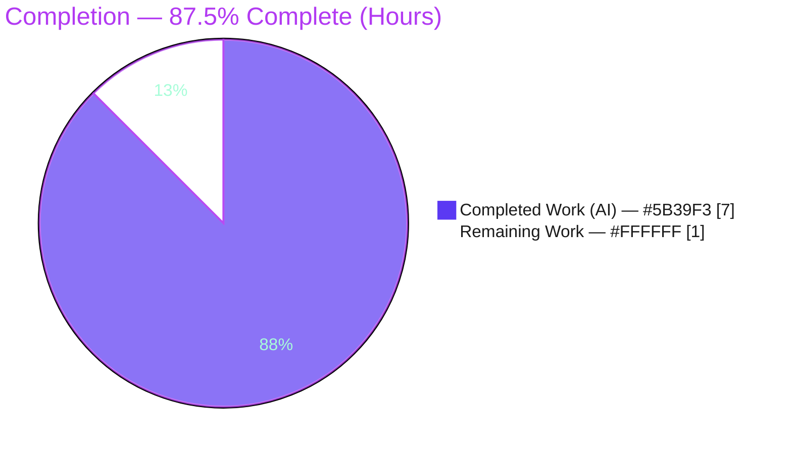
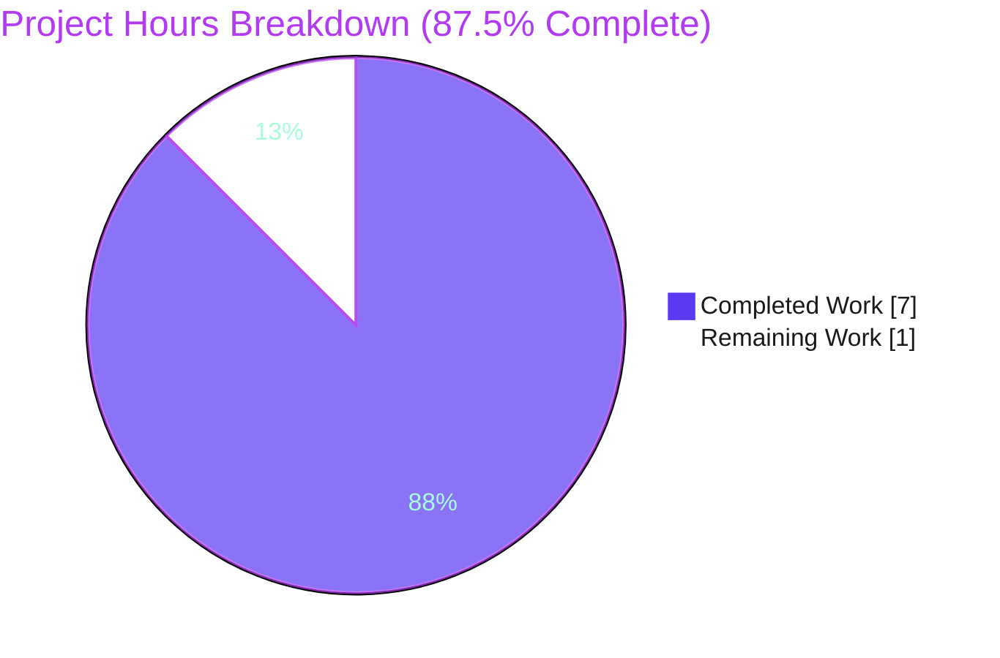
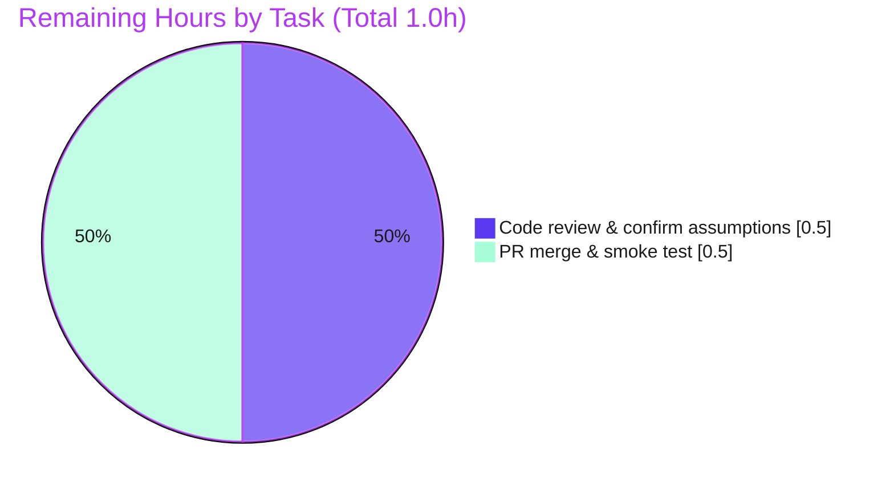
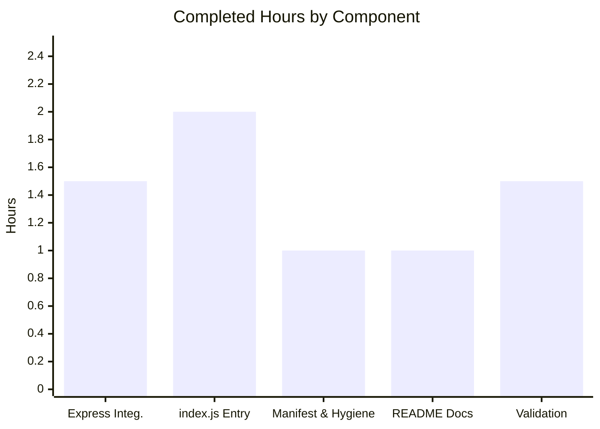

# Blitzy Project Guide — `13_feb_2_3` Express Tutorial Server

> **Project Status Color Key:** Completed / AI Work = Dark Blue `#5B39F3` · Remaining / Not Completed = White `#FFFFFF` · Headings & Accents = Violet-Black `#B23AF2` · Highlight = Mint `#A8FDD9`
>
> **Branch:** `blitzy-00736d9b-6cad-49ba-a9d8-1091cddfb841` · **HEAD:** `d0d46b6` · **Working tree:** CLEAN

---

## 1. Executive Summary

### 1.1 Project Overview

The project integrates the Express.js framework into a previously empty repository to deliver a minimal Node.js tutorial HTTP server. It exposes two `GET` endpoints — `/` returning `Hello world` (baseline, preserved) and `/good-evening` returning `Good evening` (the newly added feature) — fulfilling the user's request to add Express and a second endpoint. Target users are developers learning Express routing fundamentals. Technical scope covers a single CommonJS entry point (`index.js`), an npm manifest and lockfile pinning `express@5.2.1`, a `.gitignore`, and README documentation. Because the repository was greenfield — only a placeholder README existed — the baseline server was scaffolded from scratch. Business impact: a working, reproducible reference implementation.

### 1.2 Completion Status



| Metric | Value |
|---|---|
| **Total Hours** | **8.0** |
| **Completed Hours (AI + Manual)** | **7.0** (AI 7.0 + Manual 0.0) |
| **Remaining Hours** | **1.0** |
| **Percent Complete** | **87.5%** |

> **Calculation:** `Completion % = Completed ÷ (Completed + Remaining) = 7.0 ÷ (7.0 + 1.0) = 7.0 ÷ 8.0 = 87.5%`. Percentage reflects only AAP-scoped deliverables (R1–R4) plus standard path-to-production activities; explicitly out-of-scope items (AAP §0.3.2) are excluded.

### 1.3 Key Accomplishments

- ✅ **Express.js integrated (R1):** `express@^5.2.1` declared in `package.json`, locked to `5.2.1` in `package-lock.json` (lockfileVersion 3); `npm ci` installs 66 packages with **0 vulnerabilities**.
- ✅ **Baseline endpoint preserved (R2):** `GET /` returns the exact plaintext `Hello world` (byte-verified, 11 bytes) with HTTP 200, served through Express.
- ✅ **New endpoint added (R3):** `GET /good-evening` returns the exact plaintext `Good evening` (byte-verified, 12 bytes) with HTTP 200.
- ✅ **Project scaffolding complete (R4):** `index.js` (CommonJS entry, `PORT || 3000` listener, full JSDoc), `package.json` (`start` script), `package-lock.json`, `.gitignore`, and a documented `README.md`.
- ✅ **Runtime verified:** server boots cleanly; unknown routes return HTTP 404; `PORT` environment override confirmed (8080/3100).
- ✅ **Clean compilation:** `node --check index.js` exits 0; `npm ls` resolves a clean dependency tree.
- ✅ **Repository hygiene:** all five in-scope files committed on a clean working tree; `node_modules/` correctly git-ignored.

### 1.4 Critical Unresolved Issues

**No critical (release-blocking) issues identified.** All AAP requirements are implemented and runtime-verified. The only open items are non-blocking confirmations carried over from the AAP's flagged assumptions.

| Issue | Impact | Owner | ETA |
|---|---|---|---|
| Confirm new route path `/good-evening` matches stakeholder intent (AAP §0.8.2 flagged this — the user specified the response, not the path) | Low — endpoint works; only the path name needs sign-off | Human reviewer | During code review (≤0.5h) |
| Confirm default port `3000` (overridable via `PORT`) is acceptable | Low — already overridable without code change | Human reviewer | During code review (within above) |

### 1.5 Access Issues

**No access issues identified.** All validation commands (`git`, `node`, `npm`, `curl`) executed successfully with no permission, credential, or network-access barriers. The project requires no external services, API keys, or third-party credentials.

| System/Resource | Type of Access | Issue Description | Resolution Status | Owner |
|---|---|---|---|---|
| Git repository | Read/Write | None | ✅ No issue | — |
| npm registry (install-time) | Read | None — `npm ci` succeeded offline against committed lockfile | ✅ No issue | — |
| Runtime host (localhost) | Network bind | None — server binds port 3000/override | ✅ No issue | — |

### 1.6 Recommended Next Steps

1. **[High]** Review the five in-scope files (`index.js`, `package.json`, `package-lock.json`, `.gitignore`, `README.md`) and confirm the AAP-flagged assumptions (route path, verbatim response strings, default port). *(~0.5h)*
2. **[High]** Approve and merge the PR to `main`, then run the post-merge smoke test (`npm ci` → `npm start` → `curl` both endpoints, verify 404). *(~0.5h)*
3. **[Low]** *(Optional, out of AAP scope)* If the tutorial is later productionized, pin Node via a `package.json` `engines` field and consider `res.type('text/plain')` for strict plaintext responses.
4. **[Low]** *(Optional, out of AAP scope)* Add automated tests (Jest + supertest), production hardening (helmet/CORS/rate limiting/HTTPS), and a deployment pipeline (Docker/CI) only if scope expands beyond the tutorial.

---

## 2. Project Hours Breakdown

### 2.1 Completed Work Detail

| Component | Hours | Description |
|---|---|---|
| Express integration & dependency management (R1, R4c) | 1.5 | Declared `express@^5.2.1` in `package.json`; ran `npm install` resolving Express + 65 transitive packages; generated `package-lock.json` (lockfileVersion 3, locked 5.2.1); verified current stable version & Node ≥18 compatibility. |
| Express application entry — `index.js` (R2, R3, R4b) | 2.0 | Instantiated Express app; implemented `GET /` → `Hello world` and `GET /good-evening` → `Good evening` (verbatim strings); `app.listen(process.env.PORT || 3000)` with startup log; comprehensive JSDoc; `'use strict'`. |
| Project manifest & VCS hygiene (R4a, R4d) | 1.0 | `package.json` fields (`name`, `version`, `description`, `main`, `scripts.start`, `license`, `keywords`, `author`); `.gitignore` excluding `node_modules/` and npm log artifacts. |
| Documentation — `README.md` (R4e) | 1.0 | Project description, prerequisites (Node ≥18), installation, usage (`npm start`), `PORT` override, endpoints table, and `curl` examples. |
| Autonomous validation & runtime verification | 1.5 | Five production-readiness gates; byte-exact response checks; 404 fallback; `PORT` override; `npm audit` (0 vulnerabilities); `node --check` compilation. |
| **Total Completed** | **7.0** | **Matches Completed Hours in §1.2.** |

### 2.2 Remaining Work Detail

| Category | Hours | Priority |
|---|---|---|
| Human code review of the 5 in-scope files + confirm AAP §0.8.2 open assumptions (route path, verbatim strings, default port) | 0.5 | High |
| PR merge to `main` + post-merge local smoke test (`npm ci` → `npm start` → `curl` both endpoints, verify 404) | 0.5 | High |
| **Total Remaining** | **1.0** | **Matches Remaining Hours in §1.2 and §7 pie chart.** |

### 2.3 Hours Calculation & Out-of-Scope Notes

**Calculation summary (AAP-scoped, PA1 methodology):**

```
Completed Hours   = 1.5 + 2.0 + 1.0 + 1.0 + 1.5 = 7.0
Remaining Hours   = 0.5 + 0.5                   = 1.0
Total Project Hrs = 7.0 + 1.0                   = 8.0
Percent Complete  = 7.0 ÷ 8.0                   = 87.5%
```

**Out-of-scope enhancements (NOT counted in the 8.0h total or 87.5% — informational only).** Per AAP §0.3.2, the following are explicitly excluded from this task and therefore excluded from the completion denominator. They are listed solely as future guidance should the project grow beyond a tutorial:

| Optional Enhancement (out of scope) | Indicative Effort | Related Risk |
|---|---|---|
| Pin Node via `package.json` `engines` field | ~0.25h | T3 |
| `res.type('text/plain')` for strict plaintext content-type | ~0.25h | T1 |
| Automated tests (Jest + supertest) | ~2–3h | T2 |
| Production hardening (helmet, CORS, rate limiting, HTTPS) | ~3–4h | S1 |
| Operations (`/health` endpoint, structured logging, process manager) | ~2–3h | O1, O2 |
| Deployment automation (Dockerfile, CI/CD) | ~3–5h | — |

---

## 3. Test Results

All entries below originate from Blitzy's autonomous validation logs for this project and were independently re-executed on Node `v20.20.2` / npm `11.1.0`. The project has **no automated unit/integration test framework by design** (tests are out of scope per AAP §0.3.2 / §0.8.1); functional correctness is proven through autonomous runtime and static validation.

| Test Category | Framework | Total Tests | Passed | Failed | Coverage % | Notes |
|---|---|---|---|---|---|---|
| Functional / HTTP Endpoint | `curl` + Node runtime (autonomous) | 5 | 5 | 0 | 100% of routes | `GET /` → 200 `Hello world`; `GET /good-evening` → 200 `Good evening`; unknown → 404; byte-exact `Hello world` (11 B); byte-exact `Good evening` (12 B) |
| Configuration / Runtime | Node runtime (autonomous) | 2 | 2 | 0 | n/a | Default port 3000 bind + startup log; `PORT` override (8080 / 3100) bind + serve |
| Compilation / Static | `node --check` | 1 | 1 | 0 | n/a | `index.js` syntax valid, exit 0 |
| Dependency / Security | `npm ci` + `npm audit` | 2 | 2 | 0 | n/a | 66 packages installed (67 audited); **0 vulnerabilities** |
| Unit / Integration / E2E (automated) | — (none) | 0 | 0 | 0 | n/a | **Out of scope by design** (AAP §0.3.2/§0.8.1); `npm test` → "Missing script: test" is expected, not a failure |
| **Totals** | | **10** | **10** | **0** | — | **100% pass rate across all autonomous validation checks** |

> **Coverage note:** "100% of routes" denotes functional behavior exercised at runtime (both declared routes plus the default 404 fallback), not instrumented line coverage — no coverage tooling is in scope.

---

## 4. Runtime Validation & UI Verification

**UI Verification:** Not applicable. This is a backend HTTP server returning short plaintext responses; there is no graphical user interface, component library, or design system (AAP §0.5.3).

**Runtime Health (independently verified):**

- ✅ **Server boot** — `npm start` logs `Server listening on http://localhost:3000`; process stays alive.
- ✅ **`GET /`** — returns `Hello world`, HTTP **200**, `Content-Type: text/html; charset=utf-8`.
- ✅ **`GET /good-evening`** — returns `Good evening`, HTTP **200**.
- ✅ **Unknown route** (`GET /unknown`) — returns Express default **404**.
- ✅ **`PORT` override** — `PORT=8080` / `PORT=3100` bind and serve correctly.
- ✅ **Byte-exactness** — responses verified via `od -c` (`Hello world` = 11 bytes, `Good evening` = 12 bytes); verbatim match to the user's requested strings.
- ✅ **Dependency install** — `npm ci` reproducible from lockfile, 0 vulnerabilities.
- ✅ **Compilation** — `node --check index.js` passes.

**API Integration Outcomes:** No external/third-party API integrations are in scope; none required. All endpoints are self-contained.

---

## 5. Compliance & Quality Review

| AAP Requirement / Quality Benchmark | Status | Evidence / Fixes Applied |
|---|---|---|
| **R1** — Add Express.js (`express@5.2.1`) | ✅ Pass | Declared `^5.2.1`, locked `5.2.1`; installed clean. No fixes needed. |
| **R2** — `GET /` → `Hello world` via Express | ✅ Pass | `index.js` L44–46; runtime 200, byte-exact. No fixes needed. |
| **R3** — `GET /good-evening` → `Good evening` | ✅ Pass | `index.js` L54–56; runtime 200, byte-exact. No fixes needed. |
| **R4** — Minimal scaffolding + docs | ✅ Pass | `package.json`, `index.js`, `package-lock.json`, `.gitignore`, `README.md` all present & correct. No fixes needed. |
| Verbatim response strings preserved | ✅ Pass | Byte-exact `Hello world` / `Good evening` confirmed. |
| Backward compatibility (baseline reachable) | ✅ Pass | `GET /` still serves `Hello world`; change is purely additive. |
| Framework directive (routes via Express) | ✅ Pass | Both routes registered on the Express app (not raw `http`). |
| Pinned, non-placeholder dependency version | ✅ Pass | `express@5.2.1` verified against registry; no `latest`. |
| Dependency security (`npm audit`) | ✅ Pass | 0 vulnerabilities. |
| Code quality (no anti-patterns, documented) | ✅ Pass | `'use strict'`, comprehensive JSDoc, no TODO/placeholder/stub code. |
| Repository hygiene (`node_modules/` ignored, clean tree) | ✅ Pass | `.gitignore` excludes `node_modules/`; working tree clean. |
| Scope discipline (no out-of-scope additions) | ✅ Pass | No tests/middleware/Docker/CI introduced, per AAP §0.3.2. |

**Fixes applied during autonomous validation:** **None required** — the implementation was already complete, correct, and idiomatic; validation reported zero compilation errors, zero runtime errors, and zero dependency issues.

**Outstanding compliance items:** None blocking. Only the non-binding stakeholder confirmation of the assumed route path (see §1.4) remains.

---

## 6. Risk Assessment

All identified risks are **Low** severity. The majority are accepted-by-design consequences of the deliberately minimal tutorial scope (AAP §0.3.2).

| Risk | Category | Severity | Probability | Mitigation | Status |
|---|---|---|---|---|---|
| `res.send()` returns `Content-Type: text/html` rather than `text/plain` | Technical | Low | Medium | Acceptable for tutorial (AAP §0.5.5); use `res.type('text/plain')` if strict plaintext is required | Accepted (by design) |
| No automated tests — regressions could go undetected if project grows | Technical | Low | Low | Functional correctness runtime-verified; add Jest/supertest if scope expands | Accepted (out of scope) |
| Node version not pinned in `package.json` (`engines`); README states ≥18 | Technical | Low | Low | Add an `engines` field to enforce Node ≥18 | Open (minor) |
| No production hardening (helmet, CORS, rate limiting, HTTPS) | Security | Low | Low | Add hardening before any public deployment; no sensitive data or auth in tutorial | Accepted (out of scope) |
| Dependency vulnerabilities | Security | Low | Low | `npm audit` reports 0 vulnerabilities; lockfile pins versions; run periodic audits | Mitigated |
| No health-check endpoint / monitoring / structured logging | Operational | Low | Low | Startup log present; add `/health` + monitoring if deployed as a service | Accepted (out of scope) |
| No process manager / advanced graceful shutdown | Operational | Low | Low | Use pm2/systemd if deployed | Accepted (out of scope) |
| Assumed route path `/good-evening` (user specified response, not path) | Integration | Low | Low | Confirm with stakeholder during code review | Open (confirm in review) |
| External services / API keys / network config | Integration | None | n/a | None required by the task | N/A |

---

## 7. Visual Project Status

**Project Hours — Completed vs. Remaining** (Completed = Dark Blue `#5B39F3`, Remaining = White `#FFFFFF`):



**Remaining Work by Priority** (both remaining items are High priority, totaling 1.0h):



**Completed Hours by Component** (sums to 7.0h):



> **Integrity check:** "Remaining Work" = **1.0h** in the pie above equals the Remaining Hours in §1.2 and the sum of the §2.2 Hours column. "Completed Work" = **7.0h** equals the §2.1 total. 7.0 + 1.0 = 8.0 Total.

---

## 8. Summary & Recommendations

**Achievements.** All four AAP requirements (R1–R4) are fully implemented, committed, and runtime-verified with **zero fixes required** during validation. Express 5.2.1 is integrated and pinned; both endpoints return their exact required plaintext responses with correct HTTP status codes; the project installs cleanly with zero vulnerabilities and compiles without error. The implementation is idiomatic, fully documented (JSDoc + README), and free of placeholder or stub code.

**Remaining gaps.** The project is **87.5% complete** on an AAP-scoped basis. The remaining **1.0 hour** is purely human path-to-production effort: a brief code review (including confirmation of the AAP-flagged route-path assumption) and the PR merge with a post-merge smoke test. There are no outstanding engineering tasks within the AAP scope.

**Critical path to production.** Review → confirm assumptions → merge → smoke test. No deployment automation is in scope (the AAP explicitly excludes Docker/CI/CD), so "production" for this tutorial means a reviewed, merged, runnable reference server.

**Production readiness assessment.** **Ready for human review and merge.** Every applicable production-readiness gate passed at 100% for the defined scope. All identified risks are Low severity and predominantly accepted-by-design out-of-scope items.

| Success Metric | Target | Actual | Status |
|---|---|---|---|
| AAP requirements implemented | R1–R4 | R1–R4 | ✅ 4/4 |
| Endpoints returning exact strings | 2 | 2 | ✅ |
| Dependency vulnerabilities | 0 | 0 | ✅ |
| Compilation errors | 0 | 0 | ✅ |
| Autonomous validation pass rate | 100% | 100% (10/10) | ✅ |
| AAP-scoped completion | — | 87.5% | ✅ |

---

## 9. Development Guide

### 9.1 System Prerequisites

- **Node.js `>= 18`** (Express 5 requirement). Validated on **Node `v20.20.2`** (and per README, Node `v22.22.2`).
- **npm** (ships with Node.js). Validated on **npm `11.1.0`**.
- **Operating system:** any OS supported by Node.js (Linux/macOS/Windows).
- **Hardware:** negligible — a minimal single-process HTTP server.

```bash
node --version    # expect v18+ (validated v20.20.2)
npm --version     # validated 11.1.0
```

### 9.2 Environment Setup

No environment file is required. A single **optional** variable controls the listening port:

```bash
# Optional: override the default port (3000)
export PORT=8080
```

### 9.3 Dependency Installation

Run from the repository root. Prefer `npm ci` for a deterministic install from the committed lockfile:

```bash
npm ci
# Expected: "added 66 packages, and audited 67 packages ... found 0 vulnerabilities"
```

Alternatively (e.g., to update the lockfile):

```bash
npm install
```

### 9.4 Application Startup

```bash
npm start
# Runs: node index.js
# Expected log: Server listening on http://localhost:3000
```

To run on a different port:

```bash
PORT=8080 npm start
# Expected log: Server listening on http://localhost:8080
```

### 9.5 Verification

With the server running, in a second terminal:

```bash
curl http://localhost:3000/              # -> Hello world      (HTTP 200)
curl http://localhost:3000/good-evening  # -> Good evening     (HTTP 200)
curl -i http://localhost:3000/unknown    # -> HTTP/1.1 404 Not Found
```

Optional pre-flight check (no server needed):

```bash
node --check index.js   # exit 0 = syntax OK
npm ls                  # -> └── express@5.2.1
```

### 9.6 Example Usage

```bash
$ curl http://localhost:3000/
Hello world
$ curl http://localhost:3000/good-evening
Good evening
```

### 9.7 Troubleshooting

| Symptom | Cause | Resolution |
|---|---|---|
| `Error: listen EADDRINUSE: address already in use :::3000` | Port 3000 already occupied | Start on another port: `PORT=3100 npm start` (override verified) |
| `Error: Cannot find module 'express'` | Dependencies not installed | Run `npm ci` (or `npm install`) before `npm start` |
| `npm error ... Missing script: "test"` | No test script exists | **Expected** — tests are out of scope (AAP §0.3.2); not a failure |
| Server exits immediately / wrong Node behavior | Node version < 18 | Upgrade to Node ≥ 18 (Express 5 engines requirement) |
| Stop the server | — | Press `Ctrl+C` (SIGINT) in the terminal running it |

---

## 10. Appendices

### Appendix A — Command Reference

| Command | Purpose |
|---|---|
| `npm ci` | Deterministic install from `package-lock.json` (66 pkgs, 0 vulns) |
| `npm install` | Install/update dependencies and lockfile |
| `npm start` | Start the server (`node index.js`) |
| `PORT=8080 npm start` | Start on a custom port |
| `node --check index.js` | Syntax/compile check (no execution) |
| `npm ls` | Show resolved dependency tree |
| `npm audit` | Report dependency vulnerabilities |
| `curl http://localhost:3000/` | Invoke the baseline endpoint |
| `curl http://localhost:3000/good-evening` | Invoke the new endpoint |

### Appendix B — Port Reference

| Port | Source | Notes |
|---|---|---|
| `3000` | Default (`process.env.PORT || 3000`) | Used when `PORT` is unset |
| Custom | `PORT` environment variable | e.g., `PORT=8080` / `PORT=3100`; override verified |

### Appendix C — Key File Locations

| Path | Role |
|---|---|
| `index.js` | Express application entry — both routes + listener |
| `package.json` | Manifest: `main`, `scripts.start`, `express ^5.2.1` |
| `package-lock.json` | Locked dependency graph (lockfileVersion 3, express 5.2.1) |
| `.gitignore` | Excludes `node_modules/` and npm log artifacts |
| `README.md` | Setup, usage, `PORT` override, endpoints table |
| `node_modules/` | Installed dependencies (generated, git-ignored) |

### Appendix D — Technology Versions

| Technology | Version | Notes |
|---|---|---|
| Node.js | `v20.20.2` (validated); `>= 18` required | Express 5 engines requirement |
| npm | `11.1.0` | Ships with Node |
| Express | `5.2.1` | Declared `^5.2.1`, locked `5.2.1` |
| Lockfile | lockfileVersion 3 | npm lockfile format |
| Module system | CommonJS | `require`; no `"type": "module"` |

### Appendix E — Environment Variable Reference

| Variable | Required | Default | Purpose |
|---|---|---|---|
| `PORT` | No | `3000` | TCP port the HTTP server binds to |

### Appendix F — Developer Tools Guide

| Tool | Use in this project |
|---|---|
| `node` | Runtime; `node index.js`, `node --check` |
| `npm` | Dependency management & scripts (`ci`, `install`, `start`, `ls`, `audit`) |
| `curl` | Manual endpoint verification |
| `git` | Version control (branch `blitzy-…`, HEAD `d0d46b6`, clean tree) |

### Appendix G — Glossary

| Term | Definition |
|---|---|
| **Express** | Minimalist Node.js web framework providing routing and HTTP request/response handling. |
| **Endpoint / Route** | A URL path + HTTP method pair the server responds to (here, `GET /` and `GET /good-evening`). |
| **CommonJS** | Node's classic module system using `require`/`module.exports` (used by `index.js`). |
| **Lockfile** | `package-lock.json`, pinning exact dependency versions for reproducible installs. |
| **Transitive dependency** | A dependency pulled in indirectly by a direct dependency (Express brings ~65). |
| **Greenfield** | A project started from scratch — here, only a placeholder README pre-existed. |
| **Path to production** | Standard activities (review, merge, smoke test) to take delivered code toward release. |