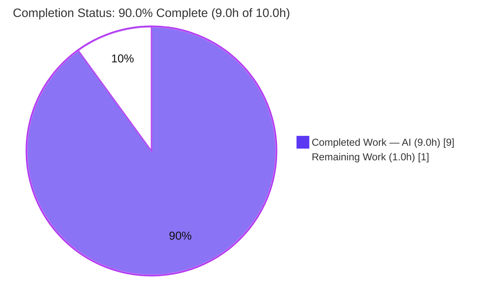
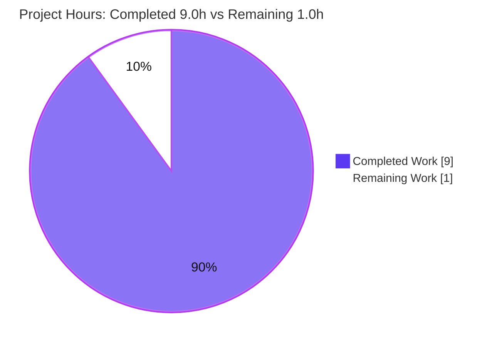

# Blitzy Project Guide — `13_feb_2_3` Express Tutorial Server

> **Project status color key:** Completed / AI Work = Dark Blue `#5B39F3` · Remaining / Not Completed = White `#FFFFFF` · Headings & Accents = Violet-Black `#B23AF2` · Highlight = Mint `#A8FDD9`

---

## 1. Executive Summary

### 1.1 Project Overview

`13_feb_2_3` is a minimal Node.js tutorial web server built on the **Express 5** framework. Its objective is to demonstrate HTTP routing by exposing two `GET` endpoints that return plaintext greetings: `GET /` → `Hello world` (baseline) and `GET /good-evening` → `Good evening` (the requested new feature). The target users are developers learning Express fundamentals. The repository was **greenfield** — it tracked only a placeholder `README.md` — so the entire runnable foundation (manifest, entry file, dependency lock, ignore rules, documentation) was scaffolded from scratch. Technical scope is intentionally narrow: framework integration (`express@5.2.1`), two routes, and setup/run documentation. All scoped work is implemented and runtime-validated.

### 1.2 Completion Status



| Metric | Value |
|---|---|
| **Total Hours** | **10.0** |
| **Completed Hours (AI + Manual)** | **9.0** (9.0 AI + 0.0 Manual) |
| **Remaining Hours** | **1.0** |
| **Percent Complete** | **90.0%** |

> Completion is computed with the AAP-scoped, hours-based methodology: `9.0 ÷ 10.0 × 100 = 90.0%`. All four AAP requirements (R1–R4) and all five in-scope file deliverables are **fully delivered and runtime-verified**; the remaining 1.0 hour is human acceptance/verification work only (no engineering gaps).

### 1.3 Key Accomplishments

- ✅ **Express 5.2.1 integrated** as the sole production dependency (R1) — pinned `^5.2.1`, locked to `5.2.1`, **0 vulnerabilities**.
- ✅ **Baseline endpoint** `GET /` returns the exact string `Hello world` (R2) — runtime-verified `[HTTP 200]`.
- ✅ **New endpoint** `GET /good-evening` returns the exact string `Good evening` (R3) — runtime-verified `[HTTP 200]`.
- ✅ **Full Node.js scaffolding created** — `package.json`, `package-lock.json` (lockfileVersion 3), `.gitignore` (R4).
- ✅ **Documentation complete** — `README.md` covers prerequisites (Node `>= 18`), install, run, `PORT` override, and an endpoints table.
- ✅ **`PORT` env override validated** — default `3000`, independently tested on `8080`.
- ✅ **Reproducible install verified** — `npm ci` → "added 66 packages, audited 67, found 0 vulnerabilities".
- ✅ **All 5 in-scope files committed**; working tree clean at HEAD `dd76ee5`; `node_modules/` correctly git-ignored.

### 1.4 Critical Unresolved Issues

| Issue | Impact | Owner | ETA |
|---|---|---|---|
| _None identified_ | All AAP requirements (R1–R4) are implemented and runtime-validated; no compilation errors, failing tests, or unresolved defects. | — | — |

### 1.5 Access Issues

| System / Resource | Type of Access | Issue Description | Resolution Status | Owner |
|---|---|---|---|---|
| _None_ | — | No access issues identified. The repository, npm registry cache, Node/npm runtime, and local ports were all accessible during autonomous validation. | N/A | — |

### 1.6 Recommended Next Steps

1. **[Medium]** Confirm the AAP-flagged assumptions with the requester: route path `GET /good-evening` (the user specified the response string, not the path), default port `3000`, and the greenfield-baseline interpretation (the server was **created**, not modified, because the repo had only a placeholder README).
2. **[Medium]** Perform a local environment smoke-test on the target machine: `npm install` → `npm start` → `curl` both endpoints.
3. **[Low]** _(Optional — beyond AAP scope)_ Add an automated test suite (Jest + Supertest) if the project will be extended past tutorial scope.
4. **[Low]** _(Optional — beyond AAP scope)_ Add security hardening (helmet, CORS) and pin the Node version (`engines` / `.nvmrc`) before any public deployment.

---

## 2. Project Hours Breakdown

### 2.1 Completed Work Detail

| Component | Hours | Description |
|---|---:|---|
| Project scaffolding & Express 5.2.1 integration (R1, R4) | 2.5 | `package.json` manifest, `npm install`, `package-lock.json` (66 packages, 0 vulnerabilities), `.gitignore`; web research confirming `express@5.2.1` + Node `>= 18` compatibility |
| Baseline endpoint `GET /` → `Hello world` (R2) | 1.0 | Express route handler in `index.js` returning the exact baseline string |
| New endpoint `GET /good-evening` → `Good evening` (R3) | 1.0 | Express route handler in `index.js` returning the exact new-feature string |
| Express app bootstrap & runtime entry (R2, R3) | 1.5 | App instantiation, `PORT` env handling, `app.listen` + startup log, CommonJS structure, comprehensive JSDoc |
| README documentation (R4) | 1.5 | Description, prerequisites, installation, usage, `PORT` override, endpoints table, curl examples |
| Runtime validation & verification | 1.5 | Multi-port boot, exact body + status-code assertions, 404 check, content-type check, `npm audit` |
| **Total Completed** | **9.0** | Matches Completed Hours in §1.2 |

### 2.2 Remaining Work Detail

| Category | Hours | Priority |
|---|---:|---|
| Stakeholder acceptance of AAP-flagged assumptions (route path `/good-evening`, default port `3000`, greenfield baseline) | 0.5 | Medium |
| Local environment smoke-test (`npm install` → `npm start` → `curl` both endpoints) | 0.5 | Medium |
| **Total Remaining** | **1.0** | Matches Remaining Hours in §1.2 and §7 |

### 2.3 Out-of-Scope / Optional Enhancements (Not Counted in Totals)

The following are **explicitly excluded by the AAP (§0.3.2)** and are therefore **not** part of the 10.0-hour total or the completion percentage. They are listed only as guidance should the project be taken beyond its stated tutorial purpose:

| Optional Enhancement | Indicative Hours | Note |
|---|---:|---|
| Automated tests (Jest + Supertest) | ~2–4 | Out of AAP scope; no tests requested |
| Security hardening (helmet, CORS, rate limiting, TLS) | ~2–3 | Required only for public deployment |
| Containerization (Dockerfile) and/or CI pipeline | ~4–8 | Out of AAP scope; no deployment requested |
| Pin Node version (`engines` field / `.nvmrc`) | ~0.5 | Nice-to-have hygiene |

---

## 3. Test Results

All results below originate from Blitzy's autonomous validation logs for this project and were independently re-confirmed during this assessment. **No automated test framework is in scope** (AAP §0.3.2 explicitly excludes tests); functional correctness is therefore proven by runtime validation rather than a unit-test suite.

| Test Category | Framework | Total | Passed | Failed | Coverage % | Notes |
|---|---:|---:|---:|---:|---:|---|
| Automated Unit/Integration | None (excluded by design) | 0 | 0 | 0 | N/A | AAP §0.3.2 excludes test frameworks/files. `npm test` → "Missing script: test" is the documented expected state. 0/0 = no failing tests (vacuous pass). |
| Runtime Functional Validation | Node runtime + `curl` | 5 | 5 | 0 | N/A | `GET /`→`Hello world`/200; `GET /good-evening`→`Good evening`/200; unknown route→404; `PORT=8080` override; Content-Type `text/html; charset=utf-8` |
| Static / Compile Check | `node --check` | 1 | 1 | 0 | N/A | CommonJS syntax of `index.js` valid (exit 0) — this is the compile gate (no TS/bundler in scope) |
| Dependency Audit | `npm audit` | 1 | 1 | 0 | N/A | 67 packages audited; **0 vulnerabilities** |
| Reproducible Install | `npm ci` | 1 | 1 | 0 | N/A | Strict install from `package-lock.json`: added 66 packages, 0 vulnerabilities, exit 0 |
| **Totals** | | **8** | **8** | **0** | **N/A** | 100% pass rate across all autonomous validation checks |

---

## 4. Runtime Validation & UI Verification

**Runtime health (all checks performed against the live server):**

- ✅ **Operational** — Server boot: `npm start` → `Server listening on http://localhost:3000`
- ✅ **Operational** — `GET /` → body `Hello world`, `[HTTP 200]`, `Content-Type: text/html; charset=utf-8`
- ✅ **Operational** — `GET /good-evening` → body `Good evening`, `[HTTP 200]`
- ✅ **Operational** — Unknown route (`GET /nonexistent`) → Express default `404` (`Cannot GET /nonexistent`)
- ✅ **Operational** — `PORT` override: `PORT=8080 npm start` binds `:8080`; both endpoints serve correctly
- ✅ **Operational** — Dependency resolution: `require('express')` → `express@5.2.1`; `npm ls` clean tree

**UI verification:**

- **Not applicable** — this is a backend HTTP server returning plaintext (AAP §0.5.3). There is no graphical user interface, component library, or design system.

**API integration:**

- **Not applicable** — the application has **no external service integrations** (no databases, third-party APIs, message queues, or webhooks). Its only dependency is the Express framework itself.

---

## 5. Compliance & Quality Review

| AAP Requirement / Quality Benchmark | Status | Progress | Evidence / Notes |
|---|---|---|---|
| R1 — Add Express.js (`express@5.2.1`) | ✅ Pass | 100% | Declared `^5.2.1` in `package.json`; locked `5.2.1` in `package-lock.json`; `npm ls` clean |
| R2 — `GET /` → `Hello world` | ✅ Pass | 100% | `index.js` L44–46; runtime body+200 verified |
| R3 — `GET /good-evening` → `Good evening` | ✅ Pass | 100% | `index.js` L54–56; runtime body+200 verified |
| R4 — Minimal scaffolding + docs | ✅ Pass | 100% | `package.json`, `package-lock.json`, `.gitignore`, `README.md` all present & valid |
| Verbatim response strings preserved | ✅ Pass | 100% | `Hello world` / `Good evening` reproduced character-for-character |
| Backward compatibility (`Hello world` reachable) | ✅ Pass | 100% | Change is strictly additive; `GET /` preserved |
| Express used for routing (not raw `http`) | ✅ Pass | 100% | `const app = express()`; both routes declared on the app |
| Pinned dependency version (no `latest`) | ✅ Pass | 100% | Exact version `5.2.1` verified against registry |
| Zero-placeholder policy | ✅ Pass | 100% | No stubs, TODOs, or `NotImplemented`; complete implementation |
| Dependency security | ✅ Pass | 100% | `npm audit` → 0 vulnerabilities |
| Version-control hygiene (`node_modules/` ignored) | ✅ Pass | 100% | `git check-ignore` confirms; only 5 in-scope files tracked |
| **Fixes applied during autonomous validation** | — | — | **None required** — every gate passed on first verification |
| **Outstanding compliance items** | ⚠ Open | — | Human acceptance of AAP-flagged assumptions (route path, port, greenfield baseline) — 1.0h, non-blocking |

---

## 6. Risk Assessment

Overall risk profile: **LOW.** Most items below are deliberate AAP scope exclusions for a tutorial, flagged for awareness if the project is extended toward production.

| Risk | Category | Severity | Probability | Mitigation | Status |
|---|---|---|---|---|---|
| No automated test suite (regressions not auto-caught) | Technical | Low | Low | Add Jest/Supertest if extended; runtime validation covers current scope | Accepted (out of scope) |
| Express 5 is a recent major; tutorials often show v4 patterns | Technical | Low | Low | Version pinned in lockfile; app uses only stable core routing | Mitigated |
| `res.send(string)` returns `text/html` (not `text/plain`) | Technical | Low | N/A | AAP §0.5.5 explicitly accepts this for the tutorial | Accepted by design |
| No security hardening (helmet, CORS, rate limiting, TLS) | Security | Low (local) / Med (public) | Low | Add before any public deployment | Accepted (out of scope) |
| No input validation | Security | Low | N/A | Endpoints accept no input (static responses); attack surface ~nil | N/A by design |
| Dependency vulnerabilities | Security | Low | Low | `npm audit` → 0 vulnerabilities; lockfile pins all deps; periodic audit | Mitigated |
| Minimal logging; no monitoring | Operational | Low | Low | Single startup log adequate for tutorial; add structured logging if extended | Accepted (out of scope) |
| No process manager / graceful shutdown | Operational | Low | Low | Add PM2/systemd for any long-running deployment | Accepted (out of scope) |
| Node version drift (requires `>= 18`) | Operational | Low | Low | README documents prerequisite; optional `engines`/`.nvmrc` | Mitigated |
| `npm install` needs registry/cache (air-gapped envs) | Integration | Low | Low | Committed `package-lock.json` enables reproducible `npm ci` | Mitigated |
| Port conflict on default `3000` | Integration | Low | Low–Med | `PORT` env override documented & validated on `8080` | Mitigated |
| No external integrations | Integration | None | N/A | No integration surface exists | N/A |
| AAP-assumed route path/port/baseline | Requirements | Low | N/A | Stakeholder confirmation (the 1.0h remaining work) | Open (pending acceptance) |

---

## 7. Visual Project Status

**Project hours breakdown** (Completed = Dark Blue `#5B39F3`, Remaining = White `#FFFFFF`):



**Remaining work by category** (hours, from §2.2 — both Medium priority):


> **Integrity check:** Pie "Remaining Work" = **1.0h** = §1.2 Remaining Hours = §2.2 total. Pie "Completed Work" = **9.0h** = §1.2 Completed Hours = §2.1 total. `9 + 1 = 10` = Total Project Hours.

---

## 8. Summary & Recommendations

**Achievements.** The project is **90.0% complete** (9.0 of 10.0 hours). Every AAP requirement has been delivered and independently runtime-validated: Express 5.2.1 is integrated as the sole, vulnerability-free dependency (R1); `GET /` returns `Hello world` (R2); the new `GET /good-evening` returns `Good evening` (R3); and the complete, runnable Node.js scaffolding plus documentation is in place (R4). The implementation contains no stubs, placeholders, or TODOs, and the working tree is clean at HEAD `dd76ee5`.

**Remaining gaps.** The outstanding **1.0 hour (10%)** is **not engineering work** — it is human acceptance/verification: confirming the AAP-flagged assumptions (route path `/good-evening`, default port `3000`, greenfield baseline) and a local smoke-test in the target environment. No defects, failing tests, or compilation errors remain.

**Critical path to production.** (1) Stakeholder confirms the flagged assumptions; (2) developer runs `npm install` → `npm start` and curls both endpoints to confirm behavior locally. After these two non-blocking steps the tutorial is ready for its intended use. Items such as automated tests, security hardening, containerization, and CI/CD were **deliberately excluded by the AAP** and are listed in §2.3 only as optional future enhancements.

**Success metrics.** 4/4 AAP requirements met · 5/5 in-scope files delivered · 8/8 autonomous validation checks passed · 0 dependency vulnerabilities · 0 unresolved defects.

**Production-readiness assessment.** For its **stated tutorial scope**, the project is functionally complete and validated. The 90.0% figure reflects the reservation of human acceptance/verification per Blitzy's honest-assessment policy (never claim 100% before human review), **not** any missing implementation.

| Metric | Value |
|---|---|
| Completion | 90.0% |
| AAP requirements met | 4 / 4 |
| In-scope files delivered | 5 / 5 |
| Autonomous validation checks passed | 8 / 8 |
| Dependency vulnerabilities | 0 |
| Unresolved defects | 0 |

---

## 9. Development Guide

### 9.1 System Prerequisites

- **Node.js `>= 18`** (Express 5 requirement). Validated on Node `v20.20.2`; AAP proof-of-concept on `v22.22.2`.
- **npm** (ships with Node.js). Validated on npm `11.1.0`.
- **Operating system:** any OS supported by Node.js (Linux, macOS, Windows).
- **Network:** internet access for the first `npm install` (or a populated npm cache for offline `npm ci`).

Verify your toolchain:

```bash
node --version   # expect v18.x or newer
npm --version
```

### 9.2 Environment Setup

No special environment configuration is required. The only optional setting is the listening port:

```bash
# Optional: override the default port (3000)
export PORT=8080
```

There is no `.env` file, database, cache, or message queue to configure.

### 9.3 Dependency Installation

From the repository root:

```bash
# Standard install (writes/uses package-lock.json)
npm install

# OR — strict, reproducible install from the committed lockfile (recommended for CI/clean checkouts)
npm ci
```

Expected output (abridged):

```
added 66 packages, and audited 67 packages in <time>
found 0 vulnerabilities
```

### 9.4 Application Startup

```bash
npm start          # runs: node index.js
```

Expected console output:

```
Server listening on http://localhost:3000
```

To run on a different port:

```bash
PORT=8080 npm start
# → Server listening on http://localhost:8080
```

### 9.5 Verification Steps

With the server running, in a second terminal:

```bash
curl http://localhost:3000/              # → Hello world
curl http://localhost:3000/good-evening  # → Good evening
```

Confirm dependency health at any time:

```bash
npm ls            # → 13_feb_2_3@1.0.0 └── express@5.2.1
npm audit         # → found 0 vulnerabilities
node --check index.js   # → exit 0 (syntax OK)
```

### 9.6 Example Usage

```bash
# Show HTTP status + content type for the baseline endpoint
curl -i http://localhost:3000/
# HTTP/1.1 200 OK
# Content-Type: text/html; charset=utf-8
# ...
# Hello world

# New feature endpoint
curl -i http://localhost:3000/good-evening
# HTTP/1.1 200 OK
# Good evening

# Unknown route returns Express's default 404
curl -i http://localhost:3000/nope
# HTTP/1.1 404 Not Found
# Cannot GET /nope
```

### 9.7 Troubleshooting

| Symptom | Cause | Resolution |
|---|---|---|
| `Error: listen EADDRINUSE :::3000` | Port 3000 already in use | Run on another port: `PORT=8080 npm start` |
| `Error: Cannot find module 'express'` | Dependencies not installed | Run `npm install` (or `npm ci`) from the repo root |
| `npm error Missing script: "test"` | Running `npm test` | **Expected** — no tests are in scope (AAP §0.3.2). Not an error condition. |
| `SyntaxError` / unexpected token at boot | Node older than 18 | Upgrade Node to `>= 18` |
| `npm ci` fails offline | No registry access / empty cache | Populate the npm cache once with network access, or use a registry mirror; the committed `package-lock.json` then guarantees reproducibility |

---

## 10. Appendices

### Appendix A — Command Reference

| Command | Purpose |
|---|---|
| `npm install` | Install dependencies (writes/uses `package-lock.json`) |
| `npm ci` | Strict reproducible install from `package-lock.json` |
| `npm start` | Start the server (`node index.js`) |
| `PORT=8080 npm start` | Start on a custom port |
| `npm ls` | Show the dependency tree |
| `npm audit` | Report dependency vulnerabilities |
| `node --check index.js` | Validate JS syntax without executing |
| `curl http://localhost:3000/` | Exercise the baseline endpoint |
| `curl http://localhost:3000/good-evening` | Exercise the new endpoint |

### Appendix B — Port Reference

| Port | Service | Notes |
|---|---|---|
| `3000` | Express HTTP server (default) | Used when `PORT` is unset |
| `<PORT env>` | Express HTTP server (override) | E.g., `PORT=8080`; validated |

### Appendix C — Key File Locations

| File | Role |
|---|---|
| `index.js` | Express application entry — both routes + listener |
| `package.json` | Manifest: `main`, `scripts.start`, `dependencies.express` |
| `package-lock.json` | Locked dependency graph (lockfileVersion 3, `express@5.2.1`) |
| `.gitignore` | Excludes `node_modules/` and npm/log artifacts |
| `README.md` | Setup, usage, and endpoints documentation |
| `node_modules/` | Installed dependencies (generated, git-ignored) |

### Appendix D — Technology Versions

| Technology | Version | Source |
|---|---|---|
| Express | 5.2.1 | `package.json` / `package-lock.json` |
| Node.js (validated) | v20.20.2 | Validation environment |
| Node.js (required) | `>= 18` | Express 5 requirement / `README.md` |
| Node.js (AAP PoC) | v22.22.2 | `README.md` note |
| npm | 11.1.0 | Validation environment |
| Lockfile format | lockfileVersion 3 | `package-lock.json` |

### Appendix E — Environment Variable Reference

| Variable | Default | Purpose |
|---|---|---|
| `PORT` | `3000` | TCP port the HTTP server binds to; overridable without code changes |

### Appendix F — Developer Tools Guide

| Tool | Use |
|---|---|
| `node --check <file>` | Static syntax validation (the project's compile gate) |
| `npm ls` | Verify the installed dependency tree matches the manifest |
| `npm audit` | Security scan of dependencies |
| `curl -i <url>` | Inspect response body + status + headers for each endpoint |
| `git status` / `git log` | Confirm a clean working tree and review commit history |

### Appendix G — Glossary

| Term | Definition |
|---|---|
| **AAP** | Agent Action Plan — the authoritative requirement specification for this project |
| **Express** | Minimalist Node.js web framework providing routing and HTTP request/response handling |
| **CommonJS** | The module system used (`require`); the project does not declare `"type": "module"` |
| **Greenfield** | A project with no pre-existing code; here, the repo started with only a placeholder README |
| **Lockfile** | `package-lock.json` — pins exact dependency versions for reproducible installs |
| **Vacuous pass** | A test gate that passes because there are zero tests to fail (tests are out of scope by design) |