# Technical Specification

# 1. Introduction

This section establishes the foundational context for the **AI Umbrella** technical specification — an enterprise-grade umbrella insurance policy management platform undergoing a significant technology stack modernization. It defines the system's purpose, stakeholder landscape, architectural posture, and scope boundaries to orient all subsequent sections of this document.

---

## 1.1 EXECUTIVE SUMMARY

### 1.1.1 Project Overview

AI Umbrella is an enterprise-grade umbrella insurance policy management platform designed to automate and streamline the end-to-end lifecycle of personal umbrella insurance policies. The system is architected as a multi-module Maven project organized into two primary components:

| Component | Role |
|---|---|
| **Umbrella Services** | Backend services responsible for policy management, data processing, enterprise integration, and business logic orchestration |
| **Umbrella UI** | Frontend interface providing user interaction capabilities and policy administration workflows |

The current release represents a **major technology stack modernization initiative**, migrating the platform from a legacy runtime to a modern, maintainable foundation. The following table summarizes the migration trajectory:

| Dimension | Legacy State | Modernized State |
|---|---|---|
| Language Runtime | Java 8 (JDK 1.8.0_321) | Java 21 LTS |
| Application Framework | Spring Framework 5.3.27 | Spring Boot 3.2.x (Spring Framework 6.1.x) |
| Package Namespace | `javax.*` packages | `jakarta.*` packages (Jakarta EE) |
| Application Server | JBoss EAP (external) | Embedded Apache Tomcat 10.1.18 |

This modernization preserves all existing business functionality while unlocking improved performance, simplified configuration through Spring Boot auto-configuration, and alignment with current long-term support ecosystems.

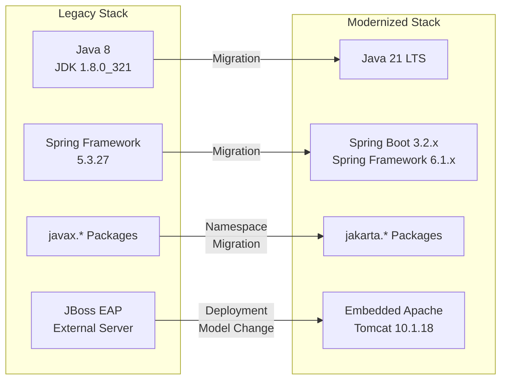

### 1.1.2 Core Business Problem

AI Umbrella addresses critical operational challenges within the insurance industry that directly impact policy issuance velocity, regulatory posture, and customer satisfaction:

| Challenge | Business Impact |
|---|---|
| Complex insurance form processing | Delays in policy issuance and customer onboarding |
| Manual payment handling | Increased errors and reconciliation issues |
| Paper-based signature processes | Extended policy activation timeframes |
| Regulatory compliance validation | Risk of non-compliance penalties and audit findings |

These pain points collectively result in elongated policy lifecycles, elevated operational costs, and diminished customer experience — challenges that AI Umbrella is purpose-built to resolve through digitized workflows, automated compliance validation, and seamless enterprise integration.

### 1.1.3 Key Stakeholders and Users

The system serves a diverse ecosystem of internal and external stakeholders, each with distinct operational requirements:

| Stakeholder Group | Primary Needs |
|---|---|
| Insurance Agents and Producers | Policy processing, application submission, quote generation |
| Underwriters | Risk evaluation, policy decision-making, compliance verification |
| Policy Applicants / Customers | Policy application, electronic signature, payment processing |
| Insurance Company Administrators | System configuration, reporting, business rule management |
| System Integration Teams | API connectivity, data exchange with enterprise systems |

Insurance agents and producers represent the primary day-to-day users of the platform, leveraging the Umbrella UI for policy administration. System integration teams consume the backend service APIs exposed through the `umbrella-web` module. Underwriters and administrators interact with specialized workflows for risk assessment and system governance.

### 1.1.4 Business Impact and Value Proposition

The AI Umbrella platform delivers measurable business value across five strategic dimensions:

| Value Dimension | Description |
|---|---|
| **Operational Efficiency** | Streamlined policy operations through automated workflows, reducing manual intervention and cycle times |
| **Regulatory Compliance** | Automated validation of regulatory requirements, including FCRA (Fair Credit Reporting Act) compliance verification |
| **Enhanced Customer Experience** | Fully digital workflows incorporating electronic signatures, eliminating paper-based processes |
| **Enterprise Integration** | Seamless connectivity with billing, payment, audit, and policy services across the enterprise landscape |
| **Data-Driven Decision Making** | Structured data capture and persistence enabling advanced analytics and informed business decisions |

The technology modernization to Java 21 and Spring Boot 3.2.x further amplifies this value by ensuring long-term platform viability, reducing infrastructure complexity through the embedded Tomcat deployment model, and enabling the adoption of modern language features and framework capabilities.

---

## 1.2 SYSTEM OVERVIEW

### 1.2.1 Project Context

#### Business Context and Market Positioning

AI Umbrella is positioned within the **personal liability insurance sector**, specifically targeting the umbrella insurance policy domain. Umbrella insurance provides an additional layer of liability coverage beyond the limits of standard homeowners, auto, or watercraft policies — a product category characterized by complex underwriting requirements and multi-policy coordination.

The platform serves as a modern alternative to legacy insurance administration systems, designed to meet the evolving expectations of both insurance professionals and policyholders for digital-first, integrated policy management. Its market positioning emphasizes automation, compliance rigor, and enterprise interoperability as competitive differentiators.

#### Current System Limitations

The modernization initiative addresses specific limitations of the legacy system that constrained operational agility and technical sustainability:

| Limitation | Consequence |
|---|---|
| Limited integration with modern enterprise systems | Inability to participate in real-time data exchange across the enterprise service landscape |
| Inability to support paperless workflows and digital signatures | Continued reliance on manual, paper-based processes for policy execution |
| Manual compliance validation processes | Elevated risk of regulatory non-compliance and increased audit burden |
| Isolated data silos | Fragmented view of policy and customer data across organizational boundaries |
| Inflexible architecture restricting business agility | Difficulty adapting to new product requirements and market conditions |

The migration from JBoss EAP to Spring Boot's embedded Apache Tomcat 10.1.18 eliminates the dependency on external application server management, while the transition from `javax.*` to `jakarta.*` namespaces aligns the platform with the current Jakarta EE specification and ensures long-term ecosystem compatibility.

#### Integration with Existing Enterprise Landscape

AI Umbrella operates as a central node within a broader enterprise integration ecosystem, exchanging data with multiple external systems to deliver complete policy lifecycle management:

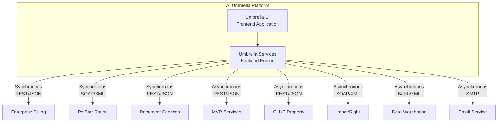

The integration topology combines synchronous and asynchronous communication patterns, with protocols ranging from REST/JSON for modern service endpoints to SOAP/XML for legacy enterprise systems. Service-level agreements range from sub-second response times for synchronous rating lookups to batch processing windows of up to 30 minutes for data warehouse synchronization. The following table summarizes the key integration points and their operational parameters:

| External System | Protocol | Integration Pattern | SLA |
|---|---|---|---|
| PolStar Rating | SOAP/XML (Jakarta EE) | Synchronous | < 2 seconds |
| Enterprise Billing | REST/JSON | Synchronous | < 3 seconds |
| Document Services | REST/JSON | Synchronous | < 5 seconds |
| MVR Services | REST/JSON | Asynchronous | < 8 seconds |
| CLUE Property | REST/JSON | Asynchronous | < 6 seconds |
| ImageRight | SOAP/XML (Jakarta EE) | Asynchronous | < 10 seconds |
| Data Warehouse | Batch/XML | Asynchronous | < 30 minutes |
| Email Service | SMTP | Asynchronous | < 1 minute |

### 1.2.2 High-Level Description

#### Primary System Capabilities

AI Umbrella delivers seven core capabilities that collectively address the full policy lifecycle:

1. **Policy Form Generation and Processing** — Automated creation, population, and validation of insurance policy forms
2. **Electronic Signature (E-Sign) Management** — Digital signature workflows that eliminate paper-based execution
3. **Payment Processing and Confirmation** — End-to-end financial transaction handling with reconciliation support
4. **Quote Proposal Generation** — Dynamic generation of insurance quotes based on applicant data and underwriting rules
5. **Policyholder and Applicant Data Management** — Comprehensive data capture, storage, and retrieval for all parties involved in the policy lifecycle
6. **Producer Compensation Tracking** — Management and tracking of agent and producer commission structures
7. **Regulatory Compliance Validation** — Automated enforcement of regulatory requirements, including FCRA verification and audit trail generation

#### Major System Components

The platform is organized as a multi-module Maven project with clearly defined module responsibilities. The architecture follows a layered, service-oriented design where each module encapsulates a specific concern.

**Backend Services (`umbrella-services`):**

| Module | Purpose |
|---|---|
| `umbrella-model` | Domain models representing policy data, applications, payments, and related entities |
| `umbrella-integration` | Database integration layer leveraging MyBatis for data persistence |
| `umbrella-appservices` | Business logic orchestration and service implementation layer |
| `umbrella-web` | Web APIs and service interfaces for system integration |
| `umbrella-config` | Configuration management for deployment environment variations |

**Frontend Application (`umbrella-ui`):**

| Module | Purpose |
|---|---|
| `umbrella-ui-services` | Service interfaces and data transfer objects (DTOs) for frontend-backend communication |
| `umbrella-ui-web` | User interface components and web presentation layer |
| `umbrella-ui-config` | Environment-specific configuration for UI components |

**Shared Configuration:**

| Module | Purpose |
|---|---|
| `spring-boot-config` | Centralized Spring Boot configuration resources introduced as part of the modernization initiative |

The `spring-boot-config` module is a new addition resulting from the migration to Spring Boot 3.2.x, providing a single source of truth for application-level configuration including Spring Boot profiles managed through `application.yml`.

```mermaid
graph TB
    subgraph FrontendApp["Umbrella UI — Frontend"]
        UIWeb["umbrella-ui-web<br/>Presentation Layer"]
        UIServices["umbrella-ui-services<br/>Service Interfaces & DTOs"]
        UIConfig["umbrella-ui-config<br/>UI Configuration"]
    end

    subgraph BackendSvc["Umbrella Services — Backend"]
        WebAPI["umbrella-web<br/>Web APIs & Interfaces"]
        AppSvc["umbrella-appservices<br/>Business Logic"]
        IntLayer["umbrella-integration<br/>Data Persistence (MyBatis)"]
        DomainModel["umbrella-model<br/>Domain Models"]
        SvcConfig["umbrella-config<br/>Service Configuration"]
    end

    subgraph SharedCfg["Shared Configuration"]
        SBConfig["spring-boot-config<br/>Centralized Spring Boot Config"]
    end

    UIWeb --> UIServices
    UIServices --> WebAPI
    WebAPI --> AppSvc
    AppSvc --> IntLayer
    IntLayer --> DomainModel
    UIConfig -.->|"Profile Config"| SBConfig
    SvcConfig -.->|"Profile Config"| SBConfig
end
```

#### Core Technical Approach

The system employs a service-oriented design with well-defined interfaces between layers. Key architectural and technical principles include:

- **Data Transfer Objects (DTOs)** are used consistently for inter-module and external system integration, ensuring clean separation between internal domain models and external data contracts
- **XML-based data interchange** via XStream serialization supports communication with legacy enterprise endpoints
- **Spring Boot 3.2.x** provides dependency injection, auto-configuration, and simplified application lifecycle management
- **Java 21 LTS** language features deliver enhanced performance, modern API access, and long-term support guarantees
- **Jakarta EE-compliant components** replace all legacy `javax.*` dependencies, aligning with the current enterprise Java specification
- **Drools business rules engine** powers transaction management and configurable business rule processing
- **Testing infrastructure** built on JUnit 5 (Jupiter 5.10.0), Mockito 5.5.0, AssertJ 3.24.2, and Spring Boot Test ensures comprehensive automated verification
- **CI/CD pipeline** leveraging Jenkins, SonarQube, Docker, and Kubernetes supports continuous integration and containerized deployment
- **Database connectivity** targets SQL Server (via `mssql-jdbc 11.2.3.jre17`) and IBM DB2 (via `jcc 11.5.8.0`) with HikariCP 5.0.1 connection pooling
- **Security** is enforced through Spring Security 6.1.x and OWASP ESAPI 2.5.2.0

The Spring Boot deployment model produces executable JAR artifacts with an embedded Apache Tomcat 10.1.18 server, eliminating the previous dependency on externally managed JBoss EAP instances. This shift simplifies deployment automation and aligns with modern cloud-native operational practices.

### 1.2.3 Success Criteria

The AI Umbrella platform defines quantifiable success criteria across five dimensions to measure the effectiveness of the modernization and ongoing operations:

| Category | Measurable Criterion | KPI Target |
|---|---|---|
| Integration Effectiveness | Successful connectivity with billing, payment, audit, and policy services | 100% operational integration |
| Processing Efficiency | Reduced application-to-policy issuance time | 50% reduction in cycle time |
| Operational Improvement | Decrease in manual touchpoints during the policy lifecycle | Measurable reduction in manual steps |
| Compliance | Adherence to regulatory requirements with automated validation | 100% compliance rate |
| Scalability | System capacity to handle increased policy volume | 200% of current volume capacity |

These criteria serve as the primary benchmarks for evaluating the platform's success both during and after the modernization initiative. The 50% processing efficiency target reflects the expected impact of eliminating paper-based workflows, automating compliance checks, and streamlining enterprise data exchange.

---

## 1.3 SCOPE

### 1.3.1 In-Scope

#### Core Features and Functionalities

The AI Umbrella platform encompasses the following functional domains, each delivering essential capabilities for umbrella insurance policy management:

**Policy Management**

| Feature ID | Capability | Description |
|---|---|---|
| F-101 | Quote Generation | Dynamic insurance quote creation based on applicant data and underwriting rules |
| F-102 | Application Processing | End-to-end policy application intake and processing workflows |
| F-103 | Policy Binding | Formal policy issuance and binding operations |
| F-104 | Policy Forms | Automated policy document generation and management |

**Endorsement Management**

| Feature ID | Capability | Description |
|---|---|---|
| F-201 | Policy Amendments | Processing of mid-term policy changes and endorsements |
| F-202 | Cancellations | Policy cancellation workflow management |
| F-203 | Renewal Processing | Automated policy renewal operations |

**Financial Operations**

| Feature ID | Capability | Description |
|---|---|---|
| F-301 | Bank Account Management | Policyholder financial account setup and maintenance |
| F-302 | Payment Plan Selection | Configuration of premium payment schedules |
| F-303 | Financial Account Billing | Integration with enterprise billing for premium collection |

**Document and Compliance Management**

| Feature ID | Capability | Description |
|---|---|---|
| F-401 | E-Signature Workflow | Electronic signature capture and verification |
| F-402 | Document Generation | Automated policy document creation and secure storage |
| — | FCRA Compliance | Fair Credit Reporting Act validation and audit trail generation |

**Third-Party Integration and Security**

| Feature ID | Capability | Description |
|---|---|---|
| F-501 | MVR Processing | Motor Vehicle Record retrieval and evaluation |
| F-502 | CLUE Reports | Comprehensive Loss Underwriting Exchange report integration |
| F-503 | Rating & Underwriting | PolStar rating engine integration for premium calculation |
| F-601 | User Authentication | Identity verification and session management |
| F-602 | FiServ Security | Financial services security protocol enforcement |
| F-701 | Cross-Selling | Auto and home policy cross-selling capabilities |

#### Implementation Boundaries

The following boundaries define the operational perimeter of the AI Umbrella platform:

| Boundary Type | Included Elements |
|---|---|
| **System Focus** | Umbrella insurance policies exclusively |
| **User Groups** | Insurance agents, underwriters, administrators, and integration services |
| **Data Domains** | Policy data, customer information, payment transactions, and electronic signatures |
| **Deployment Environment** | Spring Boot executable JAR deployment using embedded Apache Tomcat 10.1.18 |
| **Configuration Management** | Environment-specific settings managed through Spring Boot profiles (`application.yml`) |
| **Geographic Distribution** | Colorado Primary (co1), Colorado Secondary (co2), Colorado Test (co3), Northeast Regional (ne), Colocation Facility (colo) |
| **Build and CI/CD** | Maven 3.9.5 build system with Jenkins pipeline, SonarQube analysis, and Ansible-based deployment automation |
| **Monitoring** | Spring Boot Actuator health endpoints and Micrometer metrics for operational observability |

### 1.3.2 Out-of-Scope

The following elements are explicitly excluded from the current AI Umbrella release and may be considered for future phases based on business prioritization:

| Excluded Element | Rationale |
|---|---|
| **Non-umbrella insurance policy types** | The platform is purpose-built for umbrella policies; other lines of business (auto, home, etc.) are managed by separate enterprise systems |
| **Direct customer-facing portals** | The system is designed primarily for internal insurance professionals; customer self-service capabilities are not included |
| **Legacy data migration processes** | Data migration from predecessor systems is handled as a separate, dedicated project with its own timeline and governance |
| **Mobile application interfaces** | Native or hybrid mobile applications are not part of this release; access is via web-based interfaces only |
| **Third-party integrations beyond defined connections** | Only the eight explicitly defined external system integrations (PolStar, MVR, CLUE, ImageRight, Enterprise Billing, Document Services, Data Warehouse, Email Service) are supported |

Future phases may incorporate these capabilities based on evolving business requirements, market demand, and strategic prioritization. The modular architecture of the platform — particularly the clean separation between `umbrella-web` APIs and `umbrella-appservices` business logic — is designed to facilitate future extensibility without requiring fundamental architectural changes.

---

#### References

- `/app/lib/reverse_document/doc.py` (lines 326–546) — Primary source for Section 1: Introduction specification content, including executive summary, system overview, and scope definitions
- `/app/lib/reverse_document/doc.py` (lines 547–1053) — Feature catalog (Section 2) providing feature IDs and functional requirement details referenced in scope
- `/app/lib/reverse_document/doc.py` (lines 1267–1845) — Technology stack details (Section 3) providing specific version numbers and component specifications
- `/app/lib/reverse_document/doc.py` (lines 2745–2816) — Architecture section (Section 5) providing system boundary definitions, deployment model, and external integration SLA details
- `/app/lib/reverse_document/doc.py` (lines 8440–9465) — Infrastructure and deployment section (Section 8) providing geographic distribution, CI/CD pipeline, and monitoring details
- `/app/main.py` — LangGraph orchestration entry point confirming system execution context
- `/app/lib/reverse_document/helper.py` — Core processing module providing system behavioral context
- `/app/lib/reverse_document/models.py` — Pydantic data models confirming document structure
- `/app/lib/reverse_document/` — Core module directory establishing repository organization context

# 2. Product Requirements

## 2.1 FEATURE CATALOG

### 2.1.1 Feature Summary and Classification

The AI Umbrella platform delivers 21 discrete features spanning seven functional categories. These features collectively automate the end-to-end lifecycle of personal umbrella insurance policies, from initial quote generation through endorsement management and renewal processing. All features are undergoing active modernization as part of the platform migration from Java 8 / JBoss EAP to Java 21 LTS / Spring Boot 3.2.x.

The following master summary provides a consolidated view of all platform features, their categorical assignments, and priority classifications. Priority levels are derived from the dependency criticality of each feature within the policy lifecycle workflow and its impact on the core business problems identified in §1.1.2 — namely, complex form processing delays, manual payment errors, paper-based signature bottlenecks, and regulatory compliance risk.

| Feature ID | Feature Name | Category | Priority |
|---|---|---|---|
| F-101 | Quote Generation | Policy Management | Critical |
| F-102 | Application Processing | Policy Management | Critical |
| F-103 | Policy Binding | Policy Management | Critical |
| F-104 | Policy Forms | Policy Management | High |
| F-201 | Policy Amendments | Endorsement Management | High |
| F-202 | Cancellations | Endorsement Management | Medium |
| F-203 | Renewal Processing | Endorsement Management | Medium |
| F-301 | Bank Account Management | Financial Operations | High |
| F-302 | Payment Plan Selection | Financial Operations | Medium |
| F-303 | Financial Account Billing | Financial Operations | High |
| F-401 | E-Signature Workflow | Document & Compliance | High |
| F-402 | Document Generation | Document & Compliance | High |
| F-403 | FCRA Compliance | Document & Compliance | High |
| F-501 | MVR Processing | Third-Party Integration | High |
| F-502 | CLUE Reports | Third-Party Integration | High |
| F-503 | Rating & Underwriting | Third-Party Integration | Critical |
| F-601 | User Authentication | Security | Critical |
| F-602 | FiServ Security | Security | High |
| F-701 | Cross-Selling | Cross-Selling | Low |
| F-801 | Policyholder & Applicant Data Mgmt | Data Management | High |
| F-802 | Producer Compensation Tracking | Data Management | Medium |

> **Note on Feature ID Assignment:** Features F-403, F-801, and F-802 are assigned identifiers in this section for traceability purposes. F-403 (FCRA Compliance) is listed in the scope definition (§1.3.1) without an explicit ID. F-801 and F-802 correspond to core capabilities #5 and #6 from §1.2.2, which are documented as primary system capabilities but lack scope-level feature identifiers.

**Status:** All 21 features carry a status of **In Development** as part of the active modernization initiative described in §1.1.1. The modernization preserves all existing business functionality while migrating to the Java 21 / Spring Boot 3.2.x technology stack.

### 2.1.2 Policy Management Features

#### F-101 — Quote Generation

| Attribute | Detail |
|---|---|
| **Feature ID** | F-101 |
| **Feature Name** | Quote Generation |
| **Category** | Policy Management |
| **Priority** | Critical |

**Overview:** Dynamic insurance quote creation based on applicant data and underwriting rules. This feature serves as the entry point to the policy lifecycle, enabling insurance agents and producers to generate premium calculations for prospective policyholders. The quote proposal is generated by applying underwriting rules to applicant data and leveraging the PolStar rating engine for actuarial premium computation.

**Business Value:** Directly addresses the core business problem of complex insurance form processing delays (§1.1.2) by automating the quote generation workflow. Contributes to the 50% reduction in application-to-policy issuance cycle time targeted in §1.2.3.

**User Benefits:** Insurance agents and producers gain the ability to generate accurate, rule-based quotes in real-time during client consultations, eliminating manual premium calculation and reducing quoting errors.

**Technical Context:** Implemented within the `umbrella-appservices` module for business logic orchestration, with domain models defined in `umbrella-model`. The feature integrates synchronously with the PolStar Rating engine via SOAP/XML (Jakarta EE) with a service-level agreement of less than 2 seconds. The Drools business rules engine powers configurable underwriting rule evaluation. The `umbrella-web` module exposes the quote generation API for frontend consumption.

| Dependency Type | Details |
|---|---|
| **Prerequisite Features** | F-601 (User Authentication), F-801 (Applicant Data) |
| **System Dependencies** | `umbrella-appservices`, `umbrella-model`, `umbrella-web`, Drools rules engine |
| **External Dependencies** | PolStar Rating (SOAP/XML, < 2s SLA) |
| **Integration Requirements** | F-503 (Rating & Underwriting) must be operational |

#### F-102 — Application Processing

| Attribute | Detail |
|---|---|
| **Feature ID** | F-102 |
| **Feature Name** | Application Processing |
| **Category** | Policy Management |
| **Priority** | Critical |

**Overview:** End-to-end policy application intake and processing workflows. This feature manages the complete application lifecycle — from initial data capture through risk evaluation — including the orchestration of third-party data retrieval for Motor Vehicle Records and Comprehensive Loss Underwriting Exchange reports.

**Business Value:** Streamlines the most labor-intensive phase of the policy lifecycle. The automated validation and third-party data retrieval directly reduce manual touchpoints, contributing to the operational improvement KPI (§1.2.3).

**User Benefits:** Underwriters receive pre-validated, enriched application data for risk evaluation, reducing manual data gathering. Agents benefit from a guided application workflow that minimizes errors and omissions.

**Technical Context:** The application processing workflow is orchestrated by `umbrella-appservices`, with data persistence managed through `umbrella-integration` (MyBatis). Asynchronous integrations with MVR Services (REST/JSON, < 8s) and CLUE Property (REST/JSON, < 6s) enrich application data. The Drools engine validates business rules during application processing. FCRA compliance checks (F-403) are invoked during credit-related data retrieval.

| Dependency Type | Details |
|---|---|
| **Prerequisite Features** | F-601 (User Authentication), F-801 (Applicant Data) |
| **System Dependencies** | `umbrella-appservices`, `umbrella-integration`, `umbrella-model`, Drools |
| **External Dependencies** | MVR Services (REST/JSON, < 8s), CLUE Property (REST/JSON, < 6s) |
| **Integration Requirements** | F-501 (MVR), F-502 (CLUE), F-403 (FCRA) |

#### F-103 — Policy Binding

| Attribute | Detail |
|---|---|
| **Feature ID** | F-103 |
| **Feature Name** | Policy Binding |
| **Category** | Policy Management |
| **Priority** | Critical |

**Overview:** Formal policy issuance and binding operations. This feature represents the culmination of the new-business workflow, converting an approved application into an active, bound insurance policy. Policy binding triggers downstream operations including document generation, payment processing, and audit trail creation.

**Business Value:** Core revenue-generating operation. Each successful bind directly converts a prospect into a policyholder, representing the primary transaction that the platform exists to facilitate.

**User Benefits:** Agents complete the policy issuance in a single workflow session. Underwriters gain confirmation of policy activation with full audit trail.

**Technical Context:** Binding operations are orchestrated by `umbrella-appservices` with transactional integrity managed at the `umbrella-integration` layer. Binding triggers policy form generation (F-104), initiates billing setup (F-303), and creates entries in SQL Server (primary) or IBM DB2 (secondary) via HikariCP 5.0.1 connection pooling. Data exchange uses DTOs defined in `umbrella-model`.

| Dependency Type | Details |
|---|---|
| **Prerequisite Features** | F-101 (Quote Generation), F-102 (Application Processing) |
| **System Dependencies** | `umbrella-appservices`, `umbrella-integration`, `umbrella-model`, HikariCP |
| **External Dependencies** | None (internal operation) |
| **Integration Requirements** | Triggers F-104, F-303, F-402 post-bind |

#### F-104 — Policy Forms

| Attribute | Detail |
|---|---|
| **Feature ID** | F-104 |
| **Feature Name** | Policy Forms |
| **Category** | Policy Management |
| **Priority** | High |

**Overview:** Automated policy document generation and management. This feature handles the creation, population, and validation of insurance policy forms — one of the seven primary system capabilities defined in §1.2.2 (Policy Form Generation and Processing).

**Business Value:** Eliminates manual form preparation, directly addressing the complex insurance form processing challenge (§1.1.2). Reduces errors in policy documentation and accelerates time-to-issuance.

**User Benefits:** Agents receive correctly populated policy forms without manual data entry. Policyholders receive accurate, professional documentation.

**Technical Context:** Leverages Document Services (REST/JSON, < 5s SLA) for document creation and ImageRight (SOAP/XML, < 10s SLA) for secure document storage. The `umbrella-appservices` module orchestrates form population using domain models from `umbrella-model`. XStream serialization supports XML-based data interchange with legacy document endpoints.

| Dependency Type | Details |
|---|---|
| **Prerequisite Features** | F-103 (Policy Binding), F-402 (Document Generation) |
| **System Dependencies** | `umbrella-appservices`, `umbrella-model`, XStream |
| **External Dependencies** | Document Services (REST/JSON, < 5s), ImageRight (SOAP/XML, < 10s) |
| **Integration Requirements** | F-401 (E-Signature) consumes generated forms |

### 2.1.3 Endorsement Management Features

#### F-201 — Policy Amendments

| Attribute | Detail |
|---|---|
| **Feature ID** | F-201 |
| **Feature Name** | Policy Amendments |
| **Category** | Endorsement Management |
| **Priority** | High |

**Overview:** Processing of mid-term policy changes and endorsements. This feature enables modifications to active policies, including coverage adjustments, named insured changes, and limit modifications. Amendments trigger premium recalculation and document regeneration.

**Business Value:** Supports ongoing policy servicing, a critical retention mechanism. Enables agents to adapt policies to changing customer needs without requiring full re-issuance.

**User Benefits:** Agents process policy changes through guided workflows. Policyholders receive updated documentation reflecting endorsed changes.

**Technical Context:** Amendment processing reuses the PolStar rating engine (F-503) for premium recalculation and the document generation pipeline (F-402, F-104) for updated policy forms. Business rules governing amendment eligibility are managed through the Drools engine within `umbrella-appservices`.

| Dependency Type | Details |
|---|---|
| **Prerequisite Features** | F-103 (active bound policy required) |
| **System Dependencies** | `umbrella-appservices`, Drools, `umbrella-integration` |
| **External Dependencies** | PolStar Rating (for recalculation) |
| **Integration Requirements** | F-503, F-104, F-402 |

#### F-202 — Cancellations

| Attribute | Detail |
|---|---|
| **Feature ID** | F-202 |
| **Feature Name** | Cancellations |
| **Category** | Endorsement Management |
| **Priority** | Medium |

**Overview:** Policy cancellation workflow management. Handles both insured-requested and company-initiated cancellation processing, including pro-rata premium calculation, refund determination, and cancellation notice generation.

**Business Value:** Ensures proper financial reconciliation during policy termination, reducing revenue leakage and compliance risk from improper cancellation handling.

**User Benefits:** Agents and administrators process cancellations with automated premium refund calculations and documentation.

**Technical Context:** Cancellation workflows are orchestrated by `umbrella-appservices` with financial reconciliation through Enterprise Billing (F-303). Cancellation notices are generated via the document pipeline (F-402).

| Dependency Type | Details |
|---|---|
| **Prerequisite Features** | F-103 (active bound policy required) |
| **System Dependencies** | `umbrella-appservices`, `umbrella-integration` |
| **External Dependencies** | Enterprise Billing (for refund processing) |
| **Integration Requirements** | F-303, F-402 |

#### F-203 — Renewal Processing

| Attribute | Detail |
|---|---|
| **Feature ID** | F-203 |
| **Feature Name** | Renewal Processing |
| **Category** | Endorsement Management |
| **Priority** | Medium |

**Overview:** Automated policy renewal operations. Manages the end-of-term renewal workflow, including renewal eligibility evaluation, premium recalculation, renewal offer generation, and policy term extension.

**Business Value:** Automates the renewal pipeline to maximize policy retention rates and reduce manual intervention in high-volume renewal cycles.

**User Benefits:** Agents receive renewal-ready policies with pre-calculated premiums. Policyholders experience seamless coverage continuity.

**Technical Context:** Renewal processing orchestrates rating recalculation via PolStar (F-503), document regeneration (F-402, F-104), and billing plan continuation (F-303). The Drools engine evaluates renewal eligibility rules within `umbrella-appservices`.

| Dependency Type | Details |
|---|---|
| **Prerequisite Features** | F-103 (existing policy at or near term expiration) |
| **System Dependencies** | `umbrella-appservices`, Drools, `umbrella-integration` |
| **External Dependencies** | PolStar Rating (for renewal premium) |
| **Integration Requirements** | F-503, F-104, F-402, F-303 |

### 2.1.4 Financial Operations Features

#### F-301 — Bank Account Management

| Attribute | Detail |
|---|---|
| **Feature ID** | F-301 |
| **Feature Name** | Bank Account Management |
| **Category** | Financial Operations |
| **Priority** | High |

**Overview:** Policyholder financial account setup and maintenance. This feature captures and manages bank account information required for premium payment collection, including account validation and secure storage of financial data.

**Business Value:** Foundation for automated premium collection, reducing manual payment handling errors identified in §1.1.2.

**User Benefits:** Agents set up payment accounts during the policy issuance workflow, reducing follow-up interactions.

**Technical Context:** Financial data models reside in `umbrella-model`, with persistence managed by `umbrella-integration` (MyBatis). Security controls enforced through FiServ security protocols (F-602) and OWASP ESAPI 2.5.2.0 for input validation and encoding. Data stored in SQL Server or IBM DB2.

| Dependency Type | Details |
|---|---|
| **Prerequisite Features** | F-601 (User Authentication), F-602 (FiServ Security) |
| **System Dependencies** | `umbrella-model`, `umbrella-integration`, OWASP ESAPI |
| **External Dependencies** | None |
| **Integration Requirements** | F-303 (Billing) consumes account data |

#### F-302 — Payment Plan Selection

| Attribute | Detail |
|---|---|
| **Feature ID** | F-302 |
| **Feature Name** | Payment Plan Selection |
| **Category** | Financial Operations |
| **Priority** | Medium |

**Overview:** Configuration of premium payment schedules. Enables selection and setup of installment-based payment plans, including payment frequency, amount calculations, and schedule generation.

**Business Value:** Flexible payment options improve policy affordability and reduce payment delinquency rates.

**User Benefits:** Agents offer customers multiple payment plan options tailored to their financial preferences.

**Technical Context:** Payment plan business rules are managed via the Drools engine in `umbrella-appservices`. Plan configurations stored through `umbrella-integration`.

| Dependency Type | Details |
|---|---|
| **Prerequisite Features** | F-101 (premium amount from quote) |
| **System Dependencies** | `umbrella-appservices`, Drools, `umbrella-integration` |
| **External Dependencies** | None |
| **Integration Requirements** | F-303 (Billing) uses selected plan |

#### F-303 — Financial Account Billing

| Attribute | Detail |
|---|---|
| **Feature ID** | F-303 |
| **Feature Name** | Financial Account Billing |
| **Category** | Financial Operations |
| **Priority** | High |

**Overview:** Integration with enterprise billing for premium collection. This feature orchestrates the end-to-end billing workflow — one of the seven primary capabilities (Payment Processing and Confirmation, §1.2.2) — including invoice generation, payment processing, and reconciliation.

**Business Value:** Eliminates manual payment handling errors (§1.1.2) through automated billing integration. Supports the 100% operational integration KPI (§1.2.3).

**User Benefits:** Agents confirm payment setup in real-time. Policyholders receive accurate billing statements.

**Technical Context:** Integrates synchronously with Enterprise Billing via REST/JSON with a service-level agreement of less than 3 seconds. The `umbrella-web` module exposes billing APIs, while `umbrella-appservices` orchestrates the billing workflow. DTOs manage data exchange between internal domain models and the external billing system.

| Dependency Type | Details |
|---|---|
| **Prerequisite Features** | F-301 (Bank Account), F-302 (Payment Plan) |
| **System Dependencies** | `umbrella-appservices`, `umbrella-web`, `umbrella-model` |
| **External Dependencies** | Enterprise Billing (REST/JSON, < 3s SLA) |
| **Integration Requirements** | Triggered by F-103 (Policy Binding) |

### 2.1.5 Document and Compliance Management Features

#### F-401 — E-Signature Workflow

| Attribute | Detail |
|---|---|
| **Feature ID** | F-401 |
| **Feature Name** | E-Signature Workflow |
| **Category** | Document & Compliance |
| **Priority** | High |

**Overview:** Electronic signature capture and verification. This feature implements the Electronic Signature (E-Sign) Management capability (§1.2.2, capability #2), enabling digital signature workflows that eliminate paper-based execution processes.

**Business Value:** Directly resolves the paper-based signature bottleneck identified in §1.1.2. Reduces policy activation timeframes and eliminates physical document handling costs.

**User Benefits:** Policy applicants sign documents digitally during the application process. Agents complete policy issuance without waiting for mailed documents.

**Technical Context:** E-signature workflows are managed by `umbrella-appservices` with UI components in `umbrella-ui-web`. Signed documents are persisted through Document Services and ImageRight. Spring Security 6.1.x enforces signature authentication integrity.

| Dependency Type | Details |
|---|---|
| **Prerequisite Features** | F-104 (Policy Forms — documents to sign) |
| **System Dependencies** | `umbrella-appservices`, `umbrella-ui-web`, Spring Security |
| **External Dependencies** | Document Services, ImageRight |
| **Integration Requirements** | F-402 (Document Generation) |

#### F-402 — Document Generation

| Attribute | Detail |
|---|---|
| **Feature ID** | F-402 |
| **Feature Name** | Document Generation |
| **Category** | Document & Compliance |
| **Priority** | High |

**Overview:** Automated policy document creation and secure storage. This feature supports the entire document lifecycle — from template-based generation through archival — and serves as a shared service consumed by policy forms (F-104), endorsements (F-201), cancellations (F-202), and renewals (F-203).

**Business Value:** Central document management capability enabling paperless operations across the policy lifecycle.

**User Benefits:** All stakeholders access consistent, professionally generated documents from a single system of record.

**Technical Context:** Dual external integration: Document Services (REST/JSON, synchronous, < 5s SLA) for document creation and ImageRight (SOAP/XML via Jakarta EE, asynchronous, < 10s SLA) for long-term document storage and retrieval. XStream serialization handles XML data interchange with ImageRight.

| Dependency Type | Details |
|---|---|
| **Prerequisite Features** | F-801 (Policyholder Data for population) |
| **System Dependencies** | `umbrella-appservices`, `umbrella-model`, XStream |
| **External Dependencies** | Document Services (REST/JSON, < 5s), ImageRight (SOAP/XML, < 10s) |
| **Integration Requirements** | Consumed by F-104, F-201, F-202, F-203, F-401 |

#### F-403 — FCRA Compliance

| Attribute | Detail |
|---|---|
| **Feature ID** | F-403 |
| **Feature Name** | FCRA Compliance |
| **Category** | Document & Compliance |
| **Priority** | High |

**Overview:** Fair Credit Reporting Act validation and audit trail generation. This feature automates the enforcement of FCRA regulatory requirements during credit-related data access within the application processing workflow, including disclosure management and adverse action notification support.

**Business Value:** Eliminates the risk of non-compliance penalties and audit findings identified in §1.1.2. Supports the 100% compliance rate KPI (§1.2.3).

**User Benefits:** Underwriters and agents operate within an automatically enforced compliance framework, reducing personal regulatory risk.

**Technical Context:** Regulatory compliance validation is the seventh core capability (§1.2.2). FCRA rules are implemented as configurable business rules within the Drools engine, allowing policy-driven updates without code changes. Audit trail records are persisted through `umbrella-integration` (MyBatis).

| Dependency Type | Details |
|---|---|
| **Prerequisite Features** | F-102 (Application Processing triggers FCRA checks) |
| **System Dependencies** | `umbrella-appservices`, Drools, `umbrella-integration` |
| **External Dependencies** | None (internal compliance engine) |
| **Integration Requirements** | Invoked by F-102, F-501, F-502 |

### 2.1.6 Third-Party Integration Features

#### F-501 — MVR Processing

| Attribute | Detail |
|---|---|
| **Feature ID** | F-501 |
| **Feature Name** | MVR Processing |
| **Category** | Third-Party Integration |
| **Priority** | High |

**Overview:** Motor Vehicle Record retrieval and evaluation. This feature retrieves driving history records from external MVR services to support underwriting risk assessment during the application processing workflow.

**Business Value:** Enables data-driven risk evaluation, reducing underwriting errors and supporting accurate premium calculation.

**User Benefits:** Underwriters receive automated driving history data without manual record requests.

**Technical Context:** Asynchronous integration with MVR Services via REST/JSON with an SLA of less than 8 seconds. The `umbrella-integration` module manages the external service call, with results mapped to domain models in `umbrella-model`. FCRA compliance (F-403) governs data access and disclosure requirements.

| Dependency Type | Details |
|---|---|
| **Prerequisite Features** | F-601 (Authentication), F-403 (FCRA) |
| **System Dependencies** | `umbrella-integration`, `umbrella-model` |
| **External Dependencies** | MVR Services (REST/JSON, < 8s SLA) |
| **Integration Requirements** | Consumed by F-102 (Application Processing) |

#### F-502 — CLUE Reports

| Attribute | Detail |
|---|---|
| **Feature ID** | F-502 |
| **Feature Name** | CLUE Reports |
| **Category** | Third-Party Integration |
| **Priority** | High |

**Overview:** Comprehensive Loss Underwriting Exchange report integration. Retrieves prior loss history from the CLUE database to support underwriting risk assessment and loss-ratio evaluation.

**Business Value:** Provides essential loss history data for underwriting decisions, reducing adverse selection risk.

**User Benefits:** Underwriters receive automated loss history without manual industry database queries.

**Technical Context:** Asynchronous integration with CLUE Property services via REST/JSON with an SLA of less than 6 seconds. FCRA compliance (F-403) applies to CLUE data access.

| Dependency Type | Details |
|---|---|
| **Prerequisite Features** | F-601 (Authentication), F-403 (FCRA) |
| **System Dependencies** | `umbrella-integration`, `umbrella-model` |
| **External Dependencies** | CLUE Property (REST/JSON, < 6s SLA) |
| **Integration Requirements** | Consumed by F-102 (Application Processing) |

#### F-503 — Rating & Underwriting

| Attribute | Detail |
|---|---|
| **Feature ID** | F-503 |
| **Feature Name** | Rating & Underwriting |
| **Category** | Third-Party Integration |
| **Priority** | Critical |

**Overview:** PolStar rating engine integration for premium calculation. This feature provides the actuarial calculation backbone for the platform, translating applicant data and underwriting variables into precise premium amounts.

**Business Value:** Ensures pricing accuracy — the foundation of insurance profitability. Without accurate rating, the platform cannot fulfill its primary revenue function.

**User Benefits:** Agents receive accurate, consistent premium quotes. Underwriters have confidence in actuarially sound pricing.

**Technical Context:** Synchronous integration with PolStar Rating via SOAP/XML using Jakarta EE-compliant web service clients with an SLA of less than 2 seconds. This is the most latency-sensitive external integration. XStream serialization supports XML data exchange.

| Dependency Type | Details |
|---|---|
| **Prerequisite Features** | F-601 (Authentication) |
| **System Dependencies** | `umbrella-integration`, `umbrella-model`, XStream |
| **External Dependencies** | PolStar Rating (SOAP/XML, < 2s SLA) |
| **Integration Requirements** | Consumed by F-101, F-201, F-203 |

### 2.1.7 Security Features

#### F-601 — User Authentication

| Attribute | Detail |
|---|---|
| **Feature ID** | F-601 |
| **Feature Name** | User Authentication |
| **Category** | Security |
| **Priority** | Critical |

**Overview:** Identity verification and session management. This cross-cutting feature enforces authentication for all system operations, serving as the security gateway for insurance agents, underwriters, administrators, and system integration clients.

**Business Value:** Protects policyholder data and system integrity, a fundamental requirement for operating in the regulated insurance industry.

**User Benefits:** All user groups access the system through a consistent, secure authentication mechanism.

**Technical Context:** Implemented using Spring Security 6.1.x for the authentication and authorization framework. OWASP ESAPI 2.5.2.0 provides input validation, output encoding, and additional security controls. Session management is handled by the embedded Apache Tomcat 10.1.18 container.

| Dependency Type | Details |
|---|---|
| **Prerequisite Features** | None (foundational feature) |
| **System Dependencies** | Spring Security 6.1.x, OWASP ESAPI 2.5.2.0, Tomcat 10.1.18 |
| **External Dependencies** | None |
| **Integration Requirements** | All features depend on F-601 |

#### F-602 — FiServ Security

| Attribute | Detail |
|---|---|
| **Feature ID** | F-602 |
| **Feature Name** | FiServ Security |
| **Category** | Security |
| **Priority** | High |

**Overview:** Financial services security protocol enforcement. Implements specialized security controls for financial data handling, including payment information encryption, secure transmission, and access control for financial operations.

**Business Value:** Ensures compliance with financial services security standards for the payment and billing features.

**User Benefits:** Agents and policyholders have confidence in the security of financial transactions processed through the system.

**Technical Context:** Works in conjunction with Spring Security 6.1.x and OWASP ESAPI 2.5.2.0. Specifically governs access to financial operations (F-301, F-302, F-303) and data exchange with Enterprise Billing.

| Dependency Type | Details |
|---|---|
| **Prerequisite Features** | F-601 (User Authentication) |
| **System Dependencies** | Spring Security, OWASP ESAPI |
| **External Dependencies** | Enterprise Billing (security protocols) |
| **Integration Requirements** | Applied to F-301, F-302, F-303 |

### 2.1.8 Cross-Selling Features

#### F-701 — Cross-Selling

| Attribute | Detail |
|---|---|
| **Feature ID** | F-701 |
| **Feature Name** | Cross-Selling |
| **Category** | Cross-Selling |
| **Priority** | Low |

**Overview:** Auto and home policy cross-selling capabilities. Enables agents to identify and pursue cross-sell opportunities during umbrella policy interactions, linking to related auto and home policy products.

**Business Value:** Revenue expansion through multi-policy attachment. Supports customer retention through deeper product relationships.

**User Benefits:** Agents receive cross-sell prompts and can initiate related policy quotes within the umbrella workflow.

**Technical Context:** Cross-selling operates within `umbrella-appservices` for business logic and `umbrella-ui-web` for presentation. Limited to umbrella-adjacent product lines (auto, home) as defined in the system scope.

| Dependency Type | Details |
|---|---|
| **Prerequisite Features** | F-101 (active quoting session) |
| **System Dependencies** | `umbrella-appservices`, `umbrella-ui-web` |
| **External Dependencies** | None within current integration boundary |
| **Integration Requirements** | May reference external auto/home policy systems (beyond current 8 defined integrations) |

### 2.1.9 Data Management Features

#### F-801 — Policyholder and Applicant Data Management

| Attribute | Detail |
|---|---|
| **Feature ID** | F-801 |
| **Feature Name** | Policyholder & Applicant Data Management |
| **Category** | Data Management |
| **Priority** | High |

**Overview:** Comprehensive data capture, storage, and retrieval for all parties involved in the policy lifecycle. This feature corresponds to core capability #5 (§1.2.2) and provides the foundational data layer consumed by policy management, financial operations, and document generation features.

**Business Value:** Eliminates data silos and fragmented customer views identified as a legacy limitation (§1.2.1). Supports the data-driven decision making value proposition (§1.1.4).

**User Benefits:** All users access a single, consistent view of policyholder and applicant information across workflows.

**Technical Context:** Domain models in `umbrella-model` define the policyholder and applicant data structures. Data persistence is managed through `umbrella-integration` using MyBatis with HikariCP 5.0.1 connection pooling. Dual-database support targets SQL Server (mssql-jdbc 11.2.3.jre17) and IBM DB2 (jcc 11.5.8.0).

| Dependency Type | Details |
|---|---|
| **Prerequisite Features** | F-601 (User Authentication) |
| **System Dependencies** | `umbrella-model`, `umbrella-integration`, MyBatis, HikariCP |
| **External Dependencies** | SQL Server, IBM DB2 |
| **Integration Requirements** | Consumed by F-101, F-102, F-103, F-104, F-402 |

#### F-802 — Producer Compensation Tracking

| Attribute | Detail |
|---|---|
| **Feature ID** | F-802 |
| **Feature Name** | Producer Compensation Tracking |
| **Category** | Data Management |
| **Priority** | Medium |

**Overview:** Management and tracking of agent and producer commission structures. This feature corresponds to core capability #6 (§1.2.2) and handles commission calculation, tracking, and reporting for insurance agents and producers.

**Business Value:** Ensures accurate agent compensation, a critical factor in agent satisfaction and retention within the insurance distribution channel.

**User Benefits:** Agents can track their compensation. Administrators manage commission structures and generate compensation reports.

**Technical Context:** Commission structures and calculations are managed within `umbrella-appservices` with Drools-based business rules for commission rate determination. Compensation data is persisted through `umbrella-integration`.

| Dependency Type | Details |
|---|---|
| **Prerequisite Features** | F-103 (Policy Binding triggers commission) |
| **System Dependencies** | `umbrella-appservices`, Drools, `umbrella-integration` |
| **External Dependencies** | None |
| **Integration Requirements** | Triggered by F-103, F-201, F-202, F-203 |

---

## 2.2 FUNCTIONAL REQUIREMENTS

### 2.2.1 Policy Management Requirements

#### F-101 Quote Generation — Requirements

| Requirement ID | Description | Acceptance Criteria | Priority |
|---|---|---|---|
| F-101-RQ-001 | System shall accept applicant data input and generate an insurance premium quote | Given valid applicant data, when a quote is requested, the system returns a calculated premium within the PolStar SLA (< 2s) | Must-Have |
| F-101-RQ-002 | System shall apply configurable underwriting rules to evaluate risk factors | Given configured Drools rules, when applicant data is submitted, the system evaluates all applicable underwriting criteria and reflects them in the premium | Must-Have |
| F-101-RQ-003 | System shall generate a formatted quote proposal document | Given a completed premium calculation, when the agent requests a proposal, the system produces a printable quote document | Should-Have |

| Requirement ID | Input / Output | Performance | Complexity |
|---|---|---|---|
| F-101-RQ-001 | Applicant data (demographics, coverage limits) / Premium amount, quote reference | < 2 seconds (PolStar SLA) | High |
| F-101-RQ-002 | Applicant data, rule configuration / Risk evaluation result | Rule evaluation < 500ms | High |
| F-101-RQ-003 | Quote data / Formatted PDF document | < 5 seconds (Document Services SLA) | Medium |

**Validation Rules for F-101:**

| Rule Type | Description |
|---|---|
| Business Rules | Drools-based underwriting criteria must be satisfied before quote issuance |
| Data Validation | Applicant data fields validated via OWASP ESAPI input sanitization |
| Security | Authenticated session required (F-601); data access restricted by role |
| Compliance | Quote data retained per insurance regulatory retention requirements |

#### F-102 Application Processing — Requirements

| Requirement ID | Description | Acceptance Criteria | Priority |
|---|---|---|---|
| F-102-RQ-001 | System shall capture and validate policy application data through a guided workflow | Given the application form, when all required fields are populated and validated, the application is accepted for processing | Must-Have |
| F-102-RQ-002 | System shall retrieve Motor Vehicle Records for applicable applicants | Given applicant identification data, when MVR retrieval is initiated, the system returns driving history within 8 seconds | Must-Have |
| F-102-RQ-003 | System shall retrieve CLUE loss history reports | Given applicant identification data, when CLUE retrieval is initiated, the system returns loss history within 6 seconds | Must-Have |
| F-102-RQ-004 | System shall enforce FCRA compliance during third-party data access | Given a credit-related data request, when the request is processed, FCRA disclosure and consent records are generated and persisted | Must-Have |

| Requirement ID | Input / Output | Performance | Complexity |
|---|---|---|---|
| F-102-RQ-001 | Applicant personal, vehicle, and coverage data / Validated application record | UI response < 2 seconds | High |
| F-102-RQ-002 | Applicant identifiers / MVR driving record | < 8 seconds (MVR SLA) | Medium |
| F-102-RQ-003 | Applicant identifiers / CLUE loss history | < 6 seconds (CLUE SLA) | Medium |
| F-102-RQ-004 | Data access request / FCRA audit record | Synchronous with data request | High |

**Validation Rules for F-102:**

| Rule Type | Description |
|---|---|
| Business Rules | Drools-based application completeness and eligibility validation |
| Data Validation | All applicant fields sanitized via OWASP ESAPI; required field enforcement |
| Security | Role-based access control; sensitive data encrypted at rest and in transit |
| Compliance | FCRA disclosure, consent, and adverse action workflows (F-403) |

#### F-103 Policy Binding — Requirements

| Requirement ID | Description | Acceptance Criteria | Priority |
|---|---|---|---|
| F-103-RQ-001 | System shall bind a policy upon successful completion of underwriting approval | Given an approved application and accepted quote, when binding is initiated, the system creates an active policy record with a unique policy number | Must-Have |
| F-103-RQ-002 | System shall trigger downstream operations upon successful binding | Given a newly bound policy, when binding completes, the system initiates document generation (F-104), billing setup (F-303), and audit trail creation | Must-Have |
| F-103-RQ-003 | System shall maintain transactional integrity during the binding operation | Given a binding transaction, when any downstream operation fails, the system rolls back all changes and reports the failure | Must-Have |

| Requirement ID | Input / Output | Performance | Complexity |
|---|---|---|---|
| F-103-RQ-001 | Approved application, accepted quote / Active policy record | < 3 seconds | High |
| F-103-RQ-002 | Bound policy record / Triggered downstream workflows | Asynchronous triggers < 1 second | High |
| F-103-RQ-003 | Binding transaction / Commit or rollback | Transaction boundary completes atomically | High |

#### F-104 Policy Forms — Requirements

| Requirement ID | Description | Acceptance Criteria | Priority |
|---|---|---|---|
| F-104-RQ-001 | System shall generate policy forms populated with policy and applicant data | Given a bound policy, when form generation is requested, the system produces complete, populated policy forms via Document Services | Must-Have |
| F-104-RQ-002 | System shall store generated forms in the enterprise document repository | Given a generated form, when storage is initiated, the document is archived in ImageRight within the 10-second SLA | Must-Have |
| F-104-RQ-003 | System shall make generated forms available for electronic signature | Given stored policy forms, when the agent initiates the signing process, the forms are presented to the E-Signature workflow (F-401) | Should-Have |

| Requirement ID | Input / Output | Performance | Complexity |
|---|---|---|---|
| F-104-RQ-001 | Policy data, applicant data / Formatted policy forms | < 5 seconds (Document Services SLA) | Medium |
| F-104-RQ-002 | Generated document / ImageRight archive confirmation | < 10 seconds (ImageRight SLA) | Medium |
| F-104-RQ-003 | Stored forms / E-signature-ready documents | < 2 seconds | Low |

### 2.2.2 Endorsement Management Requirements

#### F-201 Policy Amendments — Requirements

| Requirement ID | Description | Acceptance Criteria | Priority |
|---|---|---|---|
| F-201-RQ-001 | System shall process mid-term policy changes including coverage and limit modifications | Given an active policy, when an endorsement is submitted, the system validates the change against Drools business rules and applies the amendment | Must-Have |
| F-201-RQ-002 | System shall recalculate the premium for endorsed policies | Given an endorsed policy, when recalculation is triggered, the system retrieves an updated premium from PolStar within 2 seconds | Must-Have |
| F-201-RQ-003 | System shall regenerate policy documents reflecting the endorsement | Given an approved endorsement, when document generation is triggered, updated policy forms are created and stored | Should-Have |

| Requirement ID | Input / Output | Performance | Complexity |
|---|---|---|---|
| F-201-RQ-001 | Policy ID, amendment details / Updated policy record | < 3 seconds | High |
| F-201-RQ-002 | Amended policy data / Recalculated premium | < 2 seconds (PolStar SLA) | Medium |
| F-201-RQ-003 | Amended policy data / Updated policy forms | < 5 seconds (Document Services SLA) | Medium |

#### F-202 Cancellations — Requirements

| Requirement ID | Description | Acceptance Criteria | Priority |
|---|---|---|---|
| F-202-RQ-001 | System shall process policy cancellations with pro-rata premium calculation | Given an active policy, when cancellation is initiated, the system calculates the earned and unearned premium and processes the cancellation | Must-Have |
| F-202-RQ-002 | System shall generate cancellation notice documentation | Given a processed cancellation, when notice generation is triggered, the system creates and stores a cancellation notice | Should-Have |

| Requirement ID | Input / Output | Performance | Complexity |
|---|---|---|---|
| F-202-RQ-001 | Policy ID, cancellation date, reason / Cancelled policy, refund amount | < 3 seconds | Medium |
| F-202-RQ-002 | Cancellation data / Cancellation notice document | < 5 seconds | Low |

#### F-203 Renewal Processing — Requirements

| Requirement ID | Description | Acceptance Criteria | Priority |
|---|---|---|---|
| F-203-RQ-001 | System shall evaluate policies for renewal eligibility based on configurable rules | Given policies approaching term expiration, when the renewal evaluation runs, the system identifies eligible policies via Drools rules | Must-Have |
| F-203-RQ-002 | System shall generate renewal offers with recalculated premiums | Given an eligible policy, when renewal processing is initiated, the system obtains a renewal premium from PolStar and generates a renewal offer | Must-Have |
| F-203-RQ-003 | System shall extend policy terms upon renewal acceptance | Given an accepted renewal offer, when the agent confirms renewal, the system extends the policy term and triggers billing continuation | Should-Have |

| Requirement ID | Input / Output | Performance | Complexity |
|---|---|---|---|
| F-203-RQ-001 | Policy portfolio / Renewal-eligible policy list | Batch within 30 minutes | Medium |
| F-203-RQ-002 | Policy data / Renewal offer with premium | < 2 seconds per policy (PolStar SLA) | Medium |
| F-203-RQ-003 | Renewal acceptance / Extended policy, billing schedule | < 3 seconds | Medium |

### 2.2.3 Financial Operations Requirements

#### F-301 Bank Account Management — Requirements

| Requirement ID | Description | Acceptance Criteria | Priority |
|---|---|---|---|
| F-301-RQ-001 | System shall capture and validate policyholder bank account information | Given account input, when the agent submits bank details, the system validates and securely stores the financial data | Must-Have |
| F-301-RQ-002 | System shall support account modification and maintenance | Given an existing account, when the agent initiates a change, the system updates the account with full audit trail | Should-Have |

| Requirement ID | Input / Output | Performance | Complexity |
|---|---|---|---|
| F-301-RQ-001 | Bank account details / Validated account record | < 2 seconds | Low |
| F-301-RQ-002 | Updated account details / Modified account record | < 2 seconds | Low |

**Validation Rules for F-301:**

| Rule Type | Description |
|---|---|
| Data Validation | Bank routing and account numbers validated for format and checksum via OWASP ESAPI |
| Security | Financial data encrypted at rest; FiServ security protocols (F-602) enforced |

#### F-302 Payment Plan Selection — Requirements

| Requirement ID | Description | Acceptance Criteria | Priority |
|---|---|---|---|
| F-302-RQ-001 | System shall present available payment plan options based on premium amount | Given a calculated premium (from F-101), when the agent selects a payment plan, the system generates an installment schedule | Must-Have |
| F-302-RQ-002 | System shall calculate installment amounts and due dates | Given a selected plan and premium, when calculation is requested, the system returns a complete payment schedule | Must-Have |

| Requirement ID | Input / Output | Performance | Complexity |
|---|---|---|---|
| F-302-RQ-001 | Premium amount / Available plan options | < 1 second | Low |
| F-302-RQ-002 | Plan selection, premium / Payment schedule | < 1 second | Low |

#### F-303 Financial Account Billing — Requirements

| Requirement ID | Description | Acceptance Criteria | Priority |
|---|---|---|---|
| F-303-RQ-001 | System shall integrate with Enterprise Billing for premium collection | Given a bound policy with payment plan, when billing is initiated, the system successfully transmits billing data to Enterprise Billing via REST/JSON within 3 seconds | Must-Have |
| F-303-RQ-002 | System shall process payment confirmations and reconciliation | Given a payment event from Enterprise Billing, when confirmation is received, the system updates the policy payment status | Must-Have |
| F-303-RQ-003 | System shall handle billing exceptions and failed payments | Given a failed payment, when the failure notification is received, the system updates the policy status and triggers appropriate workflows | Should-Have |

| Requirement ID | Input / Output | Performance | Complexity |
|---|---|---|---|
| F-303-RQ-001 | Policy billing data / Billing confirmation | < 3 seconds (Enterprise Billing SLA) | High |
| F-303-RQ-002 | Payment confirmation / Updated payment record | < 2 seconds | Medium |
| F-303-RQ-003 | Failure notification / Exception record, workflow trigger | < 2 seconds | Medium |

### 2.2.4 Document and Compliance Requirements

#### F-401 E-Signature Workflow — Requirements

| Requirement ID | Description | Acceptance Criteria | Priority |
|---|---|---|---|
| F-401-RQ-001 | System shall present policy documents for electronic signature | Given generated policy forms (F-104), when the signing workflow is initiated, documents are presented to the signer through the UI | Must-Have |
| F-401-RQ-002 | System shall capture and verify electronic signatures | Given a presented document, when the signer applies a signature, the system captures, verifies, and timestamps the signature | Must-Have |
| F-401-RQ-003 | System shall persist signed documents with signature metadata | Given a signed document, when signature capture completes, the system stores the signed version in Document Services and ImageRight | Must-Have |

| Requirement ID | Input / Output | Performance | Complexity |
|---|---|---|---|
| F-401-RQ-001 | Policy forms / Signable document presentation | < 2 seconds | Medium |
| F-401-RQ-002 | Signature input / Verified signature record | < 2 seconds | High |
| F-401-RQ-003 | Signed document / Archived signed document | < 10 seconds (ImageRight SLA) | Medium |

#### F-402 Document Generation — Requirements

| Requirement ID | Description | Acceptance Criteria | Priority |
|---|---|---|---|
| F-402-RQ-001 | System shall generate policy documents from templates populated with policy data | Given policy and applicant data, when document generation is requested, the system produces formatted documents via Document Services within 5 seconds | Must-Have |
| F-402-RQ-002 | System shall archive generated documents in ImageRight | Given a generated document, when archival is initiated, the document is stored in ImageRight via SOAP/XML within 10 seconds | Must-Have |

| Requirement ID | Input / Output | Performance | Complexity |
|---|---|---|---|
| F-402-RQ-001 | Policy data, template reference / Generated document | < 5 seconds (Document Services SLA) | Medium |
| F-402-RQ-002 | Generated document / Archive confirmation | < 10 seconds (ImageRight SLA) | Medium |

#### F-403 FCRA Compliance — Requirements

| Requirement ID | Description | Acceptance Criteria | Priority |
|---|---|---|---|
| F-403-RQ-001 | System shall enforce FCRA disclosure requirements before accessing consumer credit data | Given a credit-related data request, when the request is initiated, the system verifies FCRA disclosure and consent are recorded before proceeding | Must-Have |
| F-403-RQ-002 | System shall generate and persist FCRA audit trail records | Given an FCRA-governed data access, when the access completes, the system creates a timestamped, immutable audit record | Must-Have |
| F-403-RQ-003 | System shall support adverse action notification workflows | Given an adverse underwriting decision based on credit data, when the decision is made, the system generates required adverse action notices | Must-Have |

| Requirement ID | Input / Output | Performance | Complexity |
|---|---|---|---|
| F-403-RQ-001 | Data access request, consent record / Authorization decision | Synchronous with data request | High |
| F-403-RQ-002 | Data access event / Immutable audit record | < 1 second | Medium |
| F-403-RQ-003 | Adverse decision / Adverse action notice | < 5 seconds | Medium |

**Validation Rules for F-403:**

| Rule Type | Description |
|---|---|
| Compliance | 100% compliance rate required per KPI (§1.2.3); all FCRA interactions audited |
| Business Rules | Drools-configurable FCRA rules allow regulatory updates without code changes |
| Data Validation | Consent records must be complete and timestamped before data access proceeds |
| Security | Audit records are immutable once created; access restricted to compliance roles |

### 2.2.5 Third-Party Integration Requirements

#### F-501 MVR Processing — Requirements

| Requirement ID | Description | Acceptance Criteria | Priority |
|---|---|---|---|
| F-501-RQ-001 | System shall retrieve motor vehicle records from external MVR services | Given applicant identifiers, when MVR retrieval is initiated, the system returns driving history via REST/JSON within 8 seconds | Must-Have |
| F-501-RQ-002 | System shall evaluate MVR results against underwriting criteria | Given MVR data, when evaluation completes, the system flags risk factors per configured Drools rules | Must-Have |

| Requirement ID | Input / Output | Performance | Complexity |
|---|---|---|---|
| F-501-RQ-001 | Applicant identifiers / MVR driving record | < 8 seconds (asynchronous) | Medium |
| F-501-RQ-002 | MVR record / Risk evaluation flags | < 500ms (post-retrieval) | Medium |

#### F-502 CLUE Reports — Requirements

| Requirement ID | Description | Acceptance Criteria | Priority |
|---|---|---|---|
| F-502-RQ-001 | System shall retrieve CLUE loss history reports from external services | Given applicant identifiers, when CLUE retrieval is initiated, the system returns loss history via REST/JSON within 6 seconds | Must-Have |
| F-502-RQ-002 | System shall evaluate CLUE results against underwriting criteria | Given CLUE data, when evaluation completes, the system flags loss history factors per configured Drools rules | Must-Have |

| Requirement ID | Input / Output | Performance | Complexity |
|---|---|---|---|
| F-502-RQ-001 | Applicant identifiers / CLUE loss history | < 6 seconds (asynchronous) | Medium |
| F-502-RQ-002 | CLUE record / Risk evaluation flags | < 500ms (post-retrieval) | Medium |

#### F-503 Rating & Underwriting — Requirements

| Requirement ID | Description | Acceptance Criteria | Priority |
|---|---|---|---|
| F-503-RQ-001 | System shall integrate with PolStar rating engine for premium calculation | Given policy and applicant data, when a rating request is submitted, the system returns a calculated premium via SOAP/XML within 2 seconds | Must-Have |
| F-503-RQ-002 | System shall handle rating engine failures gracefully | Given a PolStar service failure, when the failure is detected, the system returns a meaningful error to the calling feature without data loss | Must-Have |

| Requirement ID | Input / Output | Performance | Complexity |
|---|---|---|---|
| F-503-RQ-001 | Policy data, applicant data / Calculated premium | < 2 seconds (synchronous, most latency-sensitive) | High |
| F-503-RQ-002 | Error response / Graceful error handling | Immediate | Medium |

### 2.2.6 Security Requirements

#### F-601 User Authentication — Requirements

| Requirement ID | Description | Acceptance Criteria | Priority |
|---|---|---|---|
| F-601-RQ-001 | System shall authenticate all users before granting access to platform features | Given user credentials, when authentication is attempted, the system validates identity via Spring Security 6.1.x and establishes a session | Must-Have |
| F-601-RQ-002 | System shall enforce role-based access control for all features | Given an authenticated user, when a feature is accessed, the system verifies the user's role authorizes the requested operation | Must-Have |
| F-601-RQ-003 | System shall manage session lifecycle including timeout and invalidation | Given an active session, when the session expires or is explicitly terminated, all resources are released securely | Must-Have |

| Requirement ID | Input / Output | Performance | Complexity |
|---|---|---|---|
| F-601-RQ-001 | User credentials / Authenticated session token | < 1 second | High |
| F-601-RQ-002 | Feature request, user role / Authorization decision | < 100ms (in-memory) | Medium |
| F-601-RQ-003 | Session events / Session state management | Continuous | Medium |

**Validation Rules for F-601:**

| Rule Type | Description |
|---|---|
| Security | Spring Security 6.1.x enforces authentication; OWASP ESAPI 2.5.2.0 validates all inputs |
| Data Validation | Credential format validation; injection attack prevention via ESAPI encoding |
| Business Rules | Role-to-feature mapping configurable by administrators |

#### F-602 FiServ Security — Requirements

| Requirement ID | Description | Acceptance Criteria | Priority |
|---|---|---|---|
| F-602-RQ-001 | System shall enforce financial services security protocols for all payment-related operations | Given a financial operation (F-301, F-302, F-303), when the operation is initiated, the system applies FiServ security controls | Must-Have |
| F-602-RQ-002 | System shall encrypt financial data at rest and in transit | Given financial data, when stored or transmitted, the data is encrypted per financial services security standards | Must-Have |

| Requirement ID | Input / Output | Performance | Complexity |
|---|---|---|---|
| F-602-RQ-001 | Financial operation request / Security-validated operation | < 100ms overhead | High |
| F-602-RQ-002 | Financial data / Encrypted data | Transparent to user | High |

### 2.2.7 Cross-Selling Requirements

#### F-701 Cross-Selling — Requirements

| Requirement ID | Description | Acceptance Criteria | Priority |
|---|---|---|---|
| F-701-RQ-001 | System shall identify cross-sell opportunities for auto and home policies during umbrella interactions | Given an active policy or quoting session, when cross-sell evaluation is triggered, the system presents relevant auto/home product recommendations | Could-Have |
| F-701-RQ-002 | System shall enable agents to initiate cross-sell workflows | Given a cross-sell recommendation, when the agent accepts, the system provides a pathway to initiate the related product quote | Could-Have |

| Requirement ID | Input / Output | Performance | Complexity |
|---|---|---|---|
| F-701-RQ-001 | Policy/applicant data / Cross-sell recommendations | < 2 seconds | Low |
| F-701-RQ-002 | Agent selection / Cross-sell workflow initiation | < 2 seconds | Low |

### 2.2.8 Data Management Requirements

#### F-801 Policyholder & Applicant Data Management — Requirements

| Requirement ID | Description | Acceptance Criteria | Priority |
|---|---|---|---|
| F-801-RQ-001 | System shall provide comprehensive data capture for policyholder and applicant information | Given applicant input, when data is submitted, the system captures, validates, and persists all party information in the domain model | Must-Have |
| F-801-RQ-002 | System shall support data retrieval across the policy lifecycle | Given a policy or applicant query, when retrieval is requested, the system returns complete, current party data from SQL Server or IBM DB2 | Must-Have |
| F-801-RQ-003 | System shall maintain data consistency across dual-database targets | Given data operations, when persistence completes, the data is consistent across SQL Server (mssql-jdbc 11.2.3.jre17) and IBM DB2 (jcc 11.5.8.0) | Must-Have |

| Requirement ID | Input / Output | Performance | Complexity |
|---|---|---|---|
| F-801-RQ-001 | Party data / Persisted record | < 2 seconds | Medium |
| F-801-RQ-002 | Query criteria / Party data record(s) | < 1 second | Medium |
| F-801-RQ-003 | Data operation / Consistent state | Transaction scope | High |

#### F-802 Producer Compensation Tracking — Requirements

| Requirement ID | Description | Acceptance Criteria | Priority |
|---|---|---|---|
| F-802-RQ-001 | System shall calculate agent commissions based on configurable Drools rules | Given a policy transaction (bind, endorsement, renewal), when the transaction completes, the system calculates the applicable commission | Must-Have |
| F-802-RQ-002 | System shall track and report producer compensation | Given calculated commissions, when reporting is requested, the system provides compensation summaries for agents and administrators | Should-Have |

| Requirement ID | Input / Output | Performance | Complexity |
|---|---|---|---|
| F-802-RQ-001 | Policy transaction / Commission record | < 1 second (post-transaction) | Medium |
| F-802-RQ-002 | Query criteria / Compensation report | < 5 seconds | Low |

---

## 2.3 FEATURE RELATIONSHIPS

### 2.3.1 Feature Dependency Map

The following diagram illustrates the dependency relationships between all platform features. Solid arrows represent direct functional dependencies (the source feature must be operational for the target to function). Dashed arrows represent cross-cutting concerns that apply across multiple features.

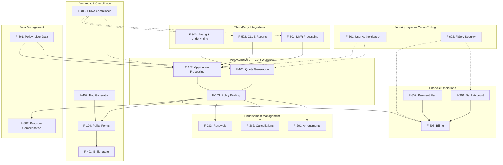

### 2.3.2 Integration Points

The following table maps features to the eight external systems defined in the enterprise integration topology (§1.2.1). Each integration point includes its protocol, communication pattern, and service-level agreement.

| Feature ID | External System | Protocol | SLA |
|---|---|---|---|
| F-503 | PolStar Rating | SOAP/XML (Jakarta EE) | < 2 seconds |
| F-303 | Enterprise Billing | REST/JSON | < 3 seconds |
| F-104, F-402 | Document Services | REST/JSON | < 5 seconds |
| F-501 | MVR Services | REST/JSON | < 8 seconds |
| F-502 | CLUE Property | REST/JSON | < 6 seconds |
| F-402 | ImageRight | SOAP/XML (Jakarta EE) | < 10 seconds |

Additional integrations that support platform-wide operations without direct feature mapping:

| Integration | Protocol | Pattern | SLA |
|---|---|---|---|
| Data Warehouse | Batch/XML | Asynchronous | < 30 minutes |
| Email Service | SMTP | Asynchronous | < 1 minute |

### 2.3.3 Shared Components and Common Services

Features share underlying platform components within the multi-module architecture. The following table identifies the shared modules and the features that depend on them.

| Shared Component | Module | Consuming Features |
|---|---|---|
| Domain Models | `umbrella-model` | All features (F-101 through F-802) |
| Data Persistence | `umbrella-integration` (MyBatis) | All data-creating/reading features |
| Business Logic | `umbrella-appservices` | All features with workflow logic |
| Web API Layer | `umbrella-web` | All externally accessible features |
| Drools Rules Engine | Embedded in `umbrella-appservices` | F-101, F-102, F-201, F-203, F-302, F-403, F-802 |
| XStream Serialization | Shared library | F-503 (PolStar), F-402 (ImageRight) |
| Spring Security 6.1.x | Framework-level | F-601, F-602, all features (enforcement) |
| OWASP ESAPI 2.5.2.0 | Framework-level | F-601, F-301, all data input features |
| HikariCP 5.0.1 | Connection pool | All database-accessing features |
| Spring Boot Config | `spring-boot-config` | All modules via `application.yml` profiles |

---

## 2.4 IMPLEMENTATION CONSIDERATIONS

### 2.4.1 Technical Constraints

#### Platform Constraints

| Constraint | Description |
|---|---|
| Java 21 LTS Runtime | All features must compile and execute on Java 21, leveraging `jakarta.*` namespaces exclusively |
| Spring Boot 3.2.x Framework | Feature implementations must conform to Spring Boot conventions including auto-configuration and profile-based configuration |
| Embedded Tomcat 10.1.18 | Deployment as executable JAR with embedded server; no external application server dependencies |
| Maven 3.9.5 Build System | Multi-module Maven project structure must be maintained |
| Dual Database Support | Features must operate correctly against both SQL Server (mssql-jdbc 11.2.3.jre17) and IBM DB2 (jcc 11.5.8.0) |

#### Integration Constraints

| Constraint | Description |
|---|---|
| Eight Defined Integrations Only | The system is limited to the eight external integrations defined in §1.2.1; no additional third-party connections are supported in this release |
| SOAP/XML for Legacy Systems | PolStar and ImageRight integrations require SOAP/XML via Jakarta EE web service clients and XStream serialization |
| REST/JSON for Modern Systems | Enterprise Billing, Document Services, MVR, and CLUE use REST/JSON with DTOs for data exchange |
| Umbrella Policies Only | The system focus is exclusively umbrella insurance; non-umbrella policy types are out of scope (§1.3.2) |

### 2.4.2 Performance Requirements

Performance requirements are derived from the SLA commitments defined in §1.2.1 and the success criteria in §1.2.3.

| Performance Dimension | Target | Applicable Features |
|---|---|---|
| Synchronous Rating Response | < 2 seconds | F-101, F-201, F-203 (via F-503) |
| Synchronous Billing Response | < 3 seconds | F-303 |
| Document Generation Response | < 5 seconds | F-104, F-402 |
| Asynchronous MVR Retrieval | < 8 seconds | F-102 (via F-501) |
| Asynchronous CLUE Retrieval | < 6 seconds | F-102 (via F-502) |
| Document Archival | < 10 seconds | F-402 (via ImageRight) |
| Batch Data Warehouse Sync | < 30 minutes | Platform analytics |
| Email Notification Delivery | < 1 minute | Platform notifications |
| Policy Lifecycle Cycle Time | 50% reduction vs. legacy | All policy management features |

### 2.4.3 Scalability Considerations

The platform's scalability targets are defined by the 200% volume capacity KPI (§1.2.3):

| Consideration | Approach |
|---|---|
| **Connection Pooling** | HikariCP 5.0.1 manages database connection pools for both SQL Server and IBM DB2, supporting high-concurrency data operations |
| **Containerized Deployment** | Docker and Kubernetes support in the CI/CD pipeline enables horizontal scaling of Spring Boot executable JAR instances |
| **Geographic Distribution** | Five deployment regions (co1, co2, co3, ne, colo) provide geographic distribution for load balancing and disaster recovery |
| **Asynchronous Processing** | MVR, CLUE, ImageRight, Data Warehouse, and Email integrations use asynchronous patterns to avoid blocking under load |
| **Monitoring** | Spring Boot Actuator health endpoints and Micrometer metrics provide operational observability for capacity planning |

### 2.4.4 Security Implications

| Feature Area | Security Measure |
|---|---|
| **Authentication** (F-601) | Spring Security 6.1.x enforces identity verification and session management across all features |
| **Input Validation** (All Features) | OWASP ESAPI 2.5.2.0 provides input sanitization, output encoding, and protection against injection attacks |
| **Financial Data** (F-301, F-302, F-303) | FiServ security protocols (F-602) enforce encryption at rest and in transit for all financial information |
| **Compliance Data** (F-403) | FCRA audit records are immutable and access-controlled; compliance with Fair Credit Reporting Act is enforced programmatically |
| **External Integrations** | DTOs ensure clean separation between internal domain models and external data contracts, preventing information leakage |
| **Configuration Security** | Spring Boot profiles (`application.yml`) managed through `spring-boot-config` centralize sensitive configuration per deployment environment |

### 2.4.5 Maintenance Requirements

| Requirement | Description |
|---|---|
| **Configurable Business Rules** | Drools business rules engine enables rule updates without code deployment, supporting features F-101, F-102, F-201, F-203, F-302, F-403, F-802 |
| **Environment Configuration** | `umbrella-config`, `umbrella-ui-config`, and `spring-boot-config` modules provide per-environment configuration management via Spring Boot profiles |
| **Automated Testing** | JUnit 5 (Jupiter 5.10.0), Mockito 5.5.0, and AssertJ 3.24.2 with Spring Boot Test provide comprehensive automated regression verification |
| **CI/CD Pipeline** | Jenkins pipeline with SonarQube analysis and Ansible-based deployment automation supports continuous integration and delivery |
| **Modular Architecture** | Nine-module Maven structure enables independent module versioning, testing, and deployment |
| **Operational Monitoring** | Spring Boot Actuator health endpoints and Micrometer metrics support proactive maintenance and incident detection |

---

## 2.5 TRACEABILITY MATRIX

### 2.5.1 Feature-to-Capability Mapping

The following matrix traces platform features to the seven core capabilities defined in §1.2.2, the business problems addressed (§1.1.2), and the success criteria (§1.2.3).

| Feature ID | Core Capability (§1.2.2) | Business Problem (§1.1.2) |
|---|---|---|
| F-101 | Quote Proposal Generation (#4) | Complex form processing delays |
| F-102 | Policyholder Data Mgmt (#5) | Complex form processing delays |
| F-103 | Policy Form Generation (#1) | Complex form processing delays |
| F-104 | Policy Form Generation (#1) | Complex form processing delays |
| F-201, F-202, F-203 | Policy Form Generation (#1) | Complex form processing delays |
| F-301, F-302, F-303 | Payment Processing (#3) | Manual payment handling errors |
| F-401 | E-Signature Management (#2) | Paper-based signature delays |
| F-402 | Policy Form Generation (#1) | Complex form processing delays |
| F-403 | Regulatory Compliance (#7) | Compliance risk |
| F-501, F-502, F-503 | Regulatory Compliance (#7) | Compliance risk |
| F-601, F-602 | (Security — cross-cutting) | Compliance risk |
| F-701 | (Cross-selling — additive) | N/A (revenue expansion) |
| F-801 | Policyholder Data Mgmt (#5) | Complex form processing delays |
| F-802 | Producer Compensation (#6) | N/A (agent operations) |

### 2.5.2 Feature-to-Success-Criteria Mapping

| Success Criterion (§1.2.3) | KPI Target | Contributing Features |
|---|---|---|
| Integration Effectiveness | 100% operational integration | F-303, F-402, F-501, F-502, F-503 |
| Processing Efficiency | 50% cycle time reduction | F-101, F-102, F-103, F-104, F-401 |
| Operational Improvement | Reduced manual steps | F-201, F-202, F-203, F-302, F-801 |
| Compliance | 100% compliance rate | F-403, F-501, F-502, F-601, F-602 |
| Scalability | 200% current volume | All features (infrastructure-level) |

### 2.5.3 Feature-to-Module Mapping

| Feature ID | Primary Module(s) | UI Module |
|---|---|---|
| F-101 | `umbrella-appservices`, `umbrella-web` | `umbrella-ui-web` |
| F-102 | `umbrella-appservices`, `umbrella-integration` | `umbrella-ui-web` |
| F-103 | `umbrella-appservices`, `umbrella-integration` | `umbrella-ui-web` |
| F-104 | `umbrella-appservices` | `umbrella-ui-web` |
| F-201, F-202, F-203 | `umbrella-appservices`, `umbrella-integration` | `umbrella-ui-web` |
| F-301, F-302, F-303 | `umbrella-appservices`, `umbrella-integration` | `umbrella-ui-web` |
| F-401 | `umbrella-appservices` | `umbrella-ui-web` |
| F-402 | `umbrella-appservices`, `umbrella-integration` | N/A (backend service) |
| F-403 | `umbrella-appservices`, `umbrella-integration` | N/A (backend enforcement) |
| F-501, F-502, F-503 | `umbrella-integration` | N/A (backend integration) |
| F-601, F-602 | Spring Security, OWASP ESAPI | `umbrella-ui-web` (login) |
| F-701 | `umbrella-appservices` | `umbrella-ui-web` |
| F-801 | `umbrella-model`, `umbrella-integration` | `umbrella-ui-web` |
| F-802 | `umbrella-appservices`, `umbrella-integration` | `umbrella-ui-web` |

---

## 2.6 ASSUMPTIONS AND CONSTRAINTS

### 2.6.1 Key Assumptions

| ID | Assumption |
|---|---|
| A-001 | All eight external systems (PolStar, Enterprise Billing, Document Services, MVR, CLUE, ImageRight, Data Warehouse, Email) will maintain their published SLAs throughout the modernization |
| A-002 | The modernization from Java 8 to Java 21 preserves all existing business functionality without behavioral changes |
| A-003 | Drools business rules from the legacy system are compatible with or migrated to the modernized runtime |
| A-004 | Insurance agents and producers are the primary system users; no direct customer-facing access is required |
| A-005 | Both SQL Server and IBM DB2 databases are available in all deployment regions |

### 2.6.2 Constraints Summary

| ID | Constraint |
|---|---|
| C-001 | System serves umbrella insurance policies exclusively (§1.3.2) |
| C-002 | No mobile application interfaces in this release (§1.3.2) |
| C-003 | No customer-facing self-service portals (§1.3.2) |
| C-004 | Legacy data migration handled separately (§1.3.2) |
| C-005 | Maximum of eight external integrations supported (§1.3.2) |

---

## 2.7 DOCUMENT VERSION HISTORY

| Version | Date | Description |
|---|---|---|
| 1.0 | Current Release | Initial product requirements specification for AI Umbrella modernization |

---

#### References

- **Technical Specification §1.1 (Executive Summary)** — Source for core business problems (§1.1.2), stakeholder definitions (§1.1.3), and business value proposition (§1.1.4) used in feature business value and user benefit descriptions
- **Technical Specification §1.2 (System Overview)** — Source for enterprise integration topology and SLAs (§1.2.1), seven core capabilities and module architecture (§1.2.2), and success criteria / KPIs (§1.2.3) used throughout feature descriptions, performance requirements, and traceability matrices
- **Technical Specification §1.3 (Scope)** — Source for complete feature catalog with IDs (§1.3.1), implementation boundaries, geographic distribution, and out-of-scope exclusions (§1.3.2) used for feature definitions and constraints
- `README.md` — Repository placeholder file (`# 13_feb_2_3`); confirms repository is in initial state with no source code available for cross-reference
- `/app/lib/reverse_document/doc.py` (lines 547–1053) — Referenced in §1.3 as the feature catalog source providing feature IDs and functional requirement details

# 3. Technology Stack

## 3.1 PROGRAMMING LANGUAGES

### 3.1.1 Primary Backend Language — Java 21 LTS

Java serves as the exclusive backend programming language for the AI Umbrella platform, having been modernized from JDK 1.8.0_321 (Java 8) to **Java 21 LTS** as part of the major platform modernization initiative documented in §1.1.1.

| Attribute | Specification |
|---|---|
| **Language** | Java |
| **Version** | 21 LTS |
| **Previous Version** | JDK 1.8.0_321 (Java 8) |
| **Compilation Target** | Java 21 (source and target via `maven-compiler-plugin 3.11.0`) |
| **Package Namespace** | `jakarta.*` (migrated from `javax.*`) |

#### Selection Justification

| Criterion | Rationale |
|---|---|
| **Long-Term Support** | Java 21 LTS is supported through at least 2030, ensuring platform viability without forced runtime upgrades |
| **Enterprise Stability** | Proven track record in enterprise insurance and financial services, with robust type safety and optimization for transactional processing |
| **Modern Language Features** | Pattern matching, sealed classes, and record classes enable more expressive and type-safe domain modeling for insurance entities |
| **Performance Improvements** | Enhanced garbage collection, JIT compilation optimizations, and virtual threads (Project Loom) improve throughput for concurrent policy processing operations |
| **Jakarta EE Compatibility** | Full alignment with the current Jakarta EE specification (`jakarta.*` namespaces), eliminating the legacy `javax.*` dependency |
| **Ecosystem Maturity** | Comprehensive library support for enterprise integration, database connectivity, and web services required by the eight defined external system integrations (§1.2.1) |

#### Constraints and Dependencies

- All modules across the nine-module Maven project must compile and execute on Java 21 exclusively (Constraint C-001 in §2.4.1)
- The `jakarta.*` namespace migration is a hard requirement — no `javax.*` packages are permitted in the modernized codebase
- Advanced pattern matching using Java 21 sealed classes is employed for domain model definitions in `umbrella-model`

### 3.1.2 Web Presentation Languages

The frontend and presentation layers utilize the following supplementary languages within the Java-centric architecture:

| Language | Module(s) | Purpose | Justification |
|---|---|---|---|
| **JSP (JavaServer Pages)** | `umbrella-ui-web` | Server-side view template rendering | Seamless integration with Java backend; enables dynamic content generation within the Spring WebMVC controller framework |
| **JavaScript** | `umbrella-ui-web` | Client-side scripting, UI interactions | Dynamic web interface behavior; minified and compressed during build via `yuicompressor-maven-plugin 1.5.1` |
| **XML** | All modules | System configuration, data exchange, service integration | Extensive use for Spring Boot configuration (`application.yml`/XML), SOAP/XML web service communication (PolStar, ImageRight), and Drools business rule definitions |

No mobile application languages (Swift, Kotlin, Objective-C) or cross-platform frameworks (React Native, Electron) are applicable to this release, as mobile interfaces are explicitly out of scope (§1.3.2, Constraint C-002).

### 3.1.3 Language Distribution Across Modules

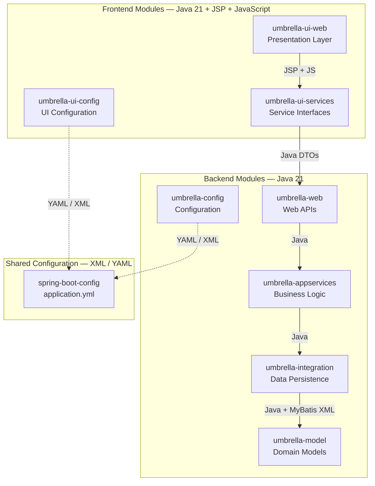

---

## 3.2 FRAMEWORKS AND LIBRARIES

### 3.2.1 Core Application Framework — Spring Boot 3.2.x

The AI Umbrella platform is built on **Spring Boot 3.2.x** with **Spring Framework 6.1.x**, migrated from Spring Framework 5.3.27 as part of the modernization initiative. Spring Boot provides the foundational infrastructure for all application modules.

| Spring Component | Version | Purpose |
|---|---|---|
| **Spring Boot** | 3.2.x | Auto-configuration, dependency management, and application lifecycle |
| **Spring Framework** | 6.1.x | Core dependency injection container, bean lifecycle management |
| **Spring Core** | 6.1.x | IoC container with Java-based configuration and annotation support |
| **Spring Context** | 6.1.x | Application context management with environment-specific configuration via properties and YAML |
| **Spring Beans** | 6.1.x | Component scanning, autowiring, and bean factory |
| **Spring AOP** | 6.1.x | Aspect-oriented programming for cross-cutting concerns (transactions, logging, security) |
| **Spring Web** | 6.1.x | Web application support with embedded Tomcat 10.1.18 integration |
| **Spring WebMVC** | 6.1.x | RESTful endpoint implementation with Jakarta EE servlet support |
| **Spring XML** | 6.1.x | XML marshalling and unmarshalling for web service data exchange via Jakarta XML Binding |

#### Framework Selection Justification

| Criterion | Rationale |
|---|---|
| **Auto-Configuration** | Simplifies bootstrapping with opinionated defaults, reducing configuration overhead from the legacy JBoss EAP deployment model |
| **Embedded Server** | Integrated Apache Tomcat 10.1.18 eliminates external application server dependency, producing self-contained executable JARs |
| **Profile Management** | Native support for environment-specific configuration (`dev`, `test`, `qa`, `prod`, and region-specific `co1`, `co2`, `ne` profiles) through `application.yml` |
| **Ecosystem Integration** | Seamless integration with MyBatis, Spring Security, Spring Web Services, and Drools via Spring Boot starters |
| **Production Readiness** | Built-in Actuator endpoints and Micrometer metrics for operational monitoring without additional infrastructure |

#### Jakarta EE Namespace Migration

All Java EE packages have been migrated to the Jakarta EE namespace as a prerequisite for Spring Boot 3.2.x compatibility:

| Legacy Namespace (`javax.*`) | Modernized Namespace (`jakarta.*`) | Usage Context |
|---|---|---|
| `javax.xml.ws` | `jakarta.xml.ws` | SOAP web service clients (PolStar, ImageRight) |
| `javax.xml.bind` | `jakarta.xml.bind` | XML data binding for service payloads |
| `javax.servlet` | `jakarta.servlet` | Servlet API for embedded Tomcat |
| `javax.validation` | `jakarta.validation` | Bean validation for domain model constraints |
| `javax.persistence` | `jakarta.persistence` | Persistence annotations for data entities |

### 3.2.2 Web Services Framework — Spring Web Services 4.0.2

| Component | Version | Purpose |
|---|---|---|
| `spring-ws-core` | 4.0.2 | Contract-first SOAP web service implementation |
| `spring-ws-security` | 4.0.2 | WS-Security enforcement for SOAP endpoints |
| `spring-ws-support` | 4.0.2 | Spring Boot integration and transport support |

Spring Web Services supports the synchronous SOAP/XML integrations with PolStar Rating (< 2 second SLA) and the asynchronous SOAP/XML integration with ImageRight (< 10 second SLA), both operating under Jakarta EE-compliant SOAP and XML binding.

### 3.2.3 Aspect-Oriented Programming — AspectJ 1.9.20

| Component | Version | Purpose |
|---|---|---|
| `aspectjrt` | 1.9.20 | Runtime library for aspect execution |
| `aspectjweaver` | 1.9.20 | Dynamic weaving of aspects at load time |

AspectJ enables cross-cutting concerns including declarative transaction management, method-level logging, and security enforcement via Spring AOP integration. Aspect compilation is managed by the `aspectj-maven-plugin 1.14.0`.

### 3.2.4 Data Persistence Framework — MyBatis Spring Boot Starter 3.0.3

| Component | Version | Purpose |
|---|---|---|
| `mybatis-spring-boot-starter` | 3.0.3 | Auto-configured SQL mapping framework with Spring Boot integration |
| `mybatis-spring-boot-autoconfigure` | 3.0.3 | Spring Boot auto-configuration support |
| `mybatis-ehcache` | 1.2.3 | Second-level cache implementation for query result caching |
| `mybatis-typehandlers-jsr310` | — | Type handlers for Java Time API (`java.time`) persistence |

#### MyBatis Selection Justification over JPA/Hibernate

| Criterion | Rationale |
|---|---|
| **SQL-Centric Control** | Direct SQL authoring enables precise optimization of complex insurance queries spanning policy, applicant, payment, and compliance data |
| **Fine-Grained Database Control** | Full control over query execution, result mapping, and transaction boundaries for dual-database operations (SQL Server and DB2) |
| **Lower Overhead** | Reduced abstraction overhead compared to JPA/Hibernate for read-heavy insurance data retrieval operations |
| **Legacy Schema Compatibility** | Direct SQL mapping accommodates existing database schemas without requiring object-relational impedance mismatch resolution |
| **Dual Database Support** | Straightforward dialect-specific SQL management for operations against both Microsoft SQL Server and IBM DB2 |

### 3.2.5 JSON and XML Processing

| Component | Version | Purpose |
|---|---|---|
| **Jackson** | (Spring Boot managed) | Object-to-JSON mapping with Jakarta Binding annotations; type-safe DTO conversion; parsing third-party REST/JSON responses |
| **Jakarta XML Binding** | 4.0.0 | XML serialization replacing legacy XStream; SOAP payload marshalling for PolStar and ImageRight integrations |

The platform employs a dual serialization strategy: Jackson for REST/JSON communication with modern services (Enterprise Billing, Document Services, MVR, CLUE) and Jakarta XML Binding 4.0.0 for SOAP/XML communication with legacy enterprise systems (PolStar, ImageRight).

### 3.2.6 Business Rules Engine — Drools

| Component | Integration | Consuming Features |
|---|---|---|
| `drools-engine` | Embedded within `umbrella-appservices` | F-101 (Quote Generation), F-102 (Application Processing), F-201 (Amendments), F-203 (Renewals), F-302 (Payment Plans), F-403 (FCRA Compliance), F-802 (Producer Compensation) |

Drools provides rule-based validation for policy issuance, premium rating, underwriting decisions, and regulatory compliance verification. The engine enables configurable business rule updates without code deployment, directly supporting the platform's maintenance requirements (§2.4.5).

### 3.2.7 Document Processing — Apache POI 5.2.3

| Component | Version | Purpose |
|---|---|---|
| `poi` | 5.2.3 | Core Excel processing for report generation |
| `poi-ooxml` | 5.2.3 | Modern Office Open XML format support for policy document generation |

Apache POI supports document generation capabilities required by features F-104 (Policy Forms) and F-402 (Document Generation).

### 3.2.8 Security Frameworks

| Component | Version | Purpose | Scope |
|---|---|---|---|
| **Spring Security** | 6.1.x | Authentication, authorization, web vulnerability protection, method-level security enforcement | All features via F-601; session management across the platform |
| **OWASP ESAPI** | 2.5.2.0 | Input validation, output encoding, XSS prevention, CSRF protection, secure logging | All data input features; F-601 authentication enforcement; F-301 financial data protection |

Spring Security 6.1.x and OWASP ESAPI 2.5.2.0 operate as complementary security layers. Spring Security manages identity verification, session management, and method-level authorization, while OWASP ESAPI enforces input sanitization and output encoding to protect against injection attacks and cross-site scripting. Together, they implement the security measures defined in §2.4.4, including FiServ security protocols (F-602) for encryption of financial data at rest and in transit.

### 3.2.9 Logging and Monitoring

| Component | Version | Purpose |
|---|---|---|
| **Log4j2** | 2.20.0 | Core logging framework for structured application logging |
| **spring-boot-starter-log4j2** | 3.2.x | Spring Boot integration for Log4j2, replacing default Logback |
| **log4j2-ecs-layout** | 1.5.0 | Structured logging in Elastic Common Schema (ECS) format for log aggregation compatibility |
| **Disruptor** | 4.0.0 | High-performance asynchronous logging via LMAX Disruptor pattern, reducing logging overhead on request processing threads |
| **Spring Boot Actuator** | 3.2.x | Production monitoring and management endpoints (`/actuator/health`, `/actuator/metrics`, `/actuator/env`, `/actuator/loggers`, `/actuator/info`) |
| **Micrometer** | (via Actuator) | Dimensional metrics collection for runtime performance monitoring and capacity planning |

### 3.2.10 Testing Frameworks

| Component | Version | Purpose |
|---|---|---|
| **JUnit Jupiter** | 5.10.0 | Modern unit testing framework (migrated from JUnit 4) |
| **Spring Boot Test** | 3.2.x | Integration testing with full Spring Boot application context |
| **Mockito** | 5.5.0 | Mock object framework for unit test isolation |
| **MockMvc** | (Built into Spring Boot Test) | HTTP-layer testing of Spring MVC controllers without deployment |
| **AssertJ** | 3.24.2 | Fluent assertion library for expressive test validation |
| **WireMock** | — | External service mocking for development and integration test isolation |

The testing stack supports comprehensive verification of all 21 platform features, enabling automated regression testing as part of the Jenkins CI/CD pipeline (§2.4.5).

### 3.2.11 Utility Libraries — Apache Commons

| Component | Version | Purpose |
|---|---|---|
| `commons-lang3` | 3.12.0 | Core Java language utility extensions (string manipulation, reflection, object builders) |
| `commons-collections` | 4.4 | Enhanced collection implementations and utilities |
| `commons-beanutils` | 1.9.4 | JavaBean property access and manipulation utilities |
| `commons-io` | 2.13.0 | I/O stream processing and file handling utilities |
| `commons-fileupload` | 2.0.0-M1 | Multipart file upload handling for policy document submission |
| `commons-text` | 1.10.0 | Text processing, string interpolation, and manipulation |

---

## 3.3 OPEN SOURCE DEPENDENCIES

### 3.3.1 Dependency Management Strategy

All open source dependencies are managed through **Maven 3.9.5** with centralized version control in the root `pom.xml`. Spring Boot 3.2.x acts as the parent POM, providing curated dependency versions for the Spring ecosystem and common third-party libraries through its dependency management BOM (Bill of Materials).

Artifacts are resolved from and published to the enterprise **Nexus repository** at `https://nexus.prcins.net/repository/releases`, ensuring all dependencies are vetted and cached within the organizational perimeter.

### 3.3.2 Complete Dependency Inventory

The following table consolidates all identified open source dependencies organized by functional category:

#### Core Framework Dependencies

| Group ID | Artifact ID | Version | License Category |
|---|---|---|---|
| `org.springframework.boot` | `spring-boot-starter` | 3.2.x | Apache 2.0 |
| `org.springframework.boot` | `spring-boot-starter-web` | 3.2.x | Apache 2.0 |
| `org.springframework.boot` | `spring-boot-starter-security` | 3.2.x | Apache 2.0 |
| `org.springframework.boot` | `spring-boot-starter-actuator` | 3.2.x | Apache 2.0 |
| `org.springframework.boot` | `spring-boot-starter-cache` | 3.2.x | Apache 2.0 |
| `org.springframework.boot` | `spring-boot-starter-log4j2` | 3.2.x | Apache 2.0 |
| `org.springframework.boot` | `spring-boot-starter-test` | 3.2.x | Apache 2.0 |
| `org.springframework.ws` | `spring-ws-core` | 4.0.2 | Apache 2.0 |
| `org.springframework.ws` | `spring-ws-security` | 4.0.2 | Apache 2.0 |

#### Data Persistence Dependencies

| Group ID | Artifact ID | Version | License Category |
|---|---|---|---|
| `org.mybatis.spring.boot` | `mybatis-spring-boot-starter` | 3.0.3 | Apache 2.0 |
| `org.mybatis` | `mybatis-ehcache` | 1.2.3 | Apache 2.0 |
| `org.mybatis` | `mybatis-typehandlers-jsr310` | — | Apache 2.0 |
| `com.zaxxer` | `HikariCP` | 5.0.1 | Apache 2.0 |
| `org.flywaydb` | `flyway-core` | 9.16.3 | Apache 2.0 |

#### Database Drivers

| Group ID | Artifact ID | Version | License Category |
|---|---|---|---|
| `com.microsoft` | `mssql-jdbc` | 11.2.3.jre17 | MIT |
| `com.ibm.db2` | `jcc` | 11.5.8.0 | IBM |

#### Security Dependencies

| Group ID | Artifact ID | Version | License Category |
|---|---|---|---|
| `org.springframework.security` | `spring-security-core` | 6.1.x | Apache 2.0 |
| `org.owasp.esapi` | `esapi` | 2.5.2.0 | BSD |

#### AOP and Weaving Dependencies

| Group ID | Artifact ID | Version | License Category |
|---|---|---|---|
| `org.aspectj` | `aspectjrt` | 1.9.20 | EPL 1.0 |
| `org.aspectj` | `aspectjweaver` | 1.9.20 | EPL 1.0 |

#### Document and Processing Dependencies

| Group ID | Artifact ID | Version | License Category |
|---|---|---|---|
| `org.apache.poi` | `poi` | 5.2.3 | Apache 2.0 |
| `org.apache.poi` | `poi-ooxml` | 5.2.3 | Apache 2.0 |
| `jakarta.xml.bind` | `jakarta.xml.bind-api` | 4.0.0 | EPL 2.0 |

#### Logging Dependencies

| Group ID | Artifact ID | Version | License Category |
|---|---|---|---|
| `org.apache.logging.log4j` | `log4j-core` | 2.20.0 | Apache 2.0 |
| `co.elastic.logging` | `log4j2-ecs-layout` | 1.5.0 | Apache 2.0 |
| `com.lmax` | `disruptor` | 4.0.0 | Apache 2.0 |

#### Utility Dependencies

| Group ID | Artifact ID | Version | License Category |
|---|---|---|---|
| `org.apache.commons` | `commons-lang3` | 3.12.0 | Apache 2.0 |
| `org.apache.commons` | `commons-collections4` | 4.4 | Apache 2.0 |
| `commons-beanutils` | `commons-beanutils` | 1.9.4 | Apache 2.0 |
| `commons-io` | `commons-io` | 2.13.0 | Apache 2.0 |
| `org.apache.commons` | `commons-fileupload2` | 2.0.0-M1 | Apache 2.0 |
| `org.apache.commons` | `commons-text` | 1.10.0 | Apache 2.0 |

#### Testing Dependencies

| Group ID | Artifact ID | Version | License Category |
|---|---|---|---|
| `org.junit.jupiter` | `junit-jupiter` | 5.10.0 | EPL 2.0 |
| `org.mockito` | `mockito-core` | 5.5.0 | MIT |
| `org.assertj` | `assertj-core` | 3.24.2 | Apache 2.0 |

### 3.3.3 Dependency Registry and Resolution

| Registry | URL | Purpose |
|---|---|---|
| **Nexus (Enterprise)** | `https://nexus.prcins.net/repository/releases` | Primary artifact repository for internal and vetted third-party dependencies |
| **Maven Central** | `https://repo.maven.apache.org/maven2` | Upstream source for open source dependencies (proxied through Nexus) |

All dependencies are resolved through the enterprise Nexus repository to ensure supply chain security, version consistency, and artifact availability across all deployment regions.

---

## 3.4 THIRD-PARTY SERVICES

### 3.4.1 Enterprise Service Integrations

The AI Umbrella platform integrates with internal enterprise services via versioned client libraries. These services provide core business capabilities consumed by the platform's backend modules.

| Service | Artifact | Version | Purpose | Consuming Module |
|---|---|---|---|---|
| **Audit Services** | `net.prcins.thirdparty.service.audit:auditservice` | 2023.2.0 | System activity auditing and compliance trail generation | `umbrella-appservices` |
| **Billing Services** | `net.prcins.thirdparty.service.billing:billing-services-client` | 2023.1.1 | Premium billing, invoicing, and payment plan management | `umbrella-appservices` (F-303) |
| **Policy Services** | `net.prcins.thirdparty.service.policy:policy-services-client` | 2022.04.01 | Core policy management integration and cross-system policy data exchange | `umbrella-integration` |
| **Payment Services** | `net.prcins.thirdparty.service.payment:paymentservice-client` | 2023.3.0 | Payment processing, transaction recording, and financial reconciliation | `umbrella-appservices` (F-301, F-302) |

### 3.4.2 External System Integrations

Eight external system integrations are defined for this release (Constraint C-005 in §2.6.2). No additional third-party connections are supported.

| External System | Protocol | Integration Pattern | SLA | Client Type |
|---|---|---|---|---|
| **PolStar Rating** | SOAP/XML (Jakarta EE) | Synchronous | < 2 seconds | SOAP — `jakarta.xml.soap`, Jakarta XML Web Services 4.0.0 |
| **Enterprise Billing** | REST/JSON | Synchronous | < 3 seconds | REST — Spring Boot `RestClient` with `@HttpExchange` |
| **Document Services** | REST/JSON | Synchronous | < 5 seconds | REST — Spring Boot `RestClient` with `@HttpExchange` |
| **MVR Services** | REST/JSON | Asynchronous | < 8 seconds | REST — Spring Boot `RestClient` with circuit breaker |
| **CLUE Property** | REST/JSON | Asynchronous | < 6 seconds | REST — Spring Boot `RestClient` with circuit breaker |
| **ImageRight** | SOAP/XML (Jakarta EE) | Asynchronous | < 10 seconds | SOAP — Jakarta XML Binding annotations |
| **Data Warehouse** | Batch/XML | Asynchronous | < 30 minutes | Batch — XML export with Jakarta XML Binding |
| **Email Service** | SMTP | Asynchronous | < 1 minute | SMTP — `PRCRELAY.PRCINS.NET` |

#### Client Implementation Patterns

**SOAP Clients** (regenerated for Jakarta EE compliance):
- PolicyServiceClient communicates via `jakarta.xml.soap`
- AuditServiceClient uses Jakarta XML Web Services 4.0.0
- BillingServiceClient employs Jakarta XML Binding annotations for payload marshalling

**REST Clients** (modernized from legacy `RestTemplate`):
- All REST clients migrated to Spring Boot's declarative `RestClient` with `@HttpExchange` annotation
- Circuit breakers and fallback mechanisms are implemented for asynchronous integrations (MVR, CLUE)
- `ProblemDetail` support (RFC 7807) for standardized error handling
- Specific client implementations: PaymentRESTClient, AuditRESTClient, PolicyRESTClient

### 3.4.3 Development and Quality Services

| Service | URL | Purpose |
|---|---|---|
| **SonarQube** | `https://sonar.prcins.net` | Static code analysis, code quality metrics, technical debt tracking, and security vulnerability scanning |
| **Nexus Repository** | `https://nexus.prcins.net/repository/releases` | Enterprise artifact repository for build artifact storage, dependency management, and release distribution |

### 3.4.4 Integration Architecture

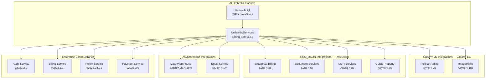

---

## 3.5 DATABASES AND STORAGE

### 3.5.1 Primary Database Platforms

The AI Umbrella platform operates against a **dual-database architecture**, a core constraint requiring all features to function correctly against both database platforms (§2.4.1).

| Database | JDBC Driver | Driver Version | Purpose |
|---|---|---|---|
| **Microsoft SQL Server** | `com.microsoft:mssql-jdbc` | **11.2.3.jre17** | Primary transactional database for policy data, applicant records, payment transactions, and compliance audit trails |
| **IBM DB2** | `com.ibm.db2:jcc` | **11.5.8.0** | Integration with legacy insurance systems and enterprise data repositories requiring DB2 compatibility |

#### Dual Database Justification

| Criterion | Rationale |
|---|---|
| **Enterprise Mandate** | Both databases must be available in all five deployment regions (Assumption A-005 in §2.6.1) |
| **Legacy Compatibility** | IBM DB2 support ensures continued interoperability with existing enterprise systems that depend on DB2-based data stores |
| **Primary Workload** | Microsoft SQL Server serves as the primary transactional database for all new policy operations |
| **Dialect-Specific SQL** | MyBatis SQL mappings accommodate dialect-specific query syntax for both platforms |

#### Data Source Configuration

Data source configuration has been modernized from JBoss JNDI-based lookups to Spring Boot property-based configuration managed through `application.yml` profiles in the `spring-boot-config` module. Environment-specific database connections are activated via Spring profile selection (`dev`, `test`, `qa`, `prod`, `co1`, `co2`, `ne`).

### 3.5.2 Connection Pooling — HikariCP 5.0.1

| Attribute | Specification |
|---|---|
| **Library** | HikariCP |
| **Version** | 5.0.1 |
| **Previous Solution** | Apache Commons DBCP |
| **Scope** | All database-accessing features across all modules |

HikariCP replaces the legacy `commons-dbcp` connection pool, providing superior performance, lower latency, and reduced memory footprint. It manages connection pools for both SQL Server and IBM DB2 data sources, supporting the platform's high-concurrency data operations and the 200% volume scalability target (§1.2.3).

### 3.5.3 Caching Architecture

| Component | Version | Integration Method | Purpose |
|---|---|---|---|
| **EhCache** (MyBatis integration) | via `mybatis-ehcache 1.2.3` | MyBatis second-level cache | Query result caching for frequently accessed insurance data, reducing database load on read-heavy operations |
| **EhCache** (Spring Cache) | via `spring-boot-starter-cache 3.2.x` | Spring Cache abstraction | Method-level caching using `@Cacheable`, `@CachePut`, and `@CacheEvict` annotations |

The caching strategy operates at two distinct layers:
1. **Data Access Layer**: MyBatis second-level cache via EhCache integration caches SQL query results for high-frequency reads (e.g., policy lookups, reference data)
2. **Service Layer**: Spring Cache abstraction provides declarative method-level caching for computed business results (e.g., rating calculations, compliance validation outcomes)

### 3.5.4 Database Schema Migration — Flyway 9.16.3

| Attribute | Specification |
|---|---|
| **Library** | Flyway |
| **Version** | 9.16.3 |
| **Integration** | `spring-boot-starter-flyway 3.2.x` (Spring Boot auto-configuration) |
| **Dialect Support** | SQL Server and DB2 dialect-specific migrations |

Flyway provides version-controlled, repeatable database schema migrations. It integrates with Spring Boot's auto-configuration to execute migrations automatically at application startup, ensuring schema consistency across all deployment environments and both database platforms.

### 3.5.5 Data Layer Architecture

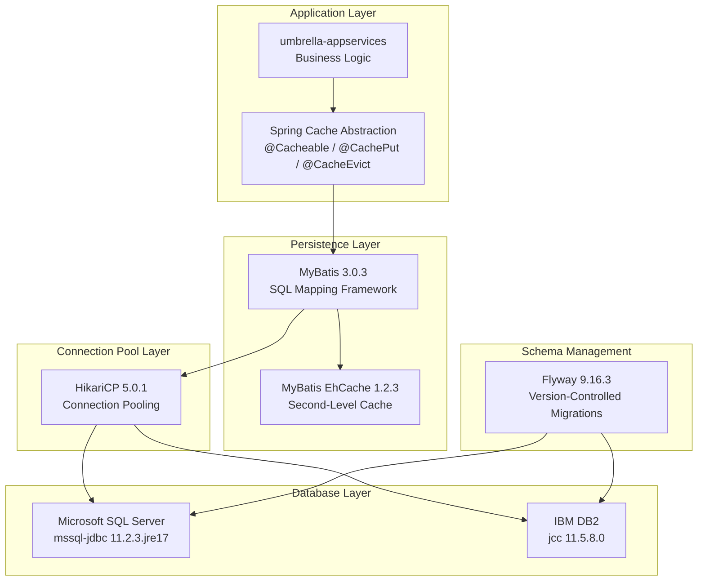

---

## 3.6 DEVELOPMENT AND DEPLOYMENT

### 3.6.1 Build System — Maven 3.9.5

Maven serves as the sole build automation and dependency management tool for the entire multi-module project.

| Attribute | Specification |
|---|---|
| **Build Tool** | Apache Maven |
| **Version** | 3.9.5 |
| **Parent POM** | Spring Boot 3.2.x Starter Parent |
| **Module Count** | 9 modules across 3 project groups |

#### Maven Plugin Configuration

| Plugin | Version | Purpose |
|---|---|---|
| `maven-compiler-plugin` | 3.11.0 | Java compilation with source and target set to Java 21 |
| `spring-boot-maven-plugin` | 3.2.0 | Executable JAR creation with embedded Tomcat |
| `jacoco-maven-plugin` | 0.8.10 | Code coverage analysis and enforcement |
| `maven-surefire-plugin` | 3.1.2 | Unit test execution with JUnit 5 (Jupiter) integration |
| `maven-failsafe-plugin` | 3.1.2 | Integration test execution in isolated lifecycle phase |
| `aspectj-maven-plugin` | 1.14.0 | AspectJ compilation and compile-time weaving |
| `maven-resources-plugin` | 3.3.1 | Resource filtering, profile-specific property replacement |
| `yuicompressor-maven-plugin` | 1.5.1 | JavaScript and CSS minification and compression |

#### Multi-Module Project Structure

```
ai-umbrella/
├── pom.xml                         (Root POM — Spring Boot Parent)
├── umbrella-services/              (Backend Services)
│   ├── pom.xml
│   ├── umbrella-model/             (Domain Models)
│   ├── umbrella-integration/       (Database Integration — MyBatis)
│   ├── umbrella-appservices/       (Business Logic — Drools)
│   ├── umbrella-web/               (Web APIs — Spring WebMVC)
│   └── umbrella-config/            (Backend Configuration)
├── umbrella-ui/                    (Frontend Application)
│   ├── pom.xml
│   ├── umbrella-ui-services/       (Service Interfaces & DTOs)
│   ├── umbrella-ui-web/            (Presentation — JSP + JavaScript)
│   └── umbrella-ui-config/         (UI Configuration)
└── spring-boot-config/             (Shared Configuration)
    ├── application.yml
    └── application-{env}.yml       (Profile-specific configs)
```

### 3.6.2 CI/CD Pipeline

The continuous integration and delivery pipeline is orchestrated by **Jenkins** and encompasses a seven-stage workflow:

| Stage | Tool | Purpose |
|---|---|---|
| **1. Build & Test** | Maven 3.9.5, JUnit 5, Java 21 | Compile all modules and execute unit test suites |
| **2. Tag** | Git | Automated version tagging for release management and traceability |
| **3. Artifact** | Maven, Nexus | Package as executable JARs and deploy to `https://nexus.prcins.net/repository/releases` |
| **4. Analyze** | SonarQube | Static code analysis at `https://sonar.prcins.net` for quality, security, and maintainability |
| **5. Containerize** | Docker | Build container images for Spring Boot application JARs |
| **6. Deploy** | Kubernetes, Ansible | Kubernetes-based deployment for containerized environments; Ansible (`springboot_deployment.yml`) for on-premise deployments |
| **7. Validate** | Spring Boot Actuator | Health check verification via `/actuator/health` endpoint on port 8080 |

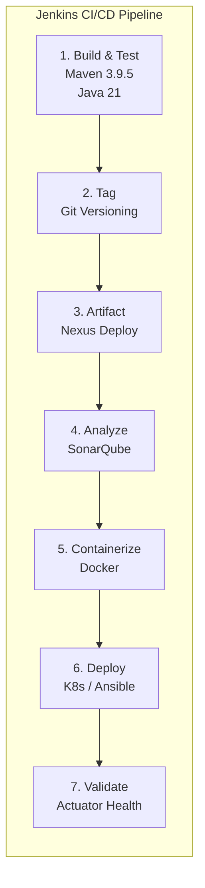

### 3.6.3 Containerization and Orchestration

| Component | Purpose |
|---|---|
| **Docker** | Container image construction for Spring Boot executable JARs |
| **Kubernetes** | Container orchestration, horizontal scaling, and deployment management across environments |
| **Ansible** | Deployment automation via `springboot_deployment.yml` playbook for on-premise servers |

The platform supports dual deployment models: containerized deployment via Docker and Kubernetes for scalable environments, and traditional on-premise deployment using Ansible automation for regions requiring direct server management.

### 3.6.4 Deployment Configuration

#### Build Artifacts

| Artifact | Description |
|---|---|
| `umbrella-web.jar` | Backend executable JAR with embedded Tomcat 10.1.18 |
| `umbrella-ui-web.jar` | Frontend executable JAR with embedded Tomcat 10.1.18 |
| `umbrella-config.zip` | Backend environment-specific configuration archive |
| `umbrella-ui-config.zip` | Frontend environment-specific configuration archive |

#### Deployment Paths

| Path | Purpose |
|---|---|
| `/opt/umbrella/app` | Application JAR files |
| `/opt/umbrella/config` | External configuration files |
| `/opt/umbrella/logs` | Application log output |

#### Startup Configuration

The Spring Boot deployment model produces self-contained executable JARs invoked directly via the JVM:

`java -jar umbrella-web.jar --spring.profiles.active=prod --server.port=8080`

#### Spring Boot Profiles

| Profile | Purpose |
|---|---|
| `dev` | Local development configuration |
| `test` | Automated test environment |
| `qa` | Quality assurance environment |
| `prod` | Production configuration |
| `co1` | Colorado Primary region |
| `co2` | Colorado Secondary region |
| `ne` | Northeast Regional |

#### Actuator Monitoring Endpoints

| Endpoint | Purpose |
|---|---|
| `/actuator/health` | Application health status and dependency checks |
| `/actuator/info` | Application version and build information |
| `/actuator/metrics` | Runtime performance metrics (Micrometer) |
| `/actuator/env` | Environment and configuration property inspection |
| `/actuator/loggers` | Runtime log level management and adjustment |

### 3.6.5 Geographic Deployment Distribution

The platform is deployed across five geographic regions to support load balancing, disaster recovery, and regional operational requirements:

| Region ID | Description | Role |
|---|---|---|
| `co1` | Colorado Primary | Primary production site |
| `co2` | Colorado Secondary | Secondary production and disaster recovery |
| `co3` | Colorado Test | Test and staging environment |
| `ne` | Northeast Regional | Regional production for northeast operations |
| `colo` | Colocation Facility | Backup production site |

Each environment uses dedicated front-end and back-end server groups, with both SQL Server and IBM DB2 databases available in all deployment regions (Assumption A-005).

### 3.6.6 Resource Requirements

| Resource | Specification |
|---|---|
| **Compute** | Minimum 4 CPU cores per Spring Boot instance |
| **JVM Heap** | 4 GB minimum, 8 GB recommended |
| **Front-End Server RAM** | 8 GB minimum |
| **Back-End Server RAM** | 16 GB minimum |
| **Database Server RAM** | 32 GB minimum |
| **Application Storage** | 100 MB per JAR + 20 GB for logs |
| **Health Check Port** | HTTP 8080 |

---

## 3.7 TECHNOLOGY STACK OVERVIEW

### 3.7.1 Layered Architecture Visualization

The following diagram illustrates the complete technology stack organized by architectural layer, showing how components relate vertically through the platform's tiers.

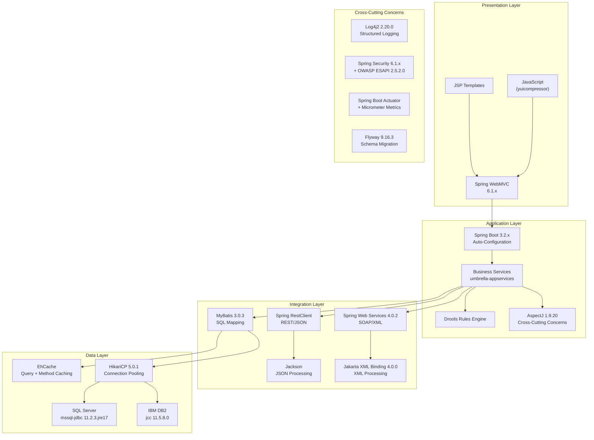

### 3.7.2 Migration Summary

The modernization initiative represents a comprehensive technology upgrade across all platform layers. The following table consolidates all migration dimensions for reference:

| Dimension | Legacy State | Modernized State |
|---|---|---|
| Language Runtime | Java 8 (JDK 1.8.0_321) | **Java 21 LTS** |
| Application Framework | Spring Framework 5.3.27 | **Spring Boot 3.2.x (Spring Framework 6.1.x)** |
| Package Namespace | `javax.*` | **`jakarta.*` (Jakarta EE)** |
| Application Server | JBoss EAP (external) | **Embedded Apache Tomcat 10.1.18** |
| Connection Pooling | Apache Commons DBCP | **HikariCP 5.0.1** |
| MyBatis Version | MyBatis 3.1.1 | **MyBatis Spring Boot Starter 3.0.3** |
| Logging | Log4j2 2.17.1 | **Spring Boot Logging with Log4j2 2.20.0** |
| Testing Framework | JUnit 4 | **JUnit Jupiter 5.10.0** |
| Deployment Unit | WAR files to JBoss EAP | **Executable JAR files with embedded Tomcat** |
| REST Clients | `RestTemplate` | **Spring Boot `RestClient` / `@HttpExchange`** |
| XML Processing | XStream / JAXB (`javax.*`) | **Jakarta XML Binding 4.0.0** |
| Configuration | Custom XML-based | **Spring Boot `application.yml` with profiles** |

---

#### References

- `/app/lib/reverse_document/doc.py` (lines 1271–1297) — Programming language specifications including Java 21 migration details and web presentation languages
- `/app/lib/reverse_document/doc.py` (lines 1298–1355) — Core Spring Boot and Spring Framework component inventory with version details
- `/app/lib/reverse_document/doc.py` (lines 1357–1393) — MyBatis persistence framework configuration, Jackson JSON processing details
- `/app/lib/reverse_document/doc.py` (lines 1394–1430) — Logging framework stack (Log4j2, Disruptor, ECS layout), Drools business rules engine, Apache POI document processing
- `/app/lib/reverse_document/doc.py` (lines 1431–1488) — Security framework specifications (Spring Security, OWASP ESAPI), testing frameworks (JUnit 5, Mockito, AssertJ), Apache Commons utility libraries, Jakarta XML Binding
- `/app/lib/reverse_document/doc.py` (lines 1489–1582) — Database platforms (SQL Server, DB2), connection pooling (HikariCP), caching architecture (EhCache), Flyway database migration
- `/app/lib/reverse_document/doc.py` (lines 1584–1673) — Third-party enterprise services (Audit, Billing, Policy, Payment), SOAP and REST client implementation patterns, integration architecture
- `/app/lib/reverse_document/doc.py` (lines 1693–1794) — Maven build system, plugin inventory, CI/CD pipeline stages, deployment configuration and paths
- `/app/lib/reverse_document/doc.py` (lines 1798–1845) — Layered technology stack visualization (Mermaid diagram source)
- `/app/lib/reverse_document/doc.py` (lines 184–202) — Multi-module Maven project structure definition
- `/app/lib/reverse_document/doc.py` (lines 267–284) — Legacy-to-modern migration dimension mapping
- `/app/lib/reverse_document/doc.py` (lines 2805–2816) — External system integration protocols and SLA definitions
- `/app/lib/reverse_document/doc.py` (lines 8440–8664) — Deployment environment specifications, Actuator endpoints, Spring profiles
- `/app/lib/reverse_document/doc.py` (lines 8520–8554) — Resource requirements (compute, memory, storage)
- `/app/lib/reverse_document/doc.py` (lines 8552) — SMTP relay endpoint specification
- `/app/lib/reverse_document/doc.py` (lines 8747–8960) — CI/CD pipeline tool inventory and stage definitions
- `/app/lib/reverse_document/doc.py` (lines 9086–9140) — Infrastructure architecture diagram (load balancer, tiers)
- Tech Spec §1.1.1 — Executive summary with migration trajectory and project context
- Tech Spec §1.2.1 — System overview with external integration topology and SLA commitments
- Tech Spec §1.3 — Scope boundaries, geographic distribution, CI/CD tools
- Tech Spec §2.3 — Feature relationships, shared components, and integration point matrix
- Tech Spec §2.4 — Implementation considerations including platform constraints, performance requirements, security implications, and maintenance requirements
- Tech Spec §2.5 — Traceability matrix confirming feature-to-module technology associations
- Tech Spec §2.6 — Assumptions (dual-database availability) and constraints (eight integrations only, no mobile)

# 4. Process Flowchart

This section provides comprehensive process flowcharts documenting every major workflow within the AI Umbrella platform — an enterprise-grade personal umbrella insurance policy management system. All process flows are derived from the functional requirements, feature dependencies, integration topology, and architectural constraints defined in the Technical Specification (§1.2, §2.1–§2.6, §3.4–§3.6). The diagrams span the complete policy lifecycle, integration workflows, error handling mechanisms, state transitions, and deployment pipelines.

The AI Umbrella platform orchestrates 21 features across seven functional categories — Policy Management, Endorsement Management, Financial Operations, Document & Compliance, Third-Party Integration, Security, and Data Management — each interconnected through well-defined dependency chains and shared enterprise services. The flowcharts below capture these interactions, decision points, validation checkpoints, and error recovery paths at every critical stage.

---

## 4.1 SYSTEM WORKFLOW OVERVIEW

### 4.1.1 High-Level Policy Lifecycle Workflow

The end-to-end policy lifecycle represents the primary value stream of the AI Umbrella platform, transforming a prospective applicant into an active policyholder and managing the policy through amendments, renewals, or cancellation. This workflow traverses all seven feature categories, engages eight external system integrations, and enforces both business rules (via the Drools engine in `umbrella-appservices`) and regulatory compliance checks (FCRA via F-403) at every critical juncture.

The following flowchart presents the complete policy lifecycle from initial authentication through policy termination. Each node maps to a specific feature identifier defined in the Feature Catalog (§2.1), with SLA constraints annotated at integration touchpoints. Decision diamonds denote authorization, validation, and underwriting gates that govern process continuation. Error and rejection paths branch to the appropriate recovery or termination states.

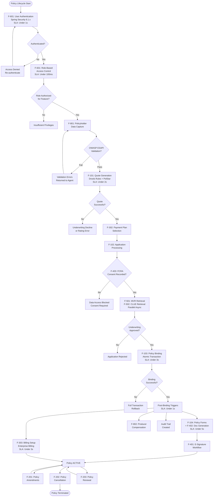

The lifecycle workflow above illustrates ten primary decision gates — from authentication through billing confirmation — each enforcing specific validation rules and business logic. The critical path traverses F-601 → F-801 → F-101 → F-302 → F-102 → F-103 → F-104/F-303 → F-401, with the PolStar rating call (F-503, under 2s SLA) and parallel MVR/CLUE retrievals (F-501/F-502, under 8s/6s SLAs) representing the most latency-sensitive external touchpoints. All error paths branch to defined recovery states: re-authentication, input correction, graceful degradation, or full transaction rollback as specified in F-103-RQ-003.

### 4.1.2 Cross-Layer Interaction Model

The AI Umbrella platform operates through a layered, service-oriented architecture with clearly defined module responsibilities (§1.2.2). Every user-initiated action traverses the full stack — from the JSP-based presentation layer (`umbrella-ui-web`) through the service interface (`umbrella-ui-services`), web API layer (`umbrella-web`), business logic orchestration (`umbrella-appservices`), and integration/persistence layer (`umbrella-integration`) — before reaching external systems or database storage.

The following sequence diagram illustrates a representative transaction — a quote generation request — flowing through all architectural layers, demonstrating the Spring Security authentication gate, Drools rule evaluation, PolStar rating call, and MyBatis persistence that characterize the platform's processing model.

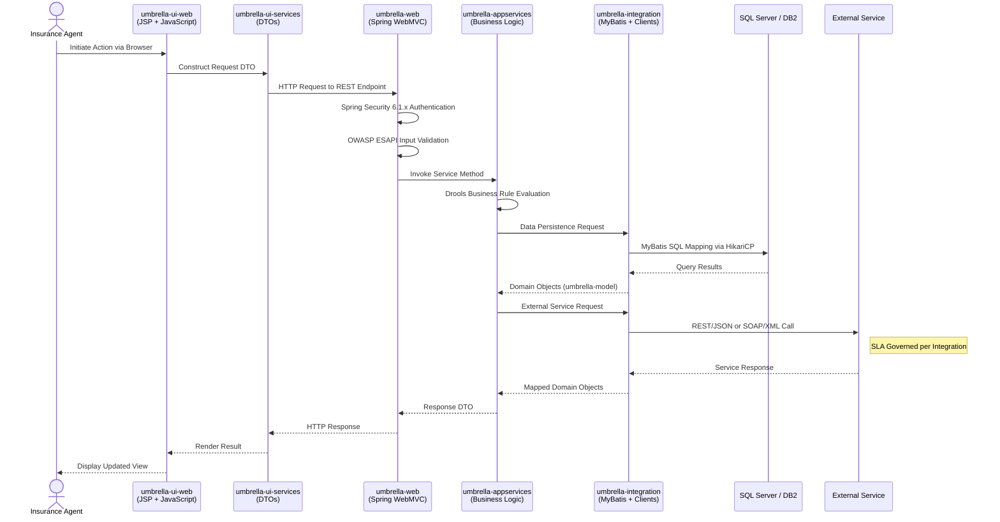

This layered interaction pattern enforces separation of concerns at every boundary. DTOs defined in `umbrella-ui-services` provide clean contracts between the frontend and backend, while `umbrella-model` domain objects circulate within the service and integration layers. Spring Security 6.1.x and OWASP ESAPI 2.5.2.0 enforce authentication and input sanitization at the API boundary before any business logic execution occurs. The `umbrella-integration` module encapsulates all external system communication, using Spring Boot `RestClient` with `@HttpExchange` annotations for REST integrations and `jakarta.xml.soap` with XStream serialization for SOAP/XML integrations.

---

## 4.2 CORE BUSINESS PROCESS FLOWS

### 4.2.1 New Business Policy Workflow

The new business workflow is the platform's critical path — the end-to-end process that converts a prospective applicant into a bound, active policyholder. This workflow engages 14 of the platform's 21 features and touches all eight external integrations defined in the enterprise topology (§1.2.1). It is organized into five sequential phases: Authentication, Data Capture and Quoting, Application and Underwriting, Policy Binding, and Document and Billing Completion.

The detailed flowchart below uses subgraph boundaries to delineate each phase, with cross-phase connections representing the natural progression of the workflow. Every decision diamond corresponds to a specific functional requirement or validation rule defined in §2.2.

```mermaid
flowchart TD
    subgraph Phase1["Phase 1: Authentication and Authorization"]
        P1Start(["Agent Initiates Session"]) --> P1Auth["Spring Security 6.1.x<br/>Credential Validation<br/>F-601-RQ-001"]
        P1Auth --> P1AuthDec{"Valid<br/>Credentials?"}
        P1AuthDec -->|No| P1Fail["Authentication Failed<br/>Session Denied"]
        P1Fail --> P1Start
        P1AuthDec -->|Yes| P1Session["Session Established<br/>Tomcat 10.1.18<br/>SLA: Under 1s"]
        P1Session --> P1Role["Role-Based Access<br/>Control Check<br/>F-601-RQ-002"]
        P1Role --> P1RoleDec{"Role Authorized?<br/>Under 100ms"}
        P1RoleDec -->|No| P1Denied["Feature Access Denied"]
        P1RoleDec -->|Yes| P1Ready["Agent Authorized<br/>Proceed to Data Capture"]
    end

    subgraph Phase2["Phase 2: Data Capture and Quoting"]
        P1Ready --> P2Data["F-801: Policyholder Data<br/>Capture and Validation<br/>F-801-RQ-001"]
        P2Data --> P2ValDec{"OWASP ESAPI<br/>Input Validation?"}
        P2ValDec -->|Fail| P2Err["Return Validation Errors<br/>XSS/Injection Prevention"]
        P2Err --> P2Data
        P2ValDec -->|Pass| P2Persist["Persist via MyBatis<br/>SQL Server / DB2<br/>HikariCP 5.0.1"]
        P2Persist --> P2Coverage["F-101: Agent Enters<br/>Coverage Parameters"]
        P2Coverage --> P2Drools["Drools Underwriting<br/>Rule Evaluation<br/>SLA: Under 500ms"]
        P2Drools --> P2RuleDec{"Underwriting<br/>Criteria Met?"}
        P2RuleDec -->|No| P2Decline["Quote Declined<br/>by Business Rules"]
        P2RuleDec -->|Yes| P2PolStar["F-503: PolStar Rating<br/>SOAP/XML via jakarta.xml.soap<br/>SLA: Under 2s"]
        P2PolStar --> P2RateDec{"PolStar<br/>Successful?"}
        P2RateDec -->|No| P2RateErr["Rating Error<br/>Graceful Degradation<br/>F-503-RQ-002"]
        P2RateDec -->|Yes| P2Premium["Premium Calculated<br/>Quote Proposal Generated<br/>F-101-RQ-003"]
        P2Premium --> P2Pay["F-302: Payment Plan<br/>Selection<br/>Drools Installment Calc"]
    end

    subgraph Phase3["Phase 3: Application and Underwriting"]
        P2Pay --> P3App["F-102: Guided Application<br/>Workflow<br/>F-102-RQ-001"]
        P3App --> P3FCRA{"F-403: FCRA<br/>Consent Recorded?"}
        P3FCRA -->|No| P3Block["Third-Party Data<br/>Access BLOCKED"]
        P3Block --> P3Disclose["Present FCRA Disclosure<br/>Obtain Applicant Consent"]
        P3Disclose --> P3FCRA
        P3FCRA -->|Yes| P3Audit["Create FCRA Immutable<br/>Audit Record<br/>F-403-RQ-002"]
        P3Audit --> P3MVR["F-501: MVR Retrieval<br/>Async REST/JSON<br/>Circuit Breaker<br/>SLA: Under 8s"]
        P3Audit --> P3CLUE["F-502: CLUE Retrieval<br/>Async REST/JSON<br/>Circuit Breaker<br/>SLA: Under 6s"]
        P3MVR --> P3RiskEval["Drools Risk Evaluation<br/>MVR + CLUE Factors<br/>SLA: Under 500ms"]
        P3CLUE --> P3RiskEval
        P3RiskEval --> P3UWDec{"Underwriting<br/>Approval?"}
        P3UWDec -->|No| P3Reject["Application Rejected<br/>Adverse Action Notice<br/>F-403-RQ-003"]
        P3UWDec -->|Yes| P3Approved["Application Approved<br/>Ready for Binding"]
    end

    subgraph Phase4["Phase 4: Policy Binding — Atomic Transaction"]
        P3Approved --> P4Bind["F-103: Initiate<br/>Policy Binding<br/>Transaction Opened"]
        P4Bind --> P4Create["Create Active Policy<br/>Record with Unique<br/>Policy Number<br/>F-103-RQ-001"]
        P4Create --> P4Trigger["Trigger Downstream<br/>Operations<br/>F-103-RQ-002"]
        P4Trigger --> P4Forms["F-104: Document<br/>Generation Triggered"]
        P4Trigger --> P4Bill["F-303: Billing<br/>Setup Triggered"]
        P4Trigger --> P4Comp["F-802: Commission<br/>Calculation Triggered"]
        P4Trigger --> P4AuditTx["Audit Trail<br/>Record Created"]
        P4Forms --> P4TxDec{"All Downstream<br/>Operations Succeed?<br/>F-103-RQ-003"}
        P4Bill --> P4TxDec
        P4Comp --> P4TxDec
        P4AuditTx --> P4TxDec
        P4TxDec -->|No| P4Rollback["FULL TRANSACTION<br/>ROLLBACK<br/>All Changes Reverted"]
        P4TxDec -->|Yes| P4Commit["Transaction COMMITTED<br/>Policy Bound"]
    end

    subgraph Phase5["Phase 5: Document and Billing Completion"]
        P4Commit --> P5DocGen["F-402: Document Generation<br/>via Document Services<br/>REST/JSON<br/>SLA: Under 5s"]
        P5DocGen --> P5Archive["Archive in ImageRight<br/>SOAP/XML<br/>SLA: Under 10s"]
        P5Archive --> P5ESign["F-401: E-Signature<br/>Present to Signer<br/>F-401-RQ-001"]
        P5ESign --> P5SignDec{"Signature<br/>Completed?"}
        P5SignDec -->|Pending| P5Pending["Awaiting Signature<br/>Reminder Workflow"]
        P5SignDec -->|Complete| P5Signed["Signed Documents<br/>Archived in ImageRight<br/>F-401-RQ-003"]
        P4Commit --> P5BillData["F-303: Transmit Billing<br/>to Enterprise Billing<br/>REST/JSON<br/>SLA: Under 3s"]
        P5BillData --> P5BillDec{"Billing<br/>Confirmed?"}
        P5BillDec -->|No| P5BillErr["Payment Exception<br/>Workflow Triggered<br/>F-303-RQ-003"]
        P5BillDec -->|Yes| P5BillOK["Payment Status<br/>Updated"]
        P5Signed --> P5Active(["Policy ACTIVE<br/>New Business Complete"])
        P5BillOK --> P5Active
    end
```

#### Decision Points Summary — New Business Flow

The new business workflow contains twelve critical decision points, each governed by specific validation rules and business logic:

| Decision Gate | Feature Reference | Validation Mechanism | Failure Path |
|---|---|---|---|
| Authentication valid? | F-601-RQ-001 | Spring Security 6.1.x credential validation | Session denied, re-authenticate |
| Role authorized? | F-601-RQ-002 | In-memory role-to-feature mapping (under 100ms) | Insufficient privileges |
| OWASP ESAPI validation? | F-801-RQ-001 | Input sanitization, injection prevention | Validation errors returned to agent |
| Underwriting criteria met? | F-101-RQ-002 | Drools configurable business rules (under 500ms) | Quote declined |
| PolStar rating successful? | F-503-RQ-001, F-503-RQ-002 | SOAP/XML response validation (under 2s) | Graceful degradation, no data loss |
| FCRA consent recorded? | F-403-RQ-001 | Consent completeness and timestamp verification | Data access blocked until consent obtained |
| MVR/CLUE data acceptable? | F-501-RQ-002, F-502-RQ-002 | Drools risk factor evaluation (under 500ms) | Risk flags forwarded to underwriter |
| Underwriting approval? | F-102-RQ-001 | Pre-validated application + risk evaluation | Rejection with adverse action notice |
| All downstream ops succeed? | F-103-RQ-003 | Atomic transaction boundary verification | Full rollback of all changes |
| Signature completed? | F-401-RQ-002 | Signature capture, verification, timestamp | Pending with reminder workflow |
| Billing confirmed? | F-303-RQ-001, F-303-RQ-002 | Enterprise Billing REST response (under 3s) | Exception workflow triggered |

### 4.2.2 Policy Amendment Workflow (F-201)

Policy amendments enable mid-term modifications to active, bound policies — including coverage adjustments, named insured changes, and limit modifications (§2.1.3). This workflow reuses the PolStar rating engine (F-503) for premium recalculation and the document generation pipeline (F-402, F-104) for updated policy forms. Drools business rules in `umbrella-appservices` govern amendment eligibility, and all amendments are restricted to policies in the Bound (Active) state per F-201-RQ-001.

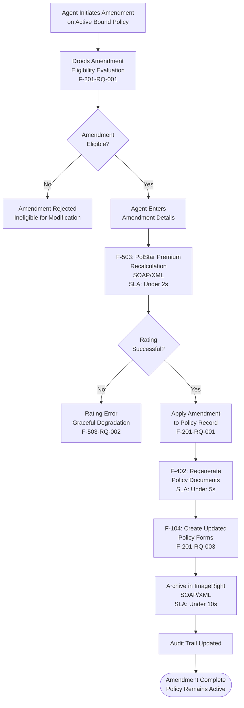

The amendment workflow involves three decision gates: amendment eligibility (Drools), premium recalculation success (PolStar), and document regeneration completion. The premium recalculation call to PolStar is the most latency-sensitive step at under 2 seconds SLA. Upon completion, the policy returns to its Active state with updated terms, premium, and documentation.

### 4.2.3 Policy Cancellation Workflow (F-202)

Cancellation processing handles both insured-requested and company-initiated policy terminations. The workflow calculates pro-rata premium splits (earned vs. unearned), processes financial reconciliation through Enterprise Billing (F-303), and generates cancellation notices through the document pipeline (F-402). All cancellations require an active, bound policy as a prerequisite (§2.1.3).

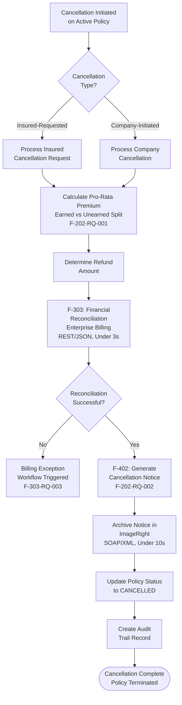

The cancellation workflow branches at the initiation point to distinguish between insured-requested and company-initiated cancellations, as both require different compliance documentation. The financial reconciliation via Enterprise Billing (under 3s SLA) is the primary integration point, with billing exception handling defined by F-303-RQ-003 for failed payment processing.

### 4.2.4 Renewal Processing Workflow (F-203)

Renewal processing combines batch evaluation with individual policy renewal execution. The batch phase — governed by a 30-minute SLA per F-203-RQ-001 — identifies policies approaching term expiration and evaluates renewal eligibility using configurable Drools rules. Eligible policies then enter the interactive renewal workflow, where agents confirm renewal offers and the system extends policy terms, recalculates premiums, continues billing, and regenerates documentation.

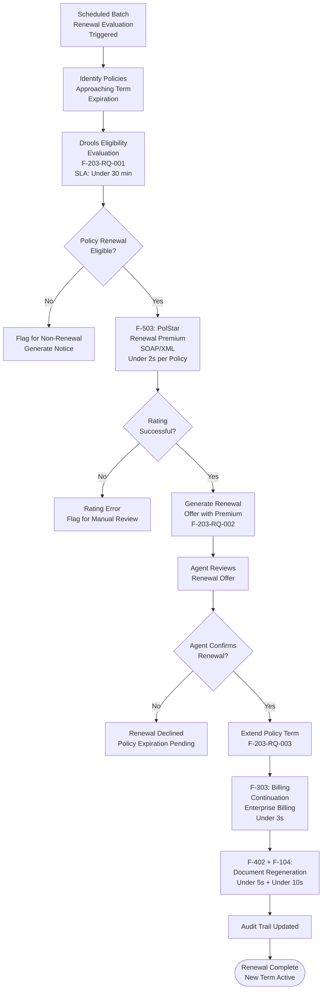

The renewal workflow has a unique dual-execution model: the batch eligibility evaluation operates asynchronously within the 30-minute SLA window, while individual policy renewals execute interactively through the agent-facing interface with synchronous PolStar rating calls. The Drools-based eligibility evaluation enables renewal criteria updates without code deployment, supporting the maintainability requirement defined in §2.4.5.

---

## 4.3 INTEGRATION WORKFLOWS

### 4.3.1 PolStar Rating Engine Integration (F-503)

The PolStar rating integration is the platform's most latency-sensitive external dependency, providing the actuarial premium calculation backbone for quote generation (F-101), amendments (F-201), and renewals (F-203). Communication uses SOAP/XML via Jakarta EE-compliant web service clients (`jakarta.xml.soap`, Jakarta XML Web Services 4.0.0), with XStream serialization handling the XML payload marshalling within the `umbrella-integration` module.

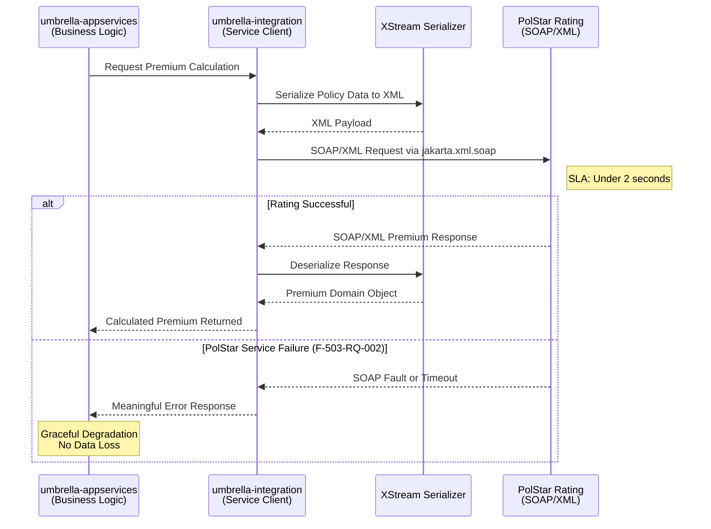

The PolStar integration enforces a strict under-2-second SLA, making it the tightest time constraint among all external integrations. F-503-RQ-002 mandates that PolStar service failures return meaningful errors without data loss, implementing the graceful degradation pattern. The synchronous nature of this integration means that any latency directly impacts the user experience during quoting, amendment, and renewal workflows.

### 4.3.2 MVR and CLUE Third-Party Data Retrieval (F-501, F-502)

MVR and CLUE retrievals are asynchronous REST/JSON integrations that enrich application data during the underwriting workflow (F-102). Both integrations implement circuit breaker patterns via Spring Boot `RestClient` to handle external service unavailability gracefully. FCRA compliance (F-403) governs all credit-related data access, requiring verified consent before any retrieval is initiated.

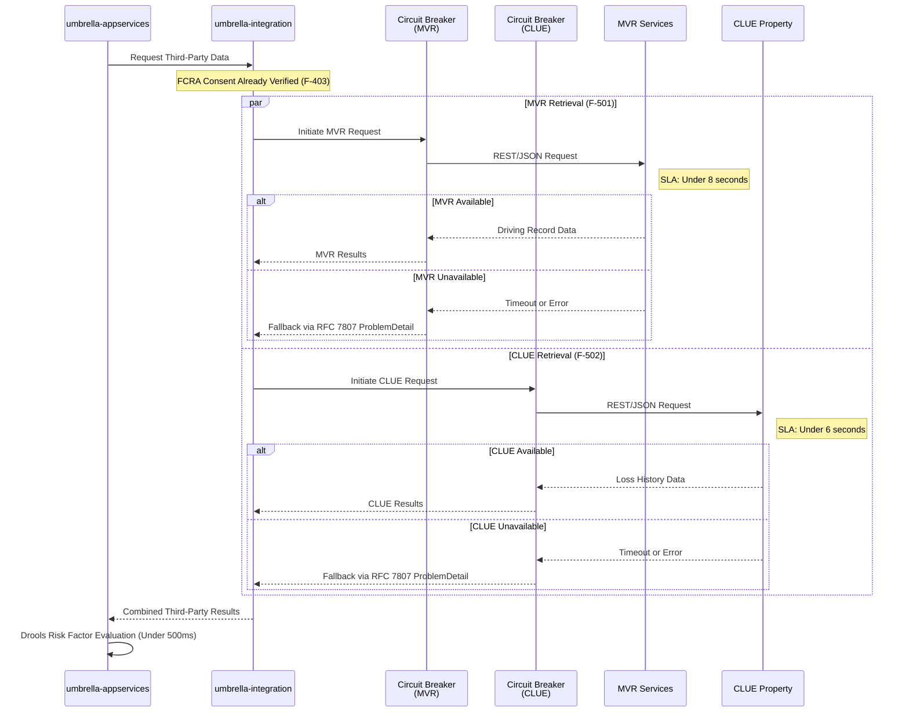

The parallel execution of MVR and CLUE retrievals optimizes the application processing workflow by overlapping the two longest-running external calls. The circuit breaker pattern ensures that an unavailable external service does not cascade failures into the core application — fallback responses conforming to RFC 7807 `ProblemDetail` are returned, allowing the underwriting workflow to proceed with available data or flag the application for manual review.

### 4.3.3 Document Lifecycle Integration (F-104, F-402, F-401)

The document lifecycle spans three features and two external systems: Document Services (REST/JSON, under 5s SLA) for document creation, and ImageRight (SOAP/XML via Jakarta XML Binding, under 10s SLA) for long-term archival. The lifecycle progresses from template-based generation through archival, e-signature presentation, signature capture and verification, and final signed-document storage.

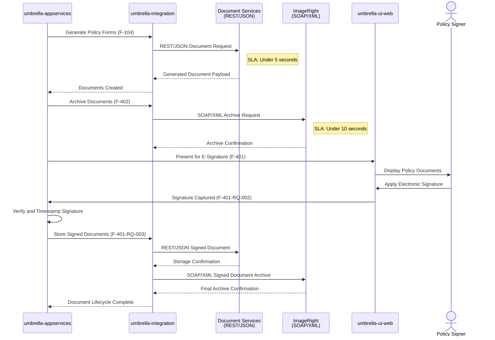

This integration workflow demonstrates the dual-protocol architecture: REST/JSON (`RestClient` with `@HttpExchange`) for Document Services and SOAP/XML (`jakarta.xml.soap` with Jakarta XML Binding annotations) for ImageRight. XStream serialization within `umbrella-integration` handles the XML data interchange for ImageRight. The e-signature workflow (F-401) represents a user touchpoint where the process pauses for human interaction before resuming automated processing.

### 4.3.4 Financial Operations Integration (F-301, F-302, F-303)

Financial operations involve a three-feature chain: bank account management (F-301), payment plan selection (F-302), and enterprise billing integration (F-303). FiServ security protocols (F-602) enforce encryption at rest and in transit for all financial data, adding a security layer before any financial operation reaches the Enterprise Billing system.

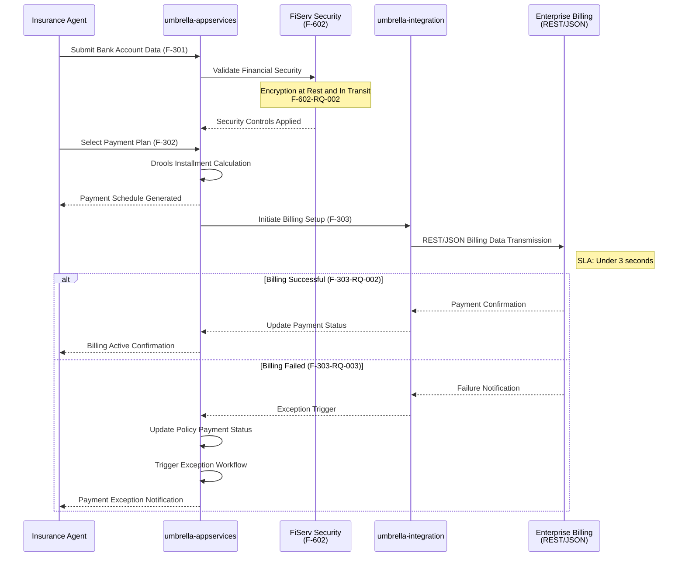

The financial operations integration enforces the FiServ security layer (F-602) as a mandatory checkpoint before any financial data reaches external systems. The under-100ms overhead for FiServ security validation (§2.2.6) ensures transparent security without measurable user impact. Enterprise Billing exception handling (F-303-RQ-003) updates policy payment status and triggers dedicated exception workflows for failed payments, preventing policies from entering an active state without confirmed billing.

### 4.3.5 Batch Processing Sequences

The AI Umbrella platform performs two primary batch operations: renewal eligibility evaluation and Data Warehouse synchronization. Both operate asynchronously with extended SLA windows, distinct from the real-time interactive workflows. Email notification delivery via SMTP complements these batch operations with event-driven asynchronous processing.

```mermaid
flowchart TD
    subgraph RenewalBatch["Renewal Eligibility Evaluation Batch"]
        RB1["Scheduled Trigger"] --> RB2["Query Policies<br/>Approaching Expiration"]
        RB2 --> RB3["Drools Batch<br/>Eligibility Evaluation"]
        RB3 --> RB4{"Policy<br/>Eligible?"}
        RB4 -->|Yes| RB5["Add to Renewal<br/>Queue"]
        RB4 -->|No| RB6["Flag for<br/>Non-Renewal"]
        RB5 --> RB7["SLA: Under 30 Minutes<br/>for Full Portfolio"]
        RB6 --> RB7
    end

    subgraph DWSyncBatch["Data Warehouse Synchronization Batch"]
        DW1["Scheduled Trigger"] --> DW2["Extract Policy and<br/>Transaction Data"]
        DW2 --> DW3["Jakarta XML Binding<br/>Serialization"]
        DW3 --> DW4["Batch XML Transfer<br/>to Data Warehouse"]
        DW4 --> DW5{"Transfer<br/>Successful?"}
        DW5 -->|Yes| DW6["Sync Complete<br/>SLA: Under 30 min"]
        DW5 -->|No| DW7["Retry on<br/>Next Schedule"]
    end

    subgraph EmailBatch["Email Notification Processing"]
        EM1["Event-Driven<br/>Trigger"] --> EM2["Compose Notification<br/>Message"]
        EM2 --> EM3["SMTP Delivery via<br/>PRCRELAY.PRCINS.NET"]
        EM3 --> EM4["Delivery Confirmed<br/>SLA: Under 1 min"]
    end
```

The Data Warehouse synchronization uses Jakarta XML Binding annotations for XML payload construction, consistent with the SOAP/XML integration pattern used for ImageRight. The email notification system leverages the enterprise SMTP relay at `PRCRELAY.PRCINS.NET` for all outbound communications, with a sub-1-minute delivery SLA. The renewal batch evaluation's 30-minute SLA (F-203-RQ-001) accommodates processing of the entire policy portfolio, after which individual eligible policies enter the interactive renewal workflow described in §4.2.4.

---

## 4.4 ERROR HANDLING FLOWCHARTS

### 4.4.1 Circuit Breaker Pattern (MVR/CLUE Integrations)

The circuit breaker pattern is implemented for the asynchronous MVR (F-501) and CLUE (F-502) integrations to prevent cascading failures when external services become unavailable. The circuit breaker operates in three states — Closed (normal operation), Open (service unavailable, fallback active), and Half-Open (testing service recovery). All fallback responses conform to the RFC 7807 `ProblemDetail` specification for standardized error handling across the REST client infrastructure.

```mermaid
flowchart TD
    subgraph CBLifecycle["Circuit Breaker State Machine"]
        CB1["External Service<br/>Request Initiated"] --> CB2{"Circuit Breaker<br/>Current State?"}
        CB2 -->|Closed| CB3["Forward Request<br/>to External Service"]
        CB3 --> CB4{"Service<br/>Response?"}
        CB4 -->|Success| CB5["Reset Failure Counter<br/>Return Valid Response"]
        CB4 -->|Timeout or Error| CB6["Increment<br/>Failure Counter"]
        CB6 --> CB7{"Failure Threshold<br/>Exceeded?"}
        CB7 -->|No| CB8["Return Error Response<br/>RFC 7807 ProblemDetail"]
        CB7 -->|Yes| CB9["OPEN Circuit Breaker<br/>Activate Fallback Mode"]
        CB2 -->|Open| CB10["Bypass External Call<br/>Return Fallback Response<br/>RFC 7807 ProblemDetail"]
        CB2 -->|Half-Open| CB11["Allow Single<br/>Test Request"]
        CB11 --> CB12{"Test Request<br/>Successful?"}
        CB12 -->|Yes| CB13["CLOSE Circuit Breaker<br/>Resume Normal Operations"]
        CB12 -->|No| CB9
        CB9 --> CB14["Wait for Recovery<br/>Timeout Period"]
        CB14 --> CB15["Transition to<br/>HALF-OPEN State"]
        CB15 --> CB11
    end
```

The circuit breaker pattern is critical for maintaining platform stability, particularly given the relatively long SLA windows for MVR (under 8s) and CLUE (under 6s) retrievals. When circuits are open, the underwriting workflow (F-102) continues with available data and flags the application for manual underwriter review, ensuring that external service disruptions do not block the entire policy processing pipeline. This supports the 200% volume capacity scalability target (§1.2.3) by preventing resource exhaustion during external service degradation.

### 4.4.2 Policy Binding Transaction Rollback (F-103)

Policy binding (F-103) represents the most transactionally critical operation in the platform. F-103-RQ-003 mandates atomic transaction integrity — when any downstream operation fails during binding, all changes must be rolled back completely. The transaction boundary encompasses policy record creation, document generation triggers, billing setup, compensation calculation, and audit trail creation. Transaction management is implemented through Spring AOP and AspectJ 1.9.20 within the `umbrella-integration` layer.

```mermaid
flowchart TD
    subgraph AtomicTx["F-103 Atomic Transaction Boundary"]
        TX1["Binding Transaction<br/>Opened"] --> TX2["Create Active Policy<br/>Record with Unique<br/>Policy Number"]
        TX2 --> TX3["Trigger F-104:<br/>Document Generation"]
        TX3 --> TX4{"F-104<br/>Succeeded?"}
        TX4 -->|No| TX11["FULL ROLLBACK<br/>All Changes Reverted"]
        TX4 -->|Yes| TX5["Trigger F-303:<br/>Billing Setup"]
        TX5 --> TX6{"F-303<br/>Succeeded?"}
        TX6 -->|No| TX11
        TX6 -->|Yes| TX7["Trigger F-802:<br/>Compensation Calc"]
        TX7 --> TX8{"F-802<br/>Succeeded?"}
        TX8 -->|No| TX11
        TX8 -->|Yes| TX9["Create Audit<br/>Trail Record"]
        TX9 --> TX10["TRANSACTION COMMITTED<br/>Policy Successfully Bound"]
        TX11 --> TX12["Failure Reported<br/>to Agent with Details"]
        TX12 --> TX13["No Partial Data<br/>Persisted"]
    end
```

The sequential verification of each downstream operation before proceeding to the next ensures fail-fast behavior — the transaction rolls back at the first point of failure rather than accumulating partial state. This atomic guarantee is enforced through Spring's declarative transaction management at the `umbrella-integration` layer, with MyBatis 3.0.3 managing the SQL operations against SQL Server or DB2 through HikariCP 5.0.1 connection pools. The under-1-second SLA for downstream trigger initiation (F-103-RQ-002) ensures that the total binding operation remains within its under-3-second performance target.

### 4.4.3 FCRA Compliance Gate (F-403)

The FCRA compliance gate is a mandatory regulatory checkpoint that must be satisfied before any credit-related data access occurs during application processing. F-403-RQ-001 requires verified disclosure and consent before proceeding, with F-403-RQ-002 mandating immutable audit records for all FCRA-governed interactions. The compliance rules are implemented as configurable Drools business rules, allowing regulatory updates without code deployment (§2.4.5).

```mermaid
flowchart TD
    subgraph FCRACompliance["F-403 FCRA Compliance Gate"]
        FC1["Credit-Related Data<br/>Access Requested<br/>by F-102"] --> FC2{"FCRA Consent<br/>Previously Recorded?"}
        FC2 -->|Yes| FC3["Validate Consent<br/>Completeness<br/>and Timestamp"]
        FC3 --> FC4["Data Access<br/>AUTHORIZED"]
        FC4 --> FC5["Create Immutable<br/>Audit Record<br/>F-403-RQ-002"]
        FC5 --> FC6["Proceed to<br/>MVR/CLUE Retrieval"]
        FC2 -->|No| FC7["Data Access<br/>BLOCKED"]
        FC7 --> FC8["Present FCRA<br/>Disclosure<br/>to Applicant"]
        FC8 --> FC9{"Applicant<br/>Provides Consent?"}
        FC9 -->|Yes| FC10["Record Consent<br/>with Timestamp"]
        FC10 --> FC3
        FC9 -->|No| FC11["Data Request<br/>DENIED"]
        FC11 --> FC12{"Adverse Decision<br/>Based on<br/>Credit Data?"}
        FC12 -->|Yes| FC13["Generate Adverse<br/>Action Notice<br/>F-403-RQ-003"]
        FC12 -->|No| FC14["Continue Processing<br/>Without Credit Data"]
    end
```

The FCRA compliance gate enforces a zero-tolerance policy — the 100% compliance rate KPI (§1.2.3) requires that no credit data access ever bypasses the consent verification step. Immutable audit records (F-403-RQ-002) created at every FCRA-governed interaction are access-restricted to compliance roles (§2.4.4), ensuring regulatory traceability. The adverse action notification pathway (F-403-RQ-003) handles cases where underwriting decisions based on credit data result in application rejection, generating required regulatory notices.

### 4.4.4 Error Recovery Summary

The following table consolidates all error handling mechanisms across the platform, mapping error types to their recovery strategies, affected features, and referenced requirements:

| Error Scenario | Recovery Mechanism | Affected Features | Requirement Reference |
|---|---|---|---|
| Authentication failure | Session denied, re-authentication prompt | F-601 | F-601-RQ-001 |
| Input validation failure | OWASP ESAPI returns errors, user corrects data | All data input features | F-801-RQ-001 |
| PolStar rating failure | Graceful degradation, meaningful error returned | F-101, F-201, F-203 | F-503-RQ-002 |
| MVR service unavailable | Circuit breaker fallback, RFC 7807 ProblemDetail | F-501 → F-102 | F-501-RQ-001 |
| CLUE service unavailable | Circuit breaker fallback, RFC 7807 ProblemDetail | F-502 → F-102 | F-502-RQ-001 |
| Binding transaction failure | Full atomic rollback, failure reported to agent | F-103 | F-103-RQ-003 |
| Document generation failure | Retry via Document Services, escalation if persistent | F-104, F-402 | F-104-RQ-001 |
| ImageRight archival failure | Retry via SOAP/XML client, escalation if persistent | F-402 | F-402-RQ-002 |
| Payment/billing failure | Policy status updated, exception workflow triggered | F-303 | F-303-RQ-003 |
| FCRA non-compliance | Data access blocked until consent properly recorded | F-403 → F-501, F-502 | F-403-RQ-001 |
| Session timeout | Automatic session invalidation, resource release | F-601 | F-601-RQ-003 |

---

## 4.5 STATE TRANSITION DIAGRAMS

### 4.5.1 Policy State Transitions

The policy entity progresses through a well-defined state machine from initial quote generation through terminal states of cancellation, non-renewal, or expiration. Each transition corresponds to a specific feature operation and is governed by business rules enforced through the Drools engine. The Bound state serves as the hub from which endorsement management operations (amendments, cancellations, renewals) branch.

```mermaid
stateDiagram-v2
    [*] --> Quoted : F-101 Quote Generated
    Quoted --> Applied : F-102 Application Submitted
    Quoted --> Expired : Quote Expiration Timeout
    Applied --> UnderReview : Underwriting Initiated
    UnderReview --> Approved : Underwriter Approves
    UnderReview --> Rejected : Underwriter Rejects
    Approved --> Bound : F-103 Policy Bound
    Bound --> Amended : F-201 Amendment Applied
    Amended --> Bound : Amendment Complete
    Bound --> Cancelled : F-202 Cancellation Processed
    Bound --> RenewalPending : F-203 Renewal Evaluation
    RenewalPending --> Renewed : Renewal Accepted
    RenewalPending --> NonRenewed : Renewal Declined
    Renewed --> Bound : New Term Active
    Rejected --> [*]
    Cancelled --> [*]
    Expired --> [*]
    NonRenewed --> [*]
```

Key state transition rules include:
- **Quoted → Applied**: Requires validated applicant data (F-801) and OWASP ESAPI input sanitization
- **Applied → Bound**: Requires successful underwriting approval, FCRA compliance (F-403), and acceptable MVR/CLUE results
- **Bound → Amended**: Requires Drools amendment eligibility validation and PolStar premium recalculation
- **Bound → Cancelled**: Requires pro-rata premium calculation and Enterprise Billing reconciliation
- **Bound → RenewalPending**: Triggered by batch renewal evaluation (F-203-RQ-001)
- **RenewalPending → Renewed**: Requires agent confirmation and successful PolStar renewal rating

### 4.5.2 Document State Transitions

Documents generated by the platform follow a lifecycle that spans creation, archival, signature presentation, and final signed-document storage. The document state machine involves three external systems: Document Services for generation, ImageRight for archival, and the Umbrella UI for signature presentation.

```mermaid
stateDiagram-v2
    [*] --> Generated : F-402 Document Generation
    Generated --> Archived : ImageRight SOAP/XML Storage
    Archived --> PresentedForSigning : F-401 E-Signature Initiated
    PresentedForSigning --> SignaturePending : Awaiting Signer Action
    SignaturePending --> PresentedForSigning : Reminder Sent
    PresentedForSigning --> Signed : Signature Applied and Verified
    Signed --> FinalArchived : Signed Document Stored
    FinalArchived --> [*]
```

The Document Services integration operates under a 5-second SLA for generation, while ImageRight archival operates under a 10-second SLA. The transition from PresentedForSigning to Signed represents a user touchpoint where the process pauses for human interaction, making it the only non-automated state transition in the document lifecycle.

### 4.5.3 Payment State Transitions

The payment lifecycle begins with billing setup (F-303) and progresses through active payment collection, with exception handling for failed payments. The FiServ security layer (F-602) governs all financial state transitions, ensuring encryption at rest and in transit.

```mermaid
stateDiagram-v2
    [*] --> BillingSetup : F-303 Billing Initiated
    BillingSetup --> PaymentActive : Payment Confirmed
    BillingSetup --> PaymentFailed : Payment Failed
    PaymentFailed --> ExceptionHandling : F-303-RQ-003 Triggered
    ExceptionHandling --> PaymentActive : Issue Resolved
    ExceptionHandling --> Suspended : Persistent Failure
    PaymentActive --> Reconciled : Financial Reconciliation
    PaymentActive --> PaymentFailed : Subsequent Failure
    Reconciled --> [*]
    Suspended --> [*]
```

The payment state machine's exception handling path (F-303-RQ-003) is critical for maintaining policy status accuracy. When a payment fails, the system immediately updates the policy payment status and triggers an exception workflow, preventing policies from remaining in an active-billed state without confirmed payment processing. Financial reconciliation represents the terminal successful state where all premium obligations have been fulfilled.

---

## 4.6 VALIDATION AND AUTHORIZATION CHECKPOINTS

### 4.6.1 Authentication and Authorization Flow

Every platform operation begins with the authentication and authorization checkpoint. Spring Security 6.1.x enforces identity verification, OWASP ESAPI 2.5.2.0 provides input sanitization, and role-based access control (RBAC) verifies feature-level authorization. Session lifecycle management is handled by the embedded Tomcat 10.1.18 container, with automatic timeout and secure resource release (F-601-RQ-003).

```mermaid
flowchart TD
    subgraph SecurityGate["Authentication and Authorization Gateway"]
        SG1(["User Requests<br/>Platform Access"]) --> SG2["Present Login<br/>Credentials"]
        SG2 --> SG3["OWASP ESAPI<br/>Input Sanitization<br/>Injection Prevention"]
        SG3 --> SG4["Spring Security 6.1.x<br/>Identity Validation<br/>F-601-RQ-001"]
        SG4 --> SG5{"Credentials<br/>Valid?"}
        SG5 -->|No| SG6["Authentication Failed<br/>Log Security Event"]
        SG6 --> SG2
        SG5 -->|Yes| SG7["Establish Session<br/>Embedded Tomcat 10.1.18<br/>SLA: Under 1s"]
        SG7 --> SG8["User Requests<br/>Feature Access"]
        SG8 --> SG9["Role-Based Access<br/>Control Verification<br/>F-601-RQ-002"]
        SG9 --> SG10{"Role Maps to<br/>Requested Feature?<br/>Under 100ms"}
        SG10 -->|No| SG11["Feature Access<br/>Denied"]
        SG10 -->|Yes| SG12["Feature Access<br/>GRANTED"]
        SG12 --> SG13{"Session<br/>Active?"}
        SG13 -->|Expired| SG14["Session Invalidated<br/>Resources Released<br/>F-601-RQ-003"]
        SG14 --> SG1
        SG13 -->|Active| SG8
    end
```

The authentication flow operates as a continuous security boundary: every feature access request re-validates role authorization (under 100ms, in-memory evaluation), and session expiration triggers automatic invalidation and secure resource release. The role-to-feature mapping is configurable by administrators (§2.2.6), enabling dynamic access control adjustments without code changes.

### 4.6.2 Validation Rules by Process Step

The following matrix maps each process step in the policy lifecycle to its applicable validation rules, enforcement mechanisms, and relevant feature requirements:

| Process Step | Validation Type | Enforcement Mechanism | Feature Reference |
|---|---|---|---|
| All platform access | Authentication | Spring Security 6.1.x | F-601-RQ-001 |
| All feature access | Role authorization | In-memory RBAC (under 100ms) | F-601-RQ-002 |
| All data input | Input sanitization | OWASP ESAPI 2.5.2.0 (XSS, CSRF, injection prevention) | All data features |
| Policyholder data capture | Field completeness and format | OWASP ESAPI + domain validation | F-801-RQ-001 |
| Quote generation | Underwriting criteria | Drools configurable business rules (under 500ms) | F-101-RQ-002 |
| Application processing | Completeness and eligibility | Drools + OWASP ESAPI | F-102-RQ-001 |
| Credit data access | FCRA consent verification | Drools compliance rules + immutable audit | F-403-RQ-001, F-403-RQ-002 |
| Bank account entry | Routing/account format, checksum | OWASP ESAPI + FiServ security (F-602) | F-301-RQ-001 |
| Financial data operations | Encryption at rest and in transit | FiServ security protocols (under 100ms overhead) | F-602-RQ-002 |
| Policy binding | Transaction integrity | Spring AOP + AspectJ 1.9.20 atomic boundaries | F-103-RQ-003 |
| Amendments | Amendment eligibility | Drools configurable business rules | F-201-RQ-001 |
| Renewals | Renewal eligibility | Drools batch evaluation (under 30 min) | F-203-RQ-001 |
| Payment plan calculation | Installment computation | Drools business rules | F-302-RQ-002 |
| Commission calculation | Compensation rules | Drools configurable rules | F-802-RQ-001 |

---

## 4.7 CI/CD PIPELINE WORKFLOW

### 4.7.1 Build and Deployment Pipeline

The Jenkins-orchestrated CI/CD pipeline executes a seven-stage workflow from code commit through production deployment validation. The pipeline produces two primary executable JAR artifacts — `umbrella-web.jar` (backend) and `umbrella-ui-web.jar` (frontend) — each with embedded Apache Tomcat 10.1.18. The pipeline supports dual deployment models: containerized deployment via Docker and Kubernetes, and on-premise deployment via Ansible (`springboot_deployment.yml`).

```mermaid
flowchart TD
    subgraph Pipeline["Jenkins CI/CD Pipeline — Seven Stages"]
        CI1(["Code Commit<br/>to Repository"]) --> CI2["Stage 1: Build and Test<br/>Maven 3.9.5 + Java 21<br/>JUnit 5 + Mockito 5.5.0"]
        CI2 --> CI3{"Build and<br/>Tests Pass?"}
        CI3 -->|No| CI4["Build Failed<br/>Notify Developer"]
        CI3 -->|Yes| CI5["Stage 2: Tag<br/>Git Version Tagging<br/>Release Traceability"]
        CI5 --> CI6["Stage 3: Artifact<br/>Deploy JARs to Nexus<br/>nexus.prcins.net"]
        CI6 --> CI7["Stage 4: Analyze<br/>SonarQube Code Quality<br/>sonar.prcins.net"]
        CI7 --> CI8{"Quality Gates<br/>Pass?"}
        CI8 -->|No| CI9["Quality Gate Failed<br/>Technical Debt Flagged"]
        CI8 -->|Yes| CI10["Stage 5: Containerize<br/>Docker Image Build<br/>Spring Boot Executable JARs"]
        CI10 --> CI11{"Deployment<br/>Target?"}
        CI11 -->|Containerized| CI12["Stage 6a: Kubernetes<br/>Container Orchestration<br/>Horizontal Scaling"]
        CI11 -->|On-Premise| CI13["Stage 6b: Ansible<br/>springboot_deployment.yml<br/>Direct Server Deploy"]
        CI12 --> CI14["Stage 7: Validate<br/>Actuator Health Check<br/>GET /actuator/health<br/>Port 8080"]
        CI13 --> CI14
        CI14 --> CI15{"Health Check<br/>Passes?"}
        CI15 -->|No| CI16["Deployment Failed<br/>Rollback Initiated"]
        CI15 -->|Yes| CI17(["Deployment Successful<br/>Pipeline Complete"])
    end
```

The pipeline introduces three decision gates that govern promotion through the stages: build and test compilation (Stage 1), SonarQube quality gate analysis (Stage 4), and post-deployment health check validation (Stage 7). The JaCoCo Maven plugin (0.8.10) enforces code coverage thresholds during Stage 1, while SonarQube at Stage 4 evaluates code quality, security vulnerabilities, and technical debt. The final Actuator health check verifies that the deployed application is operational and can reach its dependencies before the pipeline is marked as successful.

### 4.7.2 Deployment Validation and Geographic Distribution

Post-deployment validation targets five geographic regions, each with dedicated front-end and back-end server groups and dual-database access (SQL Server and DB2). The Spring Boot Actuator `/actuator/health` endpoint serves as the primary validation mechanism, confirming application startup, database connectivity, and dependency availability.

| Region ID | Description | Role | Validation Endpoint |
|---|---|---|---|
| `co1` | Colorado Primary | Primary production | `http://{host}:8080/actuator/health` |
| `co2` | Colorado Secondary | DR and secondary production | `http://{host}:8080/actuator/health` |
| `co3` | Colorado Test | Test and staging | `http://{host}:8080/actuator/health` |
| `ne` | Northeast Regional | Regional production | `http://{host}:8080/actuator/health` |
| `colo` | Colocation Facility | Backup production | `http://{host}:8080/actuator/health` |

Each deployment region activates environment-specific Spring Boot profiles (e.g., `--spring.profiles.active=co1`) from the centralized `spring-boot-config` module, which provides `application-{env}.yml` configurations for database connections, integration endpoints, and operational parameters. Flyway 9.16.3 executes version-controlled schema migrations automatically at startup, ensuring database schema consistency across all regions and both database platforms.

---

## 4.8 TIMING AND SLA CONSTRAINTS

### 4.8.1 SLA Summary by Operation

The following comprehensive SLA reference consolidates all performance targets defined across the functional requirements (§2.2) and implementation considerations (§2.4.2). Operations are ordered by latency sensitivity from the most time-critical synchronous interactions to extended batch processing windows.

| Operation | SLA Target | Integration Pattern | Protocol | Features |
|---|---|---|---|---|
| Role-based access check | Under 100ms | In-memory | Internal | F-601-RQ-002 |
| FiServ security overhead | Under 100ms | Transparent | Internal | F-602-RQ-001 |
| Drools rule evaluation | Under 500ms | Internal | Embedded engine | F-101, F-102, F-201, F-203, F-302, F-403, F-802 |
| User authentication | Under 1 second | Synchronous | Spring Security | F-601-RQ-001 |
| Post-binding trigger initiation | Under 1 second | Asynchronous | Internal | F-103-RQ-002 |
| PolStar premium rating | Under 2 seconds | Synchronous | SOAP/XML | F-503 → F-101, F-201, F-203 |
| Policy binding completion | Under 3 seconds | Synchronous | Internal + triggers | F-103-RQ-001 |
| Enterprise Billing setup | Under 3 seconds | Synchronous | REST/JSON | F-303-RQ-001 |
| Document generation | Under 5 seconds | Synchronous | REST/JSON | F-104, F-402 |
| CLUE report retrieval | Under 6 seconds | Asynchronous | REST/JSON + Circuit Breaker | F-502-RQ-001 |
| MVR record retrieval | Under 8 seconds | Asynchronous | REST/JSON + Circuit Breaker | F-501-RQ-001 |
| ImageRight document archival | Under 10 seconds | Asynchronous | SOAP/XML | F-402-RQ-002 |
| Email notification delivery | Under 1 minute | Asynchronous | SMTP | Platform notifications |
| Renewal batch evaluation | Under 30 minutes | Batch | Internal + Drools | F-203-RQ-001 |
| Data Warehouse synchronization | Under 30 minutes | Batch | XML export | Platform analytics |

### 4.8.2 End-to-End Process Timing

The new business critical path — from authenticated session to active policy — traverses the following cumulative timing estimate based on documented SLA targets. This represents the maximum expected duration assuming all external services respond within their SLA windows and all validation gates pass on the first attempt.

| Phase | Steps | Estimated Duration |
|---|---|---|
| Authentication and Authorization | Session + role check | Under 1.1 seconds |
| Data Capture and Persistence | Input validation + MyBatis persistence | Under 2 seconds |
| Quote Generation | Drools rules + PolStar rating + proposal document | Under 7.5 seconds |
| Payment Plan Selection | Drools installment calculation | Under 1 second |
| Application Processing | FCRA check + MVR + CLUE + risk evaluation | Under 8.5 seconds |
| Policy Binding | Atomic transaction + downstream triggers | Under 3 seconds |
| Document Completion | Generation + archival + e-signature presentation | Under 15 seconds |
| Billing Setup | Enterprise Billing transmission + confirmation | Under 3 seconds |
| **Total Maximum Critical Path** | **All phases sequential** | **Under 41 seconds** |

This sub-1-minute automated processing time represents a substantial improvement over legacy paper-based workflows, directly supporting the platform's success criterion of a 50% reduction in application-to-policy issuance cycle time (§1.2.3). Actual end-to-end duration will be longer when accounting for human interaction times (data entry, e-signature, agent review), but all system-processing time is constrained to the SLA targets documented above.

---

#### References

The following sources were examined and referenced in constructing the process flowcharts documented in this section:

- `README.md` — Repository placeholder; confirmed that all process flows are derived from the Technical Specification
- Tech Spec §1.1 (Executive Summary) — Business context, stakeholder identification, and core business problems
- Tech Spec §1.2 (System Overview) — Integration topology, module architecture, success criteria, and SLA targets
- Tech Spec §1.3 (Scope) — In-scope features and system boundaries
- Tech Spec §2.1 (Feature Catalog) — Complete feature inventory with dependency chains and technical context for all 21 features
- Tech Spec §2.2 (Functional Requirements) — Detailed requirements, acceptance criteria, validation rules, and performance targets for all features
- Tech Spec §2.3 (Feature Relationships) — Feature dependency map, integration points matrix, and shared component inventory
- Tech Spec §2.4 (Implementation Considerations) — Performance requirements, scalability targets, security implications, and maintenance requirements
- Tech Spec §2.5 (Traceability Matrix) — Feature-to-capability and feature-to-module mappings
- Tech Spec §2.6 (Assumptions and Constraints) — Operational assumptions and system constraints governing process behavior
- Tech Spec §3.4 (Third-Party Services) — Enterprise service integrations, external system protocols, client implementation patterns
- Tech Spec §3.5 (Databases and Storage) — Dual-database architecture, connection pooling, caching strategy, and schema migration
- Tech Spec §3.6 (Development and Deployment) — CI/CD pipeline stages, deployment configuration, geographic distribution, and resource requirements
- Tech Spec §3.7 (Technology Stack Overview) — Layered architecture model and migration trajectory

# 5. System Architecture

This section provides the definitive architectural reference for the AI Umbrella platform — an enterprise-grade personal umbrella insurance policy management system built on a modernized Java 21 and Spring Boot 3.2.x technology stack. The architecture documented here is derived entirely from the Technical Specification, as the repository currently contains only a placeholder `README.md` file. All architectural descriptions, component definitions, integration topologies, and technical decisions reflect the specification blueprint for the system under construction.

---

## 5.1 HIGH-LEVEL ARCHITECTURE

### 5.1.1 System Overview

#### Architecture Style and Rationale

The AI Umbrella platform adopts a **layered, service-oriented, multi-module Maven architecture** designed to manage the full lifecycle of umbrella insurance policies — from quote generation through binding, endorsement, renewal, and cancellation. The system is organized as a nine-module Maven project distributed across three top-level project groups: **Umbrella Services** (backend engine), **Umbrella UI** (frontend application), and **Shared Configuration** (centralized Spring Boot configuration). This structure enforces separation of concerns at the module boundary while enabling cohesive inter-module communication through well-defined interfaces and shared domain models (§1.2.2).

The architecture is organized into four principal tiers, each encapsulating a distinct concern area (§3.7.1):

- **Presentation Layer** — JSP templates, JavaScript (minified via yuicompressor), and Spring WebMVC 6.1.x controllers that render the agent-facing interface
- **Application Layer** — Spring Boot 3.2.x auto-configuration, business services (`umbrella-appservices`), the Drools rules engine for configurable business logic, and AspectJ 1.9.20 for cross-cutting concern weaving
- **Integration Layer** — MyBatis 3.0.3 for SQL mapping, Spring Web Services 4.0.2 for SOAP/XML communication, Spring RestClient for REST/JSON communication, Jackson for JSON processing, and Jakarta XML Binding 4.0.0 for XML processing
- **Data Layer** — Dual-database architecture with SQL Server (mssql-jdbc 11.2.3.jre17) and IBM DB2 (jcc 11.5.8.0), EhCache for query and method-level caching, and HikariCP 5.0.1 for connection pooling

A dedicated **Cross-Cutting Concerns** layer spans all tiers, providing structured logging (Log4j2 2.20.0), security enforcement (Spring Security 6.1.x + OWASP ESAPI 2.5.2.0), operational monitoring (Spring Boot Actuator + Micrometer), and database schema migration (Flyway 9.16.3).

#### Key Architectural Principles

The following principles govern the platform's architectural design, as defined across §1.2.2 and §2.4:

- **Data Transfer Objects (DTOs)** ensure clean separation between internal domain models and external data contracts at all module and integration boundaries
- **Spring Boot auto-configuration** simplifies application lifecycle management, replacing the legacy JBoss EAP dependency with self-contained executable JARs embedding Apache Tomcat 10.1.18
- **Jakarta EE compliance** requires all components to use the `jakarta.*` namespace, replacing all legacy `javax.*` dependencies for long-term ecosystem compatibility
- **Drools business rules engine** enables configurable rule processing without code deployment, supporting seven core features (F-101, F-102, F-201, F-203, F-302, F-403, F-802)
- **Dual-database support** mandates all features operate against both SQL Server and IBM DB2, with dialect-specific MyBatis SQL mappings
- **Embedded deployment model** produces executable JAR artifacts with Apache Tomcat 10.1.18, eliminating external application server dependencies
- **200% volume scalability target** drives architectural decisions around connection pooling, asynchronous processing, and containerized deployment via Docker and Kubernetes

#### System Boundaries and Major Interfaces

The platform serves **insurance agents and producers** as its primary users (Assumption A-004) — no direct customer-facing access or self-service portals are supported in this release (Constraints C-002, C-003). The system scope is restricted to **umbrella insurance policies exclusively** (Constraint C-001), and exactly **eight external system integrations** are supported (Constraint C-005), combining synchronous SOAP/XML and REST/JSON patterns with asynchronous batch and SMTP channels.

```mermaid
graph TB
    subgraph Presentation["Presentation Layer"]
        JSPTmpl["JSP Templates"]
        JSMin["JavaScript<br/>(yuicompressor)"]
        WebMVCCtrl["Spring WebMVC 6.1.x"]
    end

    subgraph ApplicationTier["Application Layer"]
        SBoot["Spring Boot 3.2.x<br/>Auto-Configuration"]
        BizSvc["Business Services<br/>(umbrella-appservices)"]
        DroolsRE["Drools Rules Engine"]
        AJWeave["AspectJ 1.9.20"]
    end

    subgraph IntegrationTier["Integration Layer"]
        MBMapper["MyBatis 3.0.3"]
        SWS["Spring Web Services 4.0.2<br/>(SOAP/XML)"]
        RClient["Spring RestClient<br/>(REST/JSON)"]
        JacksonP["Jackson JSON"]
        JAXBP["Jakarta XML Binding 4.0.0"]
    end

    subgraph DataTier["Data Layer"]
        SQLDB["SQL Server"]
        DB2DB["IBM DB2"]
        ECache["EhCache"]
        HPool["HikariCP 5.0.1"]
    end

    subgraph CrossCut["Cross-Cutting Concerns"]
        LogCC["Log4j2 2.20.0"]
        SecCC["Spring Security 6.1.x<br/>+ OWASP ESAPI 2.5.2.0"]
        ActCC["Actuator + Micrometer"]
        FlyCC["Flyway 9.16.3"]
    end

    JSPTmpl --> WebMVCCtrl
    JSMin --> WebMVCCtrl
    WebMVCCtrl --> SBoot
    SBoot --> BizSvc
    BizSvc --> DroolsRE
    BizSvc --> AJWeave
    BizSvc --> MBMapper
    BizSvc --> SWS
    BizSvc --> RClient
    RClient --> JacksonP
    SWS --> JAXBP
    MBMapper --> ECache
    MBMapper --> HPool
    HPool --> SQLDB
    HPool --> DB2DB
```

### 5.1.2 Core Components

The platform comprises nine Maven modules organized across three project groups. Each module encapsulates a specific architectural concern, with dependencies flowing downward through the layered stack. The following tables detail the primary responsibilities and integration characteristics of each component.

#### Backend and Frontend Module Inventory

| Component | Primary Responsibility | Key Dependencies |
|---|---|---|
| `umbrella-model` | Domain models for policy data, applications, payments, and entities | Java 21 (sealed classes, pattern matching) |
| `umbrella-integration` | Database persistence (MyBatis) and all external service client communication | MyBatis 3.0.3, HikariCP 5.0.1, Spring WS 4.0.2, RestClient |
| `umbrella-appservices` | Business logic orchestration, Drools rule evaluation, service implementation | Drools, AspectJ 1.9.20, Spring Cache, enterprise client libraries |
| `umbrella-web` | REST API endpoints via Spring WebMVC; system integration interface | Spring WebMVC 6.1.x, Spring Security 6.1.x, Embedded Tomcat 10.1.18 |
| `umbrella-config` | Environment-specific configuration for backend services | `spring-boot-config` profiles |
| `umbrella-ui-web` | User interface — JSP templates, JavaScript presentation | Spring WebMVC, yuicompressor-maven-plugin 1.5.1 |
| `umbrella-ui-services` | Service interfaces and DTOs for frontend-backend communication | `umbrella-web` REST endpoints |
| `umbrella-ui-config` | Environment-specific configuration for UI components | `spring-boot-config` profiles |
| `spring-boot-config` | Centralized Spring Boot configuration (`application.yml` with profiles) | Spring Boot 3.2.x profile management |

#### Integration Points by Component

| Component | Integration Points | Critical Considerations |
|---|---|---|
| `umbrella-model` | Consumed by all modules as shared domain vocabulary | Must support sealed classes for Java 21 pattern matching |
| `umbrella-integration` | SQL Server, DB2, PolStar, ImageRight, Billing, DocSvc, MVR, CLUE | Dual-database dialect SQL; dual-serialization (Jackson + Jakarta XML Binding) |
| `umbrella-appservices` | Audit (v2023.2.0), Billing (v2023.1.1), Payment (v2023.3.0) clients | Drools rule evaluation under 500ms; Spring Cache for computed results |
| `umbrella-web` | All external feature access; API boundary for security enforcement | Produces `umbrella-web.jar` executable artifact |
| `umbrella-ui-web` | Insurance agents via browser; downstream to `umbrella-ui-services` | Produces `umbrella-ui-web.jar` executable artifact |
| `spring-boot-config` | All modules via `application-{env}.yml` profiles | Profiles: `dev`, `test`, `qa`, `prod`, `co1`, `co2`, `ne` |

### 5.1.3 Data Flow Description

#### Primary Data Flow Path

Every user-initiated action traverses the complete architectural stack in a well-defined sequence (§4.1.2). The primary data flow for a typical policy operation proceeds as follows:

1. **Insurance Agent → `umbrella-ui-web`**: The agent initiates an action through the browser-based JSP and JavaScript presentation layer
2. **`umbrella-ui-web` → `umbrella-ui-services`**: The UI layer constructs a Request DTO, encapsulating user input into a typed data contract
3. **`umbrella-ui-services` → `umbrella-web`**: The DTO is transmitted as an HTTP request to the Spring WebMVC REST endpoint
4. **`umbrella-web` (Security Gate)**: Spring Security 6.1.x performs identity verification and OWASP ESAPI 2.5.2.0 sanitizes all input at the API boundary — before any business logic executes
5. **`umbrella-web` → `umbrella-appservices`**: The authenticated, validated request is forwarded to the business logic orchestration layer
6. **`umbrella-appservices` (Rule Evaluation)**: The Drools business rules engine evaluates applicable policy, underwriting, or compliance rules (under 500ms SLA)
7. **`umbrella-appservices` → `umbrella-integration`**: Data persistence requests flow to MyBatis, and external service requests are dispatched to the appropriate client
8. **`umbrella-integration` → SQL Server / DB2**: MyBatis SQL mappings execute through HikariCP connection pools against the appropriate database
9. **`umbrella-integration` → External Services**: REST/JSON calls via Spring RestClient with `@HttpExchange` annotations, or SOAP/XML calls via `jakarta.xml.soap` with XStream serialization
10. **Response Path**: Responses flow back through the layers — domain objects from `umbrella-model` circulate within the service and integration layers, while DTOs defined in `umbrella-ui-services` provide clean contracts at the frontend-backend boundary

#### Dual Serialization Strategy

The platform employs two serialization protocols based on the integration target:

- **Jackson (JSON)** — Used for REST/JSON communication with modern services: Enterprise Billing, Document Services, MVR Services, and CLUE Property. Type-safe DTO conversion handles all JSON parsing and generation.
- **Jakarta XML Binding 4.0.0 (XML)** — Used for SOAP/XML communication with legacy enterprise systems: PolStar Rating and ImageRight. XStream serialization within `umbrella-integration` handles XML data interchange.

#### Caching Architecture

Caching operates at two distinct layers to reduce database load and improve response times (§3.5.3):

- **Data Access Layer**: MyBatis second-level cache via EhCache (`mybatis-ehcache 1.2.3`) caches SQL query results for high-frequency reads such as policy lookups and reference data
- **Service Layer**: Spring Cache abstraction provides declarative method-level caching using `@Cacheable`, `@CachePut`, and `@CacheEvict` annotations for computed business results such as rating calculations and compliance validation outcomes

### 5.1.4 External Integration Points

The AI Umbrella platform integrates with exactly eight external systems (Constraint C-005), combining synchronous and asynchronous patterns across four distinct protocols.

#### External System Integration Map

| System | Protocol & Pattern | SLA Target | Client Implementation |
|---|---|---|---|
| PolStar Rating | SOAP/XML — Synchronous | Under 2 seconds | `jakarta.xml.soap`, Jakarta XML WS 4.0.0 |
| Enterprise Billing | REST/JSON — Synchronous | Under 3 seconds | Spring RestClient with `@HttpExchange` |
| Document Services | REST/JSON — Synchronous | Under 5 seconds | Spring RestClient with `@HttpExchange` |
| MVR Services | REST/JSON — Asynchronous | Under 8 seconds | Spring RestClient with circuit breaker |
| CLUE Property | REST/JSON — Asynchronous | Under 6 seconds | Spring RestClient with circuit breaker |
| ImageRight | SOAP/XML — Asynchronous | Under 10 seconds | Jakarta XML Binding annotations |
| Data Warehouse | Batch/XML — Asynchronous | Under 30 minutes | Jakarta XML Binding batch export |
| Email Service | SMTP — Asynchronous | Under 1 minute | SMTP relay: `PRCRELAY.PRCINS.NET` |

#### Enterprise Client Libraries

The platform also consumes four internal enterprise service client libraries that provide core business capabilities:

| Service | Artifact Version | Consuming Module |
|---|---|---|
| Audit Services | `auditservice` v2023.2.0 | `umbrella-appservices` |
| Billing Services | `billing-services-client` v2023.1.1 | `umbrella-appservices` (F-303) |
| Policy Services | `policy-services-client` v2022.04.01 | `umbrella-integration` |
| Payment Services | `paymentservice-client` v2023.3.0 | `umbrella-appservices` (F-301, F-302) |

```mermaid
graph TD
    subgraph Platform["AI Umbrella Platform"]
        UILayer["Umbrella UI<br/>JSP + JavaScript"]
        BackendLayer["Umbrella Services<br/>Spring Boot 3.2.x"]
    end

    subgraph SOAPSystems["SOAP/XML Integrations"]
        PolStar["PolStar Rating<br/>Sync — Under 2s"]
        ImageRight["ImageRight<br/>Async — Under 10s"]
    end

    subgraph RESTSystems["REST/JSON Integrations"]
        Billing["Enterprise Billing<br/>Sync — Under 3s"]
        DocSvc["Document Services<br/>Sync — Under 5s"]
        MVR["MVR Services<br/>Async — Under 8s"]
        CLUE["CLUE Property<br/>Async — Under 6s"]
    end

    subgraph AsyncSystems["Asynchronous Integrations"]
        DW["Data Warehouse<br/>Batch/XML — Under 30m"]
        EmailSvc["Email Service<br/>SMTP — Under 1m"]
    end

    subgraph EntClients["Enterprise Client Libraries"]
        AuditLib["Audit v2023.2.0"]
        BillingLib["Billing v2023.1.1"]
        PolicyLib["Policy v2022.04.01"]
        PaymentLib["Payment v2023.3.0"]
    end

    UILayer --> BackendLayer
    BackendLayer --> PolStar
    BackendLayer --> ImageRight
    BackendLayer --> Billing
    BackendLayer --> DocSvc
    BackendLayer --> MVR
    BackendLayer --> CLUE
    BackendLayer --> DW
    BackendLayer --> EmailSvc
    BackendLayer --> AuditLib
    BackendLayer --> BillingLib
    BackendLayer --> PolicyLib
    BackendLayer --> PaymentLib
```

---

## 5.2 COMPONENT DETAILS

### 5.2.1 Backend Service Components

#### umbrella-model — Domain Models

- **Purpose and Responsibilities**: Defines the shared domain vocabulary for the entire platform — domain models representing policy data, applications, payments, and related insurance entities. This module is consumed by all other modules and provides the canonical representation of business concepts.
- **Technologies**: Java 21 with sealed classes and pattern matching for enhanced type safety and domain modeling expressiveness.
- **Key Interfaces**: Domain classes representing policies, applicants, payments, quotes, amendments, cancellations, and renewals. These models circulate within the service and integration layers as the internal data representation.
- **Data Persistence**: Models correspond to SQL Server (primary transactional) and IBM DB2 (legacy enterprise) table structures. MyBatis SQL mappings in `umbrella-integration` handle the object-relational translation.
- **Scaling Considerations**: As a shared library with no runtime state, this module scales with every consuming service instance.

#### umbrella-integration — Data Persistence and External Clients

- **Purpose and Responsibilities**: The integration backbone of the platform — encapsulates all database operations via MyBatis and all external service client communication. This module serves as the sole gateway to persistent storage and external systems, enforcing a clean architectural boundary between business logic and infrastructure concerns.
- **Technologies**: MyBatis Spring Boot Starter 3.0.3 with `mybatis-ehcache 1.2.3` for second-level caching, HikariCP 5.0.1 for connection pooling, Spring Web Services 4.0.2 for SOAP clients, Spring RestClient with `@HttpExchange` for REST clients, Jakarta XML Binding 4.0.0, Jackson for JSON processing, and XStream serialization for legacy XML interchange.
- **Key Interfaces**: MyBatis mapper interfaces for all database operations (dialect-specific SQL for both SQL Server and DB2); SOAP client interfaces for PolStar and ImageRight; REST client interfaces for Enterprise Billing, Document Services, MVR, and CLUE; batch export interfaces for Data Warehouse.
- **Data Persistence**: Manages all database reads and writes through HikariCP connection pools, with Flyway 9.16.3 ensuring schema consistency via version-controlled migrations at application startup.
- **Scaling Considerations**: HikariCP connection pooling supports the 200% volume scalability target. EhCache query result caching reduces database load for high-frequency reads. Circuit breakers on MVR and CLUE REST clients prevent resource exhaustion during external service degradation.

#### umbrella-appservices — Business Logic Orchestration

- **Purpose and Responsibilities**: The business logic brain of the platform — orchestrates all workflow logic, evaluates Drools business rules, manages enterprise client library interactions, and coordinates multi-step business processes such as policy binding and renewal evaluation.
- **Technologies**: Spring Boot 3.2.x, Drools rules engine (embedded), AspectJ 1.9.20 for cross-cutting concern weaving (transactions, logging), Spring Cache abstraction for method-level caching.
- **Key Interfaces**: Service interfaces consumed by `umbrella-web` for all business operations. Drools rule sets for seven core features: quote generation (F-101), application processing (F-102), amendments (F-201), renewals (F-203), payment plans (F-302), FCRA compliance (F-403), and producer compensation (F-802).
- **Data Persistence**: Delegates all persistence to `umbrella-integration`; manages Spring Cache entries via `@Cacheable`, `@CachePut`, and `@CacheEvict`.
- **Scaling Considerations**: Drools rule evaluation targets under 500ms SLA. Spring Boot horizontal scaling via Kubernetes enables additional instances. Spring AOP + AspectJ manages atomic transaction boundaries critical for policy binding (F-103).

#### umbrella-web — Web APIs and Service Interfaces

- **Purpose and Responsibilities**: The API gateway of the backend — exposes all externally accessible features through Spring WebMVC 6.1.x REST endpoints. Enforces the security perimeter via Spring Security 6.1.x authentication and OWASP ESAPI 2.5.2.0 input validation at the API boundary.
- **Technologies**: Spring WebMVC 6.1.x, Spring Security 6.1.x, OWASP ESAPI 2.5.2.0, embedded Apache Tomcat 10.1.18.
- **Key Interfaces**: REST endpoints for all 21 platform features across seven functional categories (Policy Management, Endorsement Management, Financial Operations, Document & Compliance, Third-Party Integration, Security, Data Management).
- **Build Artifact**: `umbrella-web.jar` — executable JAR with embedded Tomcat, deployed to `/opt/umbrella/app`.
- **Scaling Considerations**: Embedded Tomcat enables independent horizontal scaling. Stateless REST endpoints support load-balanced deployment across geographic regions.

#### umbrella-config — Backend Configuration

- **Purpose and Responsibilities**: Provides environment-specific configuration for backend services, supporting deployment variation across regions and environments.
- **Technologies**: Spring Boot profile-based configuration referencing `spring-boot-config`.
- **Build Artifact**: `umbrella-config.zip` — environment-specific configuration archive deployed alongside `umbrella-web.jar`.

### 5.2.2 Frontend Application Components

#### umbrella-ui-web — Presentation Layer

- **Purpose and Responsibilities**: The agent-facing user interface — renders JSP templates with JavaScript for insurance agents and producers to manage policy lifecycle operations.
- **Technologies**: JSP templates, JavaScript (minified via `yuicompressor-maven-plugin 1.5.1`), Spring WebMVC for controller handling.
- **Key Interfaces**: Browser-accessible interface consumed by insurance agents; downstream HTTP communication to `umbrella-ui-services` for DTO construction.
- **Build Artifact**: `umbrella-ui-web.jar` — executable JAR with embedded Tomcat 10.1.18.
- **Scaling Considerations**: Minimum 8 GB RAM per frontend instance. Stateless presentation layer supports load-balanced deployment.

#### umbrella-ui-services — Service Interfaces and DTOs

- **Purpose and Responsibilities**: Defines the data contract layer between the frontend and backend — DTO definitions ensure internal domain models from `umbrella-model` never leak to the frontend.
- **Technologies**: Java 21 DTO classes with validation annotations.
- **Key Interfaces**: Request and response DTOs for every frontend-initiated operation, transmitted as HTTP requests to `umbrella-web` REST endpoints.

#### umbrella-ui-config — UI Configuration

- **Purpose and Responsibilities**: Environment-specific configuration for UI components, paralleling `umbrella-config` for the frontend.
- **Build Artifact**: `umbrella-ui-config.zip` — deployed alongside `umbrella-ui-web.jar`.

### 5.2.3 Shared Configuration — spring-boot-config

This module is a new addition introduced as part of the Spring Boot 3.2.x migration (§1.2.2). It replaces the legacy custom XML-based configuration system with a centralized, profile-driven configuration model.

- **Purpose**: Single source of truth for application-level configuration across all modules
- **Configuration Files**: `application.yml` (base) and `application-{env}.yml` (profile-specific overrides)
- **Supported Profiles**: `dev`, `test`, `qa`, `prod`, `co1` (Colorado Primary), `co2` (Colorado Secondary), `ne` (Northeast Regional)
- **Data Source Configuration**: Modernized from JBoss JNDI-based lookups to Spring Boot property-based configuration; environment-specific database connections activated via profile selection

### 5.2.4 Component Interaction Diagram

The following diagram illustrates the structural dependencies between all nine modules, showing the directed flow from frontend presentation through backend services to shared configuration.

```mermaid
graph TB
    subgraph FrontendGrp["Umbrella UI — Frontend Application"]
        UIWebMod["umbrella-ui-web<br/>Presentation Layer<br/>(JSP + JavaScript)"]
        UISvcMod["umbrella-ui-services<br/>Service Interfaces & DTOs"]
        UIConfMod["umbrella-ui-config<br/>UI Configuration"]
    end

    subgraph BackendGrp["Umbrella Services — Backend Engine"]
        WebMod["umbrella-web<br/>Web APIs<br/>(Spring WebMVC)"]
        AppSvcMod["umbrella-appservices<br/>Business Logic<br/>(Drools)"]
        IntegMod["umbrella-integration<br/>Data Persistence<br/>(MyBatis + Clients)"]
        ModelMod["umbrella-model<br/>Domain Models"]
        SvcConfMod["umbrella-config<br/>Service Configuration"]
    end

    subgraph SharedGrp["Shared Configuration"]
        SBConfMod["spring-boot-config<br/>application.yml<br/>+ Profile Overrides"]
    end

    UIWebMod --> UISvcMod
    UISvcMod --> WebMod
    WebMod --> AppSvcMod
    AppSvcMod --> IntegMod
    IntegMod --> ModelMod
    UIConfMod -.->|"Profile Config"| SBConfMod
    SvcConfMod -.->|"Profile Config"| SBConfMod
```

### 5.2.5 State Transition Diagrams

The platform manages three primary state machines that govern the lifecycle of its core entities: policies, documents, and payments.

#### Policy State Machine

The policy entity progresses through a defined state machine from initial quote generation through terminal states. Each transition corresponds to a specific feature operation governed by Drools business rules (§4.5.1). The **Bound** state serves as the operational hub from which endorsement management operations branch.

```mermaid
stateDiagram-v2
    [*] --> Quoted : F-101 Quote Generated
    Quoted --> Applied : F-102 Application Submitted
    Quoted --> Expired : Quote Expiration Timeout
    Applied --> UnderReview : Underwriting Initiated
    UnderReview --> Approved : Underwriter Approves
    UnderReview --> Rejected : Underwriter Rejects
    Approved --> Bound : F-103 Policy Bound
    Bound --> Amended : F-201 Amendment Applied
    Amended --> Bound : Amendment Complete
    Bound --> Cancelled : F-202 Cancellation Processed
    Bound --> RenewalPending : F-203 Renewal Evaluation
    RenewalPending --> Renewed : Renewal Accepted
    RenewalPending --> NonRenewed : Renewal Declined
    Renewed --> Bound : New Term Active
    Rejected --> [*]
    Cancelled --> [*]
    Expired --> [*]
    NonRenewed --> [*]
```

#### Document State Machine

Documents follow a lifecycle spanning creation via Document Services (REST/JSON, under 5s SLA), archival via ImageRight (SOAP/XML, under 10s SLA), e-signature presentation, and final signed-document storage (§4.5.2).

```mermaid
stateDiagram-v2
    [*] --> Generated : F-402 Document Generation
    Generated --> Archived : ImageRight SOAP/XML Storage
    Archived --> PresentedForSigning : F-401 E-Signature Initiated
    PresentedForSigning --> SignaturePending : Awaiting Signer Action
    SignaturePending --> PresentedForSigning : Reminder Sent
    PresentedForSigning --> Signed : Signature Verified
    Signed --> FinalArchived : Signed Document Stored
    FinalArchived --> [*]
```

#### Payment State Machine

The payment lifecycle begins with billing setup (F-303) and progresses through active payment collection. The FiServ security layer (F-602) governs all financial state transitions (§4.5.3).

```mermaid
stateDiagram-v2
    [*] --> BillingSetup : F-303 Billing Initiated
    BillingSetup --> PaymentActive : Payment Confirmed
    BillingSetup --> PaymentFailed : Payment Failed
    PaymentFailed --> ExceptionHandling : F-303-RQ-003 Triggered
    ExceptionHandling --> PaymentActive : Issue Resolved
    ExceptionHandling --> Suspended : Persistent Failure
    PaymentActive --> Reconciled : Financial Reconciliation
    PaymentActive --> PaymentFailed : Subsequent Failure
    Reconciled --> [*]
    Suspended --> [*]
```

### 5.2.6 Key Flow Sequence Diagrams

#### Cross-Layer Request Lifecycle

The following sequence diagram illustrates a representative transaction — a quote generation request — flowing through all architectural layers (§4.1.2). This pattern is characteristic of all user-initiated operations.

```mermaid
sequenceDiagram
    actor Agent as Insurance Agent
    participant UI as umbrella-ui-web<br/>(JSP + JavaScript)
    participant DTO as umbrella-ui-services<br/>(DTOs)
    participant API as umbrella-web<br/>(Spring WebMVC)
    participant BL as umbrella-appservices<br/>(Business Logic)
    participant INT as umbrella-integration<br/>(MyBatis + Clients)
    participant DB as SQL Server / DB2
    participant EXT as External Service

    Agent->>UI: Initiate Action via Browser
    UI->>DTO: Construct Request DTO
    DTO->>API: HTTP Request to REST Endpoint
    API->>API: Spring Security 6.1.x Authentication
    API->>API: OWASP ESAPI Input Validation
    API->>BL: Invoke Service Method
    BL->>BL: Drools Business Rule Evaluation
    BL->>INT: Data Persistence Request
    INT->>DB: MyBatis SQL via HikariCP
    DB-->>INT: Query Results
    INT-->>BL: Domain Objects (umbrella-model)
    BL->>INT: External Service Request
    INT->>EXT: REST/JSON or SOAP/XML Call
    Note right of EXT: SLA Governed per Integration
    EXT-->>INT: Service Response
    INT-->>BL: Mapped Domain Objects
    BL-->>API: Response DTO
    API-->>DTO: HTTP Response
    DTO-->>UI: Render Result
    UI-->>Agent: Display Updated View
```

#### PolStar Rating Integration Sequence

The PolStar integration represents the platform's most latency-sensitive external dependency (under 2s SLA), providing actuarial premium calculations for quotes (F-101), amendments (F-201), and renewals (F-203) via SOAP/XML (§4.3.1).

```mermaid
sequenceDiagram
    participant BL as umbrella-appservices
    participant INT as umbrella-integration
    participant XS as XStream Serializer
    participant PS as PolStar Rating<br/>(SOAP/XML)

    BL->>INT: Request Premium Calculation
    INT->>XS: Serialize Policy Data to XML
    XS-->>INT: XML Payload
    INT->>PS: SOAP/XML via jakarta.xml.soap
    Note right of PS: SLA: Under 2 seconds
    alt Rating Successful
        PS-->>INT: SOAP/XML Premium Response
        INT->>XS: Deserialize Response
        XS-->>INT: Premium Domain Object
        INT-->>BL: Calculated Premium Returned
    else Service Failure
        PS-->>INT: SOAP Fault or Timeout
        INT-->>BL: Graceful Degradation Error
    end
```

#### Parallel MVR and CLUE Retrieval Sequence

MVR (F-501) and CLUE (F-502) retrievals execute in parallel during underwriting, both protected by circuit breakers (§4.3.2). FCRA compliance (F-403) must be verified before any retrieval is initiated.

```mermaid
sequenceDiagram
    participant BL as umbrella-appservices
    participant INT as umbrella-integration
    participant CB1 as Circuit Breaker (MVR)
    participant CB2 as Circuit Breaker (CLUE)
    participant MVR as MVR Services
    participant CLUE as CLUE Property

    BL->>INT: Request Third-Party Data
    Note over INT: FCRA Consent Verified (F-403)

    par MVR Retrieval
        INT->>CB1: Initiate MVR Request
        CB1->>MVR: REST/JSON Request
        Note right of MVR: SLA: Under 8s
        alt MVR Available
            MVR-->>CB1: Driving Record Data
            CB1-->>INT: MVR Results
        else MVR Unavailable
            CB1-->>INT: RFC 7807 ProblemDetail Fallback
        end
    and CLUE Retrieval
        INT->>CB2: Initiate CLUE Request
        CB2->>CLUE: REST/JSON Request
        Note right of CLUE: SLA: Under 6s
        alt CLUE Available
            CLUE-->>CB2: Loss History Data
            CB2-->>INT: CLUE Results
        else CLUE Unavailable
            CB2-->>INT: RFC 7807 ProblemDetail Fallback
        end
    end

    INT-->>BL: Combined Third-Party Results
    BL->>BL: Drools Risk Evaluation (Under 500ms)
```

---

## 5.3 TECHNICAL DECISIONS

### 5.3.1 Architecture Style Decisions

The modernization initiative represents a comprehensive technology upgrade from a legacy JBoss EAP-deployed Java 8 system to a modern Spring Boot 3.2.x platform running on Java 21 LTS (§3.7.2). The following table documents the key architecture style decisions and their rationale.

| Dimension | Decision | Rationale |
|---|---|---|
| Runtime | Java 21 LTS (from Java 8) | LTS support until 2030+; sealed classes, pattern matching, modern APIs |
| Framework | Spring Boot 3.2.x (from Spring 5.3.27) | Auto-configuration, embedded server, simplified lifecycle |
| Namespace | `jakarta.*` (from `javax.*`) | Jakarta EE specification alignment, ecosystem compatibility |
| Server | Embedded Tomcat 10.1.18 (from JBoss EAP) | Self-contained executable JARs, no external server dependency |

#### Deployment Model Shift

The migration from WAR files deployed to externally managed JBoss EAP instances to executable JAR artifacts with embedded Apache Tomcat 10.1.18 represents the most significant operational architecture decision. This shift produces self-contained deployment units invoked directly via the JVM, eliminating application server management overhead. The executable JAR model enables containerized deployment via Docker and Kubernetes while maintaining Ansible-based on-premise deployment compatibility (§3.6.3).

#### Modular Architecture Rationale

The nine-module Maven structure was selected to enforce separation of concerns at the build level (§3.6.1). Each module maintains independent compilation, testing, and versioning capabilities through the multi-module Maven project structure rooted in a Spring Boot 3.2.x Starter Parent POM. This design supports:

- Independent module evolution without full-system recompilation
- Clear ownership boundaries for development teams
- Isolated integration testing via `maven-failsafe-plugin 3.1.2`
- Code coverage enforcement via `jacoco-maven-plugin 0.8.10`

### 5.3.2 Communication Pattern Choices

The platform employs a deliberate dual-protocol communication strategy driven by the integration landscape (§3.4.2):

| Pattern | Protocol | Target Systems | Justification |
|---|---|---|---|
| Synchronous SOAP/XML | Jakarta EE SOAP, XStream | PolStar Rating | Legacy system contract; tightest SLA (under 2s) |
| Synchronous REST/JSON | RestClient + `@HttpExchange` | Billing, Document Services | Modern declarative API; type-safe DTOs |
| Async REST + Circuit Breaker | RestClient + RFC 7807 | MVR, CLUE | Long SLAs (6–8s); prevents cascading failures |
| Async SOAP/XML | Jakarta XML Binding | ImageRight | Legacy archival system; 10s SLA tolerance |
| Batch/XML | Jakarta XML Binding | Data Warehouse | Periodic bulk data sync; 30-minute window |
| SMTP | Enterprise relay | Email Service | Event-driven notification; relay at `PRCRELAY.PRCINS.NET` |

The migration from legacy `RestTemplate` to Spring Boot's declarative `RestClient` with `@HttpExchange` annotation provides type-safe, interface-driven REST client definitions. Circuit breakers on MVR and CLUE integrations ensure that external service unavailability does not cascade into core application failures — fallback responses conform to RFC 7807 `ProblemDetail` specification, allowing the underwriting workflow (F-102) to continue with available data and flag applications for manual review.

### 5.3.3 Data Storage Decisions

#### Dual-Database Architecture

The platform operates against a dual-database architecture comprising SQL Server and IBM DB2 (§3.5.1). This is an enterprise mandate (Assumption A-005), requiring both databases to be available in all five deployment regions.

| Decision | Choice | Rationale |
|---|---|---|
| Primary DB | SQL Server (mssql-jdbc 11.2.3.jre17) | Primary transactional database for all new policy operations |
| Secondary DB | IBM DB2 (jcc 11.5.8.0) | Legacy enterprise compatibility; existing enterprise data repositories |
| ORM | MyBatis 3.0.3 (not JPA/Hibernate) | SQL-centric control; dual-dialect SQL; lower overhead; legacy schema compatibility |
| Connection Pool | HikariCP 5.0.1 (from Commons DBCP) | Superior performance, lower latency for high-concurrency operations |

#### MyBatis Selection Over JPA/Hibernate

MyBatis was explicitly selected over JPA/Hibernate for five documented reasons (§3.2.4): direct SQL authoring enables precise optimization of complex insurance queries; full control over query execution supports dual-database operations; reduced abstraction overhead benefits read-heavy insurance data retrieval; direct SQL mapping accommodates existing database schemas; and straightforward dialect-specific SQL management handles both SQL Server and DB2 variations.

#### Schema Migration Strategy

Flyway 9.16.3 provides version-controlled, repeatable database schema migrations (§3.5.4). Integrated with Spring Boot auto-configuration, Flyway executes migrations automatically at application startup, ensuring schema consistency across all deployment environments and both database platforms.

```mermaid
graph TD
    subgraph AppLayer["Application Layer"]
        AppSvcNode["umbrella-appservices<br/>Business Logic"]
        SCacheNode["Spring Cache Abstraction<br/>@Cacheable / @CachePut / @CacheEvict"]
    end

    subgraph PersistLayer["Persistence Layer"]
        MyBatisNode["MyBatis 3.0.3<br/>SQL Mapping Framework"]
        MBCacheNode["MyBatis EhCache 1.2.3<br/>Second-Level Cache"]
    end

    subgraph ConnPoolLayer["Connection Pool Layer"]
        HikariNode["HikariCP 5.0.1<br/>Connection Pooling"]
    end

    subgraph DBLayer["Database Layer"]
        SQLSrvNode["Microsoft SQL Server<br/>mssql-jdbc 11.2.3"]
        DB2Node["IBM DB2<br/>jcc 11.5.8.0"]
    end

    subgraph SchemaLayer["Schema Management"]
        FlywayNode["Flyway 9.16.3<br/>Version-Controlled Migrations"]
    end

    AppSvcNode --> SCacheNode
    SCacheNode --> MyBatisNode
    MyBatisNode --> MBCacheNode
    MyBatisNode --> HikariNode
    HikariNode --> SQLSrvNode
    HikariNode --> DB2Node
    FlywayNode --> SQLSrvNode
    FlywayNode --> DB2Node
```

### 5.3.4 Caching Strategy

The two-layer caching architecture balances database load reduction with data freshness requirements (§3.5.3):

| Cache Layer | Technology | Scope | Use Cases |
|---|---|---|---|
| Data Access | MyBatis EhCache 1.2.3 | SQL query results | Policy lookups, reference data (high-frequency reads) |
| Service | Spring Cache abstraction | Computed business results | Rating calculations, compliance validation outcomes |

The Data Access Layer cache reduces the direct database query volume for frequently accessed insurance data, while the Service Layer cache prevents redundant computation of business results. Both layers integrate transparently through Spring Boot auto-configuration — MyBatis EhCache via the `mybatis-ehcache` integration library and Spring Cache via `spring-boot-starter-cache 3.2.x`.

### 5.3.5 Security Mechanism Selection

Security is implemented as two complementary layers operating in concert (§3.2.8, §2.4.4):

| Mechanism | Technology | Scope |
|---|---|---|
| Identity & Authorization | Spring Security 6.1.x | Authentication, session management, method-level security, RBAC |
| Input Protection | OWASP ESAPI 2.5.2.0 | Input sanitization, output encoding, XSS/CSRF prevention, secure logging |
| Financial Encryption | FiServ Security (F-602) | Encryption at rest and in transit for financial data (under 100ms overhead) |
| Compliance Enforcement | Drools + Immutable Audit | FCRA consent verification, immutable audit records, access-restricted to compliance roles |

Spring Security 6.1.x was selected for its native integration with the Spring Boot ecosystem, providing authentication, role-based access control, session management, and web vulnerability protection. OWASP ESAPI 2.5.2.0 adds a complementary input validation layer to defend against injection attacks and cross-site scripting at the API boundary. FiServ security protocols enforce encryption for all financial data operations with transparent overhead under 100ms.

### 5.3.6 Architecture Decision Records

The following diagram visualizes the key technology selection decisions made during the modernization initiative, showing the evaluated alternatives and the rationale that drove each choice.

```mermaid
flowchart TD
    subgraph ADRTree["Architecture Decision Records"]
        D1{"Application<br/>Server?"} -->|"Self-contained JARs"| D1A["Embedded Tomcat 10.1.18<br/>✓ No external server dependency"]
        D1 -->|"Managed server"| D1B["JBoss EAP<br/>✗ Operational overhead"]

        D2{"ORM<br/>Framework?"} -->|"SQL-centric control"| D2A["MyBatis 3.0.3<br/>✓ Dual-dialect SQL, legacy schemas"]
        D2 -->|"Object-relational"| D2B["JPA / Hibernate<br/>✗ Abstraction overhead, schema rigidity"]

        D3{"Connection<br/>Pool?"} -->|"High performance"| D3A["HikariCP 5.0.1<br/>✓ Lower latency, reduced memory"]
        D3 -->|"Legacy pool"| D3B["Commons DBCP<br/>✗ Inferior throughput"]

        D4{"REST Client<br/>Pattern?"} -->|"Declarative, type-safe"| D4A["RestClient + @HttpExchange<br/>✓ Modern, interface-driven"]
        D4 -->|"Imperative"| D4B["RestTemplate<br/>✗ Deprecated pattern"]

        D5{"Configuration<br/>Model?"} -->|"Convention over config"| D5A["application.yml + Profiles<br/>✓ Centralized, environment-aware"]
        D5 -->|"Custom XML"| D5B["Legacy XML Config<br/>✗ Manual, error-prone"]
    end
```

---

## 5.4 CROSS-CUTTING CONCERNS

### 5.4.1 Monitoring and Observability

The platform leverages Spring Boot Actuator and Micrometer for comprehensive operational observability without additional infrastructure dependencies (§3.2.9, §3.6.4). Actuator endpoints are exposed on the application health check port (HTTP 8080) and serve as the final validation stage in the CI/CD pipeline.

| Actuator Endpoint | Purpose |
|---|---|
| `/actuator/health` | Application health status and dependency checks (deployment validation) |
| `/actuator/info` | Application version and build metadata |
| `/actuator/metrics` | Runtime performance metrics via Micrometer for capacity planning |
| `/actuator/env` | Environment and configuration property inspection |
| `/actuator/loggers` | Runtime log level management and dynamic adjustment |

Micrometer provides dimensional metrics collection integrated with Spring Boot Actuator, enabling runtime performance monitoring and data-driven capacity planning decisions. The health endpoint specifically validates successful connectivity to SQL Server, IBM DB2, and all critical external service dependencies, serving as the automated deployment validation gate in the seven-stage Jenkins CI/CD pipeline (§3.6.2).

### 5.4.2 Logging and Tracing Strategy

The logging infrastructure has been modernized from Log4j2 2.17.1 to a high-performance, structured logging stack optimized for enterprise log aggregation (§3.2.9):

| Component | Version | Purpose |
|---|---|---|
| Log4j2 | 2.20.0 | Core structured logging framework |
| spring-boot-starter-log4j2 | 3.2.x | Spring Boot integration (replaces default Logback) |
| log4j2-ecs-layout | 1.5.0 | Elastic Common Schema (ECS) format for log aggregation compatibility |
| Disruptor | 4.0.0 | LMAX high-performance async logging (reduces thread blocking) |

The adoption of Elastic Common Schema (ECS) format via `log4j2-ecs-layout 1.5.0` ensures all log entries conform to a standardized JSON structure compatible with enterprise log aggregation platforms. The LMAX Disruptor 4.0.0 pattern enables asynchronous log writing, preventing logging operations from blocking request-processing threads — a critical consideration given the tight SLA windows (e.g., PolStar under 2s, policy binding under 3s).

Application logs are written to `/opt/umbrella/logs` with 20 GB provisioned storage per instance, and log levels can be dynamically adjusted at runtime via the `/actuator/loggers` endpoint without application restart.

### 5.4.3 Error Handling Patterns

The platform implements four distinct error handling patterns, each tailored to specific failure scenarios across the integration landscape (§4.4).

#### Circuit Breaker Pattern (MVR/CLUE)

The circuit breaker operates in three states — **Closed** (normal operation), **Open** (service unavailable, fallback active), and **Half-Open** (testing recovery) — for the MVR (F-501) and CLUE (F-502) asynchronous REST integrations. When circuits are open, the underwriting workflow continues with available data and flags the application for manual review.

```mermaid
flowchart TD
    subgraph CBFlow["Circuit Breaker Error Handling"]
        CBReq["Service Request<br/>Initiated"] --> CBState{"Circuit Breaker<br/>Current State?"}
        CBState -->|"Closed"| CBFwd["Forward Request<br/>to External Service"]
        CBFwd --> CBResp{"Service<br/>Response?"}
        CBResp -->|"Success"| CBReset["Reset Failure Counter<br/>Return Valid Response"]
        CBResp -->|"Timeout/Error"| CBInc["Increment<br/>Failure Counter"]
        CBInc --> CBThresh{"Threshold<br/>Exceeded?"}
        CBThresh -->|"No"| CBErr["Return Error<br/>RFC 7807 ProblemDetail"]
        CBThresh -->|"Yes"| CBOpen["OPEN Circuit<br/>Activate Fallback"]
        CBState -->|"Open"| CBBypass["Bypass External Call<br/>Return Fallback Response"]
        CBState -->|"Half-Open"| CBTest["Allow Single<br/>Test Request"]
        CBTest --> CBTestResult{"Test<br/>Successful?"}
        CBTestResult -->|"Yes"| CBClose["CLOSE Circuit<br/>Resume Operations"]
        CBTestResult -->|"No"| CBOpen
        CBOpen --> CBWait["Wait for Recovery<br/>Timeout Period"]
        CBWait --> CBHalf["Transition to<br/>HALF-OPEN State"]
        CBHalf --> CBTest
    end
```

#### Atomic Transaction Rollback (Policy Binding)

Policy binding (F-103) is the platform's most transactionally critical operation (§4.4.2). When any downstream operation fails during binding — policy record creation, document generation, billing setup, compensation calculation, or audit trail creation — all changes are rolled back completely. Transaction management is implemented through Spring AOP and AspectJ 1.9.20 within the `umbrella-integration` layer, with MyBatis managing SQL operations against SQL Server or DB2 through HikariCP connection pools.

#### FCRA Compliance Gate

The FCRA compliance gate (F-403) enforces zero-tolerance regulatory access control (§4.4.3). Credit-related data access is blocked until FCRA consent is properly recorded and validated. Every FCRA-governed interaction produces an immutable audit record (F-403-RQ-002), access-restricted to compliance roles. When underwriting decisions based on credit data result in application rejection, the system generates required adverse action notices (F-403-RQ-003). Compliance rules are implemented as configurable Drools business rules, enabling regulatory updates without code deployment.

#### Error Recovery Summary

| Error Scenario | Recovery Mechanism |
|---|---|
| Authentication failure | Session denied, re-authentication prompt |
| Input validation failure | OWASP ESAPI returns errors; user corrects data |
| PolStar rating failure | Graceful degradation; meaningful error without data loss |
| MVR/CLUE unavailable | Circuit breaker fallback; RFC 7807 ProblemDetail |
| Binding transaction failure | Full atomic rollback; failure reported to agent |
| Document generation failure | Retry via Document Services; escalation if persistent |
| ImageRight archival failure | Retry via SOAP/XML client; escalation if persistent |
| Payment/billing failure | Policy status update; exception workflow triggered |
| FCRA non-compliance | Data access blocked until consent recorded |
| Session timeout | Automatic invalidation; resource release |

### 5.4.4 Authentication and Authorization

The authentication and authorization framework operates as a continuous security boundary governing every platform operation (§4.6.1):

- **Identity Verification**: Spring Security 6.1.x validates user credentials at the API boundary. Session establishment targets an under-1-second SLA via embedded Tomcat 10.1.18 session management.
- **Input Sanitization**: OWASP ESAPI 2.5.2.0 sanitizes all input before it reaches any business logic layer, defending against SQL injection, XSS, and CSRF attacks.
- **Role-Based Access Control (RBAC)**: In-memory role-to-feature mapping evaluates authorization in under 100ms. Every feature access request re-validates the user's role authorization, and the role-to-feature mapping is configurable by administrators without code changes.
- **Session Lifecycle**: Embedded Tomcat 10.1.18 manages session lifecycle with automatic timeout and secure resource release (F-601-RQ-003). Session expiration triggers immediate invalidation.
- **Financial Data Security**: FiServ security protocols (F-602) enforce encryption at rest and in transit for all financial information with under 100ms transparent overhead.

### 5.4.5 Performance Requirements and SLAs

All performance targets are derived from the SLA commitments defined across functional requirements (§2.2) and implementation considerations (§2.4.2). Operations are ordered by latency sensitivity (§4.8.1):

| Operation | SLA Target | Pattern |
|---|---|---|
| Role-based access check | Under 100ms | In-memory |
| FiServ security overhead | Under 100ms | Transparent |
| Drools rule evaluation | Under 500ms | Embedded engine |
| User authentication | Under 1 second | Synchronous |
| PolStar premium rating | Under 2 seconds | Synchronous SOAP/XML |
| Policy binding completion | Under 3 seconds | Synchronous + triggers |
| Enterprise Billing setup | Under 3 seconds | Synchronous REST/JSON |
| Document generation | Under 5 seconds | Synchronous REST/JSON |
| CLUE report retrieval | Under 6 seconds | Async REST + circuit breaker |
| MVR record retrieval | Under 8 seconds | Async REST + circuit breaker |
| ImageRight archival | Under 10 seconds | Async SOAP/XML |
| Email notification | Under 1 minute | Async SMTP |
| Renewal batch / DW sync | Under 30 minutes | Batch |

#### End-to-End Critical Path

The new business critical path — from authenticated session to active policy — has a **total maximum system-processing time of under 41 seconds** (§4.8.2), excluding human interaction time. This sub-1-minute automated processing target directly supports the platform's success criterion of a **50% reduction in application-to-policy issuance cycle time** (§1.2.3).

#### Scalability Targets

The platform is architected to handle **200% of current policy volume** (§1.2.3) through five complementary scaling mechanisms:

- **HikariCP connection pooling** manages high-concurrency database operations for both SQL Server and DB2
- **Docker and Kubernetes** support in the CI/CD pipeline enables horizontal scaling of Spring Boot instances
- **Five geographic deployment regions** provide load distribution and redundancy
- **Asynchronous integration patterns** for MVR, CLUE, ImageRight, Data Warehouse, and Email prevent blocking under load
- **Spring Boot Actuator and Micrometer metrics** provide operational data for capacity planning decisions

### 5.4.6 Deployment and Disaster Recovery

#### Deployment Topology

The platform supports dual deployment models to accommodate diverse operational requirements (§3.6.3):

- **Containerized Deployment**: Docker image construction for Spring Boot executable JARs, orchestrated by Kubernetes for horizontal scaling and deployment management
- **On-Premise Deployment**: Ansible automation via `springboot_deployment.yml` playbook for direct server deployment in regions requiring traditional infrastructure management

#### Geographic Distribution

Five geographic regions provide production load distribution, staging, and disaster recovery capabilities (§3.6.5):

| Region | Role |
|---|---|
| `co1` — Colorado Primary | Primary production site |
| `co2` — Colorado Secondary | Secondary production and disaster recovery |
| `co3` — Colorado Test | Test and staging environment |
| `ne` — Northeast Regional | Regional production for northeast operations |
| `colo` — Colocation Facility | Backup production site |

Each environment uses dedicated front-end and back-end server groups with both SQL Server and IBM DB2 databases available in all deployment regions (Assumption A-005).

#### Resource Requirements per Instance

| Resource | Specification |
|---|---|
| Compute | Minimum 4 CPU cores per Spring Boot instance |
| JVM Heap | 4 GB minimum, 8 GB recommended |
| Front-End Server RAM | 8 GB minimum |
| Back-End Server RAM | 16 GB minimum |
| Database Server RAM | 32 GB minimum |
| Application Storage | 100 MB per JAR + 20 GB for logs |
| Health Check Port | HTTP 8080 |

#### Build Artifacts

| Artifact | Description |
|---|---|
| `umbrella-web.jar` | Backend executable JAR with embedded Tomcat 10.1.18 |
| `umbrella-ui-web.jar` | Frontend executable JAR with embedded Tomcat 10.1.18 |
| `umbrella-config.zip` | Backend environment-specific configuration archive |
| `umbrella-ui-config.zip` | Frontend environment-specific configuration archive |

All artifacts are deployed to `/opt/umbrella/app` (JAR files), `/opt/umbrella/config` (configuration), and `/opt/umbrella/logs` (application logs). The Spring Boot deployment model produces self-contained executable JARs invoked via: `java -jar umbrella-web.jar --spring.profiles.active=prod --server.port=8080`.

#### Disaster Recovery

The geographic distribution strategy provides built-in disaster recovery through regional redundancy. Colorado Secondary (`co2`) serves as the dedicated disaster recovery site, while the Colocation Facility (`colo`) provides additional backup production capacity. The seven-stage Jenkins CI/CD pipeline (§3.6.2) — Build & Test → Tag → Artifact → Analyze → Containerize → Deploy → Validate — ensures consistent artifact promotion across all regions, with Spring Boot Actuator health checks on port 8080 validating successful deployment at every target.

---

## 5.5 ARCHITECTURAL ASSUMPTIONS AND CONSTRAINTS

### 5.5.1 Key Assumptions

| ID | Assumption | Architectural Impact |
|---|---|---|
| A-001 | All 8 external systems maintain published SLAs | Integration timeout and circuit breaker configurations are SLA-derived |
| A-002 | Java 8 → 21 migration preserves business functionality | Domain model and rule logic are migrated, not rewritten |
| A-003 | Drools rules compatible with modernized runtime | Business rule engine embedded without reimplementation |
| A-004 | Agents/producers are primary users (no customer access) | Single user-facing frontend; no public API or customer portal |
| A-005 | SQL Server and DB2 available in all deployment regions | Dual-database MyBatis mappings required for all data operations |

### 5.5.2 System Constraints

| ID | Constraint | Architectural Impact |
|---|---|---|
| C-001 | Umbrella insurance policies exclusively | Domain models, rules, and workflows scoped to umbrella product |
| C-002 | No mobile application interfaces | Presentation layer is browser-only (JSP + JavaScript) |
| C-003 | No customer-facing self-service portals | Authentication targets agent/producer roles only |
| C-004 | Legacy data migration handled separately | Architecture does not include data migration tooling |
| C-005 | Maximum of 8 external integrations | Integration layer is closed to additional external connections |

---

#### References

- `README.md` — Repository placeholder file; confirmed specification-derived architecture (no source code present)
- Tech Spec §1.1 EXECUTIVE SUMMARY — Business context, migration trajectory, stakeholder identification
- Tech Spec §1.2 SYSTEM OVERVIEW — Module architecture, integration topology, success criteria, SLA commitments
- Tech Spec §1.3 SCOPE — In-scope features, system boundaries, out-of-scope exclusions
- Tech Spec §2.4 IMPLEMENTATION CONSIDERATIONS — Technical constraints, performance requirements, scalability targets, security implications, maintenance requirements
- Tech Spec §2.6 ASSUMPTIONS AND CONSTRAINTS — Architectural assumptions (A-001 through A-005), system constraints (C-001 through C-005)
- Tech Spec §3.2 FRAMEWORKS AND LIBRARIES — Spring Boot 3.2.x, Spring WS 4.0.2, AspectJ 1.9.20, MyBatis 3.0.3, Jackson, Jakarta XML Binding, Drools, Apache POI, Spring Security, OWASP ESAPI, Log4j2, testing frameworks
- Tech Spec §3.4 THIRD-PARTY SERVICES — Enterprise client libraries, external system protocols, SOAP/REST client implementation patterns
- Tech Spec §3.5 DATABASES AND STORAGE — Dual-database architecture, HikariCP, EhCache caching strategy, Flyway migration, data layer diagram
- Tech Spec §3.6 DEVELOPMENT AND DEPLOYMENT — Maven 3.9.5 build system, CI/CD pipeline stages, Docker/Kubernetes/Ansible, deployment configuration, geographic distribution, resource requirements
- Tech Spec §3.7 TECHNOLOGY STACK OVERVIEW — Layered architecture visualization, migration summary table
- Tech Spec §4.1 SYSTEM WORKFLOW OVERVIEW — Policy lifecycle flowchart, cross-layer interaction sequence diagram
- Tech Spec §4.3 INTEGRATION WORKFLOWS — PolStar SOAP sequence, MVR/CLUE parallel retrieval, document lifecycle, financial operations, batch processing
- Tech Spec §4.4 ERROR HANDLING FLOWCHARTS — Circuit breaker state machine, atomic transaction rollback, FCRA compliance gate, error recovery summary
- Tech Spec §4.5 STATE TRANSITION DIAGRAMS — Policy, document, and payment state machines
- Tech Spec §4.6 VALIDATION AND AUTHORIZATION CHECKPOINTS — Authentication/authorization flow, validation rules matrix
- Tech Spec §4.8 TIMING AND SLA CONSTRAINTS — Complete SLA summary, end-to-end critical path timing analysis

# 6. SYSTEM COMPONENTS DESIGN

## 6.1 Core Services Architecture

### 6.1.1 Architecture Style Classification

#### 6.1.1.1 Monolithic Multi-Module Design

The AI Umbrella platform does **not** employ a microservices, distributed, or independently deployable service architecture. Instead, the system adopts a **layered, service-oriented, multi-module Maven architecture** designed to manage the full lifecycle of umbrella insurance policies — from quote generation through binding, endorsement, renewal, and cancellation (§5.1.1). The platform is structured as a **nine-module Maven project** distributed across three top-level project groups, compiled and deployed as **two monolithic executable JAR artifacts** with embedded Apache Tomcat 10.1.18 servers.

While the system is not decomposed into independently deployable microservices, it exhibits well-defined service-like characteristics that warrant comprehensive documentation in this section:

- **Module-level separation of concerns** enforced at the Maven build boundary
- **Rich external integration topology** spanning eight systems across four distinct communication protocols
- **Circuit breaker resilience patterns** protecting critical third-party data retrieval workflows
- **Horizontal scaling capabilities** via Docker and Kubernetes container orchestration
- **Multi-region geographic deployment** across five sites for load distribution and disaster recovery
- **Two-layer caching architecture** optimizing database and computation performance

#### 6.1.1.2 Architecture Rationale

The selection of a modular monolith over a microservices architecture is driven by specific business and technical constraints documented across the system specification. The platform serves a **single insurance product line** (umbrella policies exclusively, per Constraint C-001), targets a **single user population** (insurance agents and producers, per Assumption A-004), and operates against a **fixed set of eight external integrations** (Constraint C-005). These constraints establish a bounded operational scope where the overhead of distributed service orchestration is unwarranted.

The nine-module Maven structure was explicitly selected to enforce separation of concerns at the build level (§5.3.1). Each module maintains independent compilation, testing, and versioning capabilities through the multi-module Maven project rooted in a Spring Boot 3.2.x Starter Parent POM. This design supports:

| Principle | Implementation |
|---|---|
| Independent module evolution | Modules compile and test independently via Maven |
| Clear ownership boundaries | Each module encapsulates a specific concern area |
| Isolated integration testing | `maven-failsafe-plugin 3.1.2` per module |
| Code quality enforcement | `jacoco-maven-plugin 0.8.10` per module |

#### 6.1.1.3 Deployment Model

The migration from WAR files deployed to externally managed JBoss EAP instances to self-contained executable JAR artifacts with embedded Apache Tomcat 10.1.18 represents the most significant operational architecture decision (§5.3.1). This shift produces deployment units invoked directly via the JVM, eliminating external application server management overhead while enabling both containerized and traditional on-premise deployment models.

| Artifact | Description | Deployment Target |
|---|---|---|
| `umbrella-web.jar` | Backend executable JAR | `/opt/umbrella/app` |
| `umbrella-ui-web.jar` | Frontend executable JAR | `/opt/umbrella/app` |
| `umbrella-config.zip` | Backend configuration archive | `/opt/umbrella/config` |
| `umbrella-ui-config.zip` | Frontend configuration archive | `/opt/umbrella/config` |

Startup is initiated via direct JVM invocation: `java -jar umbrella-web.jar --spring.profiles.active=prod --server.port=8080`, with Spring Boot profile selection controlling environment-specific behavior.

---

### 6.1.2 Service Module Boundaries and Responsibilities

#### 6.1.2.1 Backend Service Modules

The backend engine (`umbrella-services`) comprises five Maven modules organized in a strict layered dependency hierarchy. Each module encapsulates a distinct architectural concern, with dependencies flowing downward through the stack (§5.2.1).

```mermaid
graph TB
    subgraph BackendModules["Umbrella Services — Backend Engine"]
        WebLayer["umbrella-web<br/>API Gateway Layer<br/>Spring WebMVC 6.1.x + Spring Security 6.1.x"]
        AppLayer["umbrella-appservices<br/>Business Logic Orchestration<br/>Drools + AspectJ 1.9.20"]
        IntLayer["umbrella-integration<br/>Persistence + External Clients<br/>MyBatis 3.0.3 + HikariCP 5.0.1"]
        ModelLayer["umbrella-model<br/>Domain Models<br/>Java 21 Sealed Classes"]
        ConfigLayer["umbrella-config<br/>Environment Configuration<br/>Spring Boot Profiles"]
    end

    WebLayer --> AppLayer
    AppLayer --> IntLayer
    IntLayer --> ModelLayer
    ConfigLayer -.->|"Profile Config"| SBConfig["spring-boot-config"]
```

| Module | Layer | Primary Responsibility |
|---|---|---|
| `umbrella-web` | Presentation / API | REST API endpoints, security enforcement, input validation via OWASP ESAPI 2.5.2.0 |
| `umbrella-appservices` | Application | Business logic orchestration, Drools rule evaluation, enterprise client interactions |
| `umbrella-integration` | Integration | Database persistence (MyBatis), all external service client communication |
| `umbrella-model` | Domain (Shared) | Canonical domain models for policies, applications, payments, entities |
| `umbrella-config` | Configuration | Environment-specific backend configuration profiles |

#### umbrella-web — API Gateway

The `umbrella-web` module functions as the API gateway of the backend, exposing all 21 platform features through Spring WebMVC 6.1.x REST endpoints (§5.2.1). It enforces the security perimeter via Spring Security 6.1.x authentication and OWASP ESAPI 2.5.2.0 input sanitization at the API boundary — before any business logic executes. The embedded Apache Tomcat 10.1.18 runtime enables stateless REST endpoints that support load-balanced deployment across geographic regions.

#### umbrella-appservices — Business Logic Brain

The `umbrella-appservices` module orchestrates all workflow logic, evaluates Drools business rules across seven core features (F-101, F-102, F-201, F-203, F-302, F-403, F-802), manages enterprise client library interactions, and coordinates multi-step business processes such as policy binding and renewal evaluation (§5.2.1). Spring AOP with AspectJ 1.9.20 manages atomic transaction boundaries critical for policy binding (F-103). Spring Cache abstraction provides method-level caching using `@Cacheable`, `@CachePut`, and `@CacheEvict` annotations for computed business results.

#### umbrella-integration — Infrastructure Gateway

The `umbrella-integration` module serves as the sole gateway to persistent storage and external systems (§5.2.1). It encapsulates all database operations via MyBatis 3.0.3 with HikariCP 5.0.1 connection pooling, SOAP/XML communication via Spring Web Services 4.0.2, REST/JSON communication via Spring RestClient with `@HttpExchange` annotations, and XML processing via Jakarta XML Binding 4.0.0. Circuit breakers on MVR and CLUE REST clients prevent resource exhaustion during external service degradation.

#### umbrella-model — Domain Vocabulary

The `umbrella-model` module defines the shared domain vocabulary consumed by all other modules (§5.2.1). It leverages Java 21 sealed classes and pattern matching for enhanced type safety. Domain models correspond to both SQL Server and IBM DB2 table structures, with MyBatis SQL mappings in `umbrella-integration` handling the object-relational translation. As a shared library with no runtime state, this module scales with every consuming service instance.

#### 6.1.2.2 Frontend Application Modules

The frontend application (`umbrella-ui`) comprises three modules that deliver the agent-facing browser interface (§5.2.2).

| Module | Primary Responsibility | Key Technology |
|---|---|---|
| `umbrella-ui-web` | JSP templates, JavaScript rendering | Spring WebMVC, yuicompressor 1.5.1 |
| `umbrella-ui-services` | DTO definitions for frontend-backend contracts | Java 21 DTO classes with validation |
| `umbrella-ui-config` | Environment-specific UI configuration | Spring Boot profiles |

The `umbrella-ui-services` module plays a critical architectural role as the **data contract enforcement layer**. DTOs defined in this module ensure that internal domain models from `umbrella-model` never leak to the frontend, maintaining a clean boundary between the backend's internal representation and the frontend's data consumption patterns (§5.2.2).

#### 6.1.2.3 Shared Configuration Module

The `spring-boot-config` module is a new addition introduced as part of the Spring Boot 3.2.x migration (§5.2.3). It replaces the legacy custom XML-based configuration system with a centralized, profile-driven configuration model serving as the single source of truth for application-level configuration across all modules.

| Configuration File | Purpose |
|---|---|
| `application.yml` | Base configuration for all environments |
| `application-dev.yml` | Local development settings |
| `application-test.yml` | Automated test environment |
| `application-qa.yml` | Quality assurance environment |
| `application-prod.yml` | Production configuration |
| `application-co1.yml` | Colorado Primary region |
| `application-co2.yml` | Colorado Secondary region |
| `application-ne.yml` | Northeast Regional |

---

### 6.1.3 Inter-Module Communication Patterns

#### 6.1.3.1 Internal Communication Architecture

Communication between modules within the AI Umbrella platform follows two distinct patterns based on the deployment boundary (§5.1.3):

**Intra-JAR Communication (Within Backend or Frontend):** Direct Java method invocations through Spring-managed beans via dependency injection. The `umbrella-web` module invokes `umbrella-appservices` services, which in turn invoke `umbrella-integration` persistence and client methods — all within the same JVM process and Spring application context.

**Inter-JAR Communication (Frontend → Backend):** HTTP REST/JSON calls from `umbrella-ui-services` to `umbrella-web` REST endpoints via Spring WebMVC controllers. Request and response DTOs defined in `umbrella-ui-services` provide type-safe contracts for all frontend-initiated operations.

```mermaid
sequenceDiagram
    actor Agent as Insurance Agent
    participant UIWeb as umbrella-ui-web<br/>(JSP + JavaScript)
    participant UIDto as umbrella-ui-services<br/>(DTOs)
    participant API as umbrella-web<br/>(REST Endpoints)
    participant Sec as Spring Security 6.1.x<br/>+ OWASP ESAPI 2.5.2.0
    participant Biz as umbrella-appservices<br/>(Business Logic)
    participant Int as umbrella-integration<br/>(Persistence + Clients)
    participant DB as SQL Server / DB2

    Agent->>UIWeb: Browser Action
    UIWeb->>UIDto: Construct Request DTO
    UIDto->>API: HTTP REST/JSON Request
    API->>Sec: Authentication + Input Validation
    Sec-->>API: Authorized Request
    API->>Biz: Invoke Service Method
    Biz->>Biz: Drools Rule Evaluation
    Biz->>Int: Data Persistence Request
    Int->>DB: MyBatis SQL via HikariCP
    DB-->>Int: Query Results
    Int-->>Biz: Domain Objects
    Biz-->>API: Response DTO
    API-->>UIDto: HTTP Response
    UIDto-->>UIWeb: Render Result
    UIWeb-->>Agent: Updated View
```

#### 6.1.3.2 External Integration Communication

The platform integrates with exactly eight external systems (Constraint C-005), employing four distinct communication protocols organized across synchronous and asynchronous patterns (§5.1.4, §5.3.2).

```mermaid
graph TB
    subgraph Platform["AI Umbrella Platform"]
        BackendSvc["umbrella-integration<br/>External Service Gateway"]
    end

    subgraph SyncIntegrations["Synchronous Integrations"]
        PolStar["PolStar Rating<br/>SOAP/XML — Under 2s"]
        Billing["Enterprise Billing<br/>REST/JSON — Under 3s"]
        DocSvc["Document Services<br/>REST/JSON — Under 5s"]
    end

    subgraph AsyncIntegrations["Asynchronous Integrations"]
        MVR["MVR Services<br/>REST/JSON — Under 8s"]
        CLUE["CLUE Property<br/>REST/JSON — Under 6s"]
        ImageRight["ImageRight<br/>SOAP/XML — Under 10s"]
    end

    subgraph BatchIntegrations["Batch / Event-Driven"]
        DW["Data Warehouse<br/>Batch/XML — Under 30m"]
        Email["Email Service<br/>SMTP — Under 1m"]
    end

    BackendSvc -->|"jakarta.xml.soap<br/>XStream"| PolStar
    BackendSvc -->|"RestClient<br/>@HttpExchange"| Billing
    BackendSvc -->|"RestClient<br/>@HttpExchange"| DocSvc
    BackendSvc -->|"RestClient<br/>Circuit Breaker"| MVR
    BackendSvc -->|"RestClient<br/>Circuit Breaker"| CLUE
    BackendSvc -->|"Jakarta XML Binding"| ImageRight
    BackendSvc -->|"Jakarta XML Binding<br/>Batch Export"| DW
    BackendSvc -->|"SMTP Relay<br/>PRCRELAY.PRCINS.NET"| Email
```

| Communication Pattern | Protocol | Target Systems | SLA Range |
|---|---|---|---|
| Synchronous SOAP/XML | Jakarta EE SOAP, XStream | PolStar Rating | Under 2 seconds |
| Synchronous REST/JSON | RestClient + `@HttpExchange` | Billing, Document Services | Under 3–5 seconds |
| Async REST + Circuit Breaker | RestClient + RFC 7807 | MVR, CLUE | Under 6–8 seconds |
| Async SOAP/XML | Jakarta XML Binding | ImageRight | Under 10 seconds |
| Batch/XML | Jakarta XML Binding | Data Warehouse | Under 30 minutes |
| Async SMTP | Enterprise relay | Email Service | Under 1 minute |

#### 6.1.3.3 Dual Serialization Strategy

The platform employs a deliberate dual-protocol serialization strategy driven by the heterogeneous integration landscape (§5.3.2):

| Serialization | Technology | Target Systems |
|---|---|---|
| JSON | Jackson | Billing, Document Services, MVR, CLUE |
| XML | Jakarta XML Binding 4.0.0 + XStream | PolStar, ImageRight, Data Warehouse |

The migration from legacy `RestTemplate` to Spring Boot's declarative `RestClient` with `@HttpExchange` annotations provides type-safe, interface-driven REST client definitions for all modern JSON-based integrations. SOAP/XML communication with legacy systems uses `jakarta.xml.soap` with Jakarta XML Web Services 4.0.0 and XStream serialization within the `umbrella-integration` module.

#### 6.1.3.4 Enterprise Client Libraries

In addition to the eight external system integrations, the platform consumes four internal enterprise service client libraries that provide core business capabilities (§5.1.4):

| Service | Artifact | Version | Consuming Module |
|---|---|---|---|
| Audit Services | `auditservice` | v2023.2.0 | `umbrella-appservices` |
| Billing Services | `billing-services-client` | v2023.1.1 | `umbrella-appservices` (F-303) |
| Policy Services | `policy-services-client` | v2022.04.01 | `umbrella-integration` |
| Payment Services | `paymentservice-client` | v2023.3.0 | `umbrella-appservices` (F-301, F-302) |

These libraries are consumed as Maven dependencies and invoked via direct Java method calls within the respective modules, following the same intra-JAR communication pattern as internal module interactions.

---

### 6.1.4 Resilience Patterns

#### 6.1.4.1 Circuit Breaker Pattern

The circuit breaker pattern is the platform's primary resilience mechanism, implemented for the **MVR (F-501)** and **CLUE (F-502)** asynchronous REST integrations — the two longest-running external calls in the underwriting workflow (§5.4.3). The circuit breaker ensures that external service unavailability does not cascade failures into the core application.

```mermaid
stateDiagram-v2
    [*] --> Closed : Initial State
    Closed --> Closed : Successful Request<br/>Reset Failure Counter
    Closed --> Open : Failure Threshold Exceeded
    Open --> HalfOpen : Recovery Timeout Elapsed
    HalfOpen --> Closed : Test Request Succeeds
    HalfOpen --> Open : Test Request Fails
    Open --> Open : Bypass External Call<br/>Return Fallback Response

    note right of Open
        Fallback active:
        RFC 7807 ProblemDetail
        Underwriting continues
        Application flagged for
        manual review
    end note
```

**Circuit Breaker States:**

| State | Behavior | Impact on Workflow |
|---|---|---|
| **Closed** | Normal operation; requests forwarded to external service | MVR/CLUE data retrieved normally |
| **Open** | External calls bypassed; fallback response returned | Underwriting proceeds with available data; flagged for manual review |
| **Half-Open** | Single test request allowed to probe service recovery | Determines whether to resume or maintain fallback |

Key design characteristics of the circuit breaker implementation:

- Fallback responses conform to the **RFC 7807 `ProblemDetail`** specification, providing structured error information
- MVR and CLUE retrievals execute **in parallel** during underwriting, optimizing the application processing workflow by overlapping the two longest-running external calls (§4.3.2)
- **FCRA compliance (F-403)** must be verified before any retrieval is initiated — credit-related data access is blocked until consent is recorded
- The pattern directly supports the **200% volume capacity** scalability target by preventing resource exhaustion under load

#### 6.1.4.2 Atomic Transaction Rollback

Policy binding (F-103) is the platform's most transactionally critical operation (§5.4.3). The binding workflow triggers multiple downstream operations — policy record creation, document generation, billing setup, compensation calculation, and audit trail creation. If **any** downstream operation fails, all changes are rolled back atomically.

```mermaid
flowchart TD
    subgraph BindingTransaction["Policy Binding Atomic Transaction — F-103"]
        Start["Policy Binding<br/>Initiated"] --> PolicyCreate["Create Policy<br/>Record"]
        PolicyCreate --> DocGen["Generate<br/>Documents"]
        DocGen --> BillingSetup["Setup Enterprise<br/>Billing"]
        BillingSetup --> CompCalc["Calculate Producer<br/>Compensation"]
        CompCalc --> AuditCreate["Create Audit<br/>Trail"]
        AuditCreate --> Commit{{"All Steps<br/>Succeeded?"}}
        Commit -->|"Yes"| Success["Transaction<br/>Committed"]
        Commit -->|"No"| Rollback["Full Atomic<br/>Rollback"]
    end

    Rollback --> ErrorReport["Failure Reported<br/>to Agent"]
    Success --> Bound["Policy Status:<br/>Bound"]
```

| Aspect | Implementation |
|---|---|
| Transaction management | Spring AOP + AspectJ 1.9.20 |
| SQL operations | MyBatis against SQL Server or DB2 via HikariCP |
| SLA target | Under 3 seconds for total binding |
| Rollback scope | Complete reversal of all downstream operations |

#### 6.1.4.3 FCRA Compliance Gate

The FCRA compliance gate (F-403) enforces zero-tolerance regulatory access control for all credit-related data operations (§5.4.3). This pattern operates as a mandatory checkpoint before MVR and CLUE data retrieval.

| Enforcement Rule | Mechanism |
|---|---|
| Credit data access blocked until consent recorded | Drools business rules (configurable without code deployment) |
| Immutable audit record per FCRA interaction | F-403-RQ-002 immutable audit generation |
| Access restricted to compliance roles | Role-based access control via Spring Security 6.1.x |
| Adverse action notice on rejection | F-403-RQ-003 automated notice generation |

#### 6.1.4.4 Graceful Degradation Patterns

Beyond the circuit breaker, the platform implements additional graceful degradation strategies tailored to specific integration scenarios (§5.4.3):

| Error Scenario | Recovery Mechanism |
|---|---|
| Authentication failure | Session denied; re-authentication prompt |
| Input validation failure | OWASP ESAPI returns errors; user corrects data |
| PolStar rating failure | Graceful degradation; meaningful error without data loss |
| MVR/CLUE unavailable | Circuit breaker fallback; RFC 7807 ProblemDetail |
| Binding transaction failure | Full atomic rollback; failure reported to agent |
| Document generation failure | Retry via Document Services; escalation if persistent |
| ImageRight archival failure | Retry via SOAP/XML client; escalation if persistent |
| Payment/billing failure | Policy status update; exception workflow triggered |
| FCRA non-compliance | Data access blocked until consent recorded |
| Session timeout | Automatic invalidation; resource release |

---

### 6.1.5 Scalability Design

#### 6.1.5.1 Scaling Strategy and Mechanisms

The AI Umbrella platform is architected to handle **200% of current policy volume** (§1.2.3), representing one of the five quantifiable success criteria for the modernization initiative. This target is achieved through five complementary scaling mechanisms operating across different layers of the architecture (§5.4.5).

```mermaid
graph TB
    subgraph ScaleTarget["Scalability Target: 200% Volume Capacity"]
        direction TB
        HCP["HikariCP 5.0.1<br/>Connection Pooling"]
        DK["Docker + Kubernetes<br/>Horizontal Scaling"]
        GEO["5 Geographic Regions<br/>Load Distribution"]
        ASYNC["Asynchronous Patterns<br/>Non-Blocking Integration"]
        MON["Actuator + Micrometer<br/>Capacity Planning"]
    end

    subgraph DatabaseTier["Database Tier"]
        SQLDB["SQL Server"]
        DB2["IBM DB2"]
    end

    subgraph AppInstances["Horizontally Scaled Instances"]
        Inst1["Backend Instance 1<br/>umbrella-web.jar"]
        Inst2["Backend Instance 2<br/>umbrella-web.jar"]
        InstN["Backend Instance N<br/>umbrella-web.jar"]
    end

    subgraph FrontInstances["Frontend Instances"]
        FE1["Frontend Instance 1<br/>umbrella-ui-web.jar"]
        FE2["Frontend Instance N<br/>umbrella-ui-web.jar"]
    end

    DK --> AppInstances
    DK --> FrontInstances
    HCP --> DatabaseTier
    AppInstances --> DatabaseTier
    GEO --> AppInstances
    ASYNC --> AppInstances
    MON --> AppInstances
```

| Mechanism | Layer | Contribution |
|---|---|---|
| HikariCP 5.0.1 connection pooling | Data | High-concurrency database operations for both SQL Server and DB2 |
| Docker + Kubernetes orchestration | Infrastructure | Horizontal scaling of Spring Boot instances via container replication |
| Five geographic deployment regions | Infrastructure | Load distribution and regional redundancy |
| Asynchronous integration patterns | Application | Non-blocking processing for MVR, CLUE, ImageRight, Data Warehouse, Email |
| Spring Boot Actuator + Micrometer | Monitoring | Operational data for capacity planning decisions |

#### 6.1.5.2 Dual Deployment Models

The platform supports two deployment models to accommodate diverse operational requirements (§5.4.6):

| Model | Tooling | Use Case |
|---|---|---|
| Containerized | Docker + Kubernetes | Scalable environments with horizontal instance replication |
| On-Premise | Ansible (`springboot_deployment.yml`) | Regions requiring traditional server management |

Both deployment models consume the same executable JAR artifacts and are validated through the seven-stage Jenkins CI/CD pipeline, ensuring consistent behavior regardless of deployment approach.

#### 6.1.5.3 Resource Allocation Strategy

Each Spring Boot instance requires the following minimum resource allocation (§3.6.6):

| Resource | Specification |
|---|---|
| Compute | Minimum 4 CPU cores per instance |
| JVM Heap | 4 GB minimum, 8 GB recommended |
| Front-End Server RAM | 8 GB minimum |
| Back-End Server RAM | 16 GB minimum |
| Database Server RAM | 32 GB minimum |
| Application Storage | 100 MB per JAR + 20 GB for logs |
| Health Check Port | HTTP 8080 |

#### 6.1.5.4 Performance Optimization Techniques

The platform employs a multi-layered performance optimization strategy designed to meet tight SLA constraints while supporting the 200% volume target (§5.1.3, §5.3.4).

#### Two-Layer Caching Architecture

| Cache Layer | Technology | Scope |
|---|---|---|
| Data Access Layer | MyBatis EhCache 1.2.3 | SQL query results for policy lookups, reference data |
| Service Layer | Spring Cache (`@Cacheable`, `@CachePut`, `@CacheEvict`) | Computed business results: rating calculations, compliance validation |

Both cache layers integrate transparently through Spring Boot auto-configuration — MyBatis EhCache via the `mybatis-ehcache` integration library and Spring Cache via `spring-boot-starter-cache 3.2.x` (§5.3.4).

#### Asynchronous Logging

The LMAX Disruptor 4.0.0 pattern enables asynchronous log writing via the `log4j2-ecs-layout 1.5.0` Elastic Common Schema format (§5.4.2). This prevents logging operations from blocking request-processing threads — a critical optimization given tight SLA windows such as PolStar's under-2-second and policy binding's under-3-second targets.

#### Stateless Endpoint Design

REST endpoints in `umbrella-web` are designed as stateless, enabling horizontal load-balanced deployment across geographic regions without session affinity requirements. Embedded Tomcat 10.1.18 manages session lifecycle independently per instance with automatic timeout and secure resource release (§5.2.1).

---

### 6.1.6 Disaster Recovery and Geographic Distribution

#### 6.1.6.1 Geographic Deployment Topology

The platform is deployed across five geographic regions providing production load distribution, staging, and disaster recovery capabilities (§3.6.5). Each environment uses dedicated front-end and back-end server groups with both SQL Server and IBM DB2 databases available in all deployment regions (Assumption A-005).

```mermaid
graph TB
    subgraph PrimaryRegion["Primary Production"]
        CO1["co1 — Colorado Primary<br/>Primary Production Site<br/>Front-End + Back-End Servers<br/>SQL Server + DB2"]
    end

    subgraph SecondaryRegion["Secondary / DR"]
        CO2["co2 — Colorado Secondary<br/>Disaster Recovery Site<br/>Front-End + Back-End Servers<br/>SQL Server + DB2"]
    end

    subgraph RegionalProduction["Regional Production"]
        NE["ne — Northeast Regional<br/>Regional Operations<br/>Front-End + Back-End Servers<br/>SQL Server + DB2"]
    end

    subgraph BackupSite["Backup Production"]
        COLO["colo — Colocation Facility<br/>Backup Production<br/>Front-End + Back-End Servers<br/>SQL Server + DB2"]
    end

    subgraph TestEnv["Test / Staging"]
        CO3["co3 — Colorado Test<br/>Test and Staging<br/>Front-End + Back-End Servers<br/>SQL Server + DB2"]
    end

    CO1 -.->|"Failover"| CO2
    CO1 -.->|"Regional"| NE
    CO1 -.->|"Backup"| COLO
    CO1 -.->|"Promotion"| CO3
```

| Region ID | Description | Role |
|---|---|---|
| `co1` | Colorado Primary | Primary production site |
| `co2` | Colorado Secondary | Secondary production and disaster recovery |
| `co3` | Colorado Test | Test and staging environment |
| `ne` | Northeast Regional | Regional production for northeast operations |
| `colo` | Colocation Facility | Backup production site |

#### 6.1.6.2 Failover Configuration

The geographic distribution strategy provides built-in disaster recovery through regional redundancy (§5.4.6):

- **Colorado Secondary (`co2`)** serves as the dedicated disaster recovery site for the primary Colorado production region
- **Colocation Facility (`colo`)** provides additional backup production capacity beyond the Colorado pair
- **Northeast Regional (`ne`)** operates as an independent regional production site, providing geographic separation from all Colorado-based sites
- The **seven-stage Jenkins CI/CD pipeline** ensures consistent artifact promotion across all regions, with Spring Boot Actuator health checks on port 8080 validating successful deployment at every target (§3.6.2)

#### 6.1.6.3 Deployment Validation Pipeline

Every deployment across all five regions passes through a standardized validation process (§3.6.2):

| Stage | Tool | Purpose |
|---|---|---|
| 1. Build & Test | Maven 3.9.5, JUnit 5 | Compile all modules, execute unit tests |
| 2. Tag | Git | Automated version tagging |
| 3. Artifact | Maven, Nexus | Package JARs, deploy to Nexus repository |
| 4. Analyze | SonarQube | Static code analysis for quality and security |
| 5. Containerize | Docker | Build container images for executable JARs |
| 6. Deploy | Kubernetes / Ansible | Region-specific deployment orchestration |
| 7. Validate | Spring Boot Actuator | Health check via `/actuator/health` on port 8080 |

The health endpoint validates successful connectivity to SQL Server, IBM DB2, and all critical external service dependencies, serving as the automated deployment validation gate (§5.4.1).

---

### 6.1.7 Monitoring and Observability

#### 6.1.7.1 Actuator Health and Metrics Endpoints

The platform leverages Spring Boot Actuator and Micrometer for comprehensive operational observability without additional infrastructure dependencies (§5.4.1). Actuator endpoints are exposed on the application health check port (HTTP 8080) and serve as the final validation stage in the CI/CD pipeline.

| Endpoint | Purpose |
|---|---|
| `/actuator/health` | Application health status and dependency checks |
| `/actuator/info` | Application version and build metadata |
| `/actuator/metrics` | Runtime performance metrics via Micrometer |
| `/actuator/env` | Environment and configuration property inspection |
| `/actuator/loggers` | Runtime log level management (dynamic, no restart) |

Micrometer provides dimensional metrics collection integrated with Spring Boot Actuator, enabling runtime performance monitoring and data-driven capacity planning decisions. The health endpoint specifically validates connectivity to SQL Server, IBM DB2, and all critical external service dependencies.

#### 6.1.7.2 Structured Logging Stack

The logging infrastructure has been modernized to a high-performance, structured logging stack optimized for enterprise log aggregation (§5.4.2):

| Component | Version | Purpose |
|---|---|---|
| Log4j2 | 2.20.0 | Core structured logging framework |
| spring-boot-starter-log4j2 | 3.2.x | Spring Boot integration (replaces Logback) |
| log4j2-ecs-layout | 1.5.0 | Elastic Common Schema (ECS) format |
| Disruptor | 4.0.0 | LMAX high-performance async logging |

All log entries conform to a standardized JSON structure compatible with enterprise log aggregation platforms via the Elastic Common Schema format. Application logs are written to `/opt/umbrella/logs` with 20 GB provisioned storage per instance, and log levels can be dynamically adjusted at runtime via the `/actuator/loggers` endpoint without application restart.

#### 6.1.7.3 Service-Level Agreement Compliance

All performance targets are derived from SLA commitments defined across functional requirements (§5.4.5). Operations are ordered by latency sensitivity to guide monitoring priority:

| Operation | SLA Target | Pattern |
|---|---|---|
| Role-based access check | Under 100ms | In-memory RBAC |
| FiServ security overhead | Under 100ms | Transparent encryption |
| Drools rule evaluation | Under 500ms | Embedded engine |
| User authentication | Under 1 second | Synchronous |
| PolStar premium rating | Under 2 seconds | Synchronous SOAP/XML |
| Policy binding completion | Under 3 seconds | Synchronous + triggers |
| Enterprise Billing setup | Under 3 seconds | Synchronous REST/JSON |
| Document generation | Under 5 seconds | Synchronous REST/JSON |
| CLUE report retrieval | Under 6 seconds | Async REST + circuit breaker |
| MVR record retrieval | Under 8 seconds | Async REST + circuit breaker |
| ImageRight archival | Under 10 seconds | Async SOAP/XML |
| Email notification | Under 1 minute | Async SMTP |
| Renewal batch / DW sync | Under 30 minutes | Batch |

The new business critical path — from authenticated session to active policy — has a **total maximum system-processing time of under 41 seconds** (§4.8), excluding human interaction time. This sub-1-minute automated processing target directly supports the success criterion of a **50% reduction in application-to-policy issuance cycle time** (§1.2.3).

---

### 6.1.8 Security as Cross-Cutting Service Boundary

#### 6.1.8.1 Security Enforcement Layers

Security operates as a continuous boundary governing every platform operation, spanning all architectural tiers (§5.3.5, §5.4.4):

| Mechanism | Technology | Scope |
|---|---|---|
| Identity & Authorization | Spring Security 6.1.x | Authentication, session management, RBAC |
| Input Protection | OWASP ESAPI 2.5.2.0 | Input sanitization, XSS/CSRF prevention |
| Financial Encryption | FiServ Security (F-602) | Encryption at rest and in transit |
| Compliance Enforcement | Drools + Immutable Audit | FCRA consent, audit records |

#### 6.1.8.2 Security SLA Performance

Security enforcement is designed to be transparent to the user experience (§5.4.4):

- **Identity verification** via Spring Security 6.1.x targets an under-1-second SLA for session establishment
- **Role-based access control** evaluates authorization in under 100ms via in-memory role-to-feature mapping
- **FiServ security protocols** enforce financial data encryption with under 100ms transparent overhead
- **OWASP ESAPI 2.5.2.0** sanitizes all input before it reaches any business logic layer, defending against SQL injection, XSS, and CSRF attacks at the API boundary

---

### 6.1.9 Architectural Constraints and Assumptions

#### 6.1.9.1 Governing Assumptions

The core services architecture operates under the following documented assumptions (§5.5.1):

| ID | Assumption | Impact |
|---|---|---|
| A-001 | All 8 external systems maintain published SLAs | Circuit breaker and timeout configs are SLA-derived |
| A-002 | Java 8 → 21 migration preserves business functionality | Domain model and rule logic migrated, not rewritten |
| A-003 | Drools rules compatible with modernized runtime | Business rule engine embedded without reimplementation |
| A-004 | Agents/producers are primary users | Single user-facing frontend; no public API |
| A-005 | SQL Server and DB2 available in all regions | Dual-database MyBatis mappings required |

#### 6.1.9.2 System Constraints

| ID | Constraint | Impact |
|---|---|---|
| C-001 | Umbrella insurance policies exclusively | Domain scope bounded to single product |
| C-002 | No mobile application interfaces | Browser-only presentation (JSP + JavaScript) |
| C-003 | No customer-facing self-service portals | Agent/producer roles only |
| C-004 | Legacy data migration handled separately | No data migration tooling in architecture |
| C-005 | Maximum 8 external integrations | Integration layer is closed to additions |

---

#### References

- `README.md` — Repository placeholder file; confirmed specification-derived architecture
- Tech Spec §1.2 SYSTEM OVERVIEW — Module architecture, integration topology, success criteria, SLA commitments
- Tech Spec §3.6 DEVELOPMENT AND DEPLOYMENT — Maven 3.9.5 build system, CI/CD pipeline, Docker/Kubernetes/Ansible deployment, geographic distribution, resource requirements
- Tech Spec §4.3 INTEGRATION WORKFLOWS — PolStar SOAP sequence, MVR/CLUE parallel retrieval, document lifecycle, financial operations, batch processing
- Tech Spec §4.4 ERROR HANDLING FLOWCHARTS — Circuit breaker state machine, atomic transaction rollback, FCRA compliance gate, error recovery summary
- Tech Spec §4.8 TIMING AND SLA CONSTRAINTS — Complete SLA summary, end-to-end critical path timing analysis
- Tech Spec §5.1 HIGH-LEVEL ARCHITECTURE — Architecture style and rationale, core components, data flow, external integration points
- Tech Spec §5.2 COMPONENT DETAILS — Detailed module responsibilities, integration points, state machines, sequence diagrams
- Tech Spec §5.3 TECHNICAL DECISIONS — Architecture decision records, communication patterns, data storage, caching, security mechanism selection
- Tech Spec §5.4 CROSS-CUTTING CONCERNS — Monitoring, logging, error handling, authentication, performance requirements, deployment and disaster recovery
- Tech Spec §5.5 ARCHITECTURAL ASSUMPTIONS AND CONSTRAINTS — Assumptions A-001 through A-005, constraints C-001 through C-005

## 6.2 Database Design

The AI Umbrella platform employs a **dual-database architecture** as an enterprise mandate, operating against both Microsoft SQL Server and IBM DB2 across all deployment regions. This section documents the complete database design — encompassing schema architecture, data models, persistence mechanisms, caching strategy, transaction management, compliance controls, and performance optimization — based entirely on the Technical Specification, as the repository currently contains only a placeholder `README.md` file with no source code or DDL artifacts.

---

### 6.2.1 Schema Design

#### 6.2.1.1 Dual-Database Platform Architecture

The platform operates against two relational database management systems simultaneously, a core enterprise constraint (Assumption A-005) requiring all features to function correctly against both platforms. Microsoft SQL Server serves as the primary transactional database for all new policy operations, while IBM DB2 ensures continued interoperability with existing legacy insurance enterprise systems.

| Attribute | SQL Server (Primary) | IBM DB2 (Secondary) |
|---|---|---|
| **JDBC Driver** | `com.microsoft:mssql-jdbc` | `com.ibm.db2:jcc` |
| **Driver Version** | 11.2.3.jre17 | 11.5.8.0 |
| **Primary Purpose** | Policy, applicant, payment, audit data | Legacy enterprise system interoperability |

The MyBatis 3.0.3 SQL mapping framework manages dialect-specific query syntax for both platforms through separate SQL mappings within the `umbrella-integration` module. This design ensures that every feature — from quote generation (F-101) through producer compensation tracking (F-802) — operates correctly against either database backend without code modification.

```mermaid
graph TD
    subgraph ApplicationTier["Application Tier"]
        AppSvc["umbrella-appservices<br/>Business Logic + Spring Cache"]
    end

    subgraph PersistenceTier["Persistence Tier"]
        MyBatisMapper["MyBatis 3.0.3<br/>Mapper Interfaces"]
        SQLServerDialect["SQL Server<br/>Dialect Mappings"]
        DB2Dialect["DB2<br/>Dialect Mappings"]
        EhCacheLayer["MyBatis EhCache 1.2.3<br/>Second-Level Cache"]
    end

    subgraph ConnectionTier["Connection Pool Tier"]
        HikariSQLServer["HikariCP 5.0.1<br/>SQL Server Pool"]
        HikariDB2["HikariCP 5.0.1<br/>DB2 Pool"]
    end

    subgraph DatabaseTier["Database Tier"]
        SQLServer["Microsoft SQL Server<br/>mssql-jdbc 11.2.3.jre17"]
        DB2["IBM DB2<br/>jcc 11.5.8.0"]
    end

    subgraph MigrationTier["Schema Management Tier"]
        FlywaySQL["Flyway 9.16.3<br/>SQL Server Migrations"]
        FlywayDB2["Flyway 9.16.3<br/>DB2 Migrations"]
    end

    AppSvc --> MyBatisMapper
    MyBatisMapper --> EhCacheLayer
    MyBatisMapper --> SQLServerDialect
    MyBatisMapper --> DB2Dialect
    SQLServerDialect --> HikariSQLServer
    DB2Dialect --> HikariDB2
    HikariSQLServer --> SQLServer
    HikariDB2 --> DB2
    FlywaySQL --> SQLServer
    FlywayDB2 --> DB2
```

#### 6.2.1.2 Entity Relationship Model

The `umbrella-model` module defines the canonical domain vocabulary consumed by all platform modules. Domain models are implemented using Java 21 sealed classes and pattern matching for enhanced type safety. These models correspond directly to SQL Server and DB2 table structures, with MyBatis SQL mappings in `umbrella-integration` handling the object-relational translation.

The following entity-relationship diagram represents the core data entities inferred from the 21 platform features and their documented data dependencies.

```mermaid
erDiagram
    POLICYHOLDER ||--o{ POLICY : holds
    POLICYHOLDER ||--o{ BANK_ACCOUNT : owns
    POLICYHOLDER {
        long policyholder_id PK
        string demographics
        string contact_info
        string coverage_requirements
    }

    POLICY ||--o{ QUOTE : originates_from
    POLICY ||--o{ APPLICATION : processed_via
    POLICY ||--o{ AMENDMENT : has
    POLICY ||--o{ CANCELLATION : may_have
    POLICY ||--o{ RENEWAL : evaluated_for
    POLICY ||--|| PAYMENT_PLAN : billed_via
    POLICY ||--o{ DOCUMENT : generates
    POLICY ||--o{ PRODUCER_COMPENSATION : triggers
    POLICY ||--o{ FCRA_AUDIT_RECORD : governed_by
    POLICY {
        long policy_id PK
        string policy_number UK
        string status
        decimal coverage_limits
        decimal premium
        date term_start
        date term_end
    }

    QUOTE {
        long quote_id PK
        long policy_id FK
        decimal calculated_premium
        string coverage_parameters
        date expiration_date
    }

    APPLICATION ||--o{ MVR_RECORD : includes
    APPLICATION ||--o{ CLUE_REPORT : includes
    APPLICATION {
        long application_id PK
        long policy_id FK
        string risk_factors
        string underwriting_status
    }

    AMENDMENT {
        long amendment_id PK
        long policy_id FK
        string amendment_details
        date effective_date
        decimal premium_adjustment
    }

    CANCELLATION {
        long cancellation_id PK
        long policy_id FK
        date cancellation_date
        string reason
        decimal refund_amount
    }

    RENEWAL {
        long renewal_id PK
        long policy_id FK
        string eligibility_status
        date new_term_start
        decimal recalculated_premium
    }

    BANK_ACCOUNT {
        long account_id PK
        long policyholder_id FK
        string routing_number
        string account_number
    }

    PAYMENT_PLAN ||--o{ BILLING_RECORD : generates
    PAYMENT_PLAN {
        long plan_id PK
        long policy_id FK
        string frequency
        int installment_count
        decimal installment_amount
    }

    BILLING_RECORD {
        long billing_id PK
        long plan_id FK
        string payment_status
        date due_date
        decimal amount
    }

    DOCUMENT {
        long document_id PK
        long policy_id FK
        string document_type
        date generation_date
        string archive_status
        string signature_status
    }

    MVR_RECORD {
        long mvr_id PK
        long application_id FK
        string driving_history
        string risk_factors
    }

    CLUE_REPORT {
        long clue_id PK
        long application_id FK
        string loss_history
        string risk_evaluation_flags
    }

    FCRA_AUDIT_RECORD {
        long audit_id PK
        long policy_id FK
        string consent_record
        datetime timestamp
        boolean immutable
    }

    PRODUCER_COMPENSATION {
        long compensation_id PK
        long policy_id FK
        string commission_structure
        decimal calculated_amount
    }
```

#### 6.2.1.3 Core Data Entities

The platform's data entities span seven functional categories aligned with the 21 platform features. Each entity category maps to specific features and persists through MyBatis mapper interfaces in `umbrella-integration`.

| Entity Category | Features | Key Attributes |
|---|---|---|
| **Policies** | F-101 through F-103, F-201 through F-203 | Policy number, status, coverage limits, premium, term dates |
| **Applicants/Policyholders** | F-801 | Demographics, contact info, coverage requirements |
| **Quotes** | F-101 | Calculated premium, coverage parameters, expiration |
| **Applications** | F-102 | Risk factors, underwriting status |

| Entity Category | Features | Key Attributes |
|---|---|---|
| **Amendments** | F-201 | Amendment details, effective date, premium adjustment |
| **Cancellations** | F-202 | Cancellation date, reason, refund amount |
| **Renewals** | F-203 | Eligibility status, new term, recalculated premium |
| **Bank Accounts** | F-301 | Routing/account numbers (encrypted via F-602) |

| Entity Category | Features | Key Attributes |
|---|---|---|
| **Payment Plans** | F-302 | Installment schedule, frequency, amounts |
| **Billing/Payments** | F-303 | Payment status, transaction records, due dates |
| **Documents** | F-104, F-401, F-402 | Document type, generation date, archive/signature status |
| **FCRA Audit Records** | F-403 | Consent records, timestamps, immutable audit trails |

| Entity Category | Features | Key Attributes |
|---|---|---|
| **MVR Records** | F-501 | Driving history, risk factors |
| **CLUE Reports** | F-502 | Loss history, risk evaluation flags |
| **Producer Compensation** | F-802 | Commission structures, calculation records |

#### 6.2.1.4 Entity State Lifecycle Management

Three primary state machines govern the lifecycle of core database entities. Each state transition corresponds to a specific feature operation governed by Drools business rules, and the current state value is persisted as a column in the corresponding entity table.

#### Policy State Machine

The policy entity progresses through a well-defined state machine spanning the full policy lifecycle. The **Bound** state serves as the operational hub from which endorsement management operations branch.

| Current State | Transition Trigger | Next State | Feature |
|---|---|---|---|
| (Initial) | Quote Generated | Quoted | F-101 |
| Quoted | Application Submitted | Applied | F-102 |
| Quoted | Quote Expiration Timeout | Expired | System |
| Applied | Underwriting Initiated | UnderReview | F-102 |
| UnderReview | Underwriter Approves | Approved | F-102 |
| Approved | Policy Bound | Bound | F-103 |
| Bound | Amendment Applied | Amended | F-201 |
| Amended | Amendment Complete | Bound | F-201 |
| Bound | Cancellation Processed | Cancelled | F-202 |
| Bound | Renewal Evaluation | RenewalPending | F-203 |
| RenewalPending | Renewal Accepted | Renewed | F-203 |

#### Document State Machine

Documents follow a lifecycle spanning generation via Document Services (REST/JSON, under 5 seconds), archival via ImageRight (SOAP/XML, under 10 seconds), e-signature presentation, and final storage.

| Current State | Transition | Next State |
|---|---|---|
| (Initial) | F-402 Document Generation | Generated |
| Generated | ImageRight SOAP/XML Storage | Archived |
| Archived | F-401 E-Signature Initiated | PresentedForSigning |
| PresentedForSigning | Signature Verified | Signed |
| Signed | Signed Document Stored | FinalArchived |

#### Payment State Machine

The payment lifecycle begins with billing setup (F-303) and progresses through active payment collection. The FiServ security layer (F-602) governs all financial state transitions.

| Current State | Transition | Next State |
|---|---|---|
| (Initial) | F-303 Billing Initiated | BillingSetup |
| BillingSetup | Payment Confirmed | PaymentActive |
| BillingSetup | Payment Failed | PaymentFailed |
| PaymentFailed | F-303-RQ-003 Triggered | ExceptionHandling |
| ExceptionHandling | Issue Resolved | PaymentActive |
| PaymentActive | Financial Reconciliation | Reconciled |

#### 6.2.1.5 Indexing Strategy

The Technical Specification does not define explicit indexing patterns or DDL. However, the platform's SQL-centric approach through MyBatis (selected specifically for direct SQL authoring and fine-grained database control) implies that indexing is managed at the database level through custom SQL optimization. The following indexing considerations are inferred from documented query patterns and SLA targets:

| Index Category | Inferred Columns | Rationale |
|---|---|---|
| **Primary Keys** | All entity `*_id` columns | Standard relational identity |
| **Unique Constraints** | `policy_number` | Unique policy identification (F-103-RQ-001) |
| **Foreign Keys** | All `*_id` FK columns | Referential integrity across entities |
| **Status Lookups** | `policy.status`, `document.status`, `payment.status` | State machine queries, under 1-second SLA |

Query patterns requiring optimized access include policyholder data retrieval (F-801-RQ-002, under 1 second), policy lookups by status for renewal batch evaluation (F-203-RQ-001, under 30 minutes for full portfolio), and FCRA audit record retrieval restricted to compliance roles.

#### 6.2.1.6 Partitioning and Replication

**Partitioning:** The Technical Specification does not document an explicit partitioning strategy. The domain scope is bounded to umbrella insurance policies exclusively (Constraint C-001), which may limit the volume requiring partitioned storage. However, the 200% volume scalability target suggests that partitioning considerations will be relevant at scale.

**Replication:** Database replication is implied by the geographic deployment topology, with both SQL Server and DB2 available in all five deployment regions (Assumption A-005). The specification does not document explicit replication mechanisms, but the geographic distribution architecture requires database availability at each site:

```mermaid
graph TB
    subgraph PrimarySite["Colorado Primary — co1"]
        CO1_SQL["SQL Server<br/>Primary Instance"]
        CO1_DB2["IBM DB2<br/>Primary Instance"]
    end

    subgraph DRSite["Colorado Secondary — co2 (DR)"]
        CO2_SQL["SQL Server<br/>DR Instance"]
        CO2_DB2["IBM DB2<br/>DR Instance"]
    end

    subgraph RegionalSite["Northeast Regional — ne"]
        NE_SQL["SQL Server<br/>Regional Instance"]
        NE_DB2["IBM DB2<br/>Regional Instance"]
    end

    subgraph BackupSite["Colocation Facility — colo"]
        COLO_SQL["SQL Server<br/>Backup Instance"]
        COLO_DB2["IBM DB2<br/>Backup Instance"]
    end

    subgraph TestSite["Colorado Test — co3"]
        CO3_SQL["SQL Server<br/>Test Instance"]
        CO3_DB2["IBM DB2<br/>Test Instance"]
    end

    CO1_SQL -.->|"Failover"| CO2_SQL
    CO1_DB2 -.->|"Failover"| CO2_DB2
    CO1_SQL -.->|"Regional"| NE_SQL
    CO1_DB2 -.->|"Regional"| NE_DB2
    CO1_SQL -.->|"Backup"| COLO_SQL
    CO1_DB2 -.->|"Backup"| COLO_DB2
    CO1_SQL -.->|"Promotion"| CO3_SQL
    CO1_DB2 -.->|"Promotion"| CO3_DB2
```

#### 6.2.1.7 Backup and Disaster Recovery Architecture

The geographic distribution strategy provides built-in disaster recovery through regional redundancy. Colorado Secondary (`co2`) serves as the dedicated disaster recovery site for the primary Colorado production region. The Colocation Facility (`colo`) provides additional backup production capacity beyond the Colorado pair. The Northeast Regional (`ne`) site operates as an independent regional production site, providing geographic separation from all Colorado-based sites.

| Region | Role | DR Function |
|---|---|---|
| `co1` — Colorado Primary | Primary production | Active production |
| `co2` — Colorado Secondary | DR / secondary production | Failover target for `co1` |
| `ne` — Northeast Regional | Regional production | Geographic separation |
| `colo` — Colocation Facility | Backup production | Tertiary backup capacity |

Database server resource allocation requires a minimum of **32 GB RAM** per database server instance across all regions to support the platform's transactional workload.

---

### 6.2.2 Data Management

#### 6.2.2.1 Schema Migration — Flyway 9.16.3

Flyway provides version-controlled, repeatable database schema migrations and is the sole mechanism for managing schema evolution across both database platforms. Integrated with Spring Boot's auto-configuration via `spring-boot-starter-flyway 3.2.x`, Flyway executes migrations automatically at application startup, ensuring schema consistency across all deployment environments.

| Attribute | Specification |
|---|---|
| **Migration Tool** | Flyway 9.16.3 |
| **Integration** | `spring-boot-starter-flyway 3.2.x` |
| **Execution Trigger** | Automatic at application startup |
| **Dialect Support** | SQL Server and DB2 dialect-specific migrations |

Key migration design characteristics:

- **Dual-dialect migration scripts** are required for every schema change — one set for SQL Server and one for DB2, ensuring both platforms remain synchronized
- **Version-controlled migrations** provide a complete audit trail of schema evolution from initial deployment through all subsequent modifications
- **Repeatable execution** ensures that any deployment target — across all five geographic regions — arrives at an identical schema state regardless of its prior migration history
- **Startup-time validation** verifies schema consistency before the application begins serving requests, preventing runtime errors from schema drift

#### 6.2.2.2 Versioning Strategy

Schema versioning is inherently managed through Flyway's migration numbering system. Each migration script carries a unique version identifier, and Flyway maintains a metadata table tracking which migrations have been applied to each database instance. This approach supports:

| Aspect | Mechanism |
|---|---|
| **Forward Migration** | Sequentially numbered Flyway scripts |
| **Environment Consistency** | Automatic startup execution across all profiles |
| **Audit Trail** | Flyway metadata table tracks all applied migrations |
| **Multi-Region Sync** | Identical migration packs deployed via CI/CD pipeline |

The seven-stage Jenkins CI/CD pipeline ensures consistent artifact promotion (including migration scripts) across all five regions, with Spring Boot Actuator health checks on port 8080 validating successful deployment and database connectivity at every target.

#### 6.2.2.3 Data Storage and Retrieval Mechanisms

All database operations are channeled exclusively through the `umbrella-integration` module, which serves as the sole gateway to persistent storage. This architectural boundary ensures that no other module directly accesses the database.

```mermaid
flowchart TD
    subgraph DataFlowPath["Data Storage and Retrieval Path"]
        Agent["Insurance Agent<br/>Browser Action"] --> UIWeb["umbrella-ui-web<br/>JSP + JavaScript"]
        UIWeb --> DTO["umbrella-ui-services<br/>Request DTO Construction"]
        DTO --> API["umbrella-web<br/>REST Endpoint + Security"]
        API --> BizLogic["umbrella-appservices<br/>Drools + Business Logic"]
        BizLogic --> Integration["umbrella-integration<br/>MyBatis Mapper Interfaces"]
        Integration --> CacheCheck{{"EhCache<br/>Hit?"}}
        CacheCheck -->|"Yes"| CacheReturn["Return Cached<br/>Query Result"]
        CacheCheck -->|"No"| HikariPool["HikariCP 5.0.1<br/>Connection Pool"]
        HikariPool --> DBSelect{{"Active<br/>Database?"}}
        DBSelect -->|"Primary"| SQLServer["SQL Server"]
        DBSelect -->|"Legacy"| DB2Inst["IBM DB2"]
        SQLServer --> ResultMap["MyBatis Result<br/>Mapping"]
        DB2Inst --> ResultMap
        ResultMap --> DomainObj["umbrella-model<br/>Domain Objects"]
    end
```

The persistence layer technology stack operates as follows:

| Layer | Technology | Responsibility |
|---|---|---|
| **Domain Models** | `umbrella-model` (Java 21 sealed classes) | Canonical data representation |
| **SQL Mapping** | MyBatis 3.0.3 mapper interfaces | Object-relational translation, dialect-specific SQL |
| **Result Caching** | MyBatis EhCache 1.2.3 | Second-level query result caching |
| **Connection Pooling** | HikariCP 5.0.1 | High-performance JDBC connection management |

#### 6.2.2.4 Caching Architecture

The platform implements a deliberate **two-layer caching strategy** designed to reduce database load while maintaining data freshness for insurance operations.

#### Layer 1: Data Access Layer Cache (MyBatis EhCache)

| Attribute | Specification |
|---|---|
| **Technology** | MyBatis EhCache 1.2.3 |
| **Scope** | SQL query result caching |
| **Target Data** | Policy lookups, reference data (high-frequency reads) |
| **Integration** | MyBatis second-level cache via `mybatis-ehcache` library |

This layer intercepts MyBatis query execution and caches result sets for frequently accessed data, reducing direct database query volume. It is particularly effective for read-heavy insurance data retrieval patterns such as policy status lookups and reference data queries.

#### Layer 2: Service Layer Cache (Spring Cache)

| Attribute | Specification |
|---|---|
| **Technology** | Spring Cache abstraction via `spring-boot-starter-cache 3.2.x` |
| **Scope** | Computed business results |
| **Target Data** | Rating calculations, compliance validation outcomes |
| **Annotations** | `@Cacheable`, `@CachePut`, `@CacheEvict` |

This layer operates within `umbrella-appservices` to cache the results of expensive business computations, preventing redundant Drools rule evaluations and recalculation of derived business values.

```mermaid
graph TD
    subgraph CacheArchitecture["Two-Layer Caching Architecture"]
        Request["Incoming Data<br/>Request"] --> ServiceCache{{"Spring Cache<br/>@Cacheable Hit?"}}
        ServiceCache -->|"Hit"| SCacheReturn["Return Cached<br/>Business Result"]
        ServiceCache -->|"Miss"| BusinessLogic["umbrella-appservices<br/>Drools Rule Evaluation"]
        BusinessLogic --> DAOCache{{"MyBatis EhCache<br/>Hit?"}}
        DAOCache -->|"Hit"| DAOReturn["Return Cached<br/>Query Result"]
        DAOCache -->|"Miss"| DBQuery["Execute SQL via<br/>HikariCP → DB"]
        DBQuery --> PopulateDAO["Populate EhCache<br/>with Result"]
        PopulateDAO --> ProcessResult["Process in<br/>Business Logic"]
        DAOReturn --> ProcessResult
        ProcessResult --> PopulateSC["Populate Spring Cache<br/>@CachePut"]
        PopulateSC --> FinalReturn["Return to Caller"]
    end
```

#### 6.2.2.5 Data Source Configuration

Data source configuration has been modernized from JBoss JNDI-based lookups to Spring Boot property-based configuration managed through `application.yml` profiles in the `spring-boot-config` module. Environment-specific database connections are activated via Spring profile selection.

| Profile | Purpose | Database Targets |
|---|---|---|
| `application.yml` | Base configuration | Default connection parameters |
| `application-dev.yml` | Local development | Dev SQL Server + DB2 |
| `application-test.yml` | Automated testing | Test SQL Server + DB2 |
| `application-qa.yml` | Quality assurance | QA SQL Server + DB2 |

| Profile | Purpose | Database Targets |
|---|---|---|
| `application-prod.yml` | Production | Production SQL Server + DB2 |
| `application-co1.yml` | Colorado Primary | co1 SQL Server + DB2 |
| `application-co2.yml` | Colorado Secondary/DR | co2 SQL Server + DB2 |
| `application-ne.yml` | Northeast Regional | ne SQL Server + DB2 |

#### 6.2.2.6 Archival Policies

Document archival is handled through the ImageRight external integration (SOAP/XML, under 10-second SLA), which serves as the enterprise document repository for generated policy forms, signed documents, and cancellation notices. The document state machine tracks archival progression through states: `Generated → Archived → PresentedForSigning → Signed → FinalArchived`.

Data archival policies for transactional records (policies, payments, audit trails) are not explicitly documented in the specification but are governed by insurance regulatory retention requirements as referenced in the validation rules for F-101. Legacy data migration from the prior JBoss EAP system is handled separately per Constraint C-004, with no data migration tooling included in the current architecture.

#### 6.2.2.7 Batch Data Processing

The platform supports two batch data processing patterns that interact with the database layer:

| Batch Operation | Data Source | SLA | Technology |
|---|---|---|---|
| **Renewal Evaluation** (F-203) | Policies approaching term expiration | Under 30 minutes | MyBatis query + Drools batch evaluation |
| **Data Warehouse Sync** | Policy and transaction extracts | Under 30 minutes | Jakarta XML Binding + Batch XML export |

Renewal batch processing queries the policy table for records approaching term expiration and evaluates eligibility through Drools rules. Data Warehouse synchronization extracts policy and transaction data for analytics through asynchronous XML-based batch export.

---

### 6.2.3 Compliance Considerations

#### 6.2.3.1 Data Access Controls

The platform implements a multi-layered security framework governing all database access. Security operates as a continuous boundary spanning all architectural tiers, enforced before any data persistence or retrieval operation executes.

| Security Layer | Technology | Database Impact |
|---|---|---|
| **Authentication** | Spring Security 6.1.x | Session required before any data access |
| **Authorization** | In-memory RBAC (under 100ms) | Role-to-feature mapping gates all operations |
| **Input Protection** | OWASP ESAPI 2.5.2.0 | SQL injection prevention at API boundary |
| **Financial Encryption** | FiServ Security (F-602) | Encryption at rest and in transit |

OWASP ESAPI 2.5.2.0 provides critical defense against SQL injection attacks, sanitizing all user input before it reaches the MyBatis persistence layer. This is enforced at the `umbrella-web` API boundary, ensuring that no unsanitized data can reach database operations.

#### 6.2.3.2 FCRA Compliance and Audit Mechanisms

FCRA compliance (F-403) imposes the most stringent data access controls in the platform, enforcing zero-tolerance regulatory requirements for credit-related data access.

| Requirement | Implementation | Enforcement |
|---|---|---|
| **Consent Prerequisite** | Credit data access blocked until FCRA consent recorded | Drools configurable rules |
| **Immutable Audit Trail** | Timestamped, immutable records for every FCRA interaction | F-403-RQ-002 |
| **Access Restriction** | Audit records restricted to compliance roles | Spring Security 6.1.x RBAC |
| **Adverse Action** | Automated notice generation on credit-based rejection | F-403-RQ-003 |

The FCRA audit records represent the platform's most sensitive compliance data. Once created, these records are immutable — they cannot be modified or deleted. Access is restricted exclusively to users with compliance roles, enforced through Spring Security 6.1.x role-based access control. The 100% compliance rate KPI established in §1.2.3 mandates that every FCRA-governed interaction produces an audit record without exception.

#### 6.2.3.3 Financial Data Security (F-602)

All financial data — including bank account details (F-301), payment plans (F-302), and billing transactions (F-303) — is protected by FiServ security protocols enforcing encryption at rest and in transit with under 100ms transparent overhead. Bank account routing and account numbers are encrypted before persistence and decrypted only when required for active billing operations.

| Financial Entity | Encryption Scope | Security Protocol |
|---|---|---|
| Bank Account (F-301) | At rest + in transit | FiServ F-602 |
| Payment Plans (F-302) | At rest + in transit | FiServ F-602 |
| Billing Records (F-303) | At rest + in transit | FiServ F-602 |

#### 6.2.3.4 Data Retention Rules

The specification references "insurance regulatory retention requirements" within the validation rules for quote generation (F-101), indicating that data retention is governed by industry regulatory mandates. However, specific retention periods (e.g., years of retention for policy records, financial transactions, or audit trails) are not explicitly defined in the Technical Specification. The immutability requirement for FCRA audit records (F-403-RQ-002) implies indefinite retention for compliance data.

#### 6.2.3.5 Backup and Fault Tolerance Policies

Fault tolerance is achieved through the five-region geographic deployment topology:

| Fault Tolerance Layer | Mechanism |
|---|---|
| **Primary Failover** | Colorado Primary (`co1`) fails over to Colorado Secondary (`co2`) |
| **Geographic Redundancy** | Northeast Regional (`ne`) operates independently |
| **Tertiary Backup** | Colocation Facility (`colo`) provides additional capacity |
| **Deployment Validation** | Actuator health checks validate SQL Server + DB2 connectivity at each region |

The `/actuator/health` endpoint specifically validates successful connectivity to both SQL Server and IBM DB2 at every deployment target, serving as the automated deployment validation gate in the seven-stage Jenkins CI/CD pipeline.

---

### 6.2.4 Performance Optimization

#### 6.2.4.1 Query Optimization Patterns

MyBatis 3.0.3 was explicitly selected over JPA/Hibernate to enable direct SQL authoring for complex insurance queries. This architectural decision provides five performance-critical capabilities documented in §3.2.4:

| Capability | Performance Impact |
|---|---|
| **Direct SQL Authoring** | Precise optimization of complex joins across policy, applicant, payment, and compliance data |
| **Fine-Grained Control** | Full control over query execution and result mapping for dual-database operations |
| **Reduced Abstraction** | Lower overhead vs. JPA/Hibernate for read-heavy insurance data retrieval |
| **Legacy Schema Fit** | Direct mapping accommodates existing schemas without impedance mismatch resolution |

Database-related SLA targets drive query optimization priorities:

| Operation | SLA Target | Optimization Approach |
|---|---|---|
| Role-based access check | Under 100ms | In-memory RBAC (no DB query) |
| Policyholder retrieval (F-801-RQ-002) | Under 1 second | Indexed MyBatis query + EhCache |
| Data persistence (F-801-RQ-001) | Under 2 seconds | Optimized MyBatis insert |
| Policy binding (F-103) | Under 3 seconds | Atomic transaction with triggers |
| Renewal batch evaluation | Under 30 minutes | Batch query + Drools processing |

#### 6.2.4.2 Connection Pooling — HikariCP 5.0.1

HikariCP replaces the legacy Apache Commons DBCP connection pool, providing superior performance, lower latency, and reduced memory footprint for managing high-concurrency database operations. It manages separate connection pools for both SQL Server and IBM DB2 data sources.

| Attribute | Specification |
|---|---|
| **Library** | HikariCP 5.0.1 |
| **Previous Solution** | Apache Commons DBCP |
| **Pool Targets** | SQL Server pool + DB2 pool |
| **Scalability** | Supports 200% of current policy volume |

HikariCP is one of the five complementary scaling mechanisms enabling the platform's 200% volume capacity target. It manages connection lifecycle, pool sizing, and connection health monitoring transparently, ensuring that high-concurrency data operations from multiple horizontally scaled Spring Boot instances do not exhaust database connections.

#### 6.2.4.3 Caching Strategy Summary

The two-layer caching architecture directly reduces database load while maintaining data freshness:

```mermaid
graph LR
    subgraph CacheLayers["Cache Hit Hierarchy"]
        L1["Layer 1: Spring Cache<br/>Computed Results<br/>Rating, Compliance"]
        L2["Layer 2: MyBatis EhCache<br/>SQL Query Results<br/>Policy Lookups, Reference Data"]
        L3["Layer 3: Database<br/>SQL Server or DB2<br/>via HikariCP 5.0.1"]
    end

    L1 -->|"Miss"| L2
    L2 -->|"Miss"| L3
```

| Cache Layer | Hit Scenario | Data Freshness |
|---|---|---|
| **Spring Cache** | Repeated business computations | Managed via `@CacheEvict` |
| **MyBatis EhCache** | Repeated SQL queries for same data | EhCache TTL configuration |
| **Database** | Cache miss or invalidated entry | Authoritative source of truth |

#### 6.2.4.4 Transaction Management

Transaction management is implemented through Spring AOP and AspectJ 1.9.20, with the policy binding operation (F-103) representing the platform's most transactionally complex workflow. Binding triggers multiple downstream operations atomically:

```mermaid
flowchart TD
    subgraph AtomicBinding["Policy Binding Atomic Transaction — F-103"]
        BindStart["Binding Initiated<br/>Under 3s SLA"] --> CreatePolicy["Create Policy Record<br/>in SQL Server / DB2"]
        CreatePolicy --> GenerateDocs["Trigger Document<br/>Generation (F-104)"]
        GenerateDocs --> SetupBilling["Setup Enterprise<br/>Billing (F-303)"]
        SetupBilling --> CalcComp["Calculate Producer<br/>Compensation (F-802)"]
        CalcComp --> CreateAudit["Create Audit<br/>Trail Record"]
        CreateAudit --> CommitCheck{{"All Steps<br/>Succeeded?"}}
        CommitCheck -->|"Yes"| TxCommit["COMMIT<br/>Policy → Bound State"]
        CommitCheck -->|"No"| TxRollback["ROLLBACK<br/>All Changes Reversed"]
    end

    TxRollback --> FailReport["Failure Reported<br/>to Agent"]
    TxCommit --> BoundState["Policy Status: Bound<br/>Downstream Workflows Active"]
```

| Transaction Aspect | Implementation |
|---|---|
| **Framework** | Spring AOP + AspectJ 1.9.20 |
| **SQL Execution** | MyBatis against SQL Server or DB2 |
| **Connection Source** | HikariCP 5.0.1 managed pool |
| **SLA Target** | Under 3 seconds for complete binding |

If any downstream operation fails during the binding workflow — whether policy record creation, document generation, billing setup, compensation calculation, or audit trail creation — all changes are rolled back atomically, and the failure is reported to the agent. This ensures that no partial policy records exist in the database.

#### 6.2.4.5 Read/Write Pattern Analysis

The platform does not implement explicit read/write splitting between SQL Server and DB2. The dual-database architecture exists for platform compatibility (enterprise mandate), not for read/write distribution. Both databases serve as complete, independent data stores supporting all read and write operations. The active database target is determined by the deployment environment configuration, not by operation type.

#### 6.2.4.6 Resource Allocation

| Resource | Specification | Purpose |
|---|---|---|
| **Database Server RAM** | 32 GB minimum | Support transactional workload |
| **Back-End Server RAM** | 16 GB minimum | Application + connection pool |
| **JVM Heap** | 4–8 GB per instance | MyBatis + EhCache + Spring Cache |
| **CPU** | 4 cores minimum per instance | Concurrent query processing |

#### 6.2.4.7 Horizontal Scaling Impact on Database

The platform supports horizontal scaling of Spring Boot instances via Docker and Kubernetes, meaning multiple application instances connect to the same database through their individual HikariCP connection pools. This architecture requires careful connection pool sizing to prevent database connection exhaustion as instance counts increase.

```mermaid
graph TB
    subgraph ScaledInstances["Horizontally Scaled Application Tier"]
        Inst1["Backend Instance 1<br/>HikariCP Pool"]
        Inst2["Backend Instance 2<br/>HikariCP Pool"]
        InstN["Backend Instance N<br/>HikariCP Pool"]
    end

    subgraph DatabaseServers["Database Tier — 32 GB RAM Minimum"]
        SQLSrv["SQL Server<br/>Shared Connection Capacity"]
        DB2Srv["IBM DB2<br/>Shared Connection Capacity"]
    end

    Inst1 --> SQLSrv
    Inst1 --> DB2Srv
    Inst2 --> SQLSrv
    Inst2 --> DB2Srv
    InstN --> SQLSrv
    InstN --> DB2Srv
```

---

### 6.2.5 ORM Framework and Persistence Layer

#### 6.2.5.1 MyBatis 3.0.3 Architecture

MyBatis serves as the SQL mapping framework for all database operations, selected explicitly over JPA/Hibernate for five documented reasons. The framework integrates with Spring Boot via `mybatis-spring-boot-starter 3.0.3` and `mybatis-spring-boot-autoconfigure 3.0.3`.

| Component | Version | Purpose |
|---|---|---|
| `mybatis-spring-boot-starter` | 3.0.3 | Auto-configured SQL mapping with Spring Boot |
| `mybatis-spring-boot-autoconfigure` | 3.0.3 | Spring Boot auto-configuration support |
| `mybatis-ehcache` | 1.2.3 | Second-level cache implementation |
| `mybatis-typehandlers-jsr310` | — | Java Time API (`java.time`) persistence |

#### 6.2.5.2 Dialect-Specific SQL Management

MyBatis mapper interfaces in `umbrella-integration` maintain separate SQL mappings for SQL Server and DB2, accommodating syntax differences between the two platforms. This approach allows each database to be targeted with optimized, platform-native SQL while presenting a unified interface to the business logic layer.

| Concern | SQL Server Dialect | DB2 Dialect |
|---|---|---|
| **Pagination** | `OFFSET/FETCH` syntax | DB2 row-limiting syntax |
| **Identity Columns** | `IDENTITY` keyword | DB2 identity generation |
| **Date Functions** | T-SQL date functions | DB2 date/time functions |
| **String Operations** | T-SQL string operations | DB2 string functions |

#### 6.2.5.3 Domain Model to Database Mapping

The `umbrella-model` module defines domain models using Java 21 sealed classes and pattern matching. MyBatis SQL mappings in `umbrella-integration` translate between these domain objects and the underlying table structures. DTOs defined in `umbrella-ui-services` ensure that domain models never leak to the frontend layer.

| Architectural Layer | Module | Role in Data Flow |
|---|---|---|
| **Presentation** | `umbrella-ui-web` | Renders data for agents |
| **Contract** | `umbrella-ui-services` | DTO boundary — prevents model leakage |
| **API** | `umbrella-web` | REST endpoints + security enforcement |
| **Business** | `umbrella-appservices` | Orchestration + Drools rules + Spring Cache |
| **Persistence** | `umbrella-integration` | MyBatis mappers + HikariCP + EhCache |
| **Domain** | `umbrella-model` | Canonical entity definitions (sealed classes) |

---

### 6.2.6 Monitoring and Health Validation

#### 6.2.6.1 Database Connectivity Monitoring

Spring Boot Actuator provides continuous database health monitoring through the `/actuator/health` endpoint exposed on HTTP port 8080. This endpoint specifically validates successful connectivity to both SQL Server and IBM DB2, serving as the automated deployment validation gate in the CI/CD pipeline.

| Endpoint | Database Relevance |
|---|---|
| `/actuator/health` | Validates SQL Server + DB2 connectivity |
| `/actuator/metrics` | Runtime database performance metrics via Micrometer |
| `/actuator/env` | Database configuration property inspection |

#### 6.2.6.2 Structured Logging for Database Operations

All database-related operations are logged through the modernized structured logging stack using Log4j2 2.20.0 with Elastic Common Schema (ECS) format. The LMAX Disruptor 4.0.0 pattern enables asynchronous log writing, preventing logging from blocking database operations within tight SLA windows. Application logs are written to `/opt/umbrella/logs` with 20 GB provisioned storage per instance.

---

### 6.2.7 Constraints and Limitations

#### 6.2.7.1 Documented Constraints

The database design operates under the following constraints established by the Technical Specification:

| ID | Constraint | Database Impact |
|---|---|---|
| A-005 | SQL Server + DB2 in all regions | Dual MyBatis mappings for all operations |
| C-001 | Umbrella policies exclusively | Schema scoped to single product line |
| C-004 | Legacy migration handled separately | No data migration tooling in architecture |
| C-005 | Maximum 8 external integrations | Fixed data exchange boundary |

#### 6.2.7.2 Specification Gaps

The following database design aspects are not explicitly defined in the Technical Specification and represent areas requiring further architectural elaboration during implementation:

| Gap Area | Current Status |
|---|---|
| **DDL / Table Definitions** | No explicit schemas; entities described at domain level |
| **Explicit Indexing Strategy** | Implied by query SLAs but not specified |
| **Partitioning Approach** | Not documented |
| **Replication Configuration** | Implied by geography but not specified |
| **Specific Retention Periods** | Referenced but not quantified |
| **EhCache TTL Configuration** | Cache technology specified, TTL values not defined |
| **HikariCP Pool Sizing** | Technology specified, pool parameters not defined |
| **Read/Write Splitting** | Not applicable; dual-DB is for compatibility |

---

### 6.2.8 Database Design Summary

The AI Umbrella platform's database design is characterized by its enterprise-mandated dual-database architecture, SQL-centric persistence through MyBatis, and multi-layered performance optimization through HikariCP connection pooling and two-tier EhCache caching. The design prioritizes transactional integrity (exemplified by the atomic policy binding workflow), regulatory compliance (FCRA immutable audit trails), and financial data security (FiServ encryption). Flyway provides disciplined schema evolution across both database platforms and all five geographic deployment regions.

| Design Dimension | Approach |
|---|---|
| **Database Platforms** | SQL Server (primary) + IBM DB2 (legacy) |
| **ORM Framework** | MyBatis 3.0.3 (SQL-centric, dual-dialect) |
| **Connection Pooling** | HikariCP 5.0.1 (replaced Commons DBCP) |
| **Caching** | Two-layer: MyBatis EhCache + Spring Cache |
| **Schema Migration** | Flyway 9.16.3 (automatic at startup) |
| **Transaction Management** | Spring AOP + AspectJ 1.9.20 |
| **Security** | Spring Security + OWASP ESAPI + FiServ |
| **Scalability Target** | 200% of current policy volume |
| **Geographic Availability** | 5 regions with DR failover |

---

#### References

- `README.md` — Repository placeholder file; confirmed that the project contains no source code or DDL artifacts
- Tech Spec §1.2 SYSTEM OVERVIEW — Module architecture, integration topology, success criteria including 200% volume scalability target
- Tech Spec §2.1 FEATURE CATALOG — Complete inventory of all 21 features with data dependencies, entity descriptions, and technical context
- Tech Spec §2.2 FUNCTIONAL REQUIREMENTS — Detailed data requirements per feature including performance SLAs and validation rules
- Tech Spec §2.6 ASSUMPTIONS AND CONSTRAINTS — Dual-database mandate (A-005), legacy migration constraint (C-004), scope constraints (C-001)
- Tech Spec §3.5 DATABASES AND STORAGE — Primary source for dual-database architecture, HikariCP, EhCache, Flyway, and data layer architecture diagram
- Tech Spec §4.5 STATE TRANSITION DIAGRAMS — Policy, document, and payment entity state machines with transition rules
- Tech Spec §4.8 TIMING AND SLA CONSTRAINTS — Complete SLA summary including database-related performance targets
- Tech Spec §5.2 COMPONENT DETAILS — Module responsibilities including `umbrella-model` domain models and `umbrella-integration` persistence layer
- Tech Spec §5.3 TECHNICAL DECISIONS — Architecture decision records for MyBatis selection, dual-database rationale, caching strategy, and security mechanisms
- Tech Spec §5.4 CROSS-CUTTING CONCERNS — Transaction management, authentication, error handling, performance requirements, and disaster recovery
- Tech Spec §6.1 CORE SERVICES ARCHITECTURE — Module boundaries, resilience patterns, scalability design, and geographic distribution topology

## 6.3 Integration Architecture

The AI Umbrella platform implements a multi-protocol integration architecture that connects the core insurance policy management system to exactly eight external systems (Constraint C-005) through a combination of synchronous and asynchronous communication patterns. This section provides the definitive reference for all API design specifications, message processing strategies, external system contracts, and error recovery mechanisms that govern the platform's integration layer. The integration layer is architecturally **closed to additions** — no external connections beyond the eight documented systems are supported in this release.

The `umbrella-integration` module within the backend service stack serves as the sole gateway to all external systems, encapsulating SOAP/XML communication via Spring Web Services 4.0.2, REST/JSON communication via Spring RestClient with `@HttpExchange` annotations, batch XML export via Jakarta XML Binding 4.0.0, and SMTP relay through the enterprise mail infrastructure. Four additional enterprise client libraries are consumed as Maven dependencies, providing core business capabilities through direct Java method invocations within `umbrella-appservices`.

---

### 6.3.1 API Design

#### 6.3.1.1 Protocol Specifications

The platform employs four distinct communication protocols organized across synchronous and asynchronous integration patterns. This multi-protocol strategy is driven by the heterogeneous integration landscape, which spans modern REST-based services and legacy SOAP/XML enterprise systems (§5.3.2).

```mermaid
graph TB
    subgraph IntegrationLayer["umbrella-integration — Protocol Gateway"]
        SOAP["SOAP/XML Client<br/>jakarta.xml.soap<br/>Jakarta XML WS 4.0.0<br/>XStream Serialization"]
        REST["REST/JSON Client<br/>Spring RestClient<br/>@HttpExchange Annotations<br/>Jackson Serialization"]
        BATCH["Batch/XML Processor<br/>Jakarta XML Binding 4.0.0<br/>Scheduled Export"]
        SMTP_C["SMTP Client<br/>Enterprise Relay<br/>PRCRELAY.PRCINS.NET"]
    end

    subgraph SyncTargets["Synchronous Targets"]
        PolStar["PolStar Rating<br/>SOAP/XML — Under 2s"]
        Billing["Enterprise Billing<br/>REST/JSON — Under 3s"]
        DocSvc["Document Services<br/>REST/JSON — Under 5s"]
    end

    subgraph AsyncTargets["Asynchronous Targets"]
        MVR["MVR Services<br/>REST/JSON — Under 8s"]
        CLUE["CLUE Property<br/>REST/JSON — Under 6s"]
        ImageRight["ImageRight<br/>SOAP/XML — Under 10s"]
    end

    subgraph BatchTargets["Batch / Event-Driven Targets"]
        DW["Data Warehouse<br/>Batch/XML — Under 30m"]
        Email["Email Service<br/>SMTP — Under 1m"]
    end

    SOAP -->|"jakarta.xml.soap<br/>XStream"| PolStar
    SOAP -->|"Jakarta XML Binding"| ImageRight
    REST -->|"RestClient + @HttpExchange"| Billing
    REST -->|"RestClient + @HttpExchange"| DocSvc
    REST -->|"RestClient + Circuit Breaker"| MVR
    REST -->|"RestClient + Circuit Breaker"| CLUE
    BATCH -->|"Jakarta XML Binding<br/>Batch Export"| DW
    SMTP_C -->|"SMTP Relay"| Email
```

The following table documents the complete protocol specification for each integration target:

| Protocol | Technology Stack | Target Systems |
|---|---|---|
| SOAP/XML | `jakarta.xml.soap`, Jakarta XML WS 4.0.0, XStream | PolStar Rating (sync), ImageRight (async) |
| REST/JSON | Spring RestClient with `@HttpExchange`, Jackson | Billing (sync), DocSvc (sync), MVR (async), CLUE (async) |
| Batch/XML | Jakarta XML Binding 4.0.0 batch export | Data Warehouse (async) |
| SMTP | Enterprise relay at `PRCRELAY.PRCINS.NET` | Email Service (async) |

#### Dual Serialization Strategy

The platform enforces a deliberate dual-serialization approach aligned with the target system's protocol requirements (§5.1.3, §5.3.2):

| Serialization Format | Technology | Target Systems |
|---|---|---|
| JSON | Jackson (Spring Boot managed) | Enterprise Billing, Document Services, MVR, CLUE |
| XML | Jakarta XML Binding 4.0.0 + XStream | PolStar Rating, ImageRight, Data Warehouse |

Jackson handles all JSON parsing and generation for REST-based integrations through type-safe DTO conversion. Jakarta XML Binding 4.0.0 with XStream serialization within `umbrella-integration` handles XML data interchange for SOAP and batch-based legacy systems. This separation ensures each protocol pathway uses the serialization library optimized for its communication contract.

#### REST Client Modernization

All REST clients were migrated from the deprecated `RestTemplate` pattern to Spring Boot's declarative `RestClient` with `@HttpExchange` annotations, providing type-safe, interface-driven client definitions (§5.3.2). The following REST client implementations exist within the platform:

| REST Client | Integration Target | Pattern |
|---|---|---|
| PaymentRESTClient | Payment Services | Direct invocation |
| AuditRESTClient | Audit Services | Direct invocation |
| PolicyRESTClient | Policy Services | Direct invocation |
| BillingRESTClient | Enterprise Billing | Synchronous with SLA |

#### SOAP Client Modernization

SOAP clients were regenerated for Jakarta EE compliance, migrating from the `javax.*` namespace to `jakarta.*` (§3.4.2):

| SOAP Client | Technology | Purpose |
|---|---|---|
| PolicyServiceClient | `jakarta.xml.soap` | Policy data exchange via SOAP |
| AuditServiceClient | Jakarta XML Web Services 4.0.0 | Audit trail SOAP communication |
| BillingServiceClient | Jakarta XML Binding annotations | Billing payload marshalling |

#### 6.3.1.2 Authentication and Authorization Framework

The integration architecture enforces a continuous security boundary at the API gateway layer (`umbrella-web`) before any request reaches the business logic or external integration layers (§5.4.4, §4.6).

#### Authentication Flow

Spring Security 6.1.x validates all user credentials at the API boundary with the following specifications:

| Security Phase | Technology | SLA Target |
|---|---|---|
| Identity Verification | Spring Security 6.1.x | Under 1 second |
| Session Establishment | Embedded Tomcat 10.1.18 | Under 1 second |
| Input Sanitization | OWASP ESAPI 2.5.2.0 | Before business logic |
| Session Lifecycle | Tomcat session management | Automatic timeout and release |

Session expiration triggers immediate invalidation with secure resource release (F-601-RQ-003). The embedded Tomcat 10.1.18 runtime manages the complete session lifecycle, replacing the legacy JBoss EAP session management dependency.

#### Authorization Framework

Role-Based Access Control (RBAC) operates through in-memory role-to-feature mapping that evaluates authorization in under 100 milliseconds:

- Every feature access request re-validates the user's role authorization against the current role-to-feature mapping
- Role-to-feature mapping is configurable by administrators without code changes
- Primary users are insurance agents and producers exclusively (Assumption A-004) — no customer access, no public-facing API endpoints (Constraints C-002, C-003)
- OWASP ESAPI 2.5.2.0 sanitizes all input before it reaches any business logic layer, defending against SQL injection, XSS, and CSRF attacks

#### Financial Data Security

FiServ security protocols (F-602) enforce encryption at rest and in transit for all financial information with under 100 milliseconds of transparent overhead (§5.3.5). This security layer is a mandatory checkpoint before any financial data reaches external systems, including Enterprise Billing and Payment Services.

#### 6.3.1.3 Rate Limiting and Capacity Strategy

The platform does not implement explicit rate limiting mechanisms such as token buckets or sliding window algorithms. Instead, capacity management is achieved through complementary architectural patterns:

| Mechanism | Purpose | Technology |
|---|---|---|
| Circuit Breakers | Prevent resource exhaustion from failing external services | Spring RestClient on MVR and CLUE |
| Connection Pooling | Manage concurrent database access | HikariCP 5.0.1 |
| Asynchronous Patterns | Prevent blocking on long-running integrations | Non-blocking async for 5 of 8 systems |
| Volume Scalability | Handle 200% of current policy volume | Docker, Kubernetes, horizontal scaling |

The 200% volume scalability target (§1.2.3) drives all capacity planning decisions, with Micrometer metrics providing operational data for data-driven scaling adjustments.

#### 6.3.1.4 Versioning Approach

#### Enterprise Client Library Versions

External service client libraries are versioned independently and consumed as Maven dependencies (§3.4.1):

| Service | Maven Artifact | Version |
|---|---|---|
| Audit Services | `net.prcins.thirdparty.service.audit:auditservice` | v2023.2.0 |
| Billing Services | `net.prcins.thirdparty.service.billing:billing-services-client` | v2023.1.1 |
| Policy Services | `net.prcins.thirdparty.service.policy:policy-services-client` | v2022.04.01 |
| Payment Services | `net.prcins.thirdparty.service.payment:paymentservice-client` | v2023.3.0 |

#### Configuration Versioning

Spring Boot profile-based configuration controls environment-specific integration parameters via `spring-boot-config` (§5.2.3):

| Configuration Level | Mechanism |
|---|---|
| Base configuration | `application.yml` (shared defaults) |
| Environment profiles | `application-{env}.yml` for `dev`, `test`, `qa`, `prod`, `co1`, `co2`, `ne` |
| Artifact distribution | Nexus repository at `https://nexus.prcins.net/repository/releases` |

#### 6.3.1.5 Documentation and Error Standards

The platform adopts the **RFC 7807 `ProblemDetail`** specification for standardized error handling across the REST client infrastructure (§3.4.2, §5.4.3). All REST client fallback responses conform to this specification, providing structured error information that enables consistent error processing throughout the integration layer.

API endpoints are exposed through Spring WebMVC 6.1.x in the `umbrella-web` module, covering all 21 platform features across 7 functional categories. DTOs defined in `umbrella-ui-services` provide clean frontend-backend contracts, ensuring that internal domain models from `umbrella-model` never leak to the presentation layer (§5.2.2).

---

### 6.3.2 Message Processing

#### 6.3.2.1 Event Processing Patterns

The AI Umbrella platform organizes its integration communication into three distinct processing patterns — synchronous request-response, asynchronous with resilience, and event-driven triggers — each aligned with the SLA requirements and reliability characteristics of the target system (§4.3, §4.8).

#### Synchronous Request-Response Integrations

Synchronous integrations block the calling thread until a response is received, making them the most latency-sensitive communication paths:

| System | Protocol | SLA Target | Features Served |
|---|---|---|---|
| PolStar Rating | SOAP/XML | Under 2 seconds | F-101 (Quote), F-201 (Amendment), F-203 (Renewal) |
| Enterprise Billing | REST/JSON | Under 3 seconds | F-303 (Billing Setup) |
| Document Services | REST/JSON | Under 5 seconds | F-104 (Document Generation), F-402 (Document Management) |

PolStar Rating is the platform's most latency-sensitive external dependency, providing the actuarial premium calculation backbone for quoting, amendments, and renewals. Its under-2-second SLA is the tightest time constraint among all external integrations (§4.3.1). F-503-RQ-002 mandates that PolStar service failures return meaningful errors without data loss, implementing a graceful degradation pattern rather than a circuit breaker.

#### Asynchronous Integrations with Resilience

Asynchronous integrations handle longer-running external calls where circuit breaker patterns protect the platform from cascading failures:

| System | Protocol | SLA Target | Resilience Pattern |
|---|---|---|---|
| MVR Services | REST/JSON | Under 8 seconds | Circuit Breaker + RFC 7807 |
| CLUE Property | REST/JSON | Under 6 seconds | Circuit Breaker + RFC 7807 |
| ImageRight | SOAP/XML | Under 10 seconds | Retry with escalation |

MVR and CLUE retrievals execute **in parallel** during the underwriting workflow (F-102), optimizing the application processing path by overlapping the two longest-running external calls (§4.3.2). FCRA compliance (F-403) must be verified before any retrieval is initiated — credit-related data access is blocked until consent is properly recorded.

#### Event-Driven Triggers

Event-driven triggers initiate processing based on system events rather than direct user actions:

| Trigger Event | Integration Target | SLA Target |
|---|---|---|
| Policy binding completion (F-103) | Document generation, billing setup, compensation, audit trail | Under 1 second trigger initiation |
| Email notification event | SMTP relay at `PRCRELAY.PRCINS.NET` | Under 1 minute delivery |
| FCRA consent recorded | MVR and CLUE retrieval authorization | Immediate |

Post-binding triggers (F-103-RQ-002) initiate a cascade of downstream operations — document generation, billing setup, compensation calculation, and audit trail creation — with an under-1-second trigger initiation SLA for each downstream operation.

#### 6.3.2.2 Message Queue Architecture

The AI Umbrella platform does **not** employ a dedicated message queue or event streaming system such as RabbitMQ, Kafka, or JMS. Instead, communication is achieved through two well-defined patterns based on the deployment boundary (§6.1.3):

| Communication Pattern | Mechanism | Scope |
|---|---|---|
| Intra-JAR | Direct Java method invocation via Spring dependency injection | Within backend or frontend JAR |
| Inter-JAR | HTTP REST/JSON calls from `umbrella-ui-services` to `umbrella-web` | Frontend to backend communication |

This architectural decision is consistent with the platform's monolithic multi-module design (§6.1.1) — all backend modules (`umbrella-web`, `umbrella-appservices`, `umbrella-integration`, `umbrella-model`, `umbrella-config`) operate within the same JVM process and Spring application context. Parallel execution of MVR and CLUE is achieved through Spring's RestClient with circuit breakers rather than through message-oriented middleware.

#### 6.3.2.3 Batch Processing Flows

The platform performs two primary batch operations and one event-driven asynchronous process, all operating with extended SLA windows distinct from real-time interactive workflows (§4.3.5).

```mermaid
flowchart TD
    subgraph RenewalBatch["Renewal Eligibility Evaluation"]
        RB1["Scheduled<br/>Trigger"] --> RB2["Query Policies<br/>Approaching Expiration"]
        RB2 --> RB3["Drools Batch<br/>Eligibility Evaluation"]
        RB3 --> RB4{{"Policy<br/>Eligible?"}}
        RB4 -->|"Yes"| RB5["Add to Renewal<br/>Queue"]
        RB4 -->|"No"| RB6["Flag for<br/>Non-Renewal"]
        RB5 --> RB7["SLA: Under 30 min<br/>for Full Portfolio"]
        RB6 --> RB7
    end

    subgraph DWSyncBatch["Data Warehouse Synchronization"]
        DW1["Scheduled<br/>Trigger"] --> DW2["Extract Policy and<br/>Transaction Data"]
        DW2 --> DW3["Jakarta XML Binding<br/>Serialization"]
        DW3 --> DW4["Batch XML Transfer<br/>to Data Warehouse"]
        DW4 --> DW5{{"Transfer<br/>Successful?"}}
        DW5 -->|"Yes"| DW6["Sync Complete<br/>SLA: Under 30 min"]
        DW5 -->|"No"| DW7["Retry on<br/>Next Schedule"]
    end

    subgraph EmailProcessing["Email Notification Processing"]
        EM1["Event-Driven<br/>Trigger"] --> EM2["Compose Notification<br/>Message"]
        EM2 --> EM3["SMTP Delivery via<br/>PRCRELAY.PRCINS.NET"]
        EM3 --> EM4["Delivery Confirmed<br/>SLA: Under 1 min"]
    end
```

#### Renewal Eligibility Evaluation Batch

The renewal batch evaluates the entire policy portfolio against Drools-defined eligibility rules. Eligible policies are queued for the interactive renewal workflow (F-203), while ineligible policies are flagged for non-renewal processing. The 30-minute SLA (F-203-RQ-001) accommodates processing of the complete portfolio before individual eligible policies enter the agent-facing renewal workflow.

#### Data Warehouse Synchronization Batch

Data Warehouse synchronization extracts policy and transaction data, serializes it via Jakarta XML Binding 4.0.0 into batch XML payloads, and transfers the data asynchronously. On failure, the system retries on the next scheduled cycle. This batch uses the same Jakarta XML Binding serialization approach as the ImageRight SOAP/XML integration, maintaining consistency across the XML processing infrastructure.

#### Email Notification Processing

Email notifications are event-driven rather than batch-scheduled, delivering messages through the enterprise SMTP relay at `PRCRELAY.PRCINS.NET` with a sub-1-minute delivery SLA. Notifications are triggered by system events such as policy binding completion, payment exceptions, and renewal eligibility outcomes.

#### 6.3.2.4 Error Handling Strategy

The integration layer implements four specialized error handling patterns, each tailored to specific failure scenarios and recovery requirements (§4.4, §5.4.3).

#### Circuit Breaker Pattern (MVR and CLUE)

The circuit breaker is the platform's primary resilience mechanism for the MVR (F-501) and CLUE (F-502) asynchronous REST integrations — the two longest-running external calls in the underwriting workflow.

```mermaid
stateDiagram-v2
    [*] --> Closed : Initial State
    Closed --> Closed : Successful Request — Reset Failure Counter
    Closed --> Open : Failure Threshold Exceeded
    Open --> HalfOpen : Recovery Timeout Elapsed
    HalfOpen --> Closed : Test Request Succeeds
    HalfOpen --> Open : Test Request Fails
    Open --> Open : Bypass External Call — Return Fallback

    note right of Open
        RFC 7807 ProblemDetail fallback
        Underwriting continues with available data
        Application flagged for manual review
    end note
```

| Circuit State | Behavior | Workflow Impact |
|---|---|---|
| Closed | Normal operation; requests forwarded to external service | MVR/CLUE data retrieved normally |
| Open | External calls bypassed; RFC 7807 fallback returned | Underwriting proceeds with available data; flagged for manual review |
| Half-Open | Single test request probes service recovery | Determines whether to resume normal operations or maintain fallback |

The circuit breaker directly supports the 200% volume capacity scalability target by preventing resource exhaustion during external service degradation (§6.1.4.1).

#### Atomic Transaction Rollback (Policy Binding)

Policy binding (F-103) implements atomic transaction integrity through Spring AOP and AspectJ 1.9.20 within the `umbrella-integration` layer (§4.4.2). The transaction boundary encompasses five sequential operations:

1. Policy record creation with unique policy number
2. Document generation trigger (F-104)
3. Enterprise Billing setup (F-303)
4. Producer compensation calculation (F-802)
5. Audit trail record creation

The workflow fails fast at the first point of failure — all prior operations are rolled back completely with no partial data persisted. The total binding operation targets an under-3-second SLA, with under-1-second trigger initiation for each downstream step (F-103-RQ-002).

#### FCRA Compliance Gate

The FCRA compliance gate (F-403) enforces zero-tolerance regulatory access control with a 100% compliance rate KPI (§4.4.3). Drools-based configurable rules verify consent before any credit-related data access occurs. Every FCRA-governed interaction produces an immutable audit record (F-403-RQ-002), access-restricted to compliance roles. When underwriting decisions based on credit data result in rejection, the system generates required adverse action notices (F-403-RQ-003).

#### Complete Error Recovery Matrix

| Error Scenario | Recovery Mechanism | Requirement |
|---|---|---|
| Authentication failure | Session denied, re-authentication prompt | F-601-RQ-001 |
| Input validation failure | OWASP ESAPI returns errors; user corrects data | F-801-RQ-001 |
| PolStar rating failure | Graceful degradation; meaningful error without data loss | F-503-RQ-002 |
| MVR/CLUE unavailable | Circuit breaker fallback; RFC 7807 ProblemDetail | F-501/F-502-RQ-001 |
| Binding transaction failure | Full atomic rollback; failure reported to agent | F-103-RQ-003 |
| Document generation failure | Retry via Document Services; escalation if persistent | F-104-RQ-001 |
| ImageRight archival failure | Retry via SOAP/XML client; escalation if persistent | F-402-RQ-002 |
| Payment/billing failure | Policy status update; exception workflow triggered | F-303-RQ-003 |
| FCRA non-compliance | Data access blocked until consent recorded | F-403-RQ-001 |
| Session timeout | Automatic invalidation; resource release | F-601-RQ-003 |

---

### 6.3.3 External Systems

#### 6.3.3.1 External System Integration Map

The AI Umbrella platform integrates with exactly eight external systems (Constraint C-005), combining synchronous and asynchronous patterns across four distinct protocols. Assumption A-001 establishes that all eight external systems maintain published SLAs, from which all integration timeout and circuit breaker configurations are derived (§5.5.1).

```mermaid
graph TB
    subgraph Platform["AI Umbrella Platform"]
        UILayer["Umbrella UI<br/>JSP + JavaScript"]
        Security["Spring Security 6.1.x<br/>+ OWASP ESAPI 2.5.2.0"]
        AppSvc["umbrella-appservices<br/>Business Logic"]
        IntGateway["umbrella-integration<br/>External Service Gateway"]
    end

    subgraph SOAPSystems["SOAP/XML Integrations"]
        PolStar["PolStar Rating<br/>Sync — Under 2s<br/>F-503"]
        ImageRight["ImageRight<br/>Async — Under 10s<br/>F-402"]
    end

    subgraph RESTSystems["REST/JSON Integrations"]
        BillingSys["Enterprise Billing<br/>Sync — Under 3s<br/>F-303"]
        DocSvcSys["Document Services<br/>Sync — Under 5s<br/>F-104, F-402"]
        MVRSys["MVR Services<br/>Async — Under 8s<br/>F-501"]
        CLUESys["CLUE Property<br/>Async — Under 6s<br/>F-502"]
    end

    subgraph AsyncSystems["Asynchronous Integrations"]
        DWSys["Data Warehouse<br/>Batch/XML — Under 30m"]
        EmailSys["Email Service<br/>SMTP — Under 1m"]
    end

    subgraph EntLibs["Enterprise Client Libraries"]
        AuditLib["Audit v2023.2.0"]
        BillingLib["Billing v2023.1.1"]
        PolicyLib["Policy v2022.04.01"]
        PaymentLib["Payment v2023.3.0"]
    end

    UILayer --> Security
    Security --> AppSvc
    AppSvc --> IntGateway
    IntGateway --> PolStar
    IntGateway --> ImageRight
    IntGateway --> BillingSys
    IntGateway --> DocSvcSys
    IntGateway --> MVRSys
    IntGateway --> CLUESys
    IntGateway --> DWSys
    IntGateway --> EmailSys
    AppSvc --> AuditLib
    AppSvc --> BillingLib
    AppSvc --> PaymentLib
    IntGateway --> PolicyLib
```

#### Complete External System Contracts

| External System | Protocol | Pattern | SLA Target |
|---|---|---|---|
| PolStar Rating | SOAP/XML via `jakarta.xml.soap` | Synchronous | Under 2 seconds |
| Enterprise Billing | REST/JSON via RestClient + `@HttpExchange` | Synchronous | Under 3 seconds |
| Document Services | REST/JSON via RestClient + `@HttpExchange` | Synchronous | Under 5 seconds |
| MVR Services | REST/JSON via RestClient + Circuit Breaker | Asynchronous | Under 8 seconds |
| CLUE Property | REST/JSON via RestClient + Circuit Breaker | Asynchronous | Under 6 seconds |
| ImageRight | SOAP/XML via Jakarta XML Binding | Asynchronous | Under 10 seconds |
| Data Warehouse | Batch/XML via Jakarta XML Binding | Asynchronous | Under 30 minutes |
| Email Service | SMTP via `PRCRELAY.PRCINS.NET` | Asynchronous | Under 1 minute |

#### 6.3.3.2 Enterprise Client Libraries

In addition to the eight external system integrations, the platform consumes four internal enterprise service client libraries that provide core business capabilities (§3.4.1). These libraries are included as Maven dependencies and invoked through direct Java method calls within the consuming module, following the intra-JAR communication pattern.

| Service | Artifact | Version | Consuming Module |
|---|---|---|---|
| Audit Services | `auditservice` | v2023.2.0 | `umbrella-appservices` |
| Billing Services | `billing-services-client` | v2023.1.1 | `umbrella-appservices` (F-303) |
| Policy Services | `policy-services-client` | v2022.04.01 | `umbrella-integration` |
| Payment Services | `paymentservice-client` | v2023.3.0 | `umbrella-appservices` (F-301, F-302) |

#### 6.3.3.3 API Gateway Configuration

The `umbrella-web` module functions as the platform's internal API gateway, serving as the single entry point for all external feature access (§6.1.2.2, §5.2.1):

| Gateway Responsibility | Implementation |
|---|---|
| REST endpoint exposure | Spring WebMVC 6.1.x — all 21 features across 7 functional categories |
| Security perimeter | Spring Security 6.1.x authentication at the API boundary |
| Input sanitization | OWASP ESAPI 2.5.2.0 — applied before any business logic executes |
| Runtime container | Embedded Apache Tomcat 10.1.18 |
| Load balancing support | Stateless REST endpoints across geographic regions |

The platform exposes **no public API or customer-facing endpoints** (Assumption A-004, Constraints C-002, C-003). All access is restricted to authenticated insurance agents and producers accessing the system through the browser-based JSP and JavaScript presentation layer.

#### 6.3.3.4 Key Integration Workflow Sequences

#### PolStar Rating Integration (F-503)

The PolStar rating integration is the most latency-sensitive external dependency, providing the actuarial premium calculation backbone for quote generation (F-101), amendments (F-201), and renewals (F-203).

```mermaid
sequenceDiagram
    participant BL as umbrella-appservices<br/>(Business Logic)
    participant INT as umbrella-integration<br/>(Service Client)
    participant XS as XStream Serializer
    participant PS as PolStar Rating<br/>(SOAP/XML)

    BL->>INT: Request Premium Calculation
    INT->>XS: Serialize Policy Data to XML
    XS-->>INT: XML Payload
    INT->>PS: SOAP/XML Request via jakarta.xml.soap
    Note right of PS: SLA: Under 2 seconds
    alt Rating Successful
        PS-->>INT: SOAP/XML Premium Response
        INT->>XS: Deserialize Response
        XS-->>INT: Premium Domain Object
        INT-->>BL: Calculated Premium Returned
    else PolStar Service Failure (F-503-RQ-002)
        PS-->>INT: SOAP Fault or Timeout
        INT-->>BL: Meaningful Error Response
        Note over BL: Graceful Degradation — No Data Loss
    end
```

Communication uses SOAP/XML via Jakarta EE-compliant web service clients (`jakarta.xml.soap`, Jakarta XML Web Services 4.0.0), with XStream serialization handling XML payload marshalling within the `umbrella-integration` module. F-503-RQ-002 mandates that PolStar service failures return meaningful errors without data loss, implementing graceful degradation rather than a circuit breaker pattern. The synchronous nature of this integration means any latency directly impacts the agent experience during quoting, amendment, and renewal workflows.

#### Parallel MVR and CLUE Retrieval (F-501, F-502)

MVR and CLUE retrievals are asynchronous REST/JSON integrations that enrich application data during the underwriting workflow (F-102). Both execute in parallel, overlapping the two longest-running external calls to optimize total processing time.

```mermaid
sequenceDiagram
    participant BL as umbrella-appservices
    participant INT as umbrella-integration
    participant CB1 as Circuit Breaker<br/>(MVR)
    participant CB2 as Circuit Breaker<br/>(CLUE)
    participant MVR as MVR Services
    participant CLUE as CLUE Property

    BL->>INT: Request Third-Party Data
    Note over INT: FCRA Consent Already Verified (F-403)

    par MVR Retrieval (F-501)
        INT->>CB1: Initiate MVR Request
        CB1->>MVR: REST/JSON Request
        Note right of MVR: SLA: Under 8 seconds
        alt MVR Available
            MVR-->>CB1: Driving Record Data
            CB1-->>INT: MVR Results
        else MVR Unavailable
            MVR-->>CB1: Timeout or Error
            CB1-->>INT: Fallback via RFC 7807 ProblemDetail
        end
    and CLUE Retrieval (F-502)
        INT->>CB2: Initiate CLUE Request
        CB2->>CLUE: REST/JSON Request
        Note right of CLUE: SLA: Under 6 seconds
        alt CLUE Available
            CLUE-->>CB2: Loss History Data
            CB2-->>INT: CLUE Results
        else CLUE Unavailable
            CLUE-->>CB2: Timeout or Error
            CB2-->>INT: Fallback via RFC 7807 ProblemDetail
        end
    end

    INT-->>BL: Combined Third-Party Results
    BL->>BL: Drools Risk Factor Evaluation (Under 500ms)
```

When either circuit breaker is in the Open state, the underwriting workflow continues with available data and flags the application for manual underwriter review. This ensures external service disruptions do not block the entire policy processing pipeline, supporting the 200% volume capacity scalability target.

#### Document Lifecycle Integration (F-104, F-402, F-401)

The document lifecycle spans three features and two external systems using dual protocols — REST/JSON for Document Services and SOAP/XML for ImageRight:

```mermaid
sequenceDiagram
    participant BL as umbrella-appservices
    participant INT as umbrella-integration
    participant DS as Document Services<br/>(REST/JSON)
    participant IR as ImageRight<br/>(SOAP/XML)
    participant UI as umbrella-ui-web
    actor Signer as Policy Signer

    BL->>INT: Generate Policy Forms (F-104)
    INT->>DS: REST/JSON Document Request
    Note right of DS: SLA: Under 5 seconds
    DS-->>INT: Generated Document Payload
    INT-->>BL: Documents Created

    BL->>INT: Archive Documents (F-402)
    INT->>IR: SOAP/XML Archive Request
    Note right of IR: SLA: Under 10 seconds
    IR-->>INT: Archive Confirmation

    BL->>UI: Present for E-Signature (F-401)
    UI->>Signer: Display Policy Documents
    Signer->>UI: Apply Electronic Signature
    UI->>BL: Signature Captured (F-401-RQ-002)
    BL->>BL: Verify and Timestamp Signature

    BL->>INT: Store Signed Documents (F-401-RQ-003)
    INT->>DS: REST/JSON Signed Document
    DS-->>INT: Storage Confirmation
    INT->>IR: SOAP/XML Signed Document Archive
    IR-->>INT: Final Archive Confirmation
    INT-->>BL: Document Lifecycle Complete
```

The lifecycle progresses through template-based generation, archival, e-signature presentation, signature capture and verification, and final signed-document storage. The e-signature workflow (F-401) represents a user touchpoint where the automated process pauses for human interaction before resuming.

#### Financial Operations Integration (F-301, F-302, F-303)

Financial operations involve a three-feature chain where FiServ security protocols (F-602) enforce mandatory encryption before any financial data reaches external systems:

```mermaid
sequenceDiagram
    participant Agent as Insurance Agent
    participant BL as umbrella-appservices
    participant FS as FiServ Security<br/>(F-602)
    participant INT as umbrella-integration
    participant EB as Enterprise Billing<br/>(REST/JSON)

    Agent->>BL: Submit Bank Account Data (F-301)
    BL->>FS: Validate Financial Security
    Note over FS: Encryption at Rest and In Transit<br/>Under 100ms overhead
    FS-->>BL: Security Controls Applied

    Agent->>BL: Select Payment Plan (F-302)
    BL->>BL: Drools Installment Calculation
    BL-->>Agent: Payment Schedule Generated

    BL->>INT: Initiate Billing Setup (F-303)
    INT->>EB: REST/JSON Billing Data Transmission
    Note right of EB: SLA: Under 3 seconds

    alt Billing Successful (F-303-RQ-002)
        EB-->>INT: Payment Confirmation
        INT-->>BL: Update Payment Status
        BL-->>Agent: Billing Active Confirmation
    else Billing Failed (F-303-RQ-003)
        EB-->>INT: Failure Notification
        INT-->>BL: Exception Trigger
        BL->>BL: Update Policy Payment Status
        BL->>BL: Trigger Exception Workflow
        BL-->>Agent: Payment Exception Notification
    end
```

Enterprise Billing exception handling (F-303-RQ-003) updates policy payment status and triggers dedicated exception workflows for failed payments, preventing policies from entering an active state without confirmed billing. The FiServ security layer adds under 100 milliseconds of transparent overhead per financial operation.

#### 6.3.3.5 Integration Monitoring and Observability

The integration layer is monitored through Spring Boot Actuator and Micrometer, exposed on HTTP port 8080 (§5.4.1):

| Monitoring Capability | Implementation | Purpose |
|---|---|---|
| Health validation | `/actuator/health` | Validates connectivity to SQL Server, DB2, and all critical external dependencies |
| Performance metrics | `/actuator/metrics` via Micrometer | Dimensional metrics for capacity planning |
| Structured logging | Log4j2 2.20.0 + ECS format (`log4j2-ecs-layout 1.5.0`) | Standardized JSON logs for enterprise aggregation |
| Async logging | LMAX Disruptor 4.0.0 | Prevents logging from blocking request-processing threads |
| Runtime log management | `/actuator/loggers` | Dynamic log level adjustment without restart |

The `/actuator/health` endpoint serves as the automated deployment validation gate in the seven-stage Jenkins CI/CD pipeline — every deployment across all five geographic regions must pass this health check before being considered successfully deployed (§3.6.2).

---

### 6.3.4 End-to-End Integration Timing

#### 6.3.4.1 SLA Compliance Summary

All performance targets are derived from SLA commitments defined across functional requirements (§4.8.1). The following table presents all integration operations ordered by latency sensitivity:

| Operation | SLA Target | Pattern |
|---|---|---|
| Role-based access check | Under 100ms | In-memory RBAC |
| FiServ security overhead | Under 100ms | Transparent encryption |
| Drools rule evaluation | Under 500ms | Embedded engine |
| User authentication | Under 1 second | Synchronous |
| PolStar premium rating | Under 2 seconds | Synchronous SOAP/XML |
| Policy binding completion | Under 3 seconds | Synchronous + triggers |
| Enterprise Billing setup | Under 3 seconds | Synchronous REST/JSON |
| Document generation | Under 5 seconds | Synchronous REST/JSON |
| CLUE report retrieval | Under 6 seconds | Async REST + circuit breaker |
| MVR record retrieval | Under 8 seconds | Async REST + circuit breaker |
| ImageRight archival | Under 10 seconds | Async SOAP/XML |
| Email notification | Under 1 minute | Async SMTP |
| Renewal batch / DW sync | Under 30 minutes | Batch |

#### 6.3.4.2 Critical Path Timing

The new business critical path — from authenticated session to active policy — has a total maximum system-processing time of under 41 seconds, excluding human interaction time (§4.8.2):

| Phase | Duration |
|---|---|
| Authentication and Authorization | Under 1.1 seconds |
| Data Capture and Persistence | Under 2 seconds |
| Quote Generation (Drools + PolStar + docs) | Under 7.5 seconds |
| Payment Plan Selection | Under 1 second |
| Application Processing (FCRA + MVR + CLUE) | Under 8.5 seconds |
| Policy Binding (atomic transaction) | Under 3 seconds |
| Document Completion (gen + archive + e-sign) | Under 15 seconds |
| Billing Setup | Under 3 seconds |
| **Total Maximum Critical Path** | **Under 41 seconds** |

This sub-1-minute automated processing target directly supports the platform's success criterion of a **50% reduction in application-to-policy issuance cycle time** (§1.2.3).

---

### 6.3.5 Integration Technology Stack

#### 6.3.5.1 Core Integration Technologies

The following table consolidates all technology components that participate in the integration architecture (§3.2, §3.3, §3.4):

| Technology | Version | Integration Role |
|---|---|---|
| Spring Boot | 3.2.x | Framework foundation and auto-configuration |
| Spring WebMVC | 6.1.x | REST endpoint exposure (API gateway) |
| Spring Web Services | 4.0.2 | SOAP/XML communication |
| Spring Security | 6.1.x | Authentication and authorization boundary |
| Spring RestClient | 3.2.x | Declarative REST client with `@HttpExchange` |
| Jackson | Spring Boot managed | JSON serialization for REST integrations |
| Jakarta XML Binding | 4.0.0 | XML serialization for SOAP and batch integrations |
| Jakarta XML WS | 4.0.0 | SOAP web service client framework |
| XStream | Integrated | XML payload marshalling for PolStar |
| OWASP ESAPI | 2.5.2.0 | Input sanitization at API boundary |
| AspectJ | 1.9.20 | Transaction management via Spring AOP |
| MyBatis | 3.0.3 | SQL mapping for persistence operations |
| HikariCP | 5.0.1 | Database connection pooling |
| EhCache (mybatis-ehcache) | 1.2.3 | Data access layer query caching |
| Spring Cache | 3.2.x | Service layer method-level caching |
| Apache Tomcat | 10.1.18 | Embedded HTTP server |
| Log4j2 | 2.20.0 | Structured logging framework |
| log4j2-ecs-layout | 1.5.0 | Elastic Common Schema log format |
| LMAX Disruptor | 4.0.0 | Asynchronous logging |
| Spring Boot Actuator | 3.2.x | Health checks and metrics endpoints |
| Micrometer | Via Actuator | Dimensional metrics collection |
| Flyway | 9.16.3 | Database schema migration |

---

### 6.3.6 Architectural Constraints

#### 6.3.6.1 Governing Assumptions

| ID | Assumption | Integration Impact |
|---|---|---|
| A-001 | All 8 external systems maintain published SLAs | Circuit breaker and timeout configs are SLA-derived |
| A-004 | Agents/producers are primary users | No public API; no customer-facing endpoints |
| A-005 | SQL Server and DB2 available in all regions | Dual-database MyBatis mappings for all persistence |

#### 6.3.6.2 System Constraints

| ID | Constraint | Integration Impact |
|---|---|---|
| C-002 | No mobile application interfaces | Browser-only presentation (JSP + JavaScript) |
| C-003 | No customer-facing self-service portals | Agent/producer roles only at API boundary |
| C-005 | Maximum 8 external integrations | Integration layer closed to additions |

---

#### References

- Tech Spec §1.2 SYSTEM OVERVIEW — Module architecture, integration topology, success criteria, and SLA commitments
- Tech Spec §3.2 FRAMEWORKS AND LIBRARIES — Spring Boot 3.2.x, Spring WS 4.0.2, AspectJ 1.9.20, Jackson, Jakarta XML Binding, OWASP ESAPI
- Tech Spec §3.4 THIRD-PARTY SERVICES — Enterprise client libraries (Audit v2023.2.0, Billing v2023.1.1, Policy v2022.04.01, Payment v2023.3.0), external system protocols, SOAP and REST client implementation patterns
- Tech Spec §4.3 INTEGRATION WORKFLOWS — PolStar SOAP sequence, MVR/CLUE parallel retrieval, document lifecycle, financial operations, batch processing sequences
- Tech Spec §4.4 ERROR HANDLING FLOWCHARTS — Circuit breaker state machine, atomic transaction rollback, FCRA compliance gate, error recovery matrix
- Tech Spec §4.8 TIMING AND SLA CONSTRAINTS — Complete SLA summary, end-to-end critical path timing (under 41 seconds)
- Tech Spec §5.1 HIGH-LEVEL ARCHITECTURE — Architecture style, core components, data flow description, external integration points
- Tech Spec §5.2 COMPONENT DETAILS — Module responsibilities, `umbrella-web` API gateway, `umbrella-integration` service client gateway
- Tech Spec §5.3 TECHNICAL DECISIONS — Communication pattern choices, dual-protocol rationale, RestClient migration, security mechanism selection
- Tech Spec §5.4 CROSS-CUTTING CONCERNS — Monitoring/observability, logging/tracing, error handling patterns, authentication/authorization, performance SLAs, deployment
- Tech Spec §5.5 ARCHITECTURAL ASSUMPTIONS AND CONSTRAINTS — Assumptions A-001 through A-005, Constraints C-001 through C-005
- Tech Spec §6.1 Core Services Architecture — Service module boundaries, inter-module communication patterns, resilience patterns, scalability design, monitoring
- `README.md` — Repository placeholder file; confirmed all architecture is specification-derived

## 6.4 Security Architecture

The AI Umbrella platform implements a multi-layered, defense-in-depth security architecture that operates as a cross-cutting concern spanning all four architectural tiers — Presentation, Application, Integration, and Data. Security enforcement is not confined to a single module; it manifests as a continuous boundary governing every platform operation, from user credential presentation through financial data encryption and regulatory compliance audit generation. This section provides the definitive reference for the platform's authentication framework, authorization system, data protection mechanisms, compliance controls, and security infrastructure.

The platform's security posture is shaped by a constrained attack surface: it serves **insurance agents and producers exclusively** (Assumption A-004), exposes **no public API or customer-facing endpoints** (Constraints C-002, C-003), and integrates with a **fixed set of eight external systems** (Constraint C-005). These constraints focus the security architecture on protecting an internal-facing, agent-operated insurance policy management system rather than a publicly accessible web application.

---

### 6.4.1 Authentication Framework

#### 6.4.1.1 Identity Management

The AI Umbrella platform employs **Spring Security 6.1.x** as its primary identity verification framework, operating at the API boundary within the `umbrella-web` module. Spring Security validates all user credentials before any business logic executes, enforcing a mandatory authentication checkpoint as the first operation in every platform request lifecycle (§5.4.4, §4.6.1).

The identity management architecture is characterized by the following design decisions:

| Dimension | Implementation |
|---|---|
| Framework | Spring Security 6.1.x |
| Entry Point | `umbrella-web` API gateway |
| User Population | Insurance agents and producers |
| Session Runtime | Embedded Apache Tomcat 10.1.18 |

Spring Security 6.1.x was selected for its native integration with the Spring Boot 3.2.x ecosystem, providing authentication, role-based access control, session management, and web vulnerability protection within a unified security framework (§5.3.5). The `spring-boot-starter-security` auto-configuration module bootstraps the security infrastructure with opinionated defaults, which are then customized for the platform's agent-oriented access model.

The platform's identity management scope is deliberately bounded. Per Assumption A-004, agents and producers are the exclusive user population. No customer self-service portals exist (Constraint C-003), and no mobile application interfaces are supported (Constraint C-002). This agent-only access model eliminates the need for public identity federation, social login, or consumer-facing identity management patterns — reducing the authentication attack surface to a single browser-based presentation vector.

#### Functional Requirement Traceability

| Requirement ID | Description | Acceptance Criteria |
|---|---|---|
| F-601-RQ-001 | Authenticate all users before access | Identity validated via Spring Security 6.1.x; session established |
| F-601-RQ-002 | Enforce role-based access control | User role verified against feature authorization on every request |
| F-601-RQ-003 | Manage session lifecycle | Session timeout triggers invalidation and secure resource release |

#### 6.4.1.2 Session Management

Session lifecycle management is handled by the **embedded Apache Tomcat 10.1.18** container, replacing the legacy JBoss EAP session management dependency. Tomcat manages the complete session lifecycle — establishment, maintenance, timeout detection, and invalidation — with automatic timeout and secure resource release (§5.4.4, §4.6.1).

| Session Phase | Behavior | Technology |
|---|---|---|
| Establishment | Created upon successful authentication | Embedded Tomcat 10.1.18 |
| Maintenance | Active while user interacts | Tomcat session tracking |
| Timeout Detection | Automatic expiration monitoring | Tomcat session timeout |
| Invalidation | Immediate resource release | F-601-RQ-003 enforcement |

When a session expires or is explicitly terminated, all associated resources are released securely (F-601-RQ-003). Session expiration triggers immediate invalidation, prompting the user to re-authenticate before further platform access is granted. The session establishment operation targets an **under-1-second SLA**, ensuring that the authentication process does not introduce perceptible latency into the agent workflow (§5.4.5).

The stateless REST endpoint design in `umbrella-web` enables horizontal load-balanced deployment across the platform's five geographic regions without session affinity requirements. Each embedded Tomcat 10.1.18 instance manages session lifecycle independently, supporting the 200% volume scalability target (§6.1.5).

#### 6.4.1.3 Input Sanitization — Pre-Authentication Gate

**OWASP ESAPI 2.5.2.0** (Enterprise Security API) provides a dedicated input sanitization layer that intercepts and validates all input at the API boundary before it reaches any business logic layer (§3.2.8, §5.4.4). This pre-processing gate defends against the three most critical web application attack vectors:

| Attack Vector | ESAPI Defense Mechanism |
|---|---|
| SQL Injection | Input validation and parameterized encoding |
| Cross-Site Scripting (XSS) | Output encoding and input sanitization |
| Cross-Site Request Forgery (CSRF) | CSRF token validation and protection |

OWASP ESAPI operates as a complementary security layer alongside Spring Security. While Spring Security manages identity verification and authorization, ESAPI focuses on data-level protection — ensuring that no malicious payload can traverse the API boundary into the business logic, persistence, or integration layers. The ESAPI scope covers all data input features, the F-601 authentication flow itself (credential format validation and injection attack prevention via ESAPI encoding), and F-301 financial data protection (§3.2.8).

#### 6.4.1.4 Authentication Flow

The following diagram illustrates the complete authentication and authorization gateway flow, showing the security checkpoint sequence from initial credential presentation through session establishment and continuous role-based authorization enforcement.

```mermaid
flowchart TD
    subgraph SecurityGate["Authentication and Authorization Gateway"]
        SG1(["User Requests<br/>Platform Access"]) --> SG2["Present Login<br/>Credentials"]
        SG2 --> SG3["OWASP ESAPI 2.5.2.0<br/>Input Sanitization<br/>Injection Prevention"]
        SG3 --> SG4["Spring Security 6.1.x<br/>Identity Validation<br/>F-601-RQ-001"]
        SG4 --> SG5{"Credentials<br/>Valid?"}
        SG5 -->|"No"| SG6["Authentication Failed<br/>Log Security Event"]
        SG6 --> SG2
        SG5 -->|"Yes"| SG7["Establish Session<br/>Embedded Tomcat 10.1.18<br/>SLA: Under 1 second"]
        SG7 --> SG8["User Requests<br/>Feature Access"]
        SG8 --> SG9["Role-Based Access<br/>Control Verification<br/>F-601-RQ-002"]
        SG9 --> SG10{"Role Maps to<br/>Requested Feature?<br/>Under 100ms"}
        SG10 -->|"No"| SG11["Feature Access<br/>DENIED"]
        SG10 -->|"Yes"| SG12["Feature Access<br/>GRANTED"]
        SG12 --> SG13{"Session<br/>Active?"}
        SG13 -->|"Expired"| SG14["Session Invalidated<br/>Resources Released<br/>F-601-RQ-003"]
        SG14 --> SG1
        SG13 -->|"Active"| SG8
    end
```

The authentication flow operates as a **continuous security boundary**: every feature access request re-validates role authorization (under 100ms via in-memory evaluation), and session expiration triggers automatic invalidation with secure resource release. Authentication failures are logged as security events, and the user is prompted to re-present credentials without exposing internal failure details.

---

### 6.4.2 Authorization System

#### 6.4.2.1 Role-Based Access Control (RBAC)

The platform enforces authorization through an **in-memory role-to-feature mapping** mechanism that evaluates every feature access request against the authenticated user's assigned role (§5.4.4, §4.6.1). This RBAC model operates with the following characteristics:

| RBAC Attribute | Specification |
|---|---|
| Evaluation Mechanism | In-memory role-to-feature mapping |
| Performance SLA | Under 100 milliseconds per evaluation |
| Enforcement Frequency | Every feature access request |
| Configurability | Administrator-managed without code changes |
| Requirement Reference | F-601-RQ-002 |

The RBAC system is designed for continuous enforcement — authorization is not a one-time check at login but a persistent validation on every subsequent feature access request. The in-memory evaluation pattern ensures that the authorization check adds negligible latency (under 100ms) to the request processing pipeline, supporting the platform's tight SLA windows for operations such as PolStar rating (under 2 seconds) and policy binding (under 3 seconds).

Role-to-feature mapping is configurable by administrators without code changes (§2.2.6), enabling dynamic access control adjustments in response to organizational role changes or policy updates. This configurability aligns with the platform's broader maintenance philosophy, where Drools business rules and Spring Boot profiles also support runtime configuration without redeployment.

#### 6.4.2.2 Feature-Level Authorization Matrix

The following matrix documents the security enforcement applied at each process step in the policy lifecycle, mapping validation types to their enforcement mechanisms and requirement traceability (§4.6.2):

| Process Step | Validation Type | Enforcement Mechanism |
|---|---|---|
| All platform access | Authentication | Spring Security 6.1.x (F-601-RQ-001) |
| All feature access | Role authorization | In-memory RBAC under 100ms (F-601-RQ-002) |
| All data input | Input sanitization | OWASP ESAPI 2.5.2.0 |
| Credit data access | FCRA consent verification | Drools rules + immutable audit (F-403) |
| Bank account entry | Format and checksum validation | OWASP ESAPI + FiServ security (F-602) |
| Financial data operations | Encryption at rest and in transit | FiServ security protocols (F-602-RQ-002) |
| Policy binding | Transaction integrity | Spring AOP + AspectJ 1.9.20 (F-103-RQ-003) |

Every row in this matrix represents a mandatory checkpoint that cannot be bypassed — authorization failure at any stage blocks the operation and returns an appropriate error response to the agent.

#### 6.4.2.3 Authorization Flow

The following diagram illustrates the authorization decision flow for feature-level access, showing how the RBAC evaluation integrates with the broader request processing pipeline.

```mermaid
flowchart TD
    subgraph AuthorizationFlow["Authorization Decision Flow"]
        AF1(["Authenticated User<br/>Requests Feature"]) --> AF2["Extract User Role<br/>from Session Context"]
        AF2 --> AF3["Evaluate In-Memory<br/>Role-to-Feature Mapping<br/>SLA: Under 100ms"]
        AF3 --> AF4{"Role Authorized<br/>for Feature?"}
        AF4 -->|"Yes"| AF5{"Feature Requires<br/>Financial Data?"}
        AF4 -->|"No"| AF6["Access DENIED<br/>Return Authorization Error"]
        AF5 -->|"Yes"| AF7["Apply FiServ Security<br/>F-602 Encryption Controls<br/>Under 100ms Overhead"]
        AF5 -->|"No"| AF8{"Feature Requires<br/>Credit Data?"}
        AF7 --> AF9["Proceed to<br/>Business Logic"]
        AF8 -->|"Yes"| AF10["Enforce FCRA<br/>Compliance Gate<br/>F-403"]
        AF8 -->|"No"| AF9
        AF10 --> AF11{"FCRA Consent<br/>Recorded?"}
        AF11 -->|"Yes"| AF9
        AF11 -->|"No"| AF12["Block Data Access<br/>Until Consent Obtained"]
    end
```

#### 6.4.2.4 Audit Logging

The platform implements comprehensive audit logging across multiple security-relevant domains, combining enterprise audit services with structured logging infrastructure (§5.4.2, §5.4.3, §3.4.1):

#### Enterprise Audit Services

The `auditservice` enterprise client library (v2023.2.0), consumed by the `umbrella-appservices` module, provides system activity auditing and compliance trail generation for all platform operations. This service generates the formal audit records required for regulatory compliance and operational accountability.

#### FCRA Compliance Audit Trail

FCRA audit logging enforces the most stringent audit requirements on the platform (§2.2.4):

| FCRA Audit Attribute | Specification |
|---|---|
| Requirement | F-403-RQ-002 |
| Record Type | Immutable, timestamped audit entries |
| Trigger | Every FCRA-governed data access |
| Access Control | Restricted to compliance roles only |
| Compliance Target | 100% compliance rate KPI (§1.2.3) |

Every FCRA-governed interaction produces an immutable audit record that cannot be modified or deleted after creation. Access to these audit records is restricted to compliance roles via the RBAC framework, preventing unauthorized access to sensitive regulatory data.

#### Security Event Logging

Authentication failures and security events are logged through the platform's structured logging stack — **Log4j2 2.20.0** with **Elastic Common Schema (ECS) format** via `log4j2-ecs-layout 1.5.0` (§5.4.2). This standardized JSON structure ensures all security event logs are compatible with enterprise log aggregation platforms, enabling centralized security monitoring and incident investigation.

| Logging Component | Version | Security Role |
|---|---|---|
| Log4j2 | 2.20.0 | Core security event logging |
| log4j2-ecs-layout | 1.5.0 | ECS format for log aggregation |
| LMAX Disruptor | 4.0.0 | Async logging to prevent thread blocking |

#### Policy Binding Audit

Policy binding (F-103) creates audit trail records as part of the atomic transaction boundary managed by Spring AOP and AspectJ 1.9.20 (F-103-RQ-002). If the audit trail creation fails during binding, the entire transaction — including policy record creation, document generation, billing setup, and compensation calculation — is rolled back atomically.

---

### 6.4.3 Data Protection

#### 6.4.3.1 Financial Data Encryption — FiServ Security (F-602)

The platform implements specialized security controls for financial data handling through the **FiServ Security** feature (F-602), which enforces encryption at rest and in transit for all payment-related operations (§2.2.6, §5.3.5, §6.3.3.4).

| FiServ Security Attribute | Specification |
|---|---|
| Feature ID | F-602 |
| Priority | High |
| Encryption Scope | At rest AND in transit |
| Performance Overhead | Under 100 milliseconds (transparent) |
| Governed Features | F-301 (Bank Account), F-302 (Payment Plan), F-303 (Billing) |
| Prerequisite | F-601 (User Authentication) |
| Standards | Financial services security standards |

#### FiServ Security Requirements

| Requirement ID | Description |
|---|---|
| F-602-RQ-001 | Enforce financial services security protocols for all payment-related operations |
| F-602-RQ-002 | Encrypt financial data at rest and in transit per financial services security standards |

FiServ security operates as a mandatory checkpoint before any financial data reaches external systems, including Enterprise Billing and Payment Services. The encryption layer adds under 100 milliseconds of transparent overhead per financial operation, maintaining the platform's SLA compliance for financial workflows (Enterprise Billing setup under 3 seconds).

```mermaid
sequenceDiagram
    participant Agent as Insurance Agent
    participant Web as umbrella-web<br/>(API Gateway)
    participant Sec as Spring Security 6.1.x
    participant ESAPI as OWASP ESAPI 2.5.2.0
    participant BL as umbrella-appservices
    participant FS as FiServ Security<br/>(F-602)
    participant INT as umbrella-integration
    participant EB as Enterprise Billing

    Agent->>Web: Submit Financial Data
    Web->>Sec: Authenticate and Authorize
    Sec-->>Web: Authorized
    Web->>ESAPI: Sanitize Input
    ESAPI-->>Web: Validated Input
    Web->>BL: Process Financial Request
    BL->>FS: Apply FiServ Security Controls
    Note over FS: Encryption at Rest and In Transit<br/>Under 100ms Overhead
    FS-->>BL: Security Controls Applied
    BL->>INT: Transmit Encrypted Data
    INT->>EB: REST/JSON Billing Request
    Note right of EB: SLA: Under 3 seconds
    EB-->>INT: Billing Confirmation
    INT-->>BL: Transaction Result
    BL-->>Agent: Operation Confirmed
```

#### 6.4.3.2 FCRA Regulatory Compliance (F-403)

The **FCRA Compliance** feature (F-403) enforces zero-tolerance regulatory access control for all consumer credit data operations, representing the platform's most stringent data protection mechanism (§5.4.3, §2.2.4). FCRA compliance is enforced with a **100% compliance rate KPI** — there is no acceptable failure threshold for regulatory data protection.

| FCRA Requirement | Description | Enforcement |
|---|---|---|
| F-403-RQ-001 | FCRA disclosure enforced before credit data access | Drools configurable rules |
| F-403-RQ-002 | Immutable, timestamped audit trail records | Audit service integration |
| F-403-RQ-003 | Adverse action notification workflows | Automated notice generation |

#### FCRA Enforcement Mechanisms

Credit-related data access is blocked until FCRA consent is properly recorded and validated. This blocking gate applies before MVR (F-501) and CLUE (F-502) data retrieval — the two primary credit-related external integrations. The enforcement rules are implemented as **Drools-configurable business rules**, enabling regulatory updates without code deployment — a critical capability for maintaining compliance with evolving Fair Credit Reporting Act requirements.

When underwriting decisions based on credit data result in application rejection, the system generates required adverse action notices automatically (F-403-RQ-003), ensuring regulatory notification obligations are met without manual intervention.

#### 6.4.3.3 Input Validation and Boundary Protection

The platform implements multiple layers of input validation and boundary protection to prevent data leakage and injection attacks (§3.2.8, §2.4.4):

| Protection Mechanism | Technology | Scope |
|---|---|---|
| Input sanitization | OWASP ESAPI 2.5.2.0 | All data input at API boundary |
| Output encoding | OWASP ESAPI 2.5.2.0 | XSS prevention on all responses |
| DTO boundary enforcement | `umbrella-ui-services` DTOs | Prevent internal model leakage |
| Credential protection | OWASP ESAPI encoding | Injection prevention on credentials |

The **Data Transfer Object (DTO)** pattern, enforced through the `umbrella-ui-services` module, ensures clean separation between internal domain models defined in `umbrella-model` and external data contracts consumed by the frontend (§2.4.4, §5.2.2). This boundary prevents information leakage — internal domain model attributes, database identifiers, and system metadata are never exposed through the frontend-backend interface.

#### 6.4.3.4 Secure Communication

The platform's communication security encompasses both web service security and supply chain integrity:

| Communication Channel | Security Mechanism | Technology |
|---|---|---|
| SOAP endpoints | WS-Security enforcement | `spring-ws-security` 4.0.2 |
| REST communication | Type-safe client contracts | Spring RestClient + `@HttpExchange` |
| Dependency resolution | Enterprise repository | Nexus at `nexus.prcins.net` |
| No public API | Reduced attack surface | Constraints C-002, C-003 |

**Spring Web Services Security** (`spring-ws-security` 4.0.2) enforces WS-Security standards on all SOAP endpoints, protecting the PolStar Rating and ImageRight integrations that use SOAP/XML communication (§3.2.2). REST communication with modern services uses Spring RestClient with `@HttpExchange` annotations, providing type-safe, interface-driven client definitions that enforce data contract compliance.

All Maven dependencies are resolved through the **enterprise Nexus repository** at `https://nexus.prcins.net/repository/releases` (§3.4.3), ensuring that third-party libraries are vetted and cached within the organizational perimeter. This dependency supply chain control prevents unauthorized or compromised libraries from entering the build pipeline.

#### 6.4.3.5 Configuration Security

Sensitive configuration is managed through the centralized `spring-boot-config` module using Spring Boot profile-based configuration (§2.4.4, §5.2.3):

| Configuration Aspect | Implementation |
|---|---|
| Base configuration | `application.yml` (shared defaults) |
| Environment profiles | `application-{env}.yml` per environment |
| Supported environments | `dev`, `test`, `qa`, `prod`, `co1`, `co2`, `ne` |
| Migration source | Modernized from JBoss JNDI-based lookups |

Environment-specific profiles centralize sensitive configuration — database credentials, integration endpoint URLs, and operational parameters — per deployment environment, preventing accidental exposure of production secrets in non-production environments.

---

### 6.4.4 Security Zone Architecture

#### 6.4.4.1 Defense-in-Depth Layers

The platform's security architecture is organized into concentric defense zones, each providing a distinct class of protection. A threat must penetrate multiple independent security layers before reaching sensitive data or operations.

```mermaid
flowchart TB
    subgraph Zone1["Zone 1 — Network Perimeter"]
        NP1["No Public API Endpoints<br/>No Customer-Facing Portals<br/>No Mobile Interfaces"]
        NP2["Browser-Only Access<br/>Agent/Producer Population"]
    end

    subgraph Zone2["Zone 2 — API Gateway (umbrella-web)"]
        AG1["Spring Security 6.1.x<br/>Identity Verification"]
        AG2["OWASP ESAPI 2.5.2.0<br/>Input Sanitization"]
        AG3["Embedded Tomcat 10.1.18<br/>Session Management"]
    end

    subgraph Zone3["Zone 3 — Application Layer (umbrella-appservices)"]
        AL1["RBAC Feature Authorization<br/>In-Memory Under 100ms"]
        AL2["Drools Compliance Rules<br/>FCRA Gate (F-403)"]
        AL3["Spring AOP + AspectJ 1.9.20<br/>Transaction Security"]
        AL4["Audit Services v2023.2.0<br/>Compliance Trail"]
    end

    subgraph Zone4["Zone 4 — Integration Layer (umbrella-integration)"]
        IL1["FiServ Security F-602<br/>Financial Data Encryption"]
        IL2["spring-ws-security 4.0.2<br/>SOAP WS-Security"]
        IL3["DTO Boundary Enforcement<br/>Information Leakage Prevention"]
    end

    subgraph Zone5["Zone 5 — Data Layer"]
        DL1["SQL Server + IBM DB2<br/>Encrypted Financial Data at Rest"]
        DL2["HikariCP 5.0.1<br/>Connection Pool Management"]
    end

    Zone1 --> Zone2
    Zone2 --> Zone3
    Zone3 --> Zone4
    Zone4 --> Zone5
```

#### 6.4.4.2 Security Zone Descriptions

| Zone | Name | Primary Defense | Key Technologies |
|---|---|---|---|
| Zone 1 | Network Perimeter | Reduced attack surface | No public API (A-004, C-002, C-003) |
| Zone 2 | API Gateway | Authentication and input protection | Spring Security 6.1.x, OWASP ESAPI 2.5.2.0, Tomcat 10.1.18 |
| Zone 3 | Application Layer | Authorization and compliance | RBAC, Drools, AspectJ 1.9.20, Audit Services |
| Zone 4 | Integration Layer | Data encryption and secure communication | FiServ Security, `spring-ws-security` 4.0.2, DTOs |
| Zone 5 | Data Layer | Data-at-rest protection | Financial data encryption, connection pool security |

#### 6.4.4.3 Cross-Cutting Security Enforcement

Security features operate as cross-cutting concerns that span the entire architectural stack (§2.3.1, §5.1.1):

- **F-601 (User Authentication)** is classified as **Critical** priority — all 20 other platform features depend on it via dashed dependency arrows in the feature dependency map, indicating universal cross-cutting enforcement.
- **F-602 (FiServ Security)** is classified as **High** priority and governs the three financial operation features: F-301 (Bank Account), F-302 (Payment Plan), and F-303 (Billing).
- **F-403 (FCRA Compliance)** operates as a cross-cutting compliance gate for F-501 (MVR Processing), F-502 (CLUE Reports), and the broader application processing workflow (F-102).

```mermaid
graph TD
    subgraph CrossCutSecurity["Cross-Cutting Security Features"]
        F601["F-601: User Authentication<br/>CRITICAL — All Features"]
        F602["F-602: FiServ Security<br/>HIGH — Financial Features"]
        F403["F-403: FCRA Compliance<br/>HIGH — Credit Data Features"]
    end

    subgraph PolicyFeatures["Policy Lifecycle Features"]
        F101["F-101: Quote Generation"]
        F102["F-102: Application Processing"]
        F103["F-103: Policy Binding"]
    end

    subgraph FinancialFeatures["Financial Operation Features"]
        F301["F-301: Bank Account"]
        F302["F-302: Payment Plan"]
        F303["F-303: Billing"]
    end

    subgraph DataFeatures["Credit Data Features"]
        F501["F-501: MVR Processing"]
        F502["F-502: CLUE Reports"]
    end

    F601 -.->|"Authentication"| F101
    F601 -.->|"Authentication"| F102
    F601 -.->|"Authentication"| F103
    F601 -.->|"Authentication"| F301
    F601 -.->|"Authentication"| F501
    F602 -.->|"Encryption"| F301
    F602 -.->|"Encryption"| F302
    F602 -.->|"Encryption"| F303
    F403 -.->|"Consent Gate"| F501
    F403 -.->|"Consent Gate"| F502
    F403 -.->|"Compliance"| F102
```

---

### 6.4.5 Security Technology Stack

#### 6.4.5.1 Core Security Dependencies

The following table consolidates all technology components that participate directly in the platform's security architecture (§3.2.8, §3.3.2, §5.3.5):

| Component | Version | Purpose |
|---|---|---|
| Spring Security | 6.1.x | Authentication, authorization, RBAC, session management |
| `spring-boot-starter-security` | 3.2.x | Spring Boot auto-configuration for security |
| OWASP ESAPI | 2.5.2.0 | Input validation, output encoding, XSS/CSRF prevention |
| `spring-ws-security` | 4.0.2 | WS-Security enforcement for SOAP endpoints |
| AspectJ (runtime + weaver) | 1.9.20 | Cross-cutting security enforcement via Spring AOP |

#### 6.4.5.2 Security-Supporting Technologies

| Technology | Version | Security Role |
|---|---|---|
| Embedded Apache Tomcat | 10.1.18 | Session lifecycle management |
| Drools Rules Engine | Embedded | FCRA compliance rule enforcement |
| Log4j2 | 2.20.0 | Security event logging |
| log4j2-ecs-layout | 1.5.0 | ECS format for security log aggregation |
| LMAX Disruptor | 4.0.0 | Async logging performance |
| Audit Services | v2023.2.0 | Enterprise audit trail generation |

#### 6.4.5.3 Security in CI/CD Pipeline

Security verification is integrated into the seven-stage Jenkins CI/CD pipeline at two critical stages (§4.7, §3.4.3, §3.6.2):

| Pipeline Stage | Security Function | Tool |
|---|---|---|
| Stage 4 — Analyze | Security vulnerability scanning, code quality | SonarQube at `sonar.prcins.net` |
| Stage 3 — Artifact | Dependency supply chain security | Nexus at `nexus.prcins.net` |

**SonarQube** evaluates code quality, security vulnerabilities, and technical debt. The SonarQube quality gate must pass before the artifact proceeds to containerization and deployment (Stage 5). This gate prevents code with known security vulnerabilities from reaching any deployment environment.

**Nexus Repository** serves as the enterprise artifact repository, ensuring all dependencies are resolved from a vetted, organizationally controlled source rather than from public repositories. This supply chain control mitigates the risk of dependency confusion and compromised third-party library attacks.

---

### 6.4.6 Security SLA Performance

#### 6.4.6.1 Security Operation Latency Targets

All security enforcement is designed to be transparent to the agent experience. Security operations occupy the lowest-latency tier of the platform's SLA hierarchy (§5.4.5, §6.1.8.2):

| Security Operation | SLA Target | Pattern |
|---|---|---|
| Role-based access check | Under 100ms | In-memory RBAC evaluation |
| FiServ security overhead | Under 100ms | Transparent encryption |
| User authentication | Under 1 second | Synchronous identity verification |
| FCRA audit record generation | Under 1 second | Synchronous with data access request |

#### 6.4.6.2 Security in the Critical Path

Within the end-to-end critical path from authenticated session to active policy (total under 41 seconds), the Authentication and Authorization phase consumes under 1.1 seconds (§6.3.4.2). The in-memory RBAC evaluation (under 100ms) and FiServ encryption overhead (under 100ms) together add less than 200 milliseconds to any individual feature operation — a negligible fraction of the tightest feature-level SLA (PolStar rating at under 2 seconds).

---

### 6.4.7 Security Control Matrix

#### 6.4.7.1 Comprehensive Security Controls

The following matrix maps all security controls to their enforcement layers, governing technologies, and applicable features across the platform:

| Control Domain | Enforcement Technology | Applicable Scope |
|---|---|---|
| Identity verification | Spring Security 6.1.x | All 21 platform features |
| Session management | Embedded Tomcat 10.1.18 | All authenticated sessions |
| Input sanitization | OWASP ESAPI 2.5.2.0 | All data input operations |
| Role-based access | In-memory RBAC | All feature access requests |
| Financial encryption | FiServ Security (F-602) | F-301, F-302, F-303 |
| FCRA compliance gate | Drools + Immutable Audit | F-403, F-501, F-502 |
| SOAP endpoint security | `spring-ws-security` 4.0.2 | PolStar, ImageRight |
| Transaction integrity | Spring AOP + AspectJ 1.9.20 | F-103 (Policy Binding) |
| Audit trail generation | Audit Services v2023.2.0 | Platform-wide operations |
| Security event logging | Log4j2 + ECS format | Authentication, authorization failures |
| Vulnerability scanning | SonarQube | All code at CI/CD Stage 4 |
| Supply chain security | Nexus Repository | All Maven dependencies |
| Boundary protection | DTOs (`umbrella-ui-services`) | Frontend-backend interface |
| Configuration isolation | Spring Boot profiles | Per-environment secrets |

#### 6.4.7.2 Error Handling and Security Recovery

The platform implements specific recovery mechanisms for security-related failure scenarios (§5.4.3):

| Error Scenario | Recovery Mechanism | Requirement |
|---|---|---|
| Authentication failure | Session denied, re-authentication prompt | F-601-RQ-001 |
| Input validation failure | OWASP ESAPI returns errors; user corrects data | All data features |
| FCRA non-compliance | Data access blocked until consent recorded | F-403-RQ-001 |
| Session timeout | Automatic invalidation, resource release | F-601-RQ-003 |
| Binding audit failure | Full atomic rollback of all operations | F-103-RQ-003 |
| Financial security failure | Operation blocked; exception workflow | F-602-RQ-001 |

---

### 6.4.8 Architectural Constraints Affecting Security

#### 6.4.8.1 Security-Relevant Assumptions and Constraints

The following architectural assumptions and constraints directly shape the platform's security posture (§5.5):

| ID | Constraint | Security Impact |
|---|---|---|
| A-004 | Agents/producers are primary users | No public API; no consumer identity management needed |
| C-002 | No mobile application interfaces | Single browser-based presentation vector |
| C-003 | No customer-facing self-service portals | Agent/producer roles only at API boundary |
| C-005 | Maximum 8 external integrations | Bounded integration threat surface |

These constraints collectively produce a **reduced attack surface** compared to public-facing insurance platforms. The absence of mobile interfaces, public APIs, and customer portals eliminates entire categories of security threats — including mobile app reverse engineering, public API abuse, and consumer identity theft vectors. Security controls are therefore optimized for protecting an internal, agent-operated system within a controlled enterprise network.

---

#### References

- `README.md` — Repository placeholder file; confirmed specification-derived architecture with no source code
- Tech Spec §1.2 SYSTEM OVERVIEW — Success criteria including 100% FCRA compliance rate KPI, 200% volume scalability
- Tech Spec §2.1 FEATURE CATALOG — F-601 (User Authentication), F-602 (FiServ Security), F-403 (FCRA Compliance) feature definitions
- Tech Spec §2.2 FUNCTIONAL REQUIREMENTS — Security requirements F-601-RQ-001/002/003, F-602-RQ-001/002, F-403-RQ-001/002/003 with validation rules
- Tech Spec §2.3 FEATURE RELATIONSHIPS — Feature dependency map showing F-601 and F-602 as cross-cutting security features
- Tech Spec §2.4 IMPLEMENTATION CONSIDERATIONS — Security implications table mapping feature areas to security measures
- Tech Spec §3.2 FRAMEWORKS AND LIBRARIES — Spring Security 6.1.x, OWASP ESAPI 2.5.2.0, spring-ws-security 4.0.2, AspectJ 1.9.20 specifications
- Tech Spec §3.4 THIRD-PARTY SERVICES — Audit Services v2023.2.0, SonarQube at sonar.prcins.net, Nexus Repository at nexus.prcins.net
- Tech Spec §4.6 VALIDATION AND AUTHORIZATION CHECKPOINTS — Complete authentication flow diagram, validation rules by process step matrix
- Tech Spec §4.7 CI/CD PIPELINE WORKFLOW — Seven-stage pipeline with SonarQube security scanning at Stage 4
- Tech Spec §5.1 HIGH-LEVEL ARCHITECTURE — Cross-cutting concerns layer showing Spring Security + OWASP ESAPI, architectural principles
- Tech Spec §5.3 TECHNICAL DECISIONS — Security mechanism selection rationale, dual-layer security implementation
- Tech Spec §5.4 CROSS-CUTTING CONCERNS — Authentication/authorization details, error handling patterns, performance SLA targets
- Tech Spec §5.5 ARCHITECTURAL ASSUMPTIONS AND CONSTRAINTS — A-004, C-002, C-003, C-005 security-relevant constraints
- Tech Spec §6.1 Core Services Architecture — Security as cross-cutting service boundary, module responsibilities, inter-module communication with security enforcement
- Tech Spec §6.3 Integration Architecture — API gateway security configuration, FiServ security in financial operations, authentication/authorization framework

## 6.5 Monitoring and Observability

The AI Umbrella platform implements a focused monitoring and observability strategy built on **Spring Boot Actuator** and **Micrometer** for runtime health and metrics, combined with an enterprise-grade **structured logging infrastructure** based on Log4j2 2.20.0 with Elastic Common Schema (ECS) formatting. This monitoring approach is deliberately scoped to match the platform's **monolithic multi-module architecture** — a layered, single-JVM design that produces two executable JAR artifacts (`umbrella-web.jar` and `umbrella-ui-web.jar`), deployed across five geographic regions (§6.1.1.1, §5.4.1).

The platform explicitly leverages Actuator and Micrometer for comprehensive operational observability **without additional infrastructure dependencies** (§5.4.1). No dedicated Application Performance Monitoring (APM) tool, distributed tracing system, standalone dashboard platform, or external alerting service is specified in the architecture. This is a deliberate design decision consistent with the system's bounded scope: a single insurance product line (Constraint C-001), a single user population of agents and producers (Assumption A-004), and a closed integration layer of exactly eight external systems (Constraint C-005). The monitoring strategy focuses on health validation, dimensional metrics for capacity planning, and structured logging for enterprise log aggregation — providing the operational observability required for this architecture profile without the overhead of a full-scale APM stack.

---

### 6.5.1 Monitoring Strategy Overview

#### 6.5.1.1 Architecture-Informed Monitoring Scope

The monitoring strategy is shaped by the platform's architectural classification as a **layered, service-oriented, multi-module Maven architecture** rather than a microservices deployment (§6.1.1.1). All backend modules — `umbrella-web`, `umbrella-appservices`, `umbrella-integration`, `umbrella-model`, and `umbrella-config` — operate within the **same JVM process** and Spring application context, communicating through direct Java method invocations via Spring dependency injection (§6.1.3.1). This single-process execution model has significant implications for monitoring scope:

| Monitoring Concern | Applicability | Rationale |
|---|---|---|
| Distributed tracing | Not applicable | All backend modules run in a single JVM process |
| Service mesh observability | Not applicable | No independently deployed microservices |
| Message queue monitoring | Not applicable | No message broker (RabbitMQ, Kafka, JMS) |
| Health check endpoints | Fully applicable | Validates application and dependency status |
| Dimensional metrics | Fully applicable | Micrometer provides runtime performance data |
| Structured logging | Fully applicable | ECS-formatted JSON logs for enterprise aggregation |
| Circuit breaker state | Fully applicable | Observable states for MVR and CLUE integrations |

#### 6.5.1.2 Monitoring Technology Stack

The complete monitoring and observability technology stack consolidates all components that participate in operational visibility across the platform (§3.2.9, §5.4.1, §5.4.2):

| Component | Version | License | Purpose |
|---|---|---|---|
| Spring Boot Actuator | 3.2.x | Apache 2.0 | Production endpoints for health, metrics, and management |
| Micrometer | Via Actuator (managed) | Apache 2.0 | Dimensional metrics collection for capacity planning |
| Log4j2 | 2.20.0 | Apache 2.0 | Core structured logging framework |
| spring-boot-starter-log4j2 | 3.2.x | Apache 2.0 | Spring Boot logging integration (replaces Logback) |
| log4j2-ecs-layout | 1.5.0 | Apache 2.0 | Elastic Common Schema format for log aggregation |
| LMAX Disruptor | 4.0.0 | Apache 2.0 | High-performance asynchronous log writing |

#### 6.5.1.3 Monitoring Design Principles

The observability strategy adheres to four governing principles derived from the platform's architectural decisions and operational requirements:

1. **Zero Additional Infrastructure**: Monitoring operates entirely within the Spring Boot ecosystem — Actuator and Micrometer require no external collectors, agents, or sidecars (§5.4.1).
2. **Non-Intrusive Performance**: Asynchronous logging via LMAX Disruptor 4.0.0 prevents observability operations from degrading request-processing throughput, a critical consideration given tight SLA windows such as PolStar rating under 2 seconds and policy binding under 3 seconds (§5.4.2).
3. **Enterprise Log Compatibility**: The Elastic Common Schema (ECS) format produces standardized JSON log entries compatible with enterprise log aggregation platforms, enabling centralized analysis without custom log parsing (§6.1.7.2).
4. **Health-Driven Deployment**: The `/actuator/health` endpoint serves as the automated deployment validation gate, making health monitoring an integral part of the delivery pipeline rather than an afterthought (§6.1.6.3).

---

### 6.5.2 Monitoring Infrastructure

#### 6.5.2.1 Spring Boot Actuator Endpoints

Spring Boot Actuator provides the primary monitoring surface for the AI Umbrella platform. Five Actuator endpoints are exposed on the application health check port **HTTP 8080**, serving both operational monitoring and CI/CD pipeline validation purposes (§5.4.1, §6.1.7.1):

| Endpoint | Purpose | Operational Use |
|---|---|---|
| `/actuator/health` | Application health status and dependency connectivity validation | CI/CD deployment gate; runtime health monitoring |
| `/actuator/info` | Application version, build metadata, and artifact identification | Environment verification; deployment auditing |
| `/actuator/metrics` | Dimensional runtime performance metrics via Micrometer | Capacity planning; performance trend analysis |
| `/actuator/env` | Environment and configuration property inspection | Configuration troubleshooting; profile verification |
| `/actuator/loggers` | Runtime log level management with dynamic adjustment capability | Live debugging; incident investigation without restart |

The `/actuator/health` endpoint is the cornerstone of the monitoring strategy. It validates successful connectivity to **SQL Server**, **IBM DB2**, and **all critical external service dependencies**, providing a comprehensive dependency health assessment in a single endpoint call (§5.4.1, §6.3.3.5). This health endpoint is invoked automatically during the seventh stage of the Jenkins CI/CD pipeline, where health check failure triggers deployment rollback across all five geographic regions (§4.7.1, §6.1.6.3).

#### 6.5.2.2 Micrometer Metrics Collection

Micrometer, integrated through Spring Boot Actuator, provides **dimensional metrics collection** that enables runtime performance monitoring and data-driven capacity planning decisions (§5.4.1, §6.1.5.1). Micrometer's dimensional metric model tags each measurement with contextual attributes (such as endpoint name, HTTP status, or exception type), enabling multi-dimensional querying and aggregation through the `/actuator/metrics` endpoint.

The following categories of metrics are available through Micrometer's Spring Boot auto-configuration:

| Metric Category | Representative Metrics | Monitoring Value |
|---|---|---|
| JVM Memory | Heap usage, GC activity, buffer pools | Memory pressure detection; JVM tuning |
| HTTP Request | Request count, latency, error rate by endpoint | SLA compliance tracking; traffic pattern analysis |
| Connection Pool | HikariCP active/idle connections, acquisition time | Database bottleneck detection; pool sizing |
| System Resources | CPU usage, thread count, file descriptors | Resource saturation alerting; capacity forecasting |

These metrics directly support the platform's **200% volume scalability target** (§1.2.3) by providing the operational data necessary for informed scaling decisions across the five geographic deployment regions (§6.1.5.1).

#### 6.5.2.3 Structured Logging Infrastructure

The platform's logging infrastructure represents the most sophisticated component of the observability stack, modernized from Log4j2 2.17.1 to a high-performance, structured logging pipeline optimized for enterprise log aggregation (§5.4.2, §6.1.7.2).

```mermaid
flowchart LR
    subgraph ApplicationLayer[Application Modules]
        UW["umbrella-web<br/>API Gateway"]
        UA["umbrella-appservices<br/>Business Logic"]
        UI["umbrella-integration<br/>Persistence + Clients"]
    end

    subgraph LoggingPipeline[Structured Logging Pipeline]
        L4J["Log4j2 2.20.0<br/>Core Framework"]
        LMAX["LMAX Disruptor 4.0.0<br/>Async Ring Buffer"]
        ECS["log4j2-ecs-layout 1.5.0<br/>ECS JSON Formatting"]
    end

    subgraph Output[Log Output]
        FS["File System<br/>/opt/umbrella/logs<br/>20 GB per Instance"]
        ENT["Enterprise Log<br/>Aggregation Platform<br/>ECS-Compatible"]
    end

    UW --> L4J
    UA --> L4J
    UI --> L4J
    L4J --> LMAX
    LMAX --> ECS
    ECS --> FS
    FS --> ENT
```

The logging stack operates with the following specifications:

| Attribute | Specification |
|---|---|
| Log Format | Elastic Common Schema (ECS) — standardized JSON |
| Log Storage Path | `/opt/umbrella/logs` |
| Storage Allocation | 20 GB provisioned per instance |
| Async Pattern | LMAX Disruptor 4.0.0 ring buffer |
| Dynamic Level Control | Via `/actuator/loggers` endpoint — no restart required |
| Spring Boot Default Override | Replaces Logback with `spring-boot-starter-log4j2` |

The LMAX Disruptor 4.0.0 pattern is particularly critical for this platform. By writing log entries asynchronously through a high-performance ring buffer, the logging infrastructure prevents I/O operations from blocking request-processing threads. This design ensures that comprehensive logging does not compromise the tight SLA targets — especially PolStar premium rating (under 2 seconds) and policy binding completion (under 3 seconds) — where even minor thread-blocking delays could cause SLA violations under load (§5.4.2).

The Elastic Common Schema format via `log4j2-ecs-layout 1.5.0` produces JSON-structured log entries with standardized field names, enabling enterprise log aggregation platforms to ingest and index log data without custom parsing configurations. This format supports correlation of log entries across the two deployment artifacts (`umbrella-web.jar` and `umbrella-ui-web.jar`) through consistent field semantics (§6.1.7.2).

#### 6.5.2.4 Security Event Logging

Authentication failures and security-related events flow through the same structured logging stack, producing ECS-formatted JSON entries that are compatible with enterprise security monitoring and incident investigation workflows (§6.4.2.4). The security event logging layer encompasses:

| Security Event Type | Logging Mechanism | Compliance Relevance |
|---|---|---|
| Authentication failures | Log4j2 + ECS structured logging | Security incident detection |
| FCRA-governed data access | Immutable audit via `auditservice` v2023.2.0 | F-403-RQ-002; 100% compliance KPI |
| Policy binding operations | Audit trail within atomic transaction | F-103-RQ-002; transaction integrity |
| System activity auditing | Enterprise Audit Services client | Compliance trail generation |

FCRA compliance auditing deserves special attention as the most stringent audit logging requirement on the platform. Every FCRA-governed interaction produces an immutable, timestamped audit record (F-403-RQ-002) that cannot be modified or deleted after creation, with access restricted to compliance roles via the RBAC framework (§6.4.3.2).

---

### 6.5.3 Health Check Architecture

#### 6.5.3.1 Health Check Design

The `/actuator/health` endpoint serves as the platform's primary health assessment mechanism, combining application readiness verification with dependency connectivity validation. The health check evaluates the following dependency matrix on each invocation:

```mermaid
flowchart TD
    subgraph HealthEndpoint["/actuator/health — Port 8080"]
        HE_Start(["Health Check<br/>Invoked"]) --> AppHealth["Application<br/>Status Check"]
        AppHealth --> DBHealth{{"Database<br/>Connectivity"}}
        DBHealth -->|"SQL Server"| SQLH["SQL Server<br/>Connection Pool<br/>(HikariCP 5.0.1)"]
        DBHealth -->|"IBM DB2"| DB2H["IBM DB2<br/>Connection Pool<br/>(HikariCP 5.0.1)"]
        SQLH --> ExtHealth{{"External Service<br/>Dependencies"}}
        DB2H --> ExtHealth
        ExtHealth --> AggResult{{"All Checks<br/>Passed?"}}
        AggResult -->|"Yes"| UP(["Status: UP"])
        AggResult -->|"No"| DOWN(["Status: DOWN"])
    end

    UP --> DeployOK["Deployment<br/>Validated"]
    DOWN --> Rollback["Trigger<br/>Rollback"]
```

| Health Check Component | Validation Scope | Failure Impact |
|---|---|---|
| SQL Server connectivity | HikariCP connection pool to primary RDBMS | Health status DOWN; deployment rollback |
| IBM DB2 connectivity | HikariCP connection pool to secondary RDBMS | Health status DOWN; deployment rollback |
| External service dependencies | Critical integration endpoint reachability | Health status DOWN; deployment rollback |
| Application context | Spring application context initialization | Health status DOWN; startup failure |

#### 6.5.3.2 Deployment Validation Pipeline

Health checks serve as the **automated deployment validation gate** in the seven-stage Jenkins CI/CD pipeline, occupying Stage 7 — the final validation step before a deployment is considered successful (§4.7.1, §6.1.6.3). The pipeline architecture establishes three critical decision gates, with the health check forming the final gate:

| Pipeline Stage | Tool | Purpose | Gate Type |
|---|---|---|---|
| 1. Build and Test | Maven 3.9.5, JUnit 5 | Compile modules; execute unit tests | Decision Gate 1: Build/Test pass |
| 2. Tag | Git | Automated version tagging | — |
| 3. Artifact | Maven, Nexus | Package JARs; deploy to Nexus at `nexus.prcins.net` | — |
| 4. Analyze | SonarQube | Static code analysis at `sonar.prcins.net` | Decision Gate 2: Quality gate pass |
| 5. Containerize | Docker | Build container images | — |
| 6. Deploy | Kubernetes / Ansible | Region-specific deployment orchestration | — |
| 7. Validate | **Spring Boot Actuator** | **Health check via `/actuator/health` on port 8080** | **Decision Gate 3: Health check pass** |

**Health check failure at Stage 7 triggers deployment rollback**, preventing unhealthy instances from serving production traffic. This validation is executed across all five geographic regions, ensuring consistent deployment quality regardless of deployment target (§6.1.6.2).

#### 6.5.3.3 Geographic Health Validation Matrix

Every deployment across the platform's five geographic regions must independently pass the health check validation. The geographic deployment topology requires health verification at each site before the deployment is considered complete (§3.6.5, §6.1.6.1):

| Region ID | Region Name | Role | Health Endpoint |
|---|---|---|---|
| `co1` | Colorado Primary | Primary production site | `http://{host}:8080/actuator/health` |
| `co2` | Colorado Secondary | Disaster recovery and secondary production | `http://{host}:8080/actuator/health` |
| `co3` | Colorado Test | Test and staging environment | `http://{host}:8080/actuator/health` |
| `ne` | Northeast Regional | Regional production for northeast operations | `http://{host}:8080/actuator/health` |
| `colo` | Colocation Facility | Backup production site | `http://{host}:8080/actuator/health` |

Each environment uses dedicated front-end and back-end server groups with both SQL Server and IBM DB2 databases available in all deployment regions (Assumption A-005). The health endpoint validates connectivity to both database engines and all critical external service dependencies per region, ensuring that a region-specific infrastructure issue is detected before traffic is routed to a newly deployed instance.

---

### 6.5.4 Performance and SLA Monitoring

#### 6.5.4.1 SLA Target Definitions

All performance targets are derived from SLA commitments defined across functional requirements (§2.2) and implementation considerations (§2.4.2). Micrometer's dimensional metrics, accessible through the `/actuator/metrics` endpoint, provide the runtime data necessary to validate compliance against these targets. Operations are ordered by latency sensitivity from the most time-critical synchronous interactions to extended batch processing windows (§4.8.1, §5.4.5):

| Operation | SLA Target | Integration Pattern | Monitoring Priority |
|---|---|---|---|
| Role-based access check | Under 100ms | In-memory RBAC | Critical — every request |
| FiServ security overhead | Under 100ms | Transparent encryption | Critical — financial operations |
| Drools rule evaluation | Under 500ms | Embedded engine | High — 7 core features |
| User authentication | Under 1 second | Synchronous | Critical — session establishment |
| Post-binding trigger initiation | Under 1 second | Asynchronous | High — downstream cascade |
| PolStar premium rating | Under 2 seconds | Synchronous SOAP/XML | High — agent-facing latency |
| Policy binding completion | Under 3 seconds | Synchronous + triggers | Critical — transaction integrity |
| Enterprise Billing setup | Under 3 seconds | Synchronous REST/JSON | High — financial workflow |
| Document generation | Under 5 seconds | Synchronous REST/JSON | Medium — document lifecycle |
| CLUE report retrieval | Under 6 seconds | Async REST + circuit breaker | Medium — underwriting data |
| MVR record retrieval | Under 8 seconds | Async REST + circuit breaker | Medium — underwriting data |
| ImageRight archival | Under 10 seconds | Async SOAP/XML | Low — background processing |
| Email notification | Under 1 minute | Async SMTP | Low — non-blocking |
| Renewal batch / DW sync | Under 30 minutes | Batch processing | Low — scheduled operations |

#### 6.5.4.2 End-to-End Critical Path Monitoring

The new business critical path — from authenticated session to active policy — has a **total maximum system-processing time of under 41 seconds**, excluding human interaction time (§4.8.2). This sub-1-minute automated processing target directly supports the platform's success criterion of a **50% reduction in application-to-policy issuance cycle time** (§1.2.3).

| Critical Path Phase | Duration Target | Key Dependencies |
|---|---|---|
| Authentication and Authorization | Under 1.1 seconds | Spring Security 6.1.x, in-memory RBAC |
| Data Capture and Persistence | Under 2 seconds | MyBatis, HikariCP, SQL Server / DB2 |
| Quote Generation | Under 7.5 seconds | Drools, PolStar (SOAP/XML), Document Services |
| Payment Plan Selection | Under 1 second | Drools installment calculation |
| Application Processing | Under 8.5 seconds | FCRA gate, MVR + CLUE (parallel, circuit breaker) |
| Policy Binding | Under 3 seconds | Atomic transaction, Spring AOP + AspectJ 1.9.20 |
| Document Completion | Under 15 seconds | Document Services, ImageRight, e-signature |
| Billing Setup | Under 3 seconds | Enterprise Billing (REST/JSON) |
| **Total Maximum** | **Under 41 seconds** | **All phases sequential** |

Micrometer HTTP request metrics and Actuator health status provide the foundational telemetry for tracking SLA compliance across these critical path phases. The dimensional nature of Micrometer metrics allows performance data to be segmented by endpoint, HTTP status, and exception type — enabling targeted investigation of SLA violations.

#### 6.5.4.3 Alert Threshold Matrix

The following matrix defines observability thresholds for key SLA-governed operations. These thresholds represent the boundary between normal operation and conditions that warrant investigation or intervention. While the platform does not include a dedicated external alerting tool, these thresholds guide operational monitoring via Actuator metrics and structured log analysis:

| Operation | SLA Target | Warning Threshold | Critical Threshold |
|---|---|---|---|
| Role-based access check | Under 100ms | 80ms (80% of SLA) | 100ms (SLA boundary) |
| FiServ security overhead | Under 100ms | 80ms | 100ms |
| Drools rule evaluation | Under 500ms | 400ms | 500ms |
| User authentication | Under 1 second | 800ms | 1 second |
| PolStar premium rating | Under 2 seconds | 1.6 seconds | 2 seconds |
| Policy binding completion | Under 3 seconds | 2.4 seconds | 3 seconds |
| Enterprise Billing setup | Under 3 seconds | 2.4 seconds | 3 seconds |
| Document generation | Under 5 seconds | 4 seconds | 5 seconds |
| CLUE report retrieval | Under 6 seconds | 4.8 seconds | 6 seconds |
| MVR record retrieval | Under 8 seconds | 6.4 seconds | 8 seconds |
| ImageRight archival | Under 10 seconds | 8 seconds | 10 seconds |

Warning thresholds are set at **80% of the SLA target** to provide early detection of performance degradation before SLA boundaries are breached. Critical thresholds correspond to the SLA boundary itself, indicating an active compliance violation.

---

### 6.5.5 Observability Patterns

#### 6.5.5.1 Circuit Breaker State Observability

The circuit breaker pattern implemented for **MVR (F-501)** and **CLUE (F-502)** asynchronous REST integrations produces three observable states that directly impact the underwriting workflow (§5.4.3, §6.1.4.1). These states represent critical observability signals for the platform's two longest-running external calls:

```mermaid
stateDiagram-v2
    [*] --> Closed : Initial State
    Closed --> Closed : Success — Reset Counter
    Closed --> Open : Failure Threshold Exceeded

    Open --> HalfOpen : Recovery Timeout Elapsed
    Open --> Open : Requests Bypassed — Fallback Active

    HalfOpen --> Closed : Probe Success — Resume
    HalfOpen --> Open : Probe Failure — Maintain Fallback

    note right of Closed
        Normal Operation
        Requests forwarded
        Metrics: success count, latency
    end note

    note right of Open
        Degraded Mode
        RFC 7807 ProblemDetail fallback
        App flagged for manual review
        Metrics: bypass count, fallback rate
    end note

    note right of HalfOpen
        Recovery Probing
        Single test request allowed
        Metrics: probe success/failure
    end note
```

| Circuit State | Observable Behavior | Workflow Impact | Monitoring Signal |
|---|---|---|---|
| Closed | Requests forwarded; success counter active | MVR/CLUE data retrieved normally | Normal — track latency and error rate |
| Open | External calls bypassed; RFC 7807 fallback returned | Underwriting proceeds; application flagged for manual review | Alert — external service unavailable |
| Half-Open | Single test request probes recovery status | Transitional — determines next state | Watch — recovery in progress |

Circuit breaker state transitions are significant operational events that should be captured through the structured logging pipeline. When a circuit breaker transitions to the **Open** state, the underwriting workflow continues with available data and flags the application for manual underwriter review, ensuring that external service disruptions do not block the entire policy processing pipeline (§6.1.4.1). This degradation pattern directly supports the **200% volume capacity** scalability target by preventing resource exhaustion under load.

#### 6.5.5.2 Business Metrics and KPIs

The platform defines five quantifiable success criteria that serve as business-level Key Performance Indicators (§1.2.3). While Micrometer provides the runtime metrics foundation, these KPIs represent the strategic outcomes that the monitoring infrastructure ultimately supports:

| KPI Category | Target | Measurement Approach |
|---|---|---|
| Integration Effectiveness | 100% operational integration with 8 external systems | `/actuator/health` dependency validation |
| Processing Efficiency | 50% reduction in application-to-policy cycle time | End-to-end critical path timing (under 41 seconds) |
| Operational Improvement | Measurable reduction in manual processing steps | Workflow completion metrics via structured logs |
| Compliance Rate | 100% FCRA compliance rate | Immutable audit trail completeness (F-403-RQ-002) |
| Scalability | 200% of current policy volume capacity | Micrometer metrics for load and resource utilization |

#### 6.5.5.3 Capacity Tracking and Scalability Monitoring

Micrometer metrics provide the operational data for capacity planning across the platform's five complementary scaling mechanisms (§6.1.5.1, §5.4.5). The following resource utilization dimensions are critical for maintaining the **200% volume capacity** target:

| Scaling Mechanism | Capacity Metrics | Resource Boundary |
|---|---|---|
| HikariCP 5.0.1 connection pooling | Active/idle connections, acquisition time, pool utilization | Connection exhaustion threshold |
| Docker + Kubernetes orchestration | Container instance count, CPU/memory per pod | 4 CPU cores, 4–8 GB JVM heap per instance |
| Geographic load distribution | Request volume per region across 5 sites | Regional capacity saturation |
| Asynchronous integration patterns | Non-blocking thread utilization for MVR, CLUE, ImageRight, DW, Email | Thread pool exhaustion |
| Application instance resources | JVM heap usage, garbage collection frequency | 8 GB recommended heap; 20 GB log storage |

The per-instance resource allocation establishes the baseline for capacity monitoring (§3.6.6, §5.4.6):

| Resource | Minimum Specification | Monitoring Target |
|---|---|---|
| Compute | 4 CPU cores per Spring Boot instance | CPU utilization below 80% sustained |
| JVM Heap | 4 GB minimum, 8 GB recommended | Heap usage below 75% of allocated |
| Back-End Server RAM | 16 GB minimum | Available memory above 20% threshold |
| Database Server RAM | 32 GB minimum | Connection pool health via HikariCP metrics |
| Application Storage | 100 MB per JAR + 20 GB for logs | Log storage utilization monitoring |
| Health Check Port | HTTP 8080 | Port availability and response time |

---

### 6.5.6 Monitoring Architecture

#### 6.5.6.1 End-to-End Monitoring Topology

The following diagram illustrates the complete monitoring architecture spanning both deployment artifacts across all five geographic regions, showing how Actuator endpoints, Micrometer metrics, and the structured logging pipeline integrate to provide operational observability:

```mermaid
flowchart TB
    subgraph Region["Geographic Deployment (5 Regions)"]
        subgraph BackendInstance["Backend Instance — umbrella-web.jar"]
            BApp["Spring Boot 3.2.x<br/>Application Context"]
            BAct["Spring Boot Actuator<br/>Port 8080"]
            BMic["Micrometer<br/>Dimensional Metrics"]
            BLog["Log4j2 2.20.0<br/>+ LMAX Disruptor 4.0.0"]
            BECS["log4j2-ecs-layout 1.5.0<br/>ECS JSON Format"]
        end

        subgraph FrontendInstance["Frontend Instance — umbrella-ui-web.jar"]
            FApp["Spring Boot 3.2.x<br/>Application Context"]
            FAct["Spring Boot Actuator<br/>Port 8080"]
            FMic["Micrometer<br/>Dimensional Metrics"]
            FLog["Log4j2 2.20.0<br/>+ LMAX Disruptor 4.0.0"]
            FECS["log4j2-ecs-layout 1.5.0<br/>ECS JSON Format"]
        end
    end

    subgraph HealthTargets["Health Check Dependencies"]
        SQLDB["SQL Server"]
        DB2DB["IBM DB2"]
        ExtSvc["External Service<br/>Dependencies"]
    end

    subgraph LogStorage["Log Storage"]
        BFS["/opt/umbrella/logs<br/>Backend — 20 GB"]
        FFS["/opt/umbrella/logs<br/>Frontend — 20 GB"]
    end

    subgraph Pipeline["Jenkins CI/CD Pipeline"]
        Stage7["Stage 7: Validate<br/>Health Check Gate"]
    end

    BApp --> BAct
    BApp --> BMic
    BApp --> BLog
    BLog --> BECS
    BECS --> BFS

    FApp --> FAct
    FApp --> FMic
    FApp --> FLog
    FLog --> FECS
    FECS --> FFS

    BAct -->|"/actuator/health"| SQLDB
    BAct -->|"/actuator/health"| DB2DB
    BAct -->|"/actuator/health"| ExtSvc

    Stage7 -->|"Validate"| BAct
    Stage7 -->|"Validate"| FAct
```

#### 6.5.6.2 Health Check Validation Flow

The following diagram details the alert flow triggered by the CI/CD pipeline health check validation, showing the decision path from deployment through health verification to either successful promotion or rollback:

```mermaid
flowchart TD
    Deploy(["Stage 6: Deploy<br/>to Target Region"]) --> HealthReq["Invoke<br/>/actuator/health<br/>on Port 8080"]
    HealthReq --> SQLCheck{{"SQL Server<br/>Reachable?"}}
    SQLCheck -->|"No"| HealthFail["Health Status:<br/>DOWN"]
    SQLCheck -->|"Yes"| DB2Check{{"IBM DB2<br/>Reachable?"}}
    DB2Check -->|"No"| HealthFail
    DB2Check -->|"Yes"| ExtCheck{{"External Services<br/>Reachable?"}}
    ExtCheck -->|"No"| HealthFail
    ExtCheck -->|"Yes"| AppCheck{{"Application Context<br/>Initialized?"}}
    AppCheck -->|"No"| HealthFail
    AppCheck -->|"Yes"| HealthPass["Health Status:<br/>UP"]

    HealthPass --> DeploySuccess(["Deployment<br/>Validated ✓"])
    HealthFail --> LogEvent["Log Health Failure<br/>via ECS-Formatted<br/>Structured Logging"]
    LogEvent --> Rollback(["Trigger Deployment<br/>Rollback ✗"])
```

---

### 6.5.7 Error Recovery Observability

#### 6.5.7.1 Observable Error Scenarios

The platform implements ten distinct error handling patterns, each producing observable events through the structured logging pipeline. These error scenarios and their recovery mechanisms represent critical operational signals for monitoring and incident investigation (§5.4.3, §4.4.4):

| Error Scenario | Recovery Mechanism | Observable Signal |
|---|---|---|
| Authentication failure | Session denied; re-authentication prompt | Security event log entry (ECS) |
| Input validation failure | OWASP ESAPI returns errors; user corrects | Validation error log entries |
| PolStar rating failure | Graceful degradation; meaningful error without data loss | Integration error log; no circuit breaker |
| MVR/CLUE unavailable | Circuit breaker fallback; RFC 7807 ProblemDetail | Circuit breaker state transition log |
| Binding transaction failure | Full atomic rollback; failure reported to agent | Transaction rollback log; audit trail failure |
| Document generation failure | Retry via Document Services; escalation if persistent | Retry count metric; escalation log |
| ImageRight archival failure | Retry via SOAP/XML client; escalation if persistent | SOAP fault log; retry metric |
| Payment/billing failure | Policy status update; exception workflow triggered | Billing exception log; workflow trigger |
| FCRA non-compliance | Data access blocked until consent recorded | FCRA gate block log; compliance audit |
| Session timeout | Automatic invalidation; resource release | Session expiration event log |

#### 6.5.7.2 Integration Error Monitoring

Each of the eight external system integrations produces distinct error patterns that are captured through the structured logging infrastructure. The error monitoring profile for each integration is determined by its communication pattern and resilience mechanism:

| External System | Error Pattern | Resilience Mechanism | Log Severity |
|---|---|---|---|
| PolStar Rating | SOAP fault or timeout | Graceful degradation | ERROR |
| Enterprise Billing | REST error or timeout | Exception workflow trigger | ERROR |
| Document Services | REST error or timeout | Retry with escalation | WARN → ERROR |
| MVR Services | REST timeout or service down | Circuit breaker + RFC 7807 fallback | WARN (Open) |
| CLUE Property | REST timeout or service down | Circuit breaker + RFC 7807 fallback | WARN (Open) |
| ImageRight | SOAP fault or timeout | Retry with escalation | WARN → ERROR |
| Data Warehouse | Batch transfer failure | Retry on next scheduled cycle | WARN |
| Email Service | SMTP delivery failure | Asynchronous retry | WARN |

---

### 6.5.8 Incident Response and Operational Procedures

#### 6.5.8.1 Applicability Statement

The AI Umbrella platform specification does not define a dedicated incident management toolchain (such as PagerDuty, OpsGenie, or VictorOps), formal alert routing rules, or documented escalation procedures. The monitoring architecture is designed to produce structured, machine-readable observability data through Actuator endpoints and ECS-formatted logs that can be consumed by enterprise-level incident management systems, but the configuration of such systems falls outside the scope of the platform architecture as specified.

The following operational practices are recommended based on the monitoring capabilities available within the platform's architecture:

#### 6.5.8.2 Recommended Operational Practices

| Practice Area | Implementation Approach |
|---|---|
| Health monitoring | Periodic polling of `/actuator/health` across all 5 regions |
| Performance monitoring | Periodic sampling of `/actuator/metrics` for SLA compliance tracking |
| Log-based alerting | Enterprise log aggregation platform ingests ECS-formatted logs and applies alert rules |
| Circuit breaker monitoring | Structured log analysis for MVR/CLUE circuit state transitions |
| Capacity monitoring | Micrometer JVM and HikariCP metrics trend analysis for scaling decisions |
| Runtime diagnostics | Dynamic log level adjustment via `/actuator/loggers` for live debugging |
| Deployment validation | Automated health check at CI/CD Stage 7 with rollback on failure |

#### 6.5.8.3 Runtime Diagnostic Capabilities

The `/actuator/loggers` endpoint provides a powerful runtime diagnostic capability that enables operational teams to adjust log verbosity without application restart (§5.4.2). This is particularly valuable during incident investigation, where increasing log detail for specific packages or classes can expose root cause information without the disruption and delay of a redeployment cycle.

| Diagnostic Action | Mechanism | Impact |
|---|---|---|
| Increase logging detail for specific module | POST to `/actuator/loggers/{logger}` with target level | Targeted verbose logging without global noise |
| Reset to default logging configuration | POST to `/actuator/loggers/{logger}` with reset | Return to normal operational logging |
| Inspect current log levels | GET `/actuator/loggers` | View effective log configuration |

---

### 6.5.9 Dashboard and Visualization Considerations

#### 6.5.9.1 Applicability Statement

The platform specification does not include a dedicated dashboard or visualization tool (such as Grafana, Kibana, or a custom monitoring UI). All monitoring data is accessible through Spring Boot Actuator REST endpoints in JSON format and through ECS-formatted structured log files. The following conceptual dashboard layout documents the recommended visualization categories should an enterprise dashboard platform be integrated with the Actuator and logging data sources.

#### 6.5.9.2 Recommended Dashboard Layout

```mermaid
flowchart TB
    subgraph OperationalDashboard["Operational Dashboard — Conceptual Layout"]
        subgraph HealthPanel["Health Status Panel"]
            HP1["Region Health Grid<br/>co1 | co2 | co3 | ne | colo"]
            HP2["Database Connectivity<br/>SQL Server | IBM DB2"]
            HP3["External Service Status<br/>8 Integration Endpoints"]
        end

        subgraph PerformancePanel["Performance Metrics Panel"]
            PP1["SLA Compliance Gauges<br/>Per-Operation Latency"]
            PP2["Critical Path Timeline<br/>Under 41s Target"]
            PP3["HTTP Request Throughput<br/>By Endpoint"]
        end

        subgraph CapacityPanel["Capacity Planning Panel"]
            CP1["JVM Heap Utilization<br/>Per Instance"]
            CP2["HikariCP Pool Status<br/>Active / Idle / Waiting"]
            CP3["Instance Count<br/>Per Region"]
        end

        subgraph ResiliencePanel["Resilience Status Panel"]
            RP1["Circuit Breaker States<br/>MVR | CLUE"]
            RP2["Error Rate Trends<br/>By Integration"]
            RP3["Transaction Rollback<br/>Count"]
        end
    end
```

| Dashboard Panel | Data Source | Refresh Cadence |
|---|---|---|
| Health Status | `/actuator/health` across all regions | Every 30 seconds |
| SLA Compliance | `/actuator/metrics` HTTP latency metrics | Every 1 minute |
| Capacity Planning | `/actuator/metrics` JVM and HikariCP metrics | Every 5 minutes |
| Resilience Status | Structured log analysis for circuit breaker events | Near real-time via log aggregation |
| Critical Path | `/actuator/metrics` per-endpoint latency aggregation | Every 1 minute |

---

### 6.5.10 Monitoring Constraints and Assumptions

#### 6.5.10.1 Architectural Constraints Affecting Monitoring

The following constraints directly shape the scope and capabilities of the monitoring architecture (§5.5):

| ID | Constraint | Monitoring Impact |
|---|---|---|
| C-001 | Umbrella insurance policies exclusively | Bounded operational scope reduces monitoring complexity |
| C-002 | No mobile application interfaces | No mobile-specific metrics or crash reporting |
| C-003 | No customer-facing self-service portals | No public user experience monitoring |
| C-005 | Maximum 8 external integrations | Fixed integration monitoring surface |

#### 6.5.10.2 Governing Assumptions

| ID | Assumption | Monitoring Relevance |
|---|---|---|
| A-001 | All 8 external systems maintain published SLAs | SLA-derived timeout and threshold configurations |
| A-004 | Agents/producers are primary users | No public traffic monitoring or DDoS detection |
| A-005 | SQL Server and DB2 available in all regions | Health check validates dual-database connectivity per region |

#### 6.5.10.3 Monitoring Scope Boundaries

The following monitoring capabilities are explicitly **outside the scope** of the platform architecture as specified, and would require additional infrastructure or tooling if needed:

| Capability | Status | Rationale |
|---|---|---|
| Dedicated APM platform | Not included | Architecture relies on Actuator + Micrometer without additional dependencies |
| Distributed tracing (Jaeger, Zipkin) | Not applicable | Single-JVM monolithic architecture; no inter-service network calls |
| Dedicated alerting system | Not included | Alert rules expected at enterprise log aggregation tier |
| Custom monitoring dashboard | Not included | Actuator endpoints provide JSON-accessible metrics |
| Synthetic transaction monitoring | Not included | Health checks validate dependency connectivity only |
| Real user monitoring (RUM) | Not included | No customer-facing web application (Constraints C-002, C-003) |
| Log-based anomaly detection | Not included | ECS format enables enterprise-tier anomaly analysis |

---

#### References

- `README.md` — Repository placeholder file (`# 13_feb_2_3`); confirmed no source code; all architecture is specification-derived
- Tech Spec §1.2 SYSTEM OVERVIEW — Success criteria and KPIs including 100% integration effectiveness, 50% cycle time reduction, 200% volume scalability
- Tech Spec §3.2 FRAMEWORKS AND LIBRARIES — Spring Boot Actuator 3.2.x, Micrometer, Log4j2 2.20.0, log4j2-ecs-layout 1.5.0, LMAX Disruptor 4.0.0 version specifications and license details
- Tech Spec §3.4 THIRD-PARTY SERVICES — Enterprise Audit Services (auditservice v2023.2.0), SonarQube at `sonar.prcins.net`, Nexus at `nexus.prcins.net`
- Tech Spec §3.5 DATABASES AND STORAGE — Dual-database architecture (SQL Server, IBM DB2), HikariCP 5.0.1 connection pooling, health check dependency scope
- Tech Spec §3.6 DEVELOPMENT AND DEPLOYMENT — Seven-stage Jenkins CI/CD pipeline, Actuator health check at Stage 7, deployment configuration, geographic distribution, resource specifications per instance
- Tech Spec §4.4 ERROR HANDLING FLOWCHARTS — Circuit breaker state machine for MVR and CLUE, atomic transaction rollback for policy binding, FCRA compliance gate, complete error recovery matrix
- Tech Spec §4.7 CI/CD PIPELINE WORKFLOW — Pipeline stages, decision gates, health check as final validation step, deployment rollback on failure
- Tech Spec §4.8 TIMING AND SLA CONSTRAINTS — Complete SLA summary for 15 operations, end-to-end critical path timing (under 41 seconds)
- Tech Spec §5.1 HIGH-LEVEL ARCHITECTURE — Cross-cutting concerns layer with Actuator + Micrometer, layered architecture with four principal tiers
- Tech Spec §5.3 TECHNICAL DECISIONS — Architecture decision records for monolithic multi-module design, communication pattern selection
- Tech Spec §5.4 CROSS-CUTTING CONCERNS — Primary monitoring and observability section (§5.4.1), logging and tracing strategy (§5.4.2), error handling patterns (§5.4.3), performance SLA targets (§5.4.5), deployment topology (§5.4.6)
- Tech Spec §5.5 ARCHITECTURAL ASSUMPTIONS AND CONSTRAINTS — Assumptions A-001, A-004, A-005; Constraints C-001, C-002, C-003, C-005 affecting monitoring scope
- Tech Spec §6.1 Core Services Architecture — Monolithic multi-module classification (§6.1.1.1), inter-module communication patterns (§6.1.3), circuit breaker resilience (§6.1.4.1), scalability design (§6.1.5), geographic distribution (§6.1.6), monitoring endpoints (§6.1.7)
- Tech Spec §6.3 Integration Architecture — Integration monitoring and observability (§6.3.3.5), external system contracts, error handling strategy, SLA compliance summary
- Tech Spec §6.4 Security Architecture — Security event logging (§6.4.2.4), FCRA compliance audit trail, audit logging infrastructure, security in CI/CD pipeline (§6.4.5.3)

## 6.6 Testing Strategy

The AI Umbrella platform defines a comprehensive, multi-layered testing strategy designed to verify the correct operation of all 21 platform features across 7 functional categories, validate integration with 8 external systems, enforce regulatory compliance, and ensure adherence to all documented SLA targets. The testing architecture leverages a modern Java testing ecosystem — anchored by JUnit Jupiter 5.10.0, Mockito 5.5.0, Spring Boot Test 3.2.x, and WireMock — integrated into a seven-stage Jenkins CI/CD pipeline with automated quality gates at three critical decision points.

This section documents the testing strategy as specified in the Technical Specification. The repository currently contains only a placeholder `README.md` file with no source code or test code; therefore, all testing strategy details are derived exclusively from the architectural specification and technology decisions documented across the Technical Specification sections.

---

### 6.6.1 Testing Approach

#### 6.6.1.1 Testing Frameworks and Tools

The platform specifies a unified testing stack delivered through the `spring-boot-starter-test` 3.2.x dependency, which transitively provides JUnit 5, Mockito, AssertJ, and MockMvc. This stack was explicitly modernized from JUnit 4 to JUnit Jupiter 5.10.0 as part of the overall technology migration initiative.

| Framework | Version | License | Purpose |
|---|---|---|---|
| JUnit Jupiter | 5.10.0 | EPL 2.0 | Unit and integration test framework |
| Spring Boot Test | 3.2.x | Apache 2.0 | Full application context testing |
| Mockito | 5.5.0 | MIT | Mock object isolation framework |
| MockMvc | Built into Spring Boot Test | Apache 2.0 | HTTP-layer controller testing |
| AssertJ | 3.24.2 | Apache 2.0 | Fluent assertion library |
| WireMock | Not version-specified | Apache 2.0 | External service stub server |

#### Testing Maven Plugins

The Maven build system enforces a clear separation between unit and integration test execution through dedicated plugins, each operating in a distinct Maven lifecycle phase.

| Plugin | Version | Lifecycle Phase | Purpose |
|---|---|---|---|
| `maven-surefire-plugin` | 3.1.2 | `test` | Unit test execution with JUnit 5 |
| `maven-failsafe-plugin` | 3.1.2 | `integration-test` | Integration test execution |
| `jacoco-maven-plugin` | 0.8.10 | `verify` | Code coverage enforcement |

This dual-plugin strategy ensures that unit tests run during the standard Maven `test` phase via `maven-surefire-plugin` 3.1.2, while integration tests execute in an isolated `integration-test` phase via `maven-failsafe-plugin` 3.1.2. The `jacoco-maven-plugin` 0.8.10 enforces code coverage thresholds during the `verify` phase, and coverage is evaluated per module within the nine-module Maven structure.

#### 6.6.1.2 Test Organization Structure

The nine-module Maven project architecture provides natural test boundaries. Each module encapsulates a specific concern area, enabling independent compilation, testing, and coverage analysis. Tests are organized to mirror the module structure across three project groups.

```mermaid
flowchart TB
    subgraph TestOrg["Test Organization by Module"]
        subgraph BackendTests["Backend Service Tests"]
            MT["umbrella-model<br/>Domain Model Tests"]
            IT["umbrella-integration<br/>Persistence + Client Tests"]
            AT["umbrella-appservices<br/>Business Logic Tests"]
            WT["umbrella-web<br/>API + Security Tests"]
            CT["umbrella-config<br/>Configuration Tests"]
        end

        subgraph FrontendTests["Frontend Application Tests"]
            UST["umbrella-ui-services<br/>DTO Validation Tests"]
            UWT["umbrella-ui-web<br/>Controller Tests"]
            UCT["umbrella-ui-config<br/>UI Configuration Tests"]
        end

        subgraph SharedTests["Shared Configuration Tests"]
            SCT["spring-boot-config<br/>Profile + Property Tests"]
        end
    end

    subgraph Plugins["Maven Test Plugins"]
        SF["maven-surefire-plugin 3.1.2<br/>Unit Tests"]
        FS["maven-failsafe-plugin 3.1.2<br/>Integration Tests"]
        JC["jacoco-maven-plugin 0.8.10<br/>Coverage Analysis"]
    end

    BackendTests --> SF
    FrontendTests --> SF
    SharedTests --> SF
    BackendTests --> FS
    FrontendTests --> FS
    SF --> JC
    FS --> JC
```

| Module | Testing Focus | Primary Frameworks |
|---|---|---|
| `umbrella-model` | Domain model validation, Java 21 sealed classes, pattern matching | JUnit 5, AssertJ |
| `umbrella-integration` | MyBatis mapper interfaces, external service clients, SOAP/REST clients | JUnit 5, Mockito, WireMock |
| `umbrella-appservices` | Business logic orchestration, Drools rule evaluation, caching behavior | JUnit 5, Mockito, Spring Boot Test |
| `umbrella-web` | REST API endpoints, Spring Security enforcement, input validation | JUnit 5, MockMvc, Spring Security Test |
| `umbrella-ui-services` | DTO definitions, Jakarta validation annotations | JUnit 5, AssertJ |
| `umbrella-ui-web` | JSP controller logic, presentation behavior | JUnit 5, MockMvc |
| `umbrella-config` | Backend profile-specific configuration loading | JUnit 5, Spring Boot Test |
| `umbrella-ui-config` | Frontend profile-specific configuration loading | JUnit 5, Spring Boot Test |
| `spring-boot-config` | Shared profile activation, property resolution across `dev`, `test`, `qa`, `prod`, `co1`, `co2`, `ne` | JUnit 5, Spring Boot Test |

#### 6.6.1.3 Mocking Strategy

The platform employs a three-tier mocking strategy tailored to the architectural boundaries between internal modules, external services, and HTTP transport.

**Tier 1 — Mockito 5.5.0 (Unit-Level Isolation)**
Mockito serves as the primary mock object framework for isolating service dependencies during unit testing. All intra-module dependencies — such as `umbrella-appservices` depending on `umbrella-integration` for data access — are mocked at the interface boundary using Mockito. This approach tests business logic in complete isolation from persistence and external systems.

**Tier 2 — WireMock (External Service Simulation)**
WireMock provides HTTP-level external service simulation for all eight external system integrations. WireMock stub servers simulate the complete request-response contract for each external service, enabling integration tests to validate protocol compliance, timeout handling, circuit breaker behavior, and error recovery without depending on live external system availability.

| External System | Protocol | WireMock Stub Type |
|---|---|---|
| PolStar Rating | SOAP/XML | SOAP fault and response stubs |
| Enterprise Billing | REST/JSON | REST response stubs |
| Document Services | REST/JSON | REST response stubs |
| MVR Services | REST/JSON | REST stubs with circuit breaker |
| CLUE Property | REST/JSON | REST stubs with circuit breaker |
| ImageRight | SOAP/XML | SOAP fault and response stubs |
| Data Warehouse | Batch/XML | Mock batch endpoint |
| Email Service | SMTP | Mock SMTP server |

**Tier 3 — MockMvc (HTTP Transport Testing)**
MockMvc enables HTTP-layer testing of Spring MVC controllers within `umbrella-web` and `umbrella-ui-web` without requiring full server deployment. MockMvc validates request routing, parameter binding, response serialization, Spring Security enforcement, and OWASP ESAPI input sanitization at the controller boundary.

#### 6.6.1.4 Test Data Management

Test data management is governed by the platform's Spring Boot profile mechanism and dual-database architecture.

| Aspect | Strategy |
|---|---|
| Profile activation | `--spring.profiles.active=test` activates test-specific configuration from `application-test.yml` |
| Database isolation | Dedicated test databases for both SQL Server and IBM DB2 in the `co3` (Colorado Test) environment |
| Schema management | Flyway 9.16.3 executes version-controlled migrations at startup, ensuring schema consistency |
| Connection pooling | HikariCP 5.0.1 manages test database connection pools |
| Cache behavior | MyBatis EhCache 1.2.3 and Spring Cache abstraction verified in test context |
| Configuration source | Centralized `spring-boot-config` module provides `application-test.yml` |

---

### 6.6.2 Unit Testing

#### 6.6.2.1 Unit Test Scope by Module

Unit tests verify the isolated behavior of individual components within each of the nine Maven modules. The `maven-surefire-plugin` 3.1.2 executes all unit tests with JUnit Jupiter 5.10.0 integration during the standard Maven `test` lifecycle phase.

#### Domain Model Unit Tests (`umbrella-model`)

The domain model module defines the canonical representation of business concepts using Java 21 language features. Unit tests focus on:

- Sealed class hierarchy validation for policy, applicant, payment, quote, amendment, cancellation, and renewal domain types
- Pattern matching correctness for type-safe domain operations
- Domain model constraint validation using Jakarta Validation annotations
- Equality, hash code, and serialization behavior of domain objects that correspond to SQL Server and IBM DB2 table structures

#### Business Logic Unit Tests (`umbrella-appservices`)

The business logic module orchestrates all workflow logic and evaluates Drools business rules for seven core features. Unit tests must verify:

- Drools rule evaluation correctness for F-101 (Quote Generation), F-102 (Application Processing), F-201 (Amendments), F-203 (Renewals), F-302 (Payment Plans), F-403 (FCRA Compliance), and F-802 (Producer Compensation)
- Drools rule evaluation completes within the under-500ms SLA target
- Spring Cache abstraction behavior via `@Cacheable`, `@CachePut`, and `@CacheEvict` annotations
- Atomic transaction boundary enforcement via Spring AOP and AspectJ 1.9.20 for policy binding (F-103)
- Enterprise client library interaction with Audit Services (v2023.2.0), Billing Services (v2023.1.1), and Payment Services (v2023.3.0) — mocked via Mockito

#### API Layer Unit Tests (`umbrella-web`)

The API gateway module exposes REST endpoints for all 21 platform features and enforces the security perimeter. Unit tests focus on:

- MockMvc-driven controller testing for all REST endpoints across 7 functional categories
- Spring Security 6.1.x authentication and role-based authorization enforcement
- OWASP ESAPI 2.5.2.0 input sanitization and output encoding verification
- RFC 7807 `ProblemDetail` error response format compliance
- DTO boundary enforcement ensuring internal `umbrella-model` objects never leak to the presentation layer

#### Presentation Layer Unit Tests (`umbrella-ui-web`, `umbrella-ui-services`)

Frontend modules validate DTO contracts and controller presentation logic:

- DTO validation annotation correctness in `umbrella-ui-services`
- JSP controller routing and model attribute binding in `umbrella-ui-web`
- JavaScript minification integrity via `yuicompressor-maven-plugin 1.5.1` output validation

#### 6.6.2.2 State Machine Unit Testing

The platform manages three primary state machines that require exhaustive transition verification through unit tests.

**Policy State Machine Transitions:**

| From State | To State | Triggering Feature | Test Focus |
|---|---|---|---|
| (Initial) | Quoted | F-101 Quote Generated | Valid quote creation |
| Quoted | Applied | F-102 Application Submitted | Application processing |
| Applied | UnderReview | Underwriting Initiated | Workflow transition |
| UnderReview | Approved | Underwriter Approves | Approval path |
| Approved | Bound | F-103 Policy Bound | Atomic binding transaction |
| Bound | Amended | F-201 Amendment Applied | Endorsement management |
| Bound | Cancelled | F-202 Cancellation Processed | Termination path |
| Bound | RenewalPending | F-203 Renewal Evaluation | Renewal workflow |

**Document State Machine Transitions:** Generated → Archived → PresentedForSigning → Signed → FinalArchived, with tests validating Document Services (REST/JSON) and ImageRight (SOAP/XML) integration triggers.

**Payment State Machine Transitions:** BillingSetup → PaymentActive → Reconciled, with exception handling paths for PaymentFailed → ExceptionHandling states, validated against FiServ security protocol enforcement (F-602).

---

### 6.6.3 Integration Testing

#### 6.6.3.1 Service Integration Test Approach

Integration tests execute in the isolated Maven `integration-test` lifecycle phase via `maven-failsafe-plugin` 3.1.2. These tests validate cross-module interactions, database persistence, external service communication, and Spring application context initialization using `spring-boot-starter-test` 3.2.x.

```mermaid
flowchart TD
    subgraph IntegrationTestScope["Integration Test Scope"]
        subgraph DBIntegration["Database Integration"]
            DB1["SQL Server<br/>mssql-jdbc 11.2.3.jre17"]
            DB2["IBM DB2<br/>jcc 11.5.8.0"]
            DB3["MyBatis 3.0.3<br/>Mapper Interface Tests"]
            DB4["HikariCP 5.0.1<br/>Connection Pool Tests"]
            DB5["Flyway 9.16.3<br/>Schema Migration Tests"]
            DB6["EhCache 1.2.3<br/>Cache Behavior Tests"]
        end

        subgraph ExtIntegration["External Service Integration"]
            EX1["PolStar Rating<br/>SOAP/XML Stubs"]
            EX2["Enterprise Billing<br/>REST/JSON Stubs"]
            EX3["Document Services<br/>REST/JSON Stubs"]
            EX4["MVR Services<br/>REST/JSON + Circuit Breaker"]
            EX5["CLUE Property<br/>REST/JSON + Circuit Breaker"]
            EX6["ImageRight<br/>SOAP/XML Stubs"]
            EX7["Data Warehouse<br/>Batch/XML Mock"]
            EX8["Email Service<br/>Mock SMTP"]
        end

        subgraph AppContextIntegration["Application Context Integration"]
            AC1["Spring Boot 3.2.x<br/>Full Context Initialization"]
            AC2["Spring Security 6.1.x<br/>Security Filter Chain"]
            AC3["Drools Engine<br/>Rule Set Loading"]
            AC4["Profile Activation<br/>test Profile"]
        end
    end

    DBIntegration --> AC1
    ExtIntegration --> AC1
    AppContextIntegration --> AC1
```

#### 6.6.3.2 Database Integration Testing

Every data access operation must be tested against both SQL Server (mssql-jdbc 11.2.3.jre17) and IBM DB2 (jcc 11.5.8.0) to validate dialect-specific SQL behavior. This dual-database requirement is a significant integration test consideration, as MyBatis 3.0.3 mapper interfaces manage dialect-specific SQL for each database engine.

| Test Category | Technology Under Test | Verification Criteria |
|---|---|---|
| MyBatis mapper interfaces | MyBatis Spring Boot Starter 3.0.3 | SQL execution, result mapping, type handler correctness for both SQL Server and DB2 |
| Connection pool behavior | HikariCP 5.0.1 | Connection acquisition, pool sizing, timeout handling under concurrent access |
| Schema migration | Flyway 9.16.3 | Version-controlled migration execution at startup; schema consistency across both databases |
| Query result caching | mybatis-ehcache 1.2.3 | Second-level cache population, eviction, and invalidation behavior |
| Service-level caching | Spring Cache abstraction | `@Cacheable`, `@CachePut`, `@CacheEvict` lifecycle validation |
| Transaction management | Spring AOP + AspectJ 1.9.20 | Atomic commit and rollback boundaries, especially for policy binding (F-103) |

#### 6.6.3.3 External Service Integration Testing

All eight external system integrations require WireMock-based stub testing to validate protocol compliance, error handling, resilience patterns, and SLA-governed timeout behavior.

| External System | Protocol | SLA Target | Test Scenarios |
|---|---|---|---|
| PolStar Rating | SOAP/XML | Under 2s | Success response, SOAP fault, timeout, graceful degradation |
| Enterprise Billing | REST/JSON | Under 3s | Success, error response, payment exception workflow |
| Document Services | REST/JSON | Under 5s | Document generation, retry on failure, escalation |
| MVR Services | REST/JSON | Under 8s | Success, circuit breaker open/half-open/closed transitions |
| CLUE Property | REST/JSON | Under 6s | Success, circuit breaker state transitions, parallel execution |
| ImageRight | SOAP/XML | Under 10s | Archive success, SOAP fault, retry with escalation |
| Data Warehouse | Batch/XML | Under 30m | Batch export success, transfer failure, retry on next cycle |
| Email Service | SMTP | Under 1m | Delivery success, SMTP relay failure, async retry |

#### Circuit Breaker Integration Testing

The circuit breaker pattern for MVR (F-501) and CLUE (F-502) services requires dedicated integration tests that verify all three circuit states and their transitions.

```mermaid
stateDiagram-v2
    [*] --> ClosedTest : Test Initial State
    ClosedTest --> ClosedTest : Verify Success Resets Counter
    ClosedTest --> OpenTest : Simulate Failure Threshold
    OpenTest --> OpenTest : Verify Fallback RFC 7807
    OpenTest --> HalfOpenTest : Verify Recovery Timeout
    HalfOpenTest --> ClosedTest : Simulate Probe Success
    HalfOpenTest --> OpenTest : Simulate Probe Failure

    note right of ClosedTest
        Verify: requests forwarded
        Verify: success counter reset
        Verify: latency within SLA
    end note

    note right of OpenTest
        Verify: external calls bypassed
        Verify: RFC 7807 ProblemDetail returned
        Verify: app flagged for manual review
    end note

    note right of HalfOpenTest
        Verify: single test request allowed
        Verify: correct state transition
    end note
```

Integration tests must also verify the **parallel execution** of MVR and CLUE retrievals during the underwriting workflow (F-102), confirming that both services are invoked concurrently and that combined results are correctly aggregated for Drools risk evaluation.

#### 6.6.3.4 Enterprise Client Library Integration Testing

Four enterprise client libraries consumed as Maven dependencies require integration verification within their consuming modules.

| Service | Artifact | Version | Module | Test Focus |
|---|---|---|---|---|
| Audit Services | `auditservice` | v2023.2.0 | `umbrella-appservices` | Audit trail generation, FCRA immutable records |
| Billing Services | `billing-services-client` | v2023.1.1 | `umbrella-appservices` | Billing setup orchestration for F-303 |
| Policy Services | `policy-services-client` | v2022.04.01 | `umbrella-integration` | Policy data exchange operations |
| Payment Services | `paymentservice-client` | v2023.3.0 | `umbrella-appservices` | Payment processing for F-301, F-302 |

#### 6.6.3.5 API Testing Strategy

MockMvc serves as the primary API testing mechanism for the `umbrella-web` module, validating HTTP request processing without full server deployment. API tests must cover all 21 platform features across the seven functional categories.

| Functional Category | Features | API Test Focus |
|---|---|---|
| Policy Management | F-101 through F-104 | Quote, application, binding, forms endpoints |
| Endorsement Management | F-201 through F-203 | Amendment, cancellation, renewal endpoints |
| Financial Operations | F-301 through F-303 | Bank account, payment plan, billing endpoints |
| Document & Compliance | F-401 through F-403 | E-signature, document generation, FCRA endpoints |
| Third-Party Integration | F-501 through F-503 | MVR, CLUE, PolStar rating endpoints |
| Security | F-601, F-602 | Authentication, FiServ security endpoints |
| Data Management | F-701, F-801, F-802 | Cross-selling, policyholder data, producer compensation endpoints |

---

### 6.6.4 End-to-End Testing

#### 6.6.4.1 E2E Test Scenarios

End-to-end testing validates the complete request lifecycle from the agent-facing presentation layer through all architectural tiers — Presentation, Application, Integration, and Data — to the external system boundary and back. The E2E test scope encompasses the full critical path from authenticated session to active policy.

**Critical Path E2E Test Sequence:**

```mermaid
flowchart TD
    subgraph E2EFlow["End-to-End Critical Path Test Flow"]
        E1["Authentication<br/>Spring Security 6.1.x<br/>SLA: Under 1s"] --> E2["Authorization<br/>In-Memory RBAC<br/>SLA: Under 100ms"]
        E2 --> E3["Data Capture<br/>OWASP ESAPI Validation<br/>SLA: Under 2s"]
        E3 --> E4["Quote Generation<br/>Drools + PolStar<br/>SLA: Under 7.5s"]
        E4 --> E5["Payment Selection<br/>Drools Installment Calc<br/>SLA: Under 1s"]
        E5 --> E6["Application Processing<br/>FCRA + MVR + CLUE<br/>SLA: Under 8.5s"]
        E6 --> E7["Policy Binding<br/>Atomic Transaction<br/>SLA: Under 3s"]
        E7 --> E8["Document Completion<br/>Gen + Archive + E-Sign<br/>SLA: Under 15s"]
        E8 --> E9["Billing Setup<br/>Enterprise Billing<br/>SLA: Under 3s"]
        E9 --> E10(["Total Critical Path<br/>Under 41 Seconds"])
    end
```

| E2E Phase | Duration Target | Key Validations |
|---|---|---|
| Authentication & Authorization | Under 1.1 seconds | Spring Security credential validation, session establishment, RBAC check |
| Data Capture & Persistence | Under 2 seconds | OWASP ESAPI input sanitization, MyBatis persistence to SQL Server and DB2 |
| Quote Generation | Under 7.5 seconds | Drools rule evaluation, PolStar SOAP/XML premium calculation, proposal document |
| Payment Plan Selection | Under 1 second | Drools installment calculation, FiServ security controls |
| Application Processing | Under 8.5 seconds | FCRA compliance gate, parallel MVR + CLUE retrieval, risk evaluation |
| Policy Binding | Under 3 seconds | Atomic transaction: policy creation, document trigger, billing, compensation, audit |
| Document Completion | Under 15 seconds | Document Services generation, ImageRight archival, e-signature presentation |
| Billing Setup | Under 3 seconds | Enterprise Billing REST/JSON transmission, payment confirmation |

#### 6.6.4.2 UI Testing Approach

The frontend is a browser-based JSP and JavaScript application accessed exclusively by insurance agents and producers (Assumption A-004). No mobile application interfaces (Constraint C-002) or customer-facing self-service portals (Constraint C-003) are supported.

| UI Test Aspect | Approach |
|---|---|
| Presentation rendering | JSP template output validation via MockMvc |
| JavaScript behavior | Minified output validation from `yuicompressor-maven-plugin 1.5.1` |
| Controller routing | MockMvc-driven request-response verification for `umbrella-ui-web` |
| DTO contract | Validation annotation testing in `umbrella-ui-services` |
| Cross-browser testing | Not explicitly specified in platform architecture |

#### 6.6.4.3 Test Data Setup and Teardown

E2E test environments utilize the `co3` (Colorado Test) geographic region, which provides dedicated test and staging infrastructure with both SQL Server and IBM DB2 databases.

| Aspect | Specification |
|---|---|
| Test region | `co3` — Colorado Test environment |
| Profile activation | `--spring.profiles.active=test` or `--spring.profiles.active=co3` |
| Schema initialization | Flyway 9.16.3 automatic migration at application startup |
| Database cleanup | Transactional rollback after each test or dedicated teardown scripts |
| External service stubs | WireMock stub servers for all 8 external integrations |
| Configuration source | `spring-boot-config` module with `application-test.yml` |

---

### 6.6.5 Security Testing

#### 6.6.5.1 Security Test Requirements

Security testing validates the defense-in-depth architecture spanning all five security zones — Network Perimeter, API Gateway, Application Layer, Integration Layer, and Data Layer.

| Security Domain | Test Requirement | Technology | Test Framework |
|---|---|---|---|
| Authentication | Verify Spring Security 6.1.x credential validation and session establishment | Spring Security 6.1.x | Spring Security Test + MockMvc |
| Authorization | Test in-memory RBAC role-to-feature mapping under 100ms | In-memory RBAC | MockMvc + Security annotations |
| Input sanitization | Validate OWASP ESAPI 2.5.2.0 against SQL injection, XSS, CSRF vectors | OWASP ESAPI 2.5.2.0 | JUnit 5 integration tests |
| Session management | Test Tomcat 10.1.18 session lifecycle: establishment, timeout, invalidation | Embedded Tomcat 10.1.18 | Spring Boot Test |
| Financial encryption | Verify FiServ Security (F-602) at-rest and in-transit encryption under 100ms | FiServ Security | Integration tests |
| FCRA compliance | Test zero-tolerance regulatory gate with immutable audit trail generation | Drools + Audit Services | JUnit 5 + Drools tests |
| SOAP endpoint security | Validate WS-Security enforcement for PolStar and ImageRight | `spring-ws-security` 4.0.2 | WireMock SOAP stubs |
| DTO boundary | Verify internal `umbrella-model` objects never exposed to frontend | DTO pattern | AssertJ structural tests |

#### 6.6.5.2 FCRA Compliance Test Matrix

FCRA compliance (F-403) enforces a 100% compliance rate KPI — the most stringent data protection requirement on the platform. Testing must verify every path through the FCRA regulatory gate.

| Test Scenario | Expected Behavior | Requirement |
|---|---|---|
| Credit data access without consent | Data access blocked until consent recorded | F-403-RQ-001 |
| Valid FCRA consent recorded | MVR and CLUE retrieval authorized | F-403-RQ-001 |
| Immutable audit trail generated | Timestamped, unmodifiable record created for every FCRA interaction | F-403-RQ-002 |
| Audit access restricted to compliance roles | Non-compliance roles denied access to FCRA audit records | F-403-RQ-002 |
| Credit-based rejection | Adverse action notice generated automatically | F-403-RQ-003 |

#### 6.6.5.3 Vulnerability Scanning

Static security analysis is integrated into the Jenkins CI/CD pipeline at Stage 4, where SonarQube at `sonar.prcins.net` evaluates code quality, security vulnerabilities, and technical debt. The SonarQube quality gate must pass before the artifact proceeds to containerization (Stage 5). Additionally, all Maven dependencies are resolved through the enterprise Nexus repository at `nexus.prcins.net`, providing supply chain security by ensuring third-party libraries are vetted within the organizational perimeter.

---

### 6.6.6 Performance Testing

#### 6.6.6.1 SLA Compliance Validation

Performance tests validate that all operations meet their documented SLA targets. Alert thresholds are set at 80% of the SLA target (warning) and the SLA boundary itself (critical).

| Operation | SLA Target | Warning (80%) | Critical | Integration Pattern |
|---|---|---|---|---|
| Role-based access check | Under 100ms | 80ms | 100ms | In-memory RBAC |
| FiServ security overhead | Under 100ms | 80ms | 100ms | Transparent encryption |
| Drools rule evaluation | Under 500ms | 400ms | 500ms | Embedded engine |
| User authentication | Under 1 second | 800ms | 1 second | Synchronous |
| PolStar premium rating | Under 2 seconds | 1.6 seconds | 2 seconds | Synchronous SOAP/XML |
| Policy binding completion | Under 3 seconds | 2.4 seconds | 3 seconds | Synchronous + triggers |
| Enterprise Billing setup | Under 3 seconds | 2.4 seconds | 3 seconds | Synchronous REST/JSON |
| Document generation | Under 5 seconds | 4 seconds | 5 seconds | Synchronous REST/JSON |
| CLUE report retrieval | Under 6 seconds | 4.8 seconds | 6 seconds | Async REST + circuit breaker |
| MVR record retrieval | Under 8 seconds | 6.4 seconds | 8 seconds | Async REST + circuit breaker |
| ImageRight archival | Under 10 seconds | 8 seconds | 10 seconds | Async SOAP/XML |

#### 6.6.6.2 End-to-End Critical Path Performance

The complete critical path from authenticated session to active policy must complete within **41 seconds** of total system-processing time (excluding human interaction). Performance tests must validate each phase individually and as a cumulative sequence.

| Critical Path Phase | Target Duration | Key Bottleneck |
|---|---|---|
| Authentication + Authorization | Under 1.1 seconds | Spring Security + Tomcat session |
| Data Capture + Persistence | Under 2 seconds | MyBatis + HikariCP + dual database |
| Quote Generation | Under 7.5 seconds | PolStar SOAP/XML (under 2s) + Drools |
| Payment Plan Selection | Under 1 second | Drools calculation |
| Application Processing | Under 8.5 seconds | Parallel MVR (8s) + CLUE (6s) |
| Policy Binding | Under 3 seconds | Atomic transaction + 5 downstream triggers |
| Document Completion | Under 15 seconds | Document Services (5s) + ImageRight (10s) |
| Billing Setup | Under 3 seconds | Enterprise Billing REST/JSON |

#### 6.6.6.3 Scalability Testing

The platform targets **200% of current policy volume capacity** as a primary success criterion. Scalability testing must validate the following capacity mechanisms:

| Scaling Mechanism | Test Focus | Technology |
|---|---|---|
| Connection pooling | Concurrent database access under high load | HikariCP 5.0.1 |
| Horizontal scaling | Multi-instance deployment behavior | Docker + Kubernetes |
| Geographic distribution | Load distribution across 5 regions | Regional deployment |
| Async integration | Non-blocking behavior under parallel external calls | MVR, CLUE, ImageRight, DW, Email |
| Caching effectiveness | Cache hit rates under sustained load | MyBatis EhCache 1.2.3 + Spring Cache |

---

### 6.6.7 Test Automation

#### 6.6.7.1 CI/CD Pipeline Integration

Testing is deeply integrated into the seven-stage Jenkins CI/CD pipeline through three automated decision gates that govern artifact promotion from code commit to production deployment.

```mermaid
flowchart TD
    subgraph PipelineTestIntegration["Jenkins CI/CD Pipeline — Test Integration"]
        S1["Stage 1: Build & Test<br/>Maven 3.9.5 + Java 21<br/>JUnit 5 + Mockito 5.5.0"] --> G1{{"Gate 1:<br/>Build & Tests Pass?<br/>JaCoCo Coverage Met?"}}
        G1 -->|"Fail"| F1["Build Failed<br/>Notify Developer"]
        G1 -->|"Pass"| S2["Stage 2: Tag<br/>Git Version Tagging"]
        S2 --> S3["Stage 3: Artifact<br/>Deploy to Nexus<br/>nexus.prcins.net"]
        S3 --> S4["Stage 4: Analyze<br/>SonarQube Quality Scan<br/>sonar.prcins.net"]
        S4 --> G2{{"Gate 2:<br/>Quality Gate Pass?<br/>Security Vulnerabilities?"}}
        G2 -->|"Fail"| F2["Quality Gate Failed<br/>Technical Debt Flagged"]
        G2 -->|"Pass"| S5["Stage 5: Containerize<br/>Docker Image Build"]
        S5 --> S6["Stage 6: Deploy<br/>Kubernetes / Ansible"]
        S6 --> S7["Stage 7: Validate<br/>Actuator Health Check<br/>GET /actuator/health<br/>Port 8080"]
        S7 --> G3{{"Gate 3:<br/>Health Check Pass?<br/>All Dependencies OK?"}}
        G3 -->|"Fail"| F3["Deployment Failed<br/>Rollback Initiated"]
        G3 -->|"Pass"| OK(["Deployment Successful<br/>Pipeline Complete"])
    end
```

#### 6.6.7.2 Decision Gate Details

| Gate | Stage | Trigger | Pass Criteria | Failure Action |
|---|---|---|---|---|
| Gate 1 | Stage 1: Build & Test | Code commit | All unit tests pass; JaCoCo coverage thresholds met | Build failure notification to developer |
| Gate 2 | Stage 4: Analyze | Post-artifact | SonarQube quality gate passes; no critical security vulnerabilities | Quality gate failure flagged; blocks containerization |
| Gate 3 | Stage 7: Validate | Post-deployment | `/actuator/health` returns UP across all target regions | Deployment rollback initiated |

#### 6.6.7.3 Deployment Health Validation

Post-deployment validation executes across all five geographic regions, verifying application health through the Spring Boot Actuator `/actuator/health` endpoint on port 8080.

| Region | Role | Validation Endpoint |
|---|---|---|
| `co1` — Colorado Primary | Primary production | `http://{host}:8080/actuator/health` |
| `co2` — Colorado Secondary | DR and secondary production | `http://{host}:8080/actuator/health` |
| `co3` — Colorado Test | Test and staging | `http://{host}:8080/actuator/health` |
| `ne` — Northeast Regional | Regional production | `http://{host}:8080/actuator/health` |
| `colo` — Colocation Facility | Backup production | `http://{host}:8080/actuator/health` |

Each health check validates:
- SQL Server database connectivity via HikariCP connection pool
- IBM DB2 database connectivity via HikariCP connection pool
- External service dependency reachability
- Spring application context successful initialization

Health check failure at any region triggers deployment rollback for that region, preventing unhealthy instances from serving production traffic.

---

### 6.6.8 Test Environment Architecture

#### 6.6.8.1 Environment Configuration

The platform leverages Spring Boot profile-based configuration to manage test environments through the centralized `spring-boot-config` module.

```mermaid
flowchart LR
    subgraph TestEnvArch["Test Environment Architecture"]
        subgraph Profiles["Spring Boot Profiles"]
            DEV["dev<br/>Local Development"]
            TEST["test<br/>Automated Testing"]
            QA["qa<br/>Quality Assurance"]
            CO3["co3<br/>Colorado Test Region"]
        end

        subgraph Infrastructure["Test Infrastructure"]
            SQLDB["SQL Server<br/>mssql-jdbc 11.2.3.jre17"]
            DB2DB["IBM DB2<br/>jcc 11.5.8.0"]
            WM["WireMock<br/>External Service Stubs"]
            JENKINS["Jenkins<br/>CI/CD Pipeline"]
        end

        subgraph Artifacts["Build Artifacts"]
            BJAR["umbrella-web.jar<br/>Backend"]
            FJAR["umbrella-ui-web.jar<br/>Frontend"]
            BCONF["umbrella-config.zip"]
            FCONF["umbrella-ui-config.zip"]
        end

        subgraph QualityTools["Quality Analysis"]
            SONAR["SonarQube<br/>sonar.prcins.net"]
            NEXUS["Nexus Repository<br/>nexus.prcins.net"]
            JACOCO["JaCoCo 0.8.10<br/>Coverage Analysis"]
        end
    end

    TEST --> SQLDB
    TEST --> DB2DB
    TEST --> WM
    CO3 --> SQLDB
    CO3 --> DB2DB
    JENKINS --> Artifacts
    Artifacts --> QualityTools
```

#### 6.6.8.2 Resource Requirements for Test Execution

Test environments must meet minimum resource specifications to accurately replicate production behavior and validate SLA compliance.

| Resource | Minimum Specification | Purpose |
|---|---|---|
| CPU | 4 cores per Spring Boot instance | Compute for test execution |
| JVM Heap | 4 GB minimum, 8 GB recommended | Memory for application context and test data |
| Front-End Server RAM | 8 GB minimum | Frontend test instance |
| Back-End Server RAM | 16 GB minimum | Backend test instance |
| Database Server RAM | 32 GB minimum | Dual-database (SQL Server + DB2) test data |
| Application Storage | 100 MB per JAR + 20 GB for logs | JAR deployment and log output |
| Health Check Port | HTTP 8080 | Actuator endpoint validation |

---

### 6.6.9 Quality Metrics and Gates

#### 6.6.9.1 Code Coverage Targets

The `jacoco-maven-plugin` 0.8.10 enforces code coverage thresholds per module during the Maven `verify` phase. While specific coverage percentage targets are not documented in the Technical Specification, the following industry-standard targets are recommended for an enterprise insurance platform of this complexity:

| Coverage Dimension | Recommended Target | Rationale |
|---|---|---|
| Line coverage | 80% minimum | Comprehensive statement execution verification |
| Branch coverage | 75% minimum | Decision path coverage for business logic |
| Critical module coverage | 90% minimum | Higher bar for `umbrella-appservices` (Drools rules) and `umbrella-web` (security enforcement) |
| Integration test coverage | 70% minimum | Cross-module interaction verification |

#### 6.6.9.2 Quality Gates

The platform enforces quality gates at two stages of the CI/CD pipeline, with a third operational gate at deployment validation.

| Quality Gate | Stage | Tool | Scope |
|---|---|---|---|
| Build & Test Gate | Stage 1 | Maven + JUnit 5 + JaCoCo 0.8.10 | All unit tests pass; coverage thresholds met per module |
| Code Quality Gate | Stage 4 | SonarQube at `sonar.prcins.net` | Code quality, security vulnerabilities, technical debt evaluated |
| Deployment Gate | Stage 7 | Spring Boot Actuator | `/actuator/health` confirms operational status across all regions |

#### 6.6.9.3 Success KPIs

Testing must validate the platform's five quantifiable success criteria that serve as business-level Key Performance Indicators.

| KPI Category | Target | Test Validation Method |
|---|---|---|
| Integration Effectiveness | 100% operational integration with all 8 external systems | Integration tests for all 8 systems with WireMock |
| Processing Efficiency | 50% reduction in application-to-policy cycle time | E2E critical path timing under 41 seconds |
| Compliance Rate | 100% FCRA compliance rate | FCRA gate tests with immutable audit verification |
| Scalability | 200% of current policy volume capacity | Load tests with Micrometer metrics validation |
| Operational Improvement | Measurable reduction in manual processing steps | Workflow completion metrics validation |

#### 6.6.9.4 Test Strategy Matrix

The following matrix summarizes the complete testing approach across all system components and testing levels.

| Component | Unit Tests | Integration Tests | E2E Tests | Security Tests |
|---|---|---|---|---|
| `umbrella-model` | Domain validation, sealed classes | Schema mapping via MyBatis | — | — |
| `umbrella-integration` | Client interface mocking | Dual-database, WireMock stubs | Critical path data flow | DTO boundary protection |
| `umbrella-appservices` | Drools rules, caching, transactions | Enterprise client libs, Drools + DB | Business workflow validation | FCRA compliance gate |
| `umbrella-web` | MockMvc controllers, error handling | Full security filter chain | Agent workflow simulation | Authentication, RBAC, ESAPI |
| `umbrella-ui-services` | DTO validation annotations | Frontend-backend contract | — | Input sanitization |
| `umbrella-ui-web` | Controller routing, model binding | UI-to-API integration | Agent interface E2E | Session management |
| `spring-boot-config` | Profile property resolution | Multi-profile activation | Environment config validation | Configuration isolation |

---

### 6.6.10 Test Data Flow

#### 6.6.10.1 Test Data Flow Diagram

The following diagram illustrates how test data flows through the platform architecture during test execution, showing the interaction between test frameworks, application modules, and mock infrastructure.

```mermaid
flowchart TD
    subgraph TestDrivers["Test Drivers"]
        UT["JUnit Jupiter 5.10.0<br/>Unit Tests"]
        IT["Spring Boot Test 3.2.x<br/>Integration Tests"]
        ET["E2E Test Suite<br/>Critical Path Tests"]
    end

    subgraph MockLayer["Mock Infrastructure"]
        MK["Mockito 5.5.0<br/>Service Mocks"]
        WM["WireMock<br/>External Service Stubs"]
        MM["MockMvc<br/>HTTP Layer Testing"]
    end

    subgraph AppLayer["Application Under Test"]
        WEB["umbrella-web<br/>Spring Security + ESAPI"]
        APP["umbrella-appservices<br/>Drools + Business Logic"]
        INT["umbrella-integration<br/>MyBatis + Clients"]
    end

    subgraph DataLayer["Test Data Stores"]
        SQLT["SQL Server<br/>Test Database"]
        DB2T["IBM DB2<br/>Test Database"]
        FW["Flyway 9.16.3<br/>Schema Migrations"]
    end

    subgraph ValidationLayer["Quality Validation"]
        JC["JaCoCo 0.8.10<br/>Coverage Report"]
        SQ["SonarQube<br/>Quality Analysis"]
        ACT["Actuator<br/>Health Validation"]
    end

    UT --> MK
    UT --> MM
    IT --> WM
    IT --> MM
    ET --> WEB

    MK --> APP
    MM --> WEB
    WM --> INT

    WEB --> APP
    APP --> INT
    INT --> SQLT
    INT --> DB2T
    FW --> SQLT
    FW --> DB2T

    UT --> JC
    IT --> JC
    JC --> SQ
    ACT --> SQLT
    ACT --> DB2T
```

---

#### References

- `README.md` — Repository placeholder file (`# 13_feb_2_3`); confirmed no source code or test code exists
- Tech Spec §1.2 SYSTEM OVERVIEW — 21 platform features across 7 functional categories, success criteria including 100% integration effectiveness, 50% cycle time reduction, 100% FCRA compliance, 200% volume scalability
- Tech Spec §1.3 SCOPE — Feature scope boundaries, in-scope and out-of-scope capabilities
- Tech Spec §2.4 IMPLEMENTATION CONSIDERATIONS — Performance requirements, security implications, maintenance needs
- Tech Spec §3.2 FRAMEWORKS AND LIBRARIES — Testing frameworks (§3.2.10): JUnit Jupiter 5.10.0, Spring Boot Test 3.2.x, Mockito 5.5.0, MockMvc, AssertJ 3.24.2, WireMock; Security frameworks (§3.2.8): Spring Security 6.1.x, OWASP ESAPI 2.5.2.0; Business rules engine (§3.2.6): Drools
- Tech Spec §3.3 OPEN SOURCE DEPENDENCIES — Complete dependency inventory with versions and licenses
- Tech Spec §3.6 DEVELOPMENT AND DEPLOYMENT — Maven plugins: `maven-surefire-plugin` 3.1.2, `maven-failsafe-plugin` 3.1.2, `jacoco-maven-plugin` 0.8.10; CI/CD pipeline stages; deployment configuration; geographic distribution; resource requirements
- Tech Spec §3.7 TECHNOLOGY STACK OVERVIEW — JUnit 4 to JUnit Jupiter 5.10.0 migration
- Tech Spec §4.7 CI/CD PIPELINE WORKFLOW — Seven-stage Jenkins pipeline with three decision gates; deployment validation across five geographic regions
- Tech Spec §4.8 TIMING AND SLA CONSTRAINTS — Complete SLA summary for 15 operations; end-to-end critical path timing under 41 seconds
- Tech Spec §5.2 COMPONENT DETAILS — Nine-module architecture with responsibilities; state machine definitions for policy, document, and payment entities
- Tech Spec §5.4 CROSS-CUTTING CONCERNS — Monitoring and observability; logging and tracing; error handling patterns; authentication and authorization; performance SLAs
- Tech Spec §6.1 Core Services Architecture — Module boundaries, inter-module communication, resilience patterns, scalability design
- Tech Spec §6.2 Database Design — Dual-database architecture (SQL Server + IBM DB2), MyBatis 3.0.3, Flyway 9.16.3, HikariCP 5.0.1, caching strategy
- Tech Spec §6.3 Integration Architecture — Eight external system contracts, protocols, error handling, SLA compliance; enterprise client libraries; circuit breaker patterns
- Tech Spec §6.4 Security Architecture — Five security zones, authentication framework, RBAC authorization, FiServ encryption, FCRA compliance, SonarQube vulnerability scanning
- Tech Spec §6.5 Monitoring and Observability — Health check architecture, performance monitoring, alert threshold matrix, deployment validation pipeline

# 7. User Interface Design

The AI Umbrella platform delivers a **server-side rendered, Java-based web application** purpose-built for insurance agents and producers to manage the full lifecycle of personal umbrella insurance policies. This section documents the presentation layer architecture, core technologies, screen inventory, user interaction patterns, UI-to-backend communication boundaries, and visual design constraints — all derived exclusively from the Technical Specification, as the repository currently contains only a placeholder `README.md` file with no source code, templates, stylesheets, or visual design artifacts.

> **Repository Note:** No JSP templates, JavaScript files, CSS stylesheets, mockups, wireframes, or UI implementation artifacts exist in the repository at this time. All UI design documentation in this section is derived from the architectural specifications defined in the Technical Specification document.

---

## 7.1 Core UI Technologies

### 7.1.1 Presentation Layer Technology Stack

The AI Umbrella frontend adopts a **traditional server-side rendered (SSR)** architecture. No modern single-page application (SPA) frameworks such as React, Angular, or Vue.js are employed. Instead, the presentation layer is built on a JSP-based templating model with JavaScript enhancements, rendered through Spring WebMVC controllers and served by an embedded Apache Tomcat container.

| Technology | Version | Purpose | Module |
|---|---|---|---|
| **JSP (JavaServer Pages)** | — | Server-side view template rendering | `umbrella-ui-web` |
| **JavaScript** | Minified via `yuicompressor-maven-plugin 1.5.1` | Client-side scripting, form validation, and UI interactions | `umbrella-ui-web` |
| **Spring WebMVC** | 6.1.x | Controller handling, request routing, and view resolution for JSP templates | `umbrella-ui-web` |
| **Embedded Apache Tomcat** | 10.1.18 | Self-contained application server; replaces legacy JBoss EAP | `umbrella-ui-web` |
| **Java** | 21 LTS | Backend logic powering UI service layer | `umbrella-ui-services` |
| **Spring Boot** | 3.2.x | Auto-configuration, profile management, and embedded server bootstrap | `umbrella-ui-web` |

#### Build-Time UI Optimization

The Maven build pipeline includes a dedicated UI optimization step that minifies and compresses all JavaScript and CSS assets prior to packaging:

| Build Plugin | Version | Function |
|---|---|---|
| `yuicompressor-maven-plugin` | 1.5.1 | JavaScript and CSS minification and compression |
| `spring-boot-maven-plugin` | 3.2.0 | Packages the presentation layer as an executable JAR with embedded Tomcat |
| `maven-resources-plugin` | 3.3.1 | Resource filtering and profile-specific property replacement for UI configuration |

### 7.1.2 Architectural Classification

The presentation layer is classified as a **Tier 1 — Presentation Layer** component within the platform's four-tier architecture:

```mermaid
graph TB
    subgraph PresentationTier["Tier 1 — Presentation Layer (umbrella-ui)"]
        JSPTemplates["JSP Templates<br/>Server-Side Rendering"]
        JSMinified["JavaScript<br/>(yuicompressor Minified)"]
        SpringMVCCtrl["Spring WebMVC 6.1.x<br/>Controllers"]
    end

    subgraph ApplicationTier["Tier 2 — Application Layer"]
        SpringBoot["Spring Boot 3.2.x"]
        BusinessLogic["umbrella-appservices<br/>(Drools Rules Engine)"]
    end

    subgraph IntegrationTier["Tier 3 — Integration Layer"]
        MyBatis["MyBatis 3.0.3"]
        RESTClients["Spring RestClient"]
        SOAPClients["Spring WS 4.0.2"]
    end

    subgraph DataTier["Tier 4 — Data Layer"]
        SQLServer["SQL Server"]
        DB2["IBM DB2"]
    end

    JSPTemplates --> SpringMVCCtrl
    JSMinified --> SpringMVCCtrl
    SpringMVCCtrl --> SpringBoot
    SpringBoot --> BusinessLogic
    BusinessLogic --> MyBatis
    BusinessLogic --> RESTClients
    BusinessLogic --> SOAPClients
    MyBatis --> SQLServer
    MyBatis --> DB2
```

### 7.1.3 Frontend Module Architecture

The frontend application (`umbrella-ui`) is a multi-module Maven sub-project consisting of three purpose-built modules, each encapsulating a distinct concern within the presentation boundary.

```mermaid
graph TB
    subgraph UmbrellaUI["umbrella-ui — Frontend Application"]
        UIWeb["umbrella-ui-web<br/>Presentation Layer<br/>(JSP + JavaScript)"]
        UISvc["umbrella-ui-services<br/>Service Interfaces & DTOs"]
        UIConf["umbrella-ui-config<br/>UI Configuration"]
    end

    subgraph SharedConfig["Shared Configuration"]
        SBConfig["spring-boot-config<br/>application.yml<br/>+ Profile Overrides"]
    end

    subgraph Backend["Umbrella Services — Backend Engine"]
        WebAPI["umbrella-web<br/>REST API Gateway<br/>(Spring WebMVC)"]
    end

    UIWeb --> UISvc
    UISvc -->|"HTTP REST/JSON"| WebAPI
    UIConf -.->|"Profile Config"| SBConfig
```

#### Module Responsibilities

| Module | Artifact | Purpose | Key Technologies |
|---|---|---|---|
| **`umbrella-ui-web`** | `umbrella-ui-web.jar` | Agent-facing presentation layer; renders JSP templates with JavaScript for policy lifecycle operations | JSP, JavaScript, Spring WebMVC, Embedded Tomcat 10.1.18 |
| **`umbrella-ui-services`** | Library JAR | Data contract layer between frontend and backend; defines Request/Response DTOs ensuring domain model isolation | Java 21 DTO classes with validation annotations |
| **`umbrella-ui-config`** | `umbrella-ui-config.zip` | Environment-specific configuration for UI components, deployed alongside `umbrella-ui-web.jar` | Spring Boot profile-based configuration |

#### Project Directory Structure

```
umbrella-ui/                    (Frontend Application)
├── pom.xml
├── umbrella-ui-services/       (Service Interfaces & DTOs)
├── umbrella-ui-web/            (Presentation — JSP + JavaScript)
└── umbrella-ui-config/         (UI Configuration)
```

---

## 7.2 UI Use Cases

### 7.2.1 Target User Personas

The AI Umbrella UI is designed exclusively for **internal insurance professionals**. Per Assumption A-004, insurance agents and producers are the primary system users, and no direct customer-facing access is required. Constraints C-002 and C-003 further reinforce that no mobile application interfaces and no customer-facing self-service portals are supported.

| User Persona | Primary Role | UI Access Scope |
|---|---|---|
| **Insurance Agents / Producers** | Day-to-day policy lifecycle management — quoting, application submission, binding, endorsements, renewals | Full policy lifecycle operations across all 21 features |
| **Underwriters** | Risk evaluation, policy decision-making, compliance verification | Specialized underwriting workflows (F-102, F-501, F-502, F-503) |
| **Administrators** | System configuration, reporting, business rule management, role-to-feature mapping | Administrative functions and commission tracking (F-802) |
| **System Integration Teams** | API connectivity and monitoring | Backend API access only — no UI interaction |

### 7.2.2 Use Case Categories

The UI supports seven functional categories encompassing 21 features. The table below maps each feature to its primary use case and the UI interaction type required.

| Category | Feature ID | Use Case | UI Interaction Type |
|---|---|---|---|
| **Policy Management** | F-101 | Generate insurance quotes with real-time premium calculation | Form entry → PolStar rating → result display |
| | F-102 | Process applications through guided multi-step workflow | Multi-step wizard → third-party data retrieval → review |
| | F-103 | Bind approved policies into active status | Confirmation workflow → transaction commit |
| | F-104 | View and manage generated policy forms | Document viewer → archive access |
| **Endorsement Mgmt** | F-201 | Process mid-term policy amendments | Amendment form → premium recalculation display |
| | F-202 | Initiate and process policy cancellations | Cancellation form → pro-rata premium → refund display |
| | F-203 | Review and confirm renewal offers | Renewal review → agent confirmation/decline |
| **Financial Operations** | F-301 | Set up and manage policyholder bank accounts | Account data entry → validation → secure storage |
| | F-302 | Select and configure payment plans | Plan selection → installment schedule display |
| | F-303 | Monitor billing status and payment confirmations | Billing status dashboard → exception handling |
| **Document & Compliance** | F-401 | Present documents for e-signature and capture signatures | Document presentation → signature capture → verification |
| | F-402 | Access archived documents in ImageRight | Document retrieval → viewer display |
| | F-403 | Present FCRA disclosures and capture applicant consent | Disclosure presentation → consent capture → audit |
| **Third-Party Integration** | F-501 | Review MVR driving records for underwriting | Background retrieval → results display |
| | F-502 | Review CLUE loss history for underwriting | Background retrieval → results display |
| **Security** | F-601 | Authenticate and establish session | Login form → credential validation → session |
| **Cross-Selling** | F-701 | Display cross-sell recommendations and initiate workflows | Recommendation panel → workflow initiation |
| **Data Management** | F-801 | Capture and manage policyholder/applicant data | Comprehensive data entry forms |
| | F-802 | Track and report producer compensation | Commission dashboard → reporting |

### 7.2.3 Primary Workflow Use Case

The following diagram illustrates the primary end-to-end use case — the new business policy lifecycle — as experienced by an insurance agent through the UI. This workflow represents the critical path through the system.

```mermaid
flowchart TD
    subgraph AuthPhase["Authentication Phase"]
        Login(["Agent Opens Browser"]) --> Creds["Enter Credentials<br/>F-601"]
        Creds --> AuthCheck{{"Authenticated?"}}
        AuthCheck -->|"No"| Denied["Access Denied<br/>Re-Enter Credentials"]
        Denied --> Creds
        AuthCheck -->|"Yes"| Session["Session Established<br/>SLA: Under 1s"]
    end

    subgraph QuotePhase["Quote Generation Phase"]
        Session --> DataEntry["Policyholder Data Capture<br/>F-801"]
        DataEntry --> Validate{{"ESAPI<br/>Validation?"}}
        Validate -->|"Fail"| FixErrors["Display Validation Errors<br/>Agent Corrects Data"]
        FixErrors --> DataEntry
        Validate -->|"Pass"| GenQuote["Generate Quote<br/>F-101 + F-503<br/>SLA: Under 2s"]
        GenQuote --> DisplayPremium["Display Premium<br/>to Agent"]
    end

    subgraph AppPhase["Application Phase"]
        DisplayPremium --> SelectPlan["Select Payment Plan<br/>F-302"]
        SelectPlan --> AppProcess["Application Processing<br/>F-102"]
        AppProcess --> FCRAConsent["FCRA Disclosure<br/>& Consent Capture<br/>F-403"]
        FCRAConsent --> TPRetrieve["Retrieve MVR + CLUE<br/>F-501 + F-502<br/>Parallel Async"]
        TPRetrieve --> UWReview["Underwriting Review<br/>Display Results"]
    end

    subgraph BindPhase["Binding Phase"]
        UWReview --> BindDecision{{"Approved?"}}
        BindDecision -->|"No"| Rejected["Display Rejection<br/>End Workflow"]
        BindDecision -->|"Yes"| BindPolicy["Bind Policy<br/>F-103<br/>SLA: Under 3s"]
        BindPolicy --> PostBind["Post-Bind Operations"]
        PostBind --> GenForms["View Policy Forms<br/>F-104 + F-402"]
        PostBind --> SetupBilling["Billing Setup Confirmation<br/>F-303"]
        GenForms --> ESign["E-Signature Workflow<br/>F-401"]
        ESign --> Complete(["Policy Active<br/>Agent Dashboard"])
    end
```

---

## 7.3 UI / Backend Interaction Boundaries

### 7.3.1 Communication Architecture

The UI communicates with the backend through a clearly defined boundary that enforces strict separation of concerns. Two distinct communication patterns operate across the platform:

| Communication Type | Path | Protocol | Purpose |
|---|---|---|---|
| **Intra-JAR** | `umbrella-ui-web` ↔ `umbrella-ui-services` | Direct Java method invocation via Spring-managed beans | DTO construction and service interface access within the frontend JAR |
| **Inter-JAR** | `umbrella-ui-services` → `umbrella-web` | HTTP REST/JSON | Frontend-to-backend data exchange across the JAR boundary |

### 7.3.2 Data Transfer Object (DTO) Boundary

The `umbrella-ui-services` module serves as the critical **DTO boundary layer** that prevents internal domain models defined in `umbrella-model` from ever leaking to the presentation layer. This architectural decision is fundamental to the system's security and maintainability.

```mermaid
sequenceDiagram
    actor Agent as Insurance Agent
    participant Browser as Browser<br/>(JSP + JavaScript)
    participant UIWeb as umbrella-ui-web<br/>(Spring WebMVC Controllers)
    participant UISvc as umbrella-ui-services<br/>(DTO Layer)
    participant WebAPI as umbrella-web<br/>(REST API Gateway)
    participant Security as Spring Security 6.1.x<br/>+ OWASP ESAPI 2.5.2.0
    participant AppSvc as umbrella-appservices<br/>(Business Logic)

    Agent->>Browser: Initiate Action
    Browser->>UIWeb: HTTP Request (Form Submission)
    UIWeb->>UISvc: Construct Request DTO
    UISvc->>WebAPI: HTTP REST/JSON Request
    WebAPI->>Security: Authentication & Input Sanitization
    Security-->>WebAPI: Validated Request
    WebAPI->>AppSvc: Invoke Business Service
    AppSvc-->>WebAPI: Response Domain Objects
    WebAPI-->>UISvc: Response DTO (HTTP/JSON)
    UISvc-->>UIWeb: Typed Response Object
    UIWeb-->>Browser: Rendered JSP View
    Browser-->>Agent: Display Updated Page
```

#### DTO Boundary Protection Rules

| Rule | Enforcement | Purpose |
|---|---|---|
| Internal domain models never exposed to frontend | `umbrella-ui-services` DTOs only | Prevents information leakage of database identifiers, system metadata |
| Request DTOs carry validation annotations | Java 21 DTO classes | Ensures input contract compliance before backend transmission |
| Response DTOs are typed data contracts | Java 21 DTO classes | Provides type-safe response handling in the UI layer |
| DTOs transmitted as HTTP payloads | REST/JSON protocol | Ensures clean, serializable data exchange at the JAR boundary |

### 7.3.3 Security Enforcement at the UI Boundary

All user-initiated requests from the UI traverse a multi-layered security gate at the `umbrella-web` API boundary before any business logic executes. The security enforcement is transparent to the agent but applies to every request.

| Security Layer | Technology | SLA | Enforcement Point |
|---|---|---|---|
| Identity Verification | Spring Security 6.1.x | Under 1 second | `umbrella-web` API gateway |
| Input Sanitization | OWASP ESAPI 2.5.2.0 | Included in request processing | `umbrella-web` API boundary |
| Role-Based Access Control | In-memory RBAC mapping | Under 100ms per check | Every feature access request |
| Session Management | Embedded Tomcat 10.1.18 | Continuous | All authenticated sessions |
| Financial Data Encryption | FiServ Security (F-602) | Under 100ms overhead | Financial operations (F-301, F-302, F-303) |
| FCRA Compliance Gate | Drools rules engine | Synchronous with request | Credit data access (F-501, F-502) |

### 7.3.4 Cross-Layer Request Lifecycle

Every user-initiated action from the UI traverses the complete architectural stack in a deterministic sequence. The following outlines the ten-step data flow path for a typical policy operation:

1. **Agent → Browser**: Agent initiates action through the browser-based JSP/JavaScript presentation
2. **Browser → `umbrella-ui-web`**: HTTP request reaches Spring WebMVC controller in the presentation module
3. **`umbrella-ui-web` → `umbrella-ui-services`**: Controller constructs a typed Request DTO via the service interface layer
4. **`umbrella-ui-services` → `umbrella-web`**: DTO transmitted as an HTTP REST/JSON request to the backend API gateway
5. **`umbrella-web` (Security Gate)**: Spring Security 6.1.x performs identity verification; OWASP ESAPI 2.5.2.0 sanitizes all input
6. **`umbrella-web` → `umbrella-appservices`**: Authenticated, validated request forwarded to business logic orchestration
7. **`umbrella-appservices` (Rule Evaluation)**: Drools business rules engine evaluates applicable rules (under 500ms SLA)
8. **`umbrella-appservices` → `umbrella-integration`**: Data persistence via MyBatis or external service dispatch
9. **`umbrella-integration` → External Systems / Databases**: SQL Server/DB2 queries via HikariCP; REST/SOAP calls to external services
10. **Response Path**: Responses flow back through the layers — domain objects from `umbrella-model` circulate within service layers, while DTOs at the `umbrella-ui-services` boundary provide clean frontend contracts

---

## 7.4 UI Schemas

### 7.4.1 Data Entry Schemas

The UI data entry schemas correspond to the Request DTOs defined in the `umbrella-ui-services` module. Each form captures specific data required by the corresponding backend feature, with all fields subject to OWASP ESAPI input validation.

#### Policyholder Data Capture Schema (F-801)

| Field Group | Data Elements | Validation | Backend Requirement |
|---|---|---|---|
| Personal Information | Name, date of birth, SSN, contact details | ESAPI sanitization, required field enforcement | F-801-RQ-001 |
| Address Information | Street, city, state, ZIP code | Format validation, required fields | F-801-RQ-001 |
| Vehicle Information | Make, model, year, VIN | Format and checksum validation | F-102-RQ-001 |
| Coverage Parameters | Coverage limits, deductible selections | Business rule validation (Drools) | F-101-RQ-001 |
| Prior Insurance | Previous carrier, policy dates, claims history | Format validation | F-102-RQ-001 |

#### Quote Generation Schema (F-101)

| Field Group | Data Elements | Validation | Performance |
|---|---|---|---|
| Applicant Demographics | Pre-populated from F-801 data capture | ESAPI re-validation | — |
| Coverage Selection | Liability limits, umbrella coverage amounts | Drools eligibility rules | Under 500ms rule evaluation |
| Risk Factors | Driving history indicators, property ownership | Underwriting rule evaluation | Under 500ms |
| Premium Output | Calculated premium, rate components, quote reference | Read-only display from PolStar | Under 2s end-to-end |

#### Bank Account Schema (F-301)

| Field Group | Data Elements | Validation | Security |
|---|---|---|---|
| Account Holder | Name on account | ESAPI sanitization | Standard |
| Routing Number | 9-digit ABA routing number | Format and checksum validation via ESAPI | FiServ F-602 encryption |
| Account Number | Bank account number | Format validation | FiServ F-602 encryption at rest and in transit |
| Account Type | Checking / Savings selection | Enumerated value | Standard |

### 7.4.2 Display Schemas

Display schemas define the read-only data structures rendered to agents in response views and dashboards.

| Display Context | Data Elements | Source | Refresh Pattern |
|---|---|---|---|
| Quote Result | Premium amount, quote reference ID, coverage summary | PolStar via `umbrella-appservices` | On-demand (new quote request) |
| Underwriting Review | MVR driving record, CLUE loss history, risk flags | MVR/CLUE via `umbrella-integration` | Asynchronous retrieval display |
| Policy Binding Confirmation | Policy number, effective dates, coverage summary | `umbrella-appservices` transaction result | Single render on bind success |
| Payment Plan Display | Installment amounts, due dates, payment schedule | Drools calculation output | On plan selection |
| Billing Status | Payment confirmations, billing exceptions, account status | Enterprise Billing response | On-demand refresh |
| Commission Report | Commission amounts, policy references, period totals | `umbrella-appservices` Drools calculation | On reporting request |

---

## 7.5 Screens Required

### 7.5.1 Screen Inventory by Functional Category

The following comprehensive screen inventory identifies all UI screens required to support the platform's 21 features. Screens are organized by functional category, with each mapping to specific functional requirements and SLA targets.

#### Authentication and Session Management

| Screen | Feature | Functional Requirements | Description | SLA |
|---|---|---|---|---|
| Login Screen | F-601 | F-601-RQ-001 | Credential entry, Spring Security validation, session establishment | Under 1 second |
| Session Timeout Alert | F-601 | F-601-RQ-003 | Automatic session invalidation notification and re-authentication prompt | Immediate |
| Unauthorized Access Screen | F-601 | F-601-RQ-002 | Insufficient privileges notification when RBAC denies feature access | Under 100ms |

#### Policy Management Screens

| Screen | Feature | Functional Requirements | Description | SLA |
|---|---|---|---|---|
| Policyholder Data Entry | F-801 | F-801-RQ-001 | Comprehensive data capture form with OWASP ESAPI validation | UI response under 2s |
| Quote Generation | F-101 | F-101-RQ-001, RQ-002 | Coverage parameter entry, Drools rule evaluation, premium display via PolStar | Under 2 seconds |
| Quote Proposal Viewer | F-101 | F-101-RQ-003 | Formatted, printable quote proposal document display | Under 5 seconds |
| Payment Plan Selection | F-302 | F-302-RQ-001, RQ-002 | Available plan options with installment schedule generation | Under 1 second |
| Application Processing Wizard | F-102 | F-102-RQ-001 | Guided multi-step application workflow with field validation | UI response under 2s |
| FCRA Disclosure & Consent | F-403 | F-403-RQ-001 | FCRA disclosure presentation with consent capture and audit | Synchronous |
| Underwriting Review | F-102 | F-102-RQ-002, RQ-003 | MVR/CLUE results display with risk evaluation flags | Results within SLA |
| Policy Binding Confirmation | F-103 | F-103-RQ-001, RQ-002 | Binding initiation with success/failure confirmation and downstream trigger status | Under 3 seconds |

#### Document and Signature Screens

| Screen | Feature | Functional Requirements | Description | SLA |
|---|---|---|---|---|
| Policy Forms Viewer | F-104 | F-104-RQ-001, RQ-003 | Generated policy form display from Document Services | Under 5 seconds |
| E-Signature Workflow | F-401 | F-401-RQ-001, RQ-002 | Document presentation for signing with signature capture and verification | Under 2 seconds |
| Document Archive Browser | F-402 | F-402-RQ-001, RQ-002 | Access to stored documents in ImageRight repository | Under 10 seconds |

#### Endorsement Management Screens

| Screen | Feature | Functional Requirements | Description | SLA |
|---|---|---|---|---|
| Policy Amendment Form | F-201 | F-201-RQ-001, RQ-002 | Amendment details entry with premium recalculation display via PolStar | Under 2 seconds |
| Cancellation Processing | F-202 | F-202-RQ-001, RQ-002 | Cancellation initiation with pro-rata premium calculation and refund information | Under 3 seconds |
| Renewal Review | F-203 | F-203-RQ-002, RQ-003 | Renewal offer review with recalculated premium; agent confirmation or decline | Under 2 seconds |

#### Financial Operations Screens

| Screen | Feature | Functional Requirements | Description | SLA |
|---|---|---|---|---|
| Bank Account Management | F-301 | F-301-RQ-001, RQ-002 | Account setup and modification with FiServ F-602 security enforcement | Under 2 seconds |
| Billing Status Dashboard | F-303 | F-303-RQ-002, RQ-003 | Payment confirmation display, billing exception handling, account status | Under 2 seconds |

#### Additional Screens

| Screen | Feature | Functional Requirements | Description | SLA |
|---|---|---|---|---|
| Cross-Sell Recommendations | F-701 | F-701-RQ-001, RQ-002 | Auto/home cross-sell recommendation display with workflow initiation | Under 2 seconds |
| Producer Compensation Dashboard | F-802 | F-802-RQ-001, RQ-002 | Commission tracking, compensation summaries, and reporting | Under 5 seconds |

### 7.5.2 Screen Navigation Map

The following diagram illustrates the primary navigation paths between screens, reflecting the agent's workflow through the system.

```mermaid
flowchart LR
    subgraph AuthScreens["Authentication Screens"]
        LoginScr["Login Screen<br/>F-601"]
        TimeoutScr["Session Timeout<br/>Alert"]
        UnauthorizedScr["Unauthorized<br/>Access"]
    end

    subgraph PolicyScreens["Policy Management Screens"]
        DataEntryScr["Policyholder<br/>Data Entry<br/>F-801"]
        QuoteScr["Quote<br/>Generation<br/>F-101"]
        QuoteProposal["Quote Proposal<br/>Viewer"]
        PlanSelScr["Payment Plan<br/>Selection<br/>F-302"]
        AppWizard["Application<br/>Processing<br/>F-102"]
        FCRAScr["FCRA Disclosure<br/>& Consent<br/>F-403"]
        UWReviewScr["Underwriting<br/>Review"]
        BindConfScr["Policy Binding<br/>Confirmation<br/>F-103"]
    end

    subgraph DocScreens["Document & Signature Screens"]
        FormViewer["Policy Forms<br/>Viewer<br/>F-104"]
        ESignScr["E-Signature<br/>Workflow<br/>F-401"]
        DocArchive["Document<br/>Archive<br/>F-402"]
    end

    subgraph EndorsementScreens["Endorsement Screens"]
        AmendScr["Policy<br/>Amendment<br/>F-201"]
        CancelScr["Cancellation<br/>Processing<br/>F-202"]
        RenewScr["Renewal<br/>Review<br/>F-203"]
    end

    LoginScr --> DataEntryScr
    DataEntryScr --> QuoteScr
    QuoteScr --> QuoteProposal
    QuoteScr --> PlanSelScr
    PlanSelScr --> AppWizard
    AppWizard --> FCRAScr
    FCRAScr --> UWReviewScr
    UWReviewScr --> BindConfScr
    BindConfScr --> FormViewer
    FormViewer --> ESignScr
    BindConfScr --> AmendScr
    BindConfScr --> CancelScr
    BindConfScr --> RenewScr
    FormViewer --> DocArchive
    TimeoutScr --> LoginScr
    UnauthorizedScr --> LoginScr
```

---

## 7.6 User Interactions

### 7.6.1 Interaction Patterns

The UI supports three primary interaction patterns, each mapped to specific feature workflows and optimized for the agent's task-oriented workflow model.

#### Pattern 1: Form-Based Data Entry with Server-Side Validation

This pattern applies to data capture screens where the agent enters information that is validated through OWASP ESAPI on the server side.

| Step | Action | Technology | Feedback |
|---|---|---|---|
| 1 | Agent enters data in JSP form fields | JSP templates + JavaScript | Client-side format hints |
| 2 | Form submission via HTTP POST | Spring WebMVC controller | Loading indicator |
| 3 | Server-side ESAPI validation | OWASP ESAPI 2.5.2.0 | Validation error messages returned to form |
| 4 | Successful persistence | `umbrella-ui-services` → `umbrella-web` → MyBatis | Confirmation display |

**Applicable Screens:** Policyholder Data Entry (F-801), Bank Account Management (F-301), Application Processing (F-102), Policy Amendment (F-201)

#### Pattern 2: Asynchronous Data Retrieval with Status Display

This pattern applies to screens that initiate external service calls and display results as they become available.

| Step | Action | Technology | Feedback |
|---|---|---|---|
| 1 | Agent initiates retrieval action | JSP form submission | Processing indicator |
| 2 | Backend dispatches async requests | `umbrella-integration` with circuit breakers | Status updates |
| 3 | External service responds | MVR (REST/JSON, under 8s), CLUE (REST/JSON, under 6s) | Results progressively displayed |
| 4 | Agent reviews complete results | JSP view re-render | Risk flags highlighted |

**Applicable Screens:** Underwriting Review (F-102, F-501, F-502), Quote Generation (F-101, F-503)

#### Pattern 3: Transaction Confirmation with Downstream Triggers

This pattern applies to critical operations that execute atomic transactions and trigger cascading downstream operations.

| Step | Action | Technology | Feedback |
|---|---|---|---|
| 1 | Agent initiates binding/transaction | JSP confirmation form | Confirmation dialog |
| 2 | Atomic transaction executed | Spring AOP + AspectJ 1.9.20 in `umbrella-appservices` | Processing status |
| 3 | Success: downstream triggers fire | F-104, F-303, F-802, Audit trail | Multi-operation status display |
| 4 | Failure: full rollback | F-103-RQ-003 atomic rollback | Error notification with rollback confirmation |

**Applicable Screens:** Policy Binding (F-103), Cancellation Processing (F-202), Renewal Confirmation (F-203)

### 7.6.2 E-Signature Interaction Flow

The e-signature workflow (F-401) represents the most complex user interaction, combining document presentation, signature capture, verification, and archival in a multi-step process.

```mermaid
sequenceDiagram
    actor Agent as Insurance Agent
    participant UI as umbrella-ui-web<br/>(E-Signature Screen)
    participant UISvc as umbrella-ui-services
    participant Web as umbrella-web
    participant AppSvc as umbrella-appservices
    participant DocSvc as Document Services<br/>(REST/JSON)
    participant ImgR as ImageRight<br/>(SOAP/XML)

    Agent->>UI: Open Policy Forms for Signing
    UI->>UISvc: Request Documents (DTO)
    UISvc->>Web: HTTP GET /documents/{policyId}
    Web->>AppSvc: Retrieve Generated Forms
    AppSvc-->>Web: Policy Form Data
    Web-->>UISvc: Document Response DTO
    UISvc-->>UI: Render Documents for Signing
    UI-->>Agent: Display Signable Documents

    Agent->>UI: Apply Electronic Signature
    UI->>UISvc: Signature Data (DTO)
    UISvc->>Web: HTTP POST /signatures
    Web->>AppSvc: Verify and Process Signature
    AppSvc->>DocSvc: Store Signed Document
    Note right of DocSvc: SLA: Under 5 seconds
    DocSvc-->>AppSvc: Storage Confirmation
    AppSvc->>ImgR: Archive Signed Document
    Note right of ImgR: SLA: Under 10 seconds
    ImgR-->>AppSvc: Archive Confirmation
    AppSvc-->>Web: Signature Verified & Archived
    Web-->>UISvc: Success Response DTO
    UISvc-->>UI: Render Confirmation
    UI-->>Agent: Signature Confirmed
```

### 7.6.3 Authentication Interaction

The authentication interaction (F-601) is the gateway to all UI operations and establishes the security context for the entire session.

| Interaction Step | User Action | System Response | Technology |
|---|---|---|---|
| Credential Presentation | Agent enters username and password | Login form rendered by JSP | `umbrella-ui-web` |
| Input Sanitization | — (automatic) | ESAPI validates credential format, prevents injection | OWASP ESAPI 2.5.2.0 |
| Identity Verification | — (automatic) | Spring Security validates against identity store | Spring Security 6.1.x |
| Session Establishment | — (automatic) | Tomcat creates session; agent redirected to dashboard | Embedded Tomcat 10.1.18 |
| Feature Access | Agent navigates to any feature | RBAC check under 100ms determines authorization | In-memory role mapping |
| Session Timeout | Agent idle beyond threshold | Automatic invalidation, redirect to login | F-601-RQ-003 |

### 7.6.4 Error Handling in the UI

All error scenarios at the UI level are handled through structured feedback mechanisms that guide agents toward resolution.

| Error Category | UI Behavior | Recovery Path | Requirement |
|---|---|---|---|
| Validation Failure | Inline error messages on form fields | Agent corrects data and resubmits | ESAPI validation |
| Authentication Failure | Login screen redisplayed with error message | Agent re-enters credentials | F-601-RQ-001 |
| Authorization Denial | Insufficient privileges notification | Agent contacts administrator for role update | F-601-RQ-002 |
| External Service Timeout | Graceful degradation message (e.g., PolStar unavailable) | Agent retries or continues without rating | F-503-RQ-002 |
| Transaction Rollback | Rollback notification with explanation | Agent re-initiates the operation | F-103-RQ-003 |
| Session Expiration | Session timeout alert with re-authentication prompt | Agent re-authenticates to resume | F-601-RQ-003 |
| Billing Exception | Exception display with workflow trigger | Agent follows exception handling workflow | F-303-RQ-003 |

---

## 7.7 Visual Design Considerations

### 7.7.1 Platform Constraints Affecting UI Design

The following architectural assumptions and constraints directly shape the visual design and presentation layer capabilities.

| Constraint ID | Description | Design Impact |
|---|---|---|
| **A-004** | Insurance agents and producers are primary users | UI optimized for professional insurance workflows; no consumer-oriented UX patterns required |
| **C-001** | Umbrella insurance policies exclusively | Single product line focus — no multi-product navigation complexity |
| **C-002** | No mobile application interfaces | **Desktop/web browser only** — no responsive/mobile-first design required |
| **C-003** | No customer-facing self-service portals | Agent/producer-only design; no public-facing accessibility requirements |
| **C-005** | Maximum 8 external integrations | Fixed integration footprint simplifies loading/status indicators |

### 7.7.2 Rendering Architecture

The UI employs a **server-side rendering (SSR)** model where all page content is generated on the server by JSP templates and delivered as complete HTML to the browser. JavaScript provides client-side enhancements (form interactions, validation hints) but does not drive the primary rendering pipeline.

| Rendering Characteristic | Implementation |
|---|---|
| **Rendering Engine** | JSP templates compiled and rendered by embedded Tomcat 10.1.18 |
| **View Resolution** | Spring WebMVC 6.1.x InternalResourceViewResolver |
| **Client-Side Enhancement** | JavaScript minified via `yuicompressor-maven-plugin 1.5.1` |
| **Asset Optimization** | CSS and JavaScript compression at build time |
| **Page Lifecycle** | Full-page HTTP request/response cycle per interaction |
| **State Management** | Server-side sessions managed by Tomcat |

### 7.7.3 Performance SLA Targets Affecting UI Responsiveness

The following SLA targets directly impact the perceived responsiveness of the UI for agent-facing operations. All targets represent the maximum system-processing time; actual end-to-end duration includes human interaction time.

| UI Operation | SLA Target | Determining Factor |
|---|---|---|
| Login / Authentication | Under 1 second | Spring Security identity verification |
| Role Authorization Check | Under 100 ms | In-memory RBAC evaluation |
| Policyholder Data Capture Response | Under 2 seconds | MyBatis persistence + ESAPI validation |
| Quote Generation & Premium Display | Under 2 seconds | PolStar SOAP/XML rating call (most latency-sensitive) |
| Payment Plan Calculation Display | Under 1 second | Drools installment calculation |
| Policy Binding Confirmation | Under 3 seconds | Atomic transaction with downstream triggers |
| Document Generation & Display | Under 5 seconds | Document Services REST/JSON call |
| Document Archival Confirmation | Under 10 seconds | ImageRight SOAP/XML storage |
| MVR Results Display | Under 8 seconds | Asynchronous REST/JSON with circuit breaker |
| CLUE Results Display | Under 6 seconds | Asynchronous REST/JSON with circuit breaker |
| End-to-End New Business (system only) | Under 41 seconds | Full critical path: auth → bind → docs → billing |

### 7.7.4 Deployment and Scaling Characteristics

The presentation layer is designed for horizontal scaling across multiple geographic regions, with stateless deployment supporting load-balanced configurations.

| Deployment Attribute | Specification |
|---|---|
| **Build Artifact** | `umbrella-ui-web.jar` — self-contained executable JAR |
| **Deployment Path** | `/opt/umbrella/app` |
| **Configuration** | `umbrella-ui-config.zip` deployed alongside JAR |
| **Minimum RAM** | 8 GB per frontend instance |
| **Health Check** | Spring Boot Actuator at `/actuator/health` on port 8080 |
| **Scaling Model** | Stateless presentation layer — horizontal load-balanced deployment |
| **Container Support** | Docker images for Kubernetes orchestration |
| **Geographic Distribution** | 5 regions: Colorado Primary (co1), Colorado Secondary (co2), Colorado Test (co3), Northeast Regional (ne), Colocation (colo) |
| **Environment Profiles** | `dev`, `test`, `qa`, `prod`, `co1`, `co2`, `ne` |

### 7.7.5 Browser and Accessibility Context

Given the constraints of the platform (no mobile interfaces, no customer portals), the UI targets desktop web browsers in a controlled enterprise environment. The server-side rendered JSP model ensures broad browser compatibility without requiring modern JavaScript runtime capabilities.

| Design Dimension | Approach |
|---|---|
| **Target Platform** | Desktop web browsers in enterprise environment |
| **Mobile Support** | Explicitly excluded (Constraint C-002) |
| **Public Accessibility** | Not required (Constraint C-003 — no customer-facing portals) |
| **Rendering Model** | Server-side JSP — minimal client-side JavaScript dependency |
| **Asset Optimization** | Build-time minification ensures optimized page load performance |

---

## 7.8 State Machines Reflected in the UI

### 7.8.1 Policy State Transitions Visible to Agents

The UI reflects three primary state machines governing the lifecycle of core entities. Agents observe and interact with these state transitions through the screens documented in §7.5.

#### Policy Lifecycle States

```mermaid
stateDiagram-v2
    [*] --> Quoted : F-101 Quote Generated
    Quoted --> Applied : F-102 Application Submitted
    Quoted --> Expired : Quote Expiration Timeout
    Applied --> UnderReview : Underwriting Initiated
    UnderReview --> Approved : Underwriter Approves
    UnderReview --> Rejected : Underwriter Rejects
    Approved --> Bound : F-103 Policy Bound
    Bound --> Amended : F-201 Amendment Applied
    Amended --> Bound : Amendment Complete
    Bound --> Cancelled : F-202 Cancellation Processed
    Bound --> RenewalPending : F-203 Renewal Evaluation
    RenewalPending --> Renewed : Renewal Accepted
    RenewalPending --> NonRenewed : Renewal Declined
    Renewed --> Bound : New Term Active
    Rejected --> [*]
    Cancelled --> [*]
    Expired --> [*]
    NonRenewed --> [*]
```

The agent interacts with this state machine at every transition point — initiating quotes (Quoted), submitting applications (Applied), reviewing underwriting (UnderReview → Approved/Rejected), binding policies (Bound), and managing endorsements (Amended, Cancelled, RenewalPending). Each transition maps directly to a screen documented in §7.5.1.

#### Document Lifecycle States

| State | Agent Visibility | UI Screen |
|---|---|---|
| Generated | Document available for view | Policy Forms Viewer (F-104) |
| Archived | Document stored in ImageRight | Document Archive Browser (F-402) |
| PresentedForSigning | Document displayed for signature | E-Signature Workflow (F-401) |
| Signed | Signature verified and captured | E-Signature Confirmation |
| FinalArchived | Signed document permanently stored | Document Archive Browser (F-402) |

#### Payment Lifecycle States

| State | Agent Visibility | UI Screen |
|---|---|---|
| BillingSetup | Billing initiated for bound policy | Billing Status Dashboard (F-303) |
| PaymentActive | Payment successfully confirmed | Billing Status Dashboard (F-303) |
| PaymentFailed | Payment failure notification | Billing Exception Display (F-303-RQ-003) |
| Reconciled | Financial reconciliation complete | Billing Status Dashboard (F-303) |
| Suspended | Persistent payment failure | Exception Handling Workflow |

---

## 7.9 UI Implementation Status

### 7.9.1 Current Repository State

The repository currently contains a single placeholder file (`README.md`) with the content `# 13_feb_2_3`. **No UI implementation artifacts exist**, including:

- No JSP template files
- No JavaScript source files
- No CSS stylesheets
- No UI mockups, wireframes, or design specifications
- No Spring WebMVC controller classes
- No DTO implementation classes
- No UI test suites

All UI design documentation in this section is derived entirely from the Technical Specification and represents the architectural blueprint for the system under construction.

### 7.9.2 Implementation Roadmap Alignment

The UI implementation is part of the broader modernization initiative migrating the platform from Java 8 / JBoss EAP to Java 21 LTS / Spring Boot 3.2.x. All 21 features carry a status of **In Development**, and the frontend architecture documented here represents the target state for the modernized presentation layer.

| Migration Dimension | Legacy State | Target State |
|---|---|---|
| Application Server | JBoss EAP (external) | Embedded Apache Tomcat 10.1.18 |
| Deployment Unit | WAR file deployed to JBoss | Executable JAR (`umbrella-ui-web.jar`) |
| Configuration | Custom XML-based | Spring Boot `application.yml` with profiles |
| Package Namespace | `javax.*` | `jakarta.*` (Jakarta EE) |

---

#### References

- `README.md` — Repository placeholder file; confirmed no UI source code or design artifacts exist
- Tech Spec §1.2 SYSTEM OVERVIEW — System module architecture, frontend component identification, integration topology
- Tech Spec §1.3 SCOPE — In-scope features (21 features across 7 categories), out-of-scope items (no mobile C-002, no customer portals C-003)
- Tech Spec §2.1 FEATURE CATALOG — Complete feature inventory with UI interaction details for all 21 features
- Tech Spec §2.2 FUNCTIONAL REQUIREMENTS — Detailed requirements per feature with acceptance criteria, input/output specifications, and validation rules
- Tech Spec §2.6 ASSUMPTIONS AND CONSTRAINTS — A-004 (agent-only users), C-001 (umbrella-only), C-002 (no mobile), C-003 (no customer portals)
- Tech Spec §3.6 DEVELOPMENT AND DEPLOYMENT — Build artifacts (`umbrella-ui-web.jar`, `umbrella-ui-config.zip`), deployment paths, resource requirements, geographic distribution
- Tech Spec §3.7 TECHNOLOGY STACK OVERVIEW — Layered architecture visualization with Presentation Layer details
- Tech Spec §4.1 SYSTEM WORKFLOW OVERVIEW — Cross-layer interaction model showing UI data flow, complete policy lifecycle workflow
- Tech Spec §4.8 TIMING AND SLA CONSTRAINTS — End-to-end process timing (under 41 seconds), SLA targets per operation
- Tech Spec §5.1 HIGH-LEVEL ARCHITECTURE — Four-tier architecture, system boundaries, data flow path
- Tech Spec §5.2 COMPONENT DETAILS — Frontend module descriptions (`umbrella-ui-web`, `umbrella-ui-services`, `umbrella-ui-config`), component interaction diagram, sequence diagrams
- Tech Spec §6.4 SECURITY ARCHITECTURE — Authentication flows, RBAC enforcement, security zone architecture, input sanitization at UI boundary

# 8. Infrastructure

The AI Umbrella platform operates on an enterprise-managed, hybrid deployment infrastructure spanning on-premise data centers and colocation facilities across five geographic regions. The infrastructure supports a dual deployment model — containerized orchestration via Docker and Kubernetes alongside traditional on-premise automation via Ansible — unified by a seven-stage Jenkins CI/CD pipeline that ensures consistent artifact promotion, quality enforcement, and deployment validation across all environments. This section provides the definitive reference for deployment topology, containerization strategy, orchestration configuration, CI/CD pipeline architecture, and infrastructure monitoring.

---

## 8.1 DEPLOYMENT ENVIRONMENT

### 8.1.1 Target Environment Assessment

#### Environment Type: Enterprise-Managed Hybrid (On-Premise + Colocation)

The AI Umbrella platform is deployed exclusively across enterprise-managed infrastructure. No public cloud provider (AWS, Azure, GCP, or similar) is utilized. The deployment footprint encompasses on-premise data centers in the Colorado and Northeast regions, supplemented by a colocation facility for backup production capacity. This enterprise-managed model reflects the platform's operational context: it serves a bounded user population of insurance agents and producers (Assumption A-004), handles no public-facing traffic (Constraints C-002, C-003), and operates within a fixed integration topology of exactly eight external systems (Constraint C-005).

The platform supports two concurrent deployment models, both consuming identical build artifacts:

| Deployment Model | Tooling | Use Case |
|---|---|---|
| Containerized | Docker + Kubernetes | Scalable environments with horizontal instance replication |
| On-Premise | Ansible (`springboot_deployment.yml`) | Regions requiring traditional server management |

#### 8.1.1.1 Geographic Distribution (Five Regions)

The platform is deployed across five geographic regions to support load balancing, disaster recovery, and regional operational requirements. Each region maintains dedicated front-end and back-end server groups with both SQL Server and IBM DB2 databases available (Assumption A-005).

| Region ID | Description | Role |
|---|---|---|
| `co1` | Colorado Primary | Primary production site |
| `co2` | Colorado Secondary | Secondary production and disaster recovery |
| `co3` | Colorado Test | Test and staging environment |
| `ne` | Northeast Regional | Regional production for northeast operations |
| `colo` | Colocation Facility | Backup production site |

```mermaid
graph TB
    subgraph PrimaryProduction["Primary Production"]
        CO1["co1 — Colorado Primary<br/>Primary Production<br/>Front-End + Back-End Servers<br/>SQL Server + IBM DB2"]
    end

    subgraph SecondaryDR["Secondary / Disaster Recovery"]
        CO2["co2 — Colorado Secondary<br/>DR + Secondary Production<br/>Front-End + Back-End Servers<br/>SQL Server + IBM DB2"]
    end

    subgraph RegionalProd["Regional Production"]
        NE["ne — Northeast Regional<br/>Regional Operations<br/>Front-End + Back-End Servers<br/>SQL Server + IBM DB2"]
    end

    subgraph BackupProd["Backup Production"]
        COLO["colo — Colocation Facility<br/>Backup Production<br/>Front-End + Back-End Servers<br/>SQL Server + IBM DB2"]
    end

    subgraph TestStaging["Test / Staging"]
        CO3["co3 — Colorado Test<br/>Test and Staging<br/>Front-End + Back-End Servers<br/>SQL Server + IBM DB2"]
    end

    CO1 -.->|"Failover"| CO2
    CO1 -.->|"Regional Distribution"| NE
    CO1 -.->|"Backup"| COLO
    CO3 -.->|"Promotion"| CO1
```

#### 8.1.1.2 Resource Requirements

Each Spring Boot instance requires the following minimum resource allocation, as specified across deployment configuration and scalability design documentation:

| Resource | Specification | Monitoring Target |
|---|---|---|
| Compute | 4 CPU cores minimum per instance | CPU utilization below 80% sustained |
| JVM Heap | 4 GB minimum, 8 GB recommended | Heap usage below 75% of allocated |
| Front-End Server RAM | 8 GB minimum | Available memory above 20% threshold |
| Back-End Server RAM | 16 GB minimum | Available memory above 20% threshold |
| Database Server RAM | 32 GB minimum | Connection pool health via HikariCP metrics |
| Application Storage | 100 MB per JAR + 20 GB for logs | Log storage utilization monitoring |
| Health Check Port | HTTP 8080 | Port availability and response time |

#### 8.1.1.3 Compliance and Regulatory Requirements

The infrastructure must support the following compliance mandates that directly affect deployment and operational procedures:

| Compliance Domain | Requirement | Infrastructure Impact |
|---|---|---|
| FCRA Compliance | 100% compliance rate KPI (F-403) | Immutable audit trail storage; compliance role isolation |
| Financial Data (FiServ) | Encryption at rest and in transit (F-602) | Encrypted storage volumes; secure transport between tiers |
| Vulnerability Scanning | SonarQube quality gate at CI/CD Stage 4 | Enterprise SonarQube at `sonar.prcins.net` |
| Supply Chain Security | All dependencies via enterprise Nexus | Enterprise Nexus at `nexus.prcins.net/repository/releases` |

### 8.1.2 Environment Management

#### 8.1.2.1 Infrastructure as Code Approach

The platform employs two infrastructure automation strategies corresponding to its dual deployment model:

| IaC Tool | Scope | Artifact |
|---|---|---|
| Ansible | On-premise server deployment automation | `springboot_deployment.yml` playbook |
| Kubernetes Manifests | Container orchestration and scaling | Kubernetes deployment specifications |

Both approaches consume the same executable JAR artifacts (`umbrella-web.jar` and `umbrella-ui-web.jar`), ensuring behavioral consistency across deployment models.

#### 8.1.2.2 Configuration Management Strategy

Application configuration is centralized in the `spring-boot-config` module, which replaced the legacy custom XML-based configuration system previously dependent on JBoss JNDI lookups. This module serves as the single source of truth for all environment-specific settings.

| Configuration File | Purpose |
|---|---|
| `application.yml` | Base configuration shared across all environments |
| `application-dev.yml` | Local development settings |
| `application-test.yml` | Automated test environment |
| `application-qa.yml` | Quality assurance environment |
| `application-prod.yml` | Production configuration |
| `application-co1.yml` | Colorado Primary region overrides |
| `application-co2.yml` | Colorado Secondary region overrides |
| `application-ne.yml` | Northeast Regional overrides |

Environment activation is controlled via the Spring Boot profile mechanism at startup: `java -jar umbrella-web.jar --spring.profiles.active=co1 --server.port=8080`. Profile-specific configuration files centralize database credentials, integration endpoint URLs, and operational parameters per deployment environment, preventing accidental exposure of production secrets in non-production environments.

#### 8.1.2.3 Environment Promotion Strategy

The environment promotion workflow follows a structured progression from development through production, enforced by the Jenkins CI/CD pipeline's three decision gates:

```mermaid
flowchart LR
    DEV["dev<br/>Local Development"] --> TEST["test<br/>Automated Tests"]
    TEST --> QA["qa<br/>Quality Assurance"]
    QA --> CO3["co3<br/>Colorado Test<br/>Staging"]
    CO3 --> CO1["co1<br/>Colorado Primary<br/>Production"]
    CO1 --> CO2["co2<br/>Colorado Secondary<br/>DR"]
    CO1 --> NE["ne<br/>Northeast Regional<br/>Production"]
    CO1 --> COLO["colo<br/>Colocation<br/>Backup Production"]
```

| Environment | Profile | Gate Required |
|---|---|---|
| Development | `dev` | None — local developer workflow |
| Test | `test` | Gate 1: Build and test compilation |
| QA | `qa` | Gate 2: SonarQube quality gate |
| Staging | `co3` | Gate 2: SonarQube quality gate |
| Production (all regions) | `co1`, `co2`, `ne`, `colo` | Gate 3: Actuator health check |

#### 8.1.2.4 Backup and Disaster Recovery

The geographic distribution strategy provides built-in disaster recovery through regional redundancy. The failover topology is designed for zero-downtime business continuity:

| DR Component | Implementation |
|---|---|
| Primary DR Site | Colorado Secondary (`co2`) — dedicated failover for `co1` |
| Backup Production | Colocation Facility (`colo`) — additional capacity beyond Colorado |
| Geographic Separation | Northeast Regional (`ne`) — independent from all Colorado sites |
| Artifact Consistency | Jenkins CI/CD deploys identical artifacts to all regions |
| Deployment Validation | `/actuator/health` check per region before traffic routing |
| Schema Consistency | Flyway 9.16.3 auto-executes version-controlled migrations at startup |
| Dual Database | SQL Server and IBM DB2 available in all 5 regions (Assumption A-005) |

### 8.1.3 Build Artifacts

The migration from WAR files deployed to externally managed JBoss EAP instances to self-contained executable JAR artifacts with embedded Apache Tomcat 10.1.18 represents the most significant operational infrastructure decision. The build process produces four deployment artifacts:

| Artifact | Description | Target Path |
|---|---|---|
| `umbrella-web.jar` | Backend executable JAR with embedded Tomcat 10.1.18 | `/opt/umbrella/app` |
| `umbrella-ui-web.jar` | Frontend executable JAR with embedded Tomcat 10.1.18 | `/opt/umbrella/app` |
| `umbrella-config.zip` | Backend environment-specific configuration archive | `/opt/umbrella/config` |
| `umbrella-ui-config.zip` | Frontend environment-specific configuration archive | `/opt/umbrella/config` |

Application logs are written to `/opt/umbrella/logs` with 20 GB provisioned storage per instance.

---

## 8.2 CLOUD SERVICES

**Cloud services are not applicable for this system.** The AI Umbrella platform is deployed exclusively across enterprise-managed on-premise data centers and a colocation facility. No public cloud provider (AWS, Azure, GCP, or equivalent) is specified in the architecture.

This decision is consistent with the platform's operational characteristics:
- **Bounded user population**: Insurance agents and producers only (Assumption A-004) — no public traffic scaling demands
- **No public-facing endpoints**: Constraints C-002 (no mobile interfaces) and C-003 (no customer self-service portals) eliminate the need for global CDN, auto-scaling, or edge distribution
- **Enterprise network integration**: Eight fixed external systems (Constraint C-005) communicate within the enterprise perimeter
- **Regulatory control**: FCRA compliance (100% KPI) and FiServ financial data encryption requirements favor enterprise-controlled infrastructure

Enterprise infrastructure services that substitute for cloud-equivalent capabilities include:

| Enterprise Service | Cloud Equivalent | URL |
|---|---|---|
| Enterprise Nexus Repository | Cloud artifact registry | `https://nexus.prcins.net/repository/releases` |
| Enterprise SonarQube | Cloud code analysis | `https://sonar.prcins.net` |
| Enterprise SMTP Relay | Cloud email service | `PRCRELAY.PRCINS.NET` |

---

## 8.3 CONTAINERIZATION

### 8.3.1 Container Platform Selection

The platform uses **Docker** for container image construction, executed at Stage 5 of the seven-stage Jenkins CI/CD pipeline. Docker containerization wraps the self-contained Spring Boot executable JARs into deployable container images suitable for Kubernetes orchestration.

### 8.3.2 Container Image Strategy

The containerization approach leverages the inherent simplicity of Spring Boot executable JARs:

| Aspect | Specification |
|---|---|
| Container Runtime | Docker |
| Base Application | Spring Boot executable JAR with embedded Tomcat 10.1.18 |
| Backend Image | Wraps `umbrella-web.jar` |
| Frontend Image | Wraps `umbrella-ui-web.jar` |
| Runtime Requirement | Java 21 (OpenJDK) |
| Exposed Port | HTTP 8080 (health check and application traffic) |

The migration from WAR files on JBoss EAP to self-contained executable JARs significantly simplifies containerization — each JAR is a complete, runnable application requiring only a Java 21 runtime, eliminating the need for application server image layers or complex configuration injection.

### 8.3.3 Image Build Pipeline Integration

Docker image construction occurs at a specific stage within the CI/CD pipeline:

| Pipeline Stage | Tool | Docker Activity |
|---|---|---|
| Stage 1: Build & Test | Maven 3.9.5 | Compile and test all modules; produce JAR artifacts |
| Stage 3: Artifact | Maven, Nexus | Publish JARs to Nexus repository |
| Stage 4: Analyze | SonarQube | Quality gate must pass before containerization |
| **Stage 5: Containerize** | **Docker** | **Build container images from executable JARs** |
| Stage 6: Deploy | Kubernetes | Deploy container images to target regions |

### 8.3.4 Container Security Considerations

| Security Concern | Implementation |
|---|---|
| Pre-build vulnerability scan | SonarQube at Stage 4 blocks containerization of vulnerable code |
| Dependency supply chain | All Maven dependencies resolved via enterprise Nexus (not public Maven Central) |
| SOAP endpoint security | `spring-ws-security` 4.0.2 enforces WS-Security within container |
| Financial data protection | FiServ encryption at rest and in transit maintained within container runtime |

> **Note:** Specific base image names, image versioning tags, Docker build optimization techniques, and container-specific security scanning tools are not documented in the architecture specification. The specification establishes Docker as the containerization platform and defines its position in the CI/CD pipeline but does not prescribe detailed Dockerfile configurations.

---

## 8.4 ORCHESTRATION

### 8.4.1 Orchestration Platform: Dual Model

The platform employs a dual orchestration strategy corresponding to its two deployment models:

| Orchestration Platform | Deployment Model | Use Case |
|---|---|---|
| Kubernetes | Containerized | Horizontal scaling, container lifecycle management, rolling deployments |
| Ansible | On-Premise | Traditional server deployment via `springboot_deployment.yml` playbook |

Both orchestration paths are triggered from Stage 6 of the Jenkins CI/CD pipeline, with the deployment target determining which tool is invoked.

```mermaid
flowchart TD
    ArtifactReady(["Artifacts Ready<br/>(Stage 5 Complete)"]) --> DeployTarget{{"Deployment<br/>Target?"}}
    DeployTarget -->|"Containerized"| K8s["Kubernetes<br/>Container Orchestration<br/>Horizontal Scaling"]
    DeployTarget -->|"On-Premise"| Ansible["Ansible<br/>springboot_deployment.yml<br/>Direct Server Deploy"]
    K8s --> Validate["Stage 7: Validate<br/>/actuator/health<br/>Port 8080"]
    Ansible --> Validate
    Validate --> HealthResult{{"Health Check<br/>Passed?"}}
    HealthResult -->|"Yes"| Success(["Deployment<br/>Validated ✓"])
    HealthResult -->|"No"| Rollback(["Deployment<br/>Rollback ✗"])
```

### 8.4.2 Kubernetes Orchestration

Kubernetes provides container orchestration for scalable deployment environments, managing horizontal scaling and deployment lifecycle for the two primary application containers:

| Container | Image Source | Resource Baseline |
|---|---|---|
| Backend (`umbrella-web`) | `umbrella-web.jar` Docker image | 4 CPU cores, 4–8 GB JVM heap |
| Frontend (`umbrella-ui-web`) | `umbrella-ui-web.jar` Docker image | 4 CPU cores, 4–8 GB JVM heap |

#### Stateless Scaling

REST endpoints in `umbrella-web` are designed as stateless, enabling horizontal load-balanced deployment across geographic regions without session affinity requirements. Each embedded Tomcat 10.1.18 instance manages session lifecycle independently, supporting the 200% volume scalability target through horizontal instance replication.

### 8.4.3 Ansible On-Premise Deployment

For regions requiring traditional infrastructure management, Ansible automates the deployment process via the `springboot_deployment.yml` playbook:

| Deployment Step | Action |
|---|---|
| Artifact Transfer | Deploy JARs to `/opt/umbrella/app` |
| Configuration Deployment | Extract configuration to `/opt/umbrella/config` |
| Application Startup | `java -jar umbrella-web.jar --spring.profiles.active={env} --server.port=8080` |
| Log Directory Provisioning | Ensure `/opt/umbrella/logs` exists with 20 GB capacity |
| Health Validation | Verify `/actuator/health` returns `UP` status |

### 8.4.4 Scalability Design

The platform is architected to handle **200% of current policy volume** through five complementary scaling mechanisms:

```mermaid
flowchart TB
    subgraph ScalabilityTarget["Scalability Target: 200% Volume Capacity"]
        M1["HikariCP 5.0.1<br/>Connection Pooling<br/>High-Concurrency DB Ops"]
        M2["Docker + Kubernetes<br/>Horizontal Scaling<br/>Instance Replication"]
        M3["5 Geographic Regions<br/>Load Distribution<br/>Regional Redundancy"]
        M4["Asynchronous Patterns<br/>Non-Blocking Integration<br/>MVR, CLUE, ImageRight, DW, Email"]
        M5["Actuator + Micrometer<br/>Capacity Planning<br/>Data-Driven Decisions"]
    end

    subgraph ResourceLayer["Resource Provisioning"]
        Compute["4 CPU Cores<br/>Per Instance"]
        Memory["4-8 GB JVM Heap<br/>Per Instance"]
        Storage["100 MB JAR<br/>+ 20 GB Logs"]
    end

    M2 --> ResourceLayer
```

| Scaling Mechanism | Layer | Contribution |
|---|---|---|
| HikariCP 5.0.1 connection pooling | Data | High-concurrency operations for SQL Server and DB2 |
| Docker + Kubernetes | Infrastructure | Horizontal instance replication |
| Five geographic regions | Infrastructure | Load distribution and redundancy |
| Asynchronous integration patterns | Application | Non-blocking processing for 5 external systems |
| Actuator + Micrometer metrics | Monitoring | Operational data for capacity planning |

> **Note:** Specific Kubernetes auto-scaling policies (HPA thresholds, replica counts, resource limits), Helm chart configurations, and cluster architecture details are not documented in the architecture specification. The specification establishes Kubernetes as the orchestration platform and defines the scaling strategy at an architectural level.

---

## 8.5 CI/CD PIPELINE

### 8.5.1 Pipeline Architecture Overview

The continuous integration and delivery pipeline is orchestrated by **Jenkins** and executes a seven-stage workflow from code commit through production deployment validation. The pipeline produces two primary executable JAR artifacts and enforces three quality decision gates that govern artifact promotion.

```mermaid
flowchart TD
    subgraph JenkinsPipeline["Jenkins CI/CD Pipeline — Seven Stages"]
        Commit(["Code Commit<br/>to Repository"]) --> Stage1["Stage 1: Build & Test<br/>Maven 3.9.5 + Java 21<br/>JUnit 5 + JaCoCo 0.8.10"]
        Stage1 --> Gate1{{"Gate 1:<br/>Build & Tests<br/>Pass?"}}
        Gate1 -->|"No"| Fail1["Build Failed<br/>Notify Developer"]
        Gate1 -->|"Yes"| Stage2["Stage 2: Tag<br/>Git Version Tagging<br/>Release Traceability"]
        Stage2 --> Stage3["Stage 3: Artifact<br/>Deploy JARs to Nexus<br/>nexus.prcins.net"]
        Stage3 --> Stage4["Stage 4: Analyze<br/>SonarQube Quality Gate<br/>sonar.prcins.net"]
        Stage4 --> Gate2{{"Gate 2:<br/>Quality Gate<br/>Pass?"}}
        Gate2 -->|"No"| Fail2["Quality Gate Failed<br/>Technical Debt Flagged"]
        Gate2 -->|"Yes"| Stage5["Stage 5: Containerize<br/>Docker Image Build"]
        Stage5 --> DeployChoice{{"Deployment<br/>Target?"}}
        DeployChoice -->|"Containerized"| Stage6a["Stage 6a: Kubernetes<br/>Container Orchestration"]
        DeployChoice -->|"On-Premise"| Stage6b["Stage 6b: Ansible<br/>springboot_deployment.yml"]
        Stage6a --> Stage7["Stage 7: Validate<br/>Actuator Health Check<br/>/actuator/health:8080"]
        Stage6b --> Stage7
        Stage7 --> Gate3{{"Gate 3:<br/>Health Check<br/>Pass?"}}
        Gate3 -->|"No"| Fail3["Deployment Failed<br/>Rollback Initiated"]
        Gate3 -->|"Yes"| Success(["Deployment Successful<br/>Pipeline Complete ✓"])
    end
```

### 8.5.2 Build Pipeline

#### 8.5.2.1 Build Environment Requirements

| Component | Version | Purpose |
|---|---|---|
| Java (JDK) | 21 | Compilation and runtime target |
| Apache Maven | 3.9.5 | Build automation and dependency management |
| Spring Boot Parent POM | 3.2.x | Dependency version management and plugin defaults |
| Module Count | 9 modules across 3 project groups | Multi-module Maven reactor build |

#### 8.5.2.2 Maven Plugin Configuration

The build pipeline employs eight Maven plugins that collectively handle compilation, testing, packaging, and optimization:

| Plugin | Version | Stage |
|---|---|---|
| `maven-compiler-plugin` | 3.11.0 | Java 21 compilation |
| `spring-boot-maven-plugin` | 3.2.0 | Executable JAR creation with embedded Tomcat |
| `jacoco-maven-plugin` | 0.8.10 | Code coverage analysis and threshold enforcement |
| `maven-surefire-plugin` | 3.1.2 | Unit test execution with JUnit 5 |
| `maven-failsafe-plugin` | 3.1.2 | Integration test execution in isolated lifecycle phase |
| `aspectj-maven-plugin` | 1.14.0 | AspectJ compile-time weaving for Spring AOP |
| `maven-resources-plugin` | 3.3.1 | Resource filtering and profile-specific property replacement |
| `yuicompressor-maven-plugin` | 1.5.1 | JavaScript and CSS minification for frontend assets |

#### 8.5.2.3 Dependency Management

All Maven dependencies are resolved through the enterprise Nexus repository at `https://nexus.prcins.net/repository/releases`, ensuring supply chain security by preventing direct resolution from public repositories. The Nexus repository serves as both a proxy for Maven Central and the hosting platform for enterprise client libraries:

| Enterprise Dependency | Version |
|---|---|
| Audit Services (`auditservice`) | v2023.2.0 |
| Billing Services (`billing-services-client`) | v2023.1.1 |
| Policy Services (`policy-services-client`) | v2022.04.01 |
| Payment Services (`paymentservice-client`) | v2023.3.0 |

#### 8.5.2.4 Artifact Generation and Storage

| Artifact | Type | Repository |
|---|---|---|
| `umbrella-web.jar` | Executable JAR (backend) | Nexus releases repository |
| `umbrella-ui-web.jar` | Executable JAR (frontend) | Nexus releases repository |
| `umbrella-config.zip` | Configuration archive (backend) | Nexus releases repository |
| `umbrella-ui-config.zip` | Configuration archive (frontend) | Nexus releases repository |

### 8.5.3 Quality Gates

The pipeline enforces three decision gates that govern artifact promotion through the deployment lifecycle. Failure at any gate halts the pipeline and initiates the appropriate remediation action.

| Gate | Pipeline Stage | Pass Criteria | Failure Action |
|---|---|---|---|
| Gate 1 | Stage 1 — Build & Test | All unit tests pass; JaCoCo coverage thresholds met | Build failure notification to developer |
| Gate 2 | Stage 4 — Analyze | SonarQube quality gate passes; no critical vulnerabilities | Blocks containerization; technical debt flagged |
| Gate 3 | Stage 7 — Validate | `/actuator/health` returns `UP` across all target regions | Deployment rollback initiated |

#### Quality Gate Detail: SonarQube Analysis (Gate 2)

SonarQube at `https://sonar.prcins.net` evaluates three dimensions of code quality before artifacts are permitted to proceed to containerization:

| Analysis Dimension | Purpose |
|---|---|
| Code Quality | Detect code smells, duplications, and maintainability issues |
| Security Vulnerabilities | Identify potential security weaknesses in application code |
| Technical Debt | Quantify and flag accumulated maintenance burden |

#### Quality Gate Detail: Health Check Validation (Gate 3)

The health check at Stage 7 validates deployment integrity across all target regions. The `/actuator/health` endpoint verifies:

| Validation Component | Scope |
|---|---|
| SQL Server connectivity | HikariCP connection pool to primary RDBMS |
| IBM DB2 connectivity | HikariCP connection pool to secondary RDBMS |
| External service dependencies | Critical integration endpoint reachability |
| Application context | Spring application context initialization |

### 8.5.4 Deployment Pipeline

#### 8.5.4.1 Deployment Strategy

The pipeline supports both containerized (Kubernetes) and on-premise (Ansible) deployment paths from Stage 6. The target deployment model is selected based on the infrastructure profile of the destination region.

#### 8.5.4.2 Geographic Deployment Validation

Post-deployment validation targets all five geographic regions. Each region is independently validated via the Actuator health endpoint before deployment is considered successful:

| Region | Validation Endpoint | Role |
|---|---|---|
| `co1` | `http://{host}:8080/actuator/health` | Primary production |
| `co2` | `http://{host}:8080/actuator/health` | DR and secondary production |
| `co3` | `http://{host}:8080/actuator/health` | Test and staging |
| `ne` | `http://{host}:8080/actuator/health` | Regional production |
| `colo` | `http://{host}:8080/actuator/health` | Backup production |

Each deployment region activates environment-specific Spring Boot profiles from the centralized `spring-boot-config` module. Flyway 9.16.3 executes version-controlled schema migrations automatically at startup, ensuring database schema consistency across all regions and both database platforms.

#### 8.5.4.3 Rollback Procedures

Health check failure at Stage 7 triggers deployment rollback, preventing unhealthy instances from serving production traffic. The rollback mechanism ensures that the previous known-good deployment is restored across affected regions.

| Rollback Trigger | Action |
|---|---|
| `/actuator/health` returns `DOWN` | Immediate deployment rollback |
| SQL Server connectivity failure | Region-specific rollback |
| IBM DB2 connectivity failure | Region-specific rollback |
| External service dependency failure | Region-specific rollback |
| Application context initialization failure | Region-specific rollback |

#### 8.5.4.4 Post-Deployment Validation

Beyond the Stage 7 health check, the following post-deployment validations ensure operational readiness:

| Validation | Mechanism |
|---|---|
| Database schema consistency | Flyway 9.16.3 auto-migration at startup |
| Application version verification | `/actuator/info` endpoint returns build metadata |
| Configuration profile verification | `/actuator/env` endpoint confirms active profile |
| Runtime metric availability | `/actuator/metrics` endpoint returns dimensional data |

---

## 8.6 INFRASTRUCTURE MONITORING

### 8.6.1 Monitoring Strategy Overview

The AI Umbrella platform implements a focused monitoring and observability strategy built entirely on the Spring Boot ecosystem, requiring **zero additional infrastructure dependencies**. This monitoring approach is deliberately scoped to match the platform's monolithic multi-module architecture — a single-JVM design producing two executable JAR artifacts deployed across five geographic regions.

The platform explicitly does **not** include a dedicated Application Performance Monitoring (APM) tool, distributed tracing system, standalone dashboard, or external alerting service. This is a deliberate design decision: the single-JVM execution model eliminates the need for distributed tracing, the bounded user population (agents and producers only) removes the need for public traffic monitoring, and the fixed integration surface of eight external systems constrains the monitoring scope.

### 8.6.2 Monitoring Technology Stack

| Component | Version | License | Purpose |
|---|---|---|---|
| Spring Boot Actuator | 3.2.x | Apache 2.0 | Health, metrics, and management endpoints |
| Micrometer | Via Actuator (managed) | Apache 2.0 | Dimensional metrics collection |
| Log4j2 | 2.20.0 | Apache 2.0 | Core structured logging framework |
| spring-boot-starter-log4j2 | 3.2.x | Apache 2.0 | Spring Boot logging integration |
| log4j2-ecs-layout | 1.5.0 | Apache 2.0 | Elastic Common Schema JSON format |
| LMAX Disruptor | 4.0.0 | Apache 2.0 | High-performance async log writing |

### 8.6.3 Resource Monitoring Approach

#### 8.6.3.1 Spring Boot Actuator Endpoints

Five Actuator endpoints exposed on HTTP port 8080 form the primary monitoring surface:

| Endpoint | Purpose | Operational Use |
|---|---|---|
| `/actuator/health` | Health status and dependency checks | CI/CD deployment gate; runtime monitoring |
| `/actuator/info` | Version and build metadata | Environment verification; deployment auditing |
| `/actuator/metrics` | Dimensional performance metrics | Capacity planning; performance trend analysis |
| `/actuator/env` | Configuration property inspection | Configuration troubleshooting; profile verification |
| `/actuator/loggers` | Runtime log level management | Live debugging without restart |

#### 8.6.3.2 Micrometer Metrics Categories

Micrometer provides dimensional metrics collection enabling multi-dimensional querying through the `/actuator/metrics` endpoint:

| Metric Category | Representative Metrics | Monitoring Value |
|---|---|---|
| JVM Memory | Heap usage, GC activity, buffer pools | Memory pressure detection; JVM tuning |
| HTTP Request | Request count, latency, error rate by endpoint | SLA compliance tracking; traffic analysis |
| Connection Pool | HikariCP active/idle connections, acquisition time | Database bottleneck detection; pool sizing |
| System Resources | CPU usage, thread count, file descriptors | Resource saturation alerting; capacity forecasting |

### 8.6.4 Structured Logging Infrastructure

The logging pipeline has been modernized from Log4j2 2.17.1 to a high-performance stack optimized for enterprise log aggregation:

```mermaid
flowchart LR
    subgraph ApplicationModules["Application Modules"]
        UW["umbrella-web<br/>API Gateway"]
        UA["umbrella-appservices<br/>Business Logic"]
        UI["umbrella-integration<br/>Persistence + Clients"]
    end

    subgraph LogPipeline["Structured Logging Pipeline"]
        L4J["Log4j2 2.20.0<br/>Core Framework"]
        LMAX["LMAX Disruptor 4.0.0<br/>Async Ring Buffer"]
        ECS["log4j2-ecs-layout 1.5.0<br/>ECS JSON Formatting"]
    end

    subgraph LogOutput["Log Output"]
        FS["/opt/umbrella/logs<br/>20 GB per Instance"]
        ENT["Enterprise Log<br/>Aggregation Platform"]
    end

    UW --> L4J
    UA --> L4J
    UI --> L4J
    L4J --> LMAX
    LMAX --> ECS
    ECS --> FS
    FS --> ENT
```

| Logging Attribute | Specification |
|---|---|
| Format | Elastic Common Schema (ECS) — standardized JSON |
| Storage Path | `/opt/umbrella/logs` |
| Storage Allocation | 20 GB provisioned per instance |
| Async Pattern | LMAX Disruptor 4.0.0 ring buffer |
| Dynamic Level Control | Via `/actuator/loggers` — no restart required |
| Default Override | Replaces Logback with `spring-boot-starter-log4j2` |

The LMAX Disruptor 4.0.0 ring buffer pattern prevents log I/O from blocking request-processing threads — critical given tight SLA targets such as PolStar rating (under 2 seconds) and policy binding (under 3 seconds).

### 8.6.5 Performance Metrics and SLA Monitoring

#### 8.6.5.1 SLA Alert Threshold Matrix

Alert thresholds are set at **80% of the SLA target** for early warning and at **100%** for critical violation detection:

| Operation | SLA Target | Warning (80%) | Critical |
|---|---|---|---|
| Role-based access check | Under 100ms | 80ms | 100ms |
| FiServ security overhead | Under 100ms | 80ms | 100ms |
| Drools rule evaluation | Under 500ms | 400ms | 500ms |
| User authentication | Under 1 second | 800ms | 1 second |
| PolStar premium rating | Under 2 seconds | 1.6 seconds | 2 seconds |
| Policy binding completion | Under 3 seconds | 2.4 seconds | 3 seconds |
| Enterprise Billing setup | Under 3 seconds | 2.4 seconds | 3 seconds |
| Document generation | Under 5 seconds | 4 seconds | 5 seconds |

#### 8.6.5.2 End-to-End Critical Path

The new business critical path — from authenticated session to active policy — has a **total maximum system-processing time of under 41 seconds**, excluding human interaction time. This supports the platform's success criterion of a **50% reduction in application-to-policy issuance cycle time**.

| Critical Path Phase | Duration Target |
|---|---|
| Authentication and Authorization | Under 1.1 seconds |
| Data Capture and Persistence | Under 2 seconds |
| Quote Generation | Under 7.5 seconds |
| Payment Plan Selection | Under 1 second |
| Application Processing | Under 8.5 seconds |
| Policy Binding | Under 3 seconds |
| Document Completion | Under 15 seconds |
| Billing Setup | Under 3 seconds |
| **Total Maximum** | **Under 41 seconds** |

### 8.6.6 Security Monitoring

Security event monitoring is integrated into the structured logging infrastructure rather than a dedicated security monitoring tool:

| Security Event | Monitoring Mechanism |
|---|---|
| Authentication failures | ECS-formatted security event logs via Log4j2 |
| FCRA data access | Immutable audit records via `auditservice` v2023.2.0 |
| Policy binding operations | Atomic transaction audit trail |
| Configuration changes | `/actuator/env` inspection |
| Vulnerability detection | SonarQube at CI/CD Stage 4 |

### 8.6.7 Circuit Breaker State Monitoring

The circuit breaker pattern on MVR (F-501) and CLUE (F-502) integrations produces three observable states captured through structured logging:

| Circuit State | Observable Behavior | Monitoring Signal |
|---|---|---|
| Closed | Requests forwarded; success counter active | Normal — track latency and error rate |
| Open | External calls bypassed; RFC 7807 fallback | Alert — service unavailable |
| Half-Open | Single test request probes recovery | Watch — recovery in progress |

### 8.6.8 Monitoring Scope Boundaries

The following monitoring capabilities are explicitly outside the scope of the platform architecture:

| Capability | Status | Rationale |
|---|---|---|
| Dedicated APM platform | Not included | Actuator + Micrometer provide sufficient observability |
| Distributed tracing (Jaeger, Zipkin) | Not applicable | Single-JVM monolithic architecture |
| Dedicated alerting system | Not included | Alert rules expected at enterprise log aggregation tier |
| Custom monitoring dashboard | Not included | Actuator endpoints provide JSON-accessible metrics |
| Synthetic transaction monitoring | Not included | Health checks validate dependencies only |
| Real user monitoring (RUM) | Not included | No customer-facing web application (C-002, C-003) |

---

## 8.7 INFRASTRUCTURE ARCHITECTURE DIAGRAM

### 8.7.1 Complete Infrastructure Topology

The following diagram illustrates the end-to-end infrastructure architecture spanning all deployment components, monitoring systems, and external dependencies:

```mermaid
flowchart TB
    subgraph CICDLayer["CI/CD Layer — Jenkins Pipeline"]
        Jenkins["Jenkins Orchestrator"]
        Maven["Maven 3.9.5<br/>Java 21 Build"]
        Nexus["Nexus Repository<br/>nexus.prcins.net"]
        Sonar["SonarQube<br/>sonar.prcins.net"]
        DockerBuild["Docker<br/>Image Build"]
    end

    subgraph DeployLayer["Deployment Layer"]
        K8s["Kubernetes<br/>Orchestration"]
        AnsibleDeploy["Ansible<br/>springboot_deployment.yml"]
    end

    subgraph ProductionRegions["Production Regions"]
        subgraph CO1Region["co1 — Colorado Primary"]
            CO1BE["Backend<br/>umbrella-web.jar"]
            CO1FE["Frontend<br/>umbrella-ui-web.jar"]
        end
        subgraph CO2Region["co2 — Colorado Secondary / DR"]
            CO2BE["Backend<br/>umbrella-web.jar"]
            CO2FE["Frontend<br/>umbrella-ui-web.jar"]
        end
        subgraph NERegion["ne — Northeast Regional"]
            NEBE["Backend<br/>umbrella-web.jar"]
            NEFE["Frontend<br/>umbrella-ui-web.jar"]
        end
        subgraph COLORegion["colo — Colocation Backup"]
            COLOBE["Backend<br/>umbrella-web.jar"]
            COLOFE["Frontend<br/>umbrella-ui-web.jar"]
        end
    end

    subgraph TestRegion["Test Environment"]
        CO3BE["co3 Backend<br/>umbrella-web.jar"]
        CO3FE["co3 Frontend<br/>umbrella-ui-web.jar"]
    end

    subgraph DataLayer["Data Layer — Per Region"]
        SQLDB["SQL Server<br/>mssql-jdbc 11.2.3"]
        DB2DB["IBM DB2<br/>jcc 11.5.8.0"]
        HikariPool["HikariCP 5.0.1<br/>Connection Pooling"]
    end

    subgraph MonitoringLayer["Monitoring Layer"]
        Actuator["/actuator/health<br/>Port 8080"]
        Metrics["/actuator/metrics<br/>Micrometer"]
        Logs["Log4j2 2.20.0<br/>ECS JSON Format<br/>/opt/umbrella/logs"]
    end

    Jenkins --> Maven
    Maven --> Nexus
    Maven --> Sonar
    Sonar --> DockerBuild
    DockerBuild --> K8s
    DockerBuild --> AnsibleDeploy
    K8s --> ProductionRegions
    K8s --> TestRegion
    AnsibleDeploy --> ProductionRegions
    AnsibleDeploy --> TestRegion
    ProductionRegions --> DataLayer
    HikariPool --> SQLDB
    HikariPool --> DB2DB
    ProductionRegions --> MonitoringLayer
```

### 8.7.2 External Dependencies Map

The platform integrates with eight external systems and relies on three enterprise infrastructure services:

| External System | Protocol | SLA Target |
|---|---|---|
| PolStar Rating | SOAP/XML | Under 2 seconds |
| Enterprise Billing | REST/JSON | Under 3 seconds |
| Document Services | REST/JSON | Under 5 seconds |
| MVR Services | REST/JSON (circuit breaker) | Under 8 seconds |
| CLUE Property | REST/JSON (circuit breaker) | Under 6 seconds |
| ImageRight | SOAP/XML | Under 10 seconds |
| Data Warehouse | Batch/XML | Under 30 minutes |
| Email Service | SMTP via `PRCRELAY.PRCINS.NET` | Under 1 minute |

| Infrastructure Service | URL | Purpose |
|---|---|---|
| Nexus Repository | `https://nexus.prcins.net/repository/releases` | Artifact storage and dependency management |
| SonarQube | `https://sonar.prcins.net` | Code quality and security analysis |
| SMTP Relay | `PRCRELAY.PRCINS.NET` | Email notification delivery |

---

## 8.8 RESOURCE SIZING GUIDELINES

### 8.8.1 Per-Instance Sizing

| Tier | CPU Cores | RAM | Storage | Instances |
|---|---|---|---|---|
| Front-End Server | 4 minimum | 8 GB minimum | 100 MB JAR + 20 GB logs | Per region |
| Back-End Server | 4 minimum | 16 GB minimum | 100 MB JAR + 20 GB logs | Per region |
| Database Server | As provisioned | 32 GB minimum | As provisioned | Per region (dual: SQL Server + DB2) |

### 8.8.2 Per-Region Sizing

Each of the five deployment regions requires dedicated front-end and back-end server groups with dual-database access. Minimum per-region infrastructure:

| Component | Quantity | Specification |
|---|---|---|
| Backend instances | 1+ (horizontal scaling via Kubernetes) | 4 cores, 16 GB RAM each |
| Frontend instances | 1+ (horizontal scaling via Kubernetes) | 4 cores, 8 GB RAM each |
| SQL Server | 1 instance | 32 GB RAM minimum |
| IBM DB2 | 1 instance | 32 GB RAM minimum |
| Log Storage | Per application instance | 20 GB provisioned |

### 8.8.3 Infrastructure Cost Estimates

Detailed infrastructure cost estimates are not available for this system. The platform operates on enterprise-managed on-premise and colocation infrastructure where cost allocation follows internal enterprise budgeting models rather than pay-per-use cloud pricing. Cost considerations include:

| Cost Category | Driver |
|---|---|
| Compute | Server hardware across 5 regions |
| Storage | Database storage + 20 GB log storage per instance |
| Network | Inter-region connectivity (Colorado ↔ Northeast ↔ Colocation) |
| Licensing | SQL Server licenses; IBM DB2 licenses |
| Operations | Jenkins, Nexus, SonarQube enterprise operation |

---

#### References

- `README.md` — Repository placeholder file (`# 13_feb_2_3`); confirmed no source code exists; all infrastructure documentation is specification-derived
- Tech Spec §1.2 SYSTEM OVERVIEW — Success criteria including 100% integration effectiveness, 50% cycle time reduction, 200% volume scalability target
- Tech Spec §3.4 THIRD-PARTY SERVICES — Enterprise client libraries (Audit Services v2023.2.0, Billing Services v2023.1.1, Policy Services v2022.04.01, Payment Services v2023.3.0), SonarQube and Nexus enterprise infrastructure
- Tech Spec §3.5 DATABASES AND STORAGE — Dual-database architecture (SQL Server mssql-jdbc 11.2.3, IBM DB2 jcc 11.5.8.0), HikariCP 5.0.1, Flyway 9.16.3, EhCache via mybatis-ehcache 1.2.3
- Tech Spec §3.6 DEVELOPMENT AND DEPLOYMENT — Maven 3.9.5 build configuration, seven-stage Jenkins CI/CD pipeline, Docker and Kubernetes containerization, Ansible on-premise deployment, geographic distribution across 5 regions, resource requirements per instance, deployment paths and startup configuration
- Tech Spec §4.7 CI/CD PIPELINE WORKFLOW — Pipeline flowchart with 7 stages and 3 decision gates, geographic deployment validation matrix, Flyway auto-migration at startup
- Tech Spec §5.4 CROSS-CUTTING CONCERNS — Monitoring via Actuator and Micrometer (§5.4.1), structured logging via Log4j2 ECS (§5.4.2), error handling patterns including circuit breaker (§5.4.3), performance SLA targets (§5.4.5), deployment topology and disaster recovery (§5.4.6)
- Tech Spec §5.5 ARCHITECTURAL ASSUMPTIONS AND CONSTRAINTS — Assumptions A-001 through A-005 (external SLAs, migration scope, Drools compatibility, agent user population, dual-database availability), Constraints C-001 through C-005 (umbrella-only, no mobile, no customer portal, separate data migration, 8 integrations)
- Tech Spec §6.1 Core Services Architecture — Monolithic multi-module classification (§6.1.1), dual deployment model (§6.1.5.2), resource allocation (§6.1.5.3), geographic deployment topology (§6.1.6), failover configuration (§6.1.6.2), deployment validation pipeline (§6.1.6.3), monitoring endpoints (§6.1.7)
- Tech Spec §6.4 Security Architecture — Security in CI/CD pipeline with SonarQube vulnerability scanning and Nexus supply chain security (§6.4.5.3), configuration security via Spring Boot profiles (§6.4.3.5), SOAP endpoint security via `spring-ws-security` 4.0.2 (§6.4.3.4)
- Tech Spec §6.5 Monitoring and Observability — Complete monitoring strategy (§6.5.1), Actuator endpoint configuration (§6.5.2.1), Micrometer metrics categories (§6.5.2.2), structured logging pipeline (§6.5.2.3), health check architecture (§6.5.3), SLA alert thresholds (§6.5.4.3), circuit breaker observability (§6.5.5.1), monitoring scope boundaries (§6.5.10.3)
- Tech Spec §6.6 Testing Strategy — CI/CD integration with quality gates, JaCoCo coverage enforcement at Stage 1, SonarQube analysis at Stage 4

# 9. Appendices

This section consolidates supplementary technical reference material for the AI Umbrella platform — an enterprise-grade personal umbrella insurance policy management system built on Java 21 and Spring Boot 3.2.x. The appendices provide quick-reference tables, comprehensive glossary definitions, and an exhaustive acronym index to support all stakeholders in navigating the Technical Specification.

---

## 9.1 ADDITIONAL TECHNICAL REFERENCE

### 9.1.1 Technology Migration Matrix

The modernization initiative migrates the AI Umbrella platform from a legacy Java 8 / JBoss EAP stack to a modern Java 21 / Spring Boot 3.2.x foundation. The following matrix consolidates all migration dimensions documented across the specification for consolidated reference.

| Dimension | Legacy State | Modernized State |
|---|---|---|
| Language Runtime | Java 8 (JDK 1.8.0_321) | Java 21 LTS |
| Application Framework | Spring Framework 5.3.27 | Spring Boot 3.2.x (Spring Framework 6.1.x) |
| Package Namespace | `javax.*` | `jakarta.*` (Jakarta EE) |
| Application Server | JBoss EAP (external WAR deployment) | Embedded Apache Tomcat 10.1.18 (executable JAR) |
| Connection Pooling | Apache Commons DBCP | HikariCP 5.0.1 |
| ORM Framework | MyBatis 3.1.1 | MyBatis Spring Boot Starter 3.0.3 |
| Logging Framework | Log4j2 2.17.1 | Log4j2 2.20.0 with ECS layout 1.5.0 |
| Testing Framework | JUnit 4 | JUnit Jupiter 5.10.0 |
| Deployment Unit | WAR files to JBoss EAP | Executable JAR with embedded Tomcat |
| REST Client Pattern | `RestTemplate` (imperative) | `RestClient` with `@HttpExchange` (declarative) |
| XML Processing | XStream / JAXB (`javax.*`) | Jakarta XML Binding 4.0.0 |
| Configuration Model | Custom XML-based | `application.yml` with Spring Boot profiles |

*Source: §1.1, §3.7*

### 9.1.2 Feature ID Quick Reference

The platform implements 21 features organized into seven functional categories. This table provides a consolidated lookup spanning feature identifiers, names, categories, and priority designations as defined in the Feature Catalog (§2.1).

| Feature ID | Feature Name | Category | Priority |
|---|---|---|---|
| F-101 | Quote Generation | Policy Management | Critical |
| F-102 | Application Processing | Policy Management | Critical |
| F-103 | Policy Binding | Policy Management | Critical |
| F-104 | Policy Forms | Policy Management | High |
| F-201 | Policy Amendments | Endorsement Mgmt | High |
| F-202 | Cancellations | Endorsement Mgmt | Medium |
| F-203 | Renewal Processing | Endorsement Mgmt | Medium |
| F-301 | Bank Account Management | Financial Operations | High |
| F-302 | Payment Plan Selection | Financial Operations | Medium |
| F-303 | Financial Account Billing | Financial Operations | High |
| F-401 | E-Signature Workflow | Document & Compliance | High |
| F-402 | Document Generation | Document & Compliance | High |
| F-403 | FCRA Compliance | Document & Compliance | High |
| F-501 | MVR Processing | Third-Party Integration | High |
| F-502 | CLUE Reports | Third-Party Integration | High |
| F-503 | Rating & Underwriting | Third-Party Integration | Critical |
| F-601 | User Authentication | Security | Critical |
| F-602 | FiServ Security | Security | High |
| F-701 | Cross-Selling | Cross-Selling | Low |
| F-801 | Policyholder & Applicant Data Mgmt | Data Management | High |
| F-802 | Producer Compensation Tracking | Data Management | Medium |

### 9.1.3 Nine-Module Maven Project Structure

The AI Umbrella platform is organized as a multi-module Maven project with nine modules distributed across three project groups. This structure enforces build-level separation of concerns, enabling independent compilation, testing, and versioning per module (§3.6, §5.1, §5.2).

```mermaid
graph TB
    subgraph RootPOM["Root POM — Spring Boot 3.2.x Starter Parent"]
        direction TB
        subgraph BackendGroup["Umbrella Services — Backend Engine"]
            Model["umbrella-model<br/>Domain Models<br/>(Java 21 Sealed Classes)"]
            Integration["umbrella-integration<br/>Data Persistence + Clients<br/>(MyBatis, HikariCP, REST/SOAP)"]
            AppServices["umbrella-appservices<br/>Business Logic<br/>(Drools Rules Engine)"]
            Web["umbrella-web<br/>REST API Gateway<br/>(Spring WebMVC, Security)"]
            Config["umbrella-config<br/>Backend Environment Config"]
        end

        subgraph FrontendGroup["Umbrella UI — Frontend Application"]
            UIWeb["umbrella-ui-web<br/>Presentation Layer<br/>(JSP + JavaScript)"]
            UIServices["umbrella-ui-services<br/>DTO Service Interfaces"]
            UIConfig["umbrella-ui-config<br/>Frontend Environment Config"]
        end

        subgraph SharedGroup["Shared Configuration"]
            SBConfig["spring-boot-config<br/>application.yml<br/>+ Profile Overrides"]
        end
    end

    Web --> AppServices
    AppServices --> Integration
    Integration --> Model
    UIWeb --> UIServices
    UIServices --> Web
    Config -.-> SBConfig
    UIConfig -.-> SBConfig
```

The dependency flow follows a strict layered pattern: the frontend UI layer communicates with backend services through REST endpoints exposed by `umbrella-web`, which delegates to `umbrella-appservices` for business logic orchestration. All data persistence and external system communication is encapsulated within `umbrella-integration`, with `umbrella-model` providing the canonical domain vocabulary consumed by all modules.

### 9.1.4 Maven Plugin Inventory

The build system uses Maven 3.9.5 with the following plugin configuration to support compilation, testing, packaging, and quality enforcement across all nine modules (§3.6).

| Plugin | Version | Purpose |
|---|---|---|
| `maven-compiler-plugin` | 3.11.0 | Java 21 source and target compilation |
| `spring-boot-maven-plugin` | 3.2.0 | Executable JAR creation with embedded Tomcat |
| `jacoco-maven-plugin` | 0.8.10 | Code coverage analysis and threshold enforcement |
| `maven-surefire-plugin` | 3.1.2 | Unit test execution (JUnit 5 Jupiter) |
| `maven-failsafe-plugin` | 3.1.2 | Integration test execution in isolated phase |
| `aspectj-maven-plugin` | 1.14.0 | AspectJ compile-time weaving |
| `maven-resources-plugin` | 3.3.1 | Resource filtering and profile property replacement |
| `yuicompressor-maven-plugin` | 1.5.1 | JavaScript and CSS minification |

### 9.1.5 Complete Dependency License Summary

All open source dependencies are resolved through the enterprise Nexus repository at `https://nexus.prcins.net/repository/releases` for supply chain security. The following table consolidates all licenses in use (§3.3).

| License Category | Components |
|---|---|
| **Apache 2.0** | Spring Boot 3.2.x, Spring Security 6.1.x, Spring WS 4.0.2, MyBatis 3.0.3, HikariCP 5.0.1, Flyway 9.16.3, Log4j2 2.20.0, Apache POI 5.2.3, Apache Commons (lang3, collections4, beanutils, io, fileupload2, text), Jackson, AssertJ 3.24.2, ECS Layout 1.5.0, LMAX Disruptor 4.0.0 |
| **EPL 1.0** | AspectJ 1.9.20 (aspectjrt, aspectjweaver) |
| **EPL 2.0** | Jakarta XML Binding 4.0.0, JUnit Jupiter 5.10.0 |
| **MIT** | Microsoft SQL Server JDBC 11.2.3.jre17, Mockito 5.5.0 |
| **BSD** | OWASP ESAPI 2.5.2.0 |
| **IBM** | IBM DB2 JCC 11.5.8.0 |

### 9.1.6 Enterprise Client Library Versions

The platform consumes four enterprise-internal client libraries for core business operations. These are proprietary libraries hosted in the enterprise Nexus repository (§3.4).

| Service | Group ID | Version | Consuming Module |
|---|---|---|---|
| Audit Services | `net.prcins.thirdparty.service.audit` | 2023.2.0 | `umbrella-appservices` |
| Billing Services | `net.prcins.thirdparty.service.billing` | 2023.1.1 | `umbrella-appservices` |
| Policy Services | `net.prcins.thirdparty.service.policy` | 2022.04.01 | `umbrella-integration` |
| Payment Services | `net.prcins.thirdparty.service.payment` | 2023.3.0 | `umbrella-appservices` |

### 9.1.7 External System Integration Quick Reference

Eight external system integrations are defined for this release (Constraint C-005). No additional third-party connections are supported (§3.4, §6.3).

| External System | Protocol | Pattern | SLA | Client Technology |
|---|---|---|---|---|
| PolStar Rating | SOAP/XML | Synchronous | < 2s | `jakarta.xml.soap`, Jakarta XML WS 4.0.0 |
| Enterprise Billing | REST/JSON | Synchronous | < 3s | `RestClient` + `@HttpExchange` |
| Document Services | REST/JSON | Synchronous | < 5s | `RestClient` + `@HttpExchange` |
| MVR Services | REST/JSON | Async + Circuit Breaker | < 8s | `RestClient` + RFC 7807 fallback |
| CLUE Property | REST/JSON | Async + Circuit Breaker | < 6s | `RestClient` + RFC 7807 fallback |
| ImageRight | SOAP/XML | Asynchronous | < 10s | Jakarta XML Binding annotations |
| Data Warehouse | Batch/XML | Asynchronous | < 30m | Jakarta XML Binding batch export |
| Email Service | SMTP | Asynchronous | < 1m | `PRCRELAY.PRCINS.NET` relay |

### 9.1.8 SLA Performance Budget

All operations are governed by documented SLA targets. The following table presents the complete performance budget ordered by latency sensitivity, from sub-100ms in-memory checks through batch processing windows (§4.8, §5.4).

| Operation | SLA Target | Pattern | Features |
|---|---|---|---|
| Role-based access check | < 100ms | In-memory RBAC | F-601-RQ-002 |
| FiServ security overhead | < 100ms | Transparent encryption | F-602-RQ-001 |
| Drools rule evaluation | < 500ms | Embedded engine | F-101, F-102, F-201, F-203, F-302, F-403, F-802 |
| User authentication | < 1 second | Synchronous | F-601-RQ-001 |
| Post-binding trigger initiation | < 1 second | Asynchronous | F-103-RQ-002 |
| PolStar premium rating | < 2 seconds | Sync SOAP/XML | F-503 |
| Policy binding completion | < 3 seconds | Sync + triggers | F-103-RQ-001 |
| Enterprise Billing setup | < 3 seconds | Sync REST/JSON | F-303-RQ-001 |
| Document generation | < 5 seconds | Sync REST/JSON | F-104, F-402 |
| CLUE report retrieval | < 6 seconds | Async + circuit breaker | F-502-RQ-001 |
| MVR record retrieval | < 8 seconds | Async + circuit breaker | F-501-RQ-001 |
| ImageRight archival | < 10 seconds | Async SOAP/XML | F-402-RQ-002 |
| Email notification | < 1 minute | Async SMTP | Platform notifications |
| Renewal batch / DW sync | < 30 minutes | Batch | F-203-RQ-001 |

#### End-to-End Critical Path

The new business critical path — from authenticated session to active, bound policy — has a **total maximum system-processing time of under 41 seconds**, excluding human interaction time. This sub-1-minute target directly supports the platform success criterion of a **50% reduction in application-to-policy issuance cycle time** (§1.2, §4.8).

| Phase | Estimated Duration |
|---|---|
| Authentication and Authorization | < 1.1 seconds |
| Data Capture and Persistence | < 2 seconds |
| Quote Generation (Drools + PolStar + document) | < 7.5 seconds |
| Payment Plan Selection (Drools) | < 1 second |
| Application Processing (FCRA + MVR + CLUE + risk) | < 8.5 seconds |
| Policy Binding (atomic transaction + triggers) | < 3 seconds |
| Document Completion (generation + archival + e-sign) | < 15 seconds |
| Billing Setup (Enterprise Billing transmission) | < 3 seconds |
| **Total Maximum Critical Path** | **< 41 seconds** |

### 9.1.9 Geographic Deployment Topology

The platform is deployed across five geographic regions supporting production load distribution, disaster recovery, and regional operational requirements (§3.6, §8.1).

| Region ID | Description | Role | Spring Profile |
|---|---|---|---|
| `co1` | Colorado Primary | Primary production site | `co1` |
| `co2` | Colorado Secondary | Secondary production + DR | `co2` |
| `co3` | Colorado Test | Test and staging | `test`, `qa` |
| `ne` | Northeast Regional | Regional production | `ne` |
| `colo` | Colocation Facility | Backup production | `prod` |

### 9.1.10 Configuration File Inventory

The `spring-boot-config` module provides centralized, profile-driven configuration, replacing the legacy custom XML-based configuration system. The following files are maintained across all environments (§5.2, §6.2, §8.1).

| Configuration File | Purpose |
|---|---|
| `application.yml` | Base configuration shared across all environments |
| `application-dev.yml` | Local development settings |
| `application-test.yml` | Automated test environment |
| `application-qa.yml` | Quality assurance environment |
| `application-prod.yml` | Production configuration |
| `application-co1.yml` | Colorado Primary region overrides |
| `application-co2.yml` | Colorado Secondary region overrides |
| `application-ne.yml` | Northeast Regional overrides |

### 9.1.11 Deployment Artifacts and Paths

All build artifacts are produced by the Maven 3.9.5 build system and deployed to standardized filesystem locations on target servers (§3.6, §8.1).

| Artifact | Description | Target Path |
|---|---|---|
| `umbrella-web.jar` | Backend executable JAR (embedded Tomcat 10.1.18) | `/opt/umbrella/app` |
| `umbrella-ui-web.jar` | Frontend executable JAR (embedded Tomcat 10.1.18) | `/opt/umbrella/app` |
| `umbrella-config.zip` | Backend environment configuration archive | `/opt/umbrella/config` |
| `umbrella-ui-config.zip` | Frontend environment configuration archive | `/opt/umbrella/config` |
| Application logs | Log4j2 structured logs (ECS JSON format) | `/opt/umbrella/logs` (20 GB provisioned) |

#### Application Startup Command

```
java -jar umbrella-web.jar --spring.profiles.active=co1 --server.port=8080
```

### 9.1.12 Resource Sizing Quick Reference

Per-instance and per-tier minimum resource specifications for each deployment region (§8.1, §8.8).

| Tier | CPU Cores | RAM | Storage |
|---|---|---|---|
| Front-End Server | 4 minimum | 8 GB minimum | 100 MB JAR + 20 GB logs |
| Back-End Server | 4 minimum | 16 GB minimum | 100 MB JAR + 20 GB logs |
| Database Server | As provisioned | 32 GB minimum | As provisioned |
| JVM Heap (all tiers) | — | 4 GB min / 8 GB recommended | — |

### 9.1.13 Enterprise Service Infrastructure

Internal enterprise services supporting the development and deployment lifecycle (§3.4).

| Service | URL | Purpose |
|---|---|---|
| SonarQube | `https://sonar.prcins.net` | Static code analysis, quality gates, security scanning |
| Nexus Repository | `https://nexus.prcins.net/repository/releases` | Artifact repository, dependency proxy, release distribution |
| Email SMTP Relay | `PRCRELAY.PRCINS.NET` | Enterprise email relay for notifications |

### 9.1.14 CI/CD Pipeline Stage Summary

The Jenkins-orchestrated seven-stage pipeline governs build, quality, and deployment across all regions (§3.6, §8.5).

```mermaid
graph LR
    subgraph Pipeline["Jenkins CI/CD — Seven Stages"]
        S1["1. Build & Test<br/>Maven 3.9.5<br/>JUnit 5 + JaCoCo"]
        S2["2. Tag<br/>Git Version<br/>Tagging"]
        S3["3. Artifact<br/>Nexus<br/>Publish"]
        S4["4. Analyze<br/>SonarQube<br/>Quality Gate"]
        S5["5. Containerize<br/>Docker<br/>Image Build"]
        S6["6. Deploy<br/>Kubernetes /<br/>Ansible"]
        S7["7. Validate<br/>Actuator<br/>Health Check"]
    end

    S1 --> S2 --> S3 --> S4 --> S5 --> S6 --> S7
```

#### Quality Gates

Three automated decision points enforce quality standards before artifact promotion:

| Gate | Stage | Enforcement Criteria |
|---|---|---|
| Build & Test Gate | Stage 1 | All unit tests pass; JaCoCo coverage thresholds met |
| SonarQube Gate | Stage 4 | Code quality, security vulnerability, and technical debt thresholds satisfied |
| Health Check Gate | Stage 7 | `/actuator/health` returns healthy on port 8080; dependency connectivity verified |

### 9.1.15 Architectural Assumptions

Governing assumptions that influence the platform's architectural design and implementation strategy (§2.6, §5.5).

| ID | Assumption | Architectural Impact |
|---|---|---|
| A-001 | All 8 external systems maintain published SLAs | Integration timeouts and circuit breakers are SLA-derived |
| A-002 | Java 8 → 21 migration preserves business functionality | Domain model and rule logic are migrated, not rewritten |
| A-003 | Drools rules compatible with modernized runtime | Business rule engine is embedded without reimplementation |
| A-004 | Agents and producers are the primary users | Single user-facing frontend; no public API or customer portal |
| A-005 | SQL Server and DB2 available in all deployment regions | Dual-database MyBatis mappings required for all data operations |

### 9.1.16 System Constraints

Fixed boundaries constraining the platform's scope and capabilities (§2.6, §5.5).

| ID | Constraint | Architectural Impact |
|---|---|---|
| C-001 | Umbrella insurance policies exclusively | Domain models, rules, and workflows scoped to umbrella product |
| C-002 | No mobile application interfaces | Presentation layer is browser-only (JSP + JavaScript) |
| C-003 | No customer-facing self-service portals | Authentication targets agent and producer roles only |
| C-004 | Legacy data migration handled separately | Architecture does not include data migration tooling |
| C-005 | Maximum of 8 external integrations | Integration layer is closed to additional external connections |

### 9.1.17 Actuator Monitoring Endpoints

Spring Boot Actuator endpoints exposed on port 8080 for operational monitoring and CI/CD pipeline deployment validation (§3.6, §5.4, §6.5).

| Endpoint | Purpose |
|---|---|
| `/actuator/health` | Application health status and dependency connectivity validation |
| `/actuator/info` | Application version and build metadata |
| `/actuator/metrics` | Runtime performance metrics via Micrometer for capacity planning |
| `/actuator/env` | Environment and configuration property inspection |
| `/actuator/loggers` | Runtime log level management and dynamic adjustment |

### 9.1.18 Success Criteria and KPI Targets

Measurable targets governing the platform's post-deployment success evaluation (§1.2, §2.5).

| Success Criterion | KPI Target | Contributing Features |
|---|---|---|
| Integration Effectiveness | 100% operational integration | F-303, F-402, F-501, F-502, F-503 |
| Processing Efficiency | 50% cycle time reduction | F-101, F-102, F-103, F-104, F-401 |
| Operational Improvement | Reduced manual processing steps | F-201, F-202, F-203, F-302, F-801 |
| Regulatory Compliance | 100% compliance rate | F-403, F-501, F-502, F-601, F-602 |
| Scalability | 200% current volume capacity | All features (infrastructure-level) |

---

## 9.2 GLOSSARY

### 9.2.1 Business Domain Terms

| Term | Definition |
|---|---|
| **Adverse Action Notice** | A regulatory notification required under FCRA when underwriting decisions based on credit data result in application rejection. Generated by the FCRA compliance module (F-403-RQ-003). |
| **Cancellation** | Policy termination workflow management, including pro-rata premium calculation, refund determination, and cancellation notice generation (F-202). |
| **Cross-Selling** | The capability for insurance agents to identify and pursue related auto and home policy opportunities during umbrella policy interactions (F-701). |
| **E-Signature / E-Sign** | Electronic signature capture and verification workflow that eliminates paper-based policy execution processes (F-401). |
| **Endorsement** | A mid-term policy change or amendment to an active insurance policy, including coverage adjustments, named insured changes, and limit modifications (F-201). |
| **Policy Binding** | The formal process of converting an approved application into an active, bound insurance policy. Triggers downstream operations including document generation, payment processing, compensation calculation, and audit trail creation (F-103). |
| **Premium** | The calculated cost of an insurance policy, determined through actuarial computation using the PolStar rating engine (F-503). |
| **Producer** | An insurance agent or sales representative who generates and services insurance policies on behalf of the insurance company. Producers are the primary day-to-day users of the platform. |
| **Producer Compensation** | The management and tracking of agent and producer commission structures and calculation of earned commissions (F-802). |
| **Quote** | A dynamic insurance price calculation generated based on applicant data and underwriting rules. Serves as the entry point to the policy lifecycle (F-101). |
| **Renewal** | Automated policy renewal operations including eligibility evaluation, premium recalculation, renewal offer generation, and policy term extension (F-203). |
| **Umbrella Insurance** | An additional layer of liability coverage beyond the limits of standard homeowners, auto, or watercraft policies, characterized by complex underwriting requirements and multi-policy coordination. |
| **Underwriting** | The process of risk evaluation and policy decision-making, involving assessment of applicant data, driving history, loss history, and regulatory compliance. |

### 9.2.2 Architecture and Pattern Terms

| Term | Definition |
|---|---|
| **Auto-Configuration** | Spring Boot mechanism that simplifies application bootstrapping with opinionated defaults, reducing configuration overhead from the legacy JBoss EAP deployment model. |
| **Bill of Materials (BOM)** | Maven parent POM mechanism provided by Spring Boot 3.2.x that manages curated dependency versions for the Spring ecosystem and common third-party libraries. |
| **Circuit Breaker** | A resilience pattern monitoring for failures that, when a threshold is exceeded, short-circuits requests to prevent resource exhaustion. Implemented for MVR and CLUE integrations with three states: Closed (normal), Open (fallback active), and Half-Open (testing recovery). |
| **Connection Pool** | A managed set of reusable database connections provided by HikariCP 5.0.1, eliminating the overhead of establishing new connections for each database operation. Maintains separate pools for SQL Server and DB2. |
| **Data Transfer Object (DTO)** | Objects used for inter-module and external system integration, ensuring clean separation between internal domain models in `umbrella-model` and external data contracts in `umbrella-ui-services`. |
| **Defense-in-Depth** | Security architecture organized into concentric defense zones (Spring Security, OWASP ESAPI, FiServ, Drools compliance), where a threat must penetrate multiple independent security layers before reaching sensitive data. |
| **Executable JAR** | Self-contained Java Archive with an embedded Apache Tomcat 10.1.18 server, producing deployable artifacts that run without external application server dependency. Replaces the legacy WAR-on-JBoss deployment model. |
| **Layered Architecture** | The platform's four-tier design: Presentation Layer (JSP, JavaScript, WebMVC), Application Layer (Spring Boot, Drools), Integration Layer (MyBatis, Spring WS, RestClient), and Data Layer (SQL Server, DB2, EhCache, HikariCP). |
| **Maven Reactor** | Maven's multi-module build mechanism for building all nine modules in the correct dependency order across the three project groups (Umbrella Services, Umbrella UI, Shared Configuration). |
| **Quality Gate** | Automated decision points in the CI/CD pipeline that must be passed before artifact promotion. Three gates exist: Build & Test, SonarQube Analysis, and Health Check Validation. |
| **Sealed Classes** | Java 21 language feature used for domain model definitions in `umbrella-model`, enabling exhaustive pattern matching and type-safe domain operations. |
| **Spring Boot Profile** | Configuration mechanism enabling environment-specific settings through `application-{env}.yml` files supporting profiles: `dev`, `test`, `qa`, `prod`, `co1`, `co2`, and `ne`. |

### 9.2.3 Technology and Framework Terms

| Term | Definition |
|---|---|
| **Apache POI** | Document processing library (v5.2.3) supporting Excel processing and Office Open XML format for policy document generation within `umbrella-appservices`. |
| **Ansible** | Infrastructure automation tool used for on-premise server deployment via the `springboot_deployment.yml` playbook as an alternative to Kubernetes-based deployment. |
| **AspectJ** | AOP framework (v1.9.20) providing compile-time and load-time weaving for cross-cutting concerns including declarative transaction management, structured logging, and security enforcement. |
| **Drools** | Business rules engine embedded within `umbrella-appservices`, powering configurable rule processing for 7 core features (F-101, F-102, F-201, F-203, F-302, F-403, F-802) without requiring code deployment. |
| **EhCache** | Second-level cache implementation operating at two layers: MyBatis query result caching via `mybatis-ehcache 1.2.3`, and Spring Cache abstraction via `spring-boot-starter-cache 3.2.x` for method-level caching. |
| **Flyway** | Version-controlled, repeatable database schema migration tool (v9.16.3) that auto-executes at application startup, supporting dual-dialect migrations for both SQL Server and DB2. |
| **HikariCP** | High-performance JDBC connection pool library (v5.0.1) replacing legacy Apache Commons DBCP, managing separate pools for SQL Server and IBM DB2 data sources. |
| **ImageRight** | External enterprise document repository accessed via SOAP/XML for secure document storage and archival with an under-10-second SLA. |
| **JaCoCo** | Java Code Coverage tool (v0.8.10) integrated via Maven plugin, enforcing code coverage thresholds during CI/CD pipeline Stage 1. |
| **Jackson** | JSON processing library managed by Spring Boot BOM for object-to-JSON mapping, used in REST/JSON integrations with Enterprise Billing, Document Services, MVR, and CLUE. |
| **Jenkins** | CI/CD pipeline orchestrator executing the seven-stage build-to-deployment workflow from source code through production validation. |
| **LMAX Disruptor** | High-performance ring buffer pattern (v4.0.0) enabling asynchronous log writing, preventing I/O operations from blocking request-processing threads during SLA-critical operations. |
| **Micrometer** | Dimensional metrics collection library integrated through Spring Boot Actuator, providing runtime performance monitoring and capacity planning data via the `/actuator/metrics` endpoint. |
| **MockMvc** | Spring Boot Test component enabling HTTP-layer testing of Spring MVC controllers without full server deployment. |
| **MyBatis** | SQL mapping framework (v3.0.3) selected over JPA/Hibernate for direct SQL authoring, fine-grained database control, and dual-database support across SQL Server and IBM DB2. |
| **Nexus** | Enterprise artifact repository at `nexus.prcins.net/repository/releases` serving as both dependency proxy and release distribution platform for all build artifacts. |
| **PolStar** | External SOAP/XML-based rating engine providing actuarial premium calculation for quote generation (F-101), amendments (F-201), and renewals (F-203). Most latency-sensitive external integration (under 2s SLA). |
| **ProblemDetail (RFC 7807)** | Standardized error response format adopted for all REST client fallback responses, providing structured error information for consistent error processing across the platform. |
| **SonarQube** | Static code analysis tool at `sonar.prcins.net` evaluating code quality, security vulnerabilities, and technical debt at CI/CD Stage 4. |
| **Spring Boot Actuator** | Production monitoring and management component providing REST endpoints on port 8080 for health, metrics, environment inspection, and runtime log level management. |
| **WireMock** | External service stub server used in testing to simulate complete request-response contracts for all eight external system integrations without live service dependency. |
| **XStream** | XML serialization library used within `umbrella-integration` for data interchange with legacy enterprise endpoints, particularly PolStar SOAP/XML communication. |

---

## 9.3 ACRONYMS

### 9.3.1 Technology and Standards Acronyms

| Acronym | Expanded Form |
|---|---|
| **AOP** | Aspect-Oriented Programming |
| **API** | Application Programming Interface |
| **APM** | Application Performance Monitoring |
| **BOM** | Bill of Materials |
| **CI/CD** | Continuous Integration / Continuous Delivery |
| **CPU** | Central Processing Unit |
| **CSS** | Cascading Style Sheets |
| **CSRF** | Cross-Site Request Forgery |
| **DBCP** | Database Connection Pooling (Apache Commons) |
| **DDL** | Data Definition Language |
| **DI** | Dependency Injection |
| **DR** | Disaster Recovery |
| **DTO** | Data Transfer Object |
| **DW** | Data Warehouse |
| **E2E** | End-to-End |
| **EAP** | Enterprise Application Platform (JBoss) |
| **ECS** | Elastic Common Schema |
| **EE** | Enterprise Edition (Jakarta EE / Java EE) |
| **EPL** | Eclipse Public License |
| **FK** | Foreign Key |
| **GC** | Garbage Collection |
| **HTTP** | Hypertext Transfer Protocol |
| **IaC** | Infrastructure as Code |
| **I/O** | Input/Output |
| **IoC** | Inversion of Control |
| **JAR** | Java Archive |
| **JAXB** | Java Architecture for XML Binding |
| **JDK** | Java Development Kit |
| **JDBC** | Java Database Connectivity |
| **JIT** | Just-In-Time (compilation) |
| **JMS** | Java Message Service |
| **JNDI** | Java Naming and Directory Interface |
| **JPA** | Java Persistence API |
| **JSON** | JavaScript Object Notation |
| **JSP** | JavaServer Pages |
| **JSR** | Java Specification Request |
| **JVM** | Java Virtual Machine |
| **LTS** | Long-Term Support |
| **MVC** | Model-View-Controller |
| **ORM** | Object-Relational Mapping |
| **PK** | Primary Key |
| **POM** | Project Object Model (Maven) |
| **RAM** | Random Access Memory |
| **RBAC** | Role-Based Access Control |
| **RDBMS** | Relational Database Management System |
| **REST** | Representational State Transfer |
| **RFC** | Request for Comments |
| **RUM** | Real User Monitoring |
| **SLA** | Service Level Agreement |
| **SMTP** | Simple Mail Transfer Protocol |
| **SOAP** | Simple Object Access Protocol |
| **SPA** | Single-Page Application |
| **SQL** | Structured Query Language |
| **SSR** | Server-Side Rendering |
| **T-SQL** | Transact-SQL |
| **TTL** | Time To Live |
| **UI** | User Interface |
| **UK** | Unique Key |
| **WAR** | Web Application Archive |
| **WS** | Web Services |
| **XML** | eXtensible Markup Language |
| **XSS** | Cross-Site Scripting |
| **YAML** | YAML Ain't Markup Language |

### 9.3.2 Business and Domain Acronyms

| Acronym | Expanded Form |
|---|---|
| **CLUE** | Comprehensive Loss Underwriting Exchange |
| **ESAPI** | Enterprise Security API (OWASP) |
| **FCRA** | Fair Credit Reporting Act |
| **KPI** | Key Performance Indicator |
| **MVR** | Motor Vehicle Record |
| **OWASP** | Open Web Application Security Project |

### 9.3.3 Vendor and Product Acronyms

| Acronym | Expanded Form |
|---|---|
| **AWS** | Amazon Web Services (referenced as not in use) |
| **BSD** | Berkeley Software Distribution (license) |
| **GCP** | Google Cloud Platform (referenced as not in use) |
| **LMAX** | LMAX Exchange (Disruptor pattern origin) |
| **MIT** | Massachusetts Institute of Technology (license) |

---

## 9.4 DOCUMENT VERSION HISTORY

| Version | Date | Description |
|---|---|---|
| 1.0 | Current Release | Initial Technical Specification for AI Umbrella modernization |

---

#### References

The following sources were examined and cross-referenced in constructing Section 9:

- `README.md` — Repository placeholder file (`# 13_feb_2_3`); confirmed no source code present; all documentation is specification-derived
- Tech Spec §1.1 EXECUTIVE SUMMARY — Project overview, migration trajectory, stakeholder identification, business value proposition
- Tech Spec §1.2 SYSTEM OVERVIEW — Integration topology, module architecture, success criteria, SLA commitments
- Tech Spec §1.3 SCOPE — Feature scope, deployment regions, in-scope/out-of-scope boundaries
- Tech Spec §2.1 FEATURE CATALOG — All 21 features with IDs, categories, priorities, and dependencies
- Tech Spec §2.5 TRACEABILITY MATRIX — Feature-to-capability, feature-to-success-criteria, and feature-to-module mappings
- Tech Spec §2.6 ASSUMPTIONS AND CONSTRAINTS — Assumptions A-001 through A-005, Constraints C-001 through C-005
- Tech Spec §2.7 DOCUMENT VERSION HISTORY — Version record for the specification
- Tech Spec §3.3 OPEN SOURCE DEPENDENCIES — Complete dependency inventory with versions and license categories
- Tech Spec §3.4 THIRD-PARTY SERVICES — Eight external integrations, four enterprise client libraries, development services
- Tech Spec §3.5 DATABASES AND STORAGE — Dual-database architecture, HikariCP, EhCache, Flyway
- Tech Spec §3.6 DEVELOPMENT AND DEPLOYMENT — Maven 3.9.5 build system, CI/CD pipeline, deployment configuration, geographic distribution, resource requirements
- Tech Spec §3.7 TECHNOLOGY STACK OVERVIEW — Layered architecture visualization, complete migration summary table
- Tech Spec §4.8 TIMING AND SLA CONSTRAINTS — Comprehensive SLA reference, end-to-end critical path timing analysis
- Tech Spec §5.2 COMPONENT DETAILS — Nine-module descriptions, component interactions, state transition diagrams
- Tech Spec §5.3 TECHNICAL DECISIONS — Architecture decision records, communication pattern choices, data storage decisions
- Tech Spec §5.4 CROSS-CUTTING CONCERNS — Monitoring, logging, error handling patterns, authentication, performance SLAs
- Tech Spec §5.5 ARCHITECTURAL ASSUMPTIONS AND CONSTRAINTS — Assumption and constraint impact analysis
- Tech Spec §6.2 Database Design — Schema design, entity model, caching, transaction management
- Tech Spec §6.3 Integration Architecture — API design, message processing, external system contracts
- Tech Spec §6.4 Security Architecture — Authentication, authorization, data protection, defense-in-depth zones
- Tech Spec §6.5 Monitoring and Observability — Actuator endpoints, Micrometer metrics, structured logging, health checks
- Tech Spec §8.1 DEPLOYMENT ENVIRONMENT — Geographic regions, resource requirements, environment management
- Tech Spec §8.5 CI/CD PIPELINE — Seven-stage pipeline, quality gates, deployment validation
- Tech Spec §8.8 RESOURCE SIZING GUIDELINES — Per-instance and per-region sizing, infrastructure cost considerations